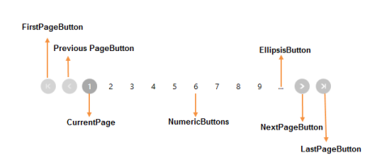
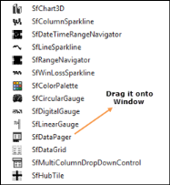

# Getting Started

This section describes about the assembly that is required for SfDataPagerControl in your WPF application.The following assemblies are required in your application.

<table>
<tr>
<th>
Demanded Assemblies</th><th>
Description</th></tr>
<tr>
<td>
Syncfusion.SfGrid.WPF</td><td>
Covers the SfDataPager and other elements.</td></tr>
</table>

When you use SfDataPager in the SfDataGrid, You need to add the following assembles with the default assembles.

<table>
<tr>
<th>
Demanded Assemblies</th><th>
Description</th></tr>
<tr>
<td>
Syncfusion.Data.WPF</td><td>
Covers basic processing on data like sorting, grouping, and filtering.</td></tr>
<tr>
<td>
Syncfudion.Shared.WPF</td><td>
Covers an editors like CurrencyTextBox, PercentEdit, DateTimeEdit.</td></tr>
</table>

## Control Structure

The following screenshot describes the elements of the DataPager control.

* FirstPageButton: Moves the current page index to the first page and displays the first page data.
* PreviousPageButton: Moves the current page index to the previous page and displays the previous page data.
* LastPageButton: Moves the current page index to the last page and displays the last page data.
* NextPageButton: Moves the current page index to the next page and displays the next page data.
* NumericButtons: Denotes the available pages. You can directly navigate to the page by clicking the corresponding button.
* EllipsisButton: Displayed when AutoEllipsis mode is set. This button displays the next set of numeric page buttons are displayed.

## Create Simple Application with SfDataPager

The following steps help you to use the SfDataPager in an application:

1. Create a new WPF application
2. Open a VisualStudio toolbox. Navigate to SyncfusionControls and drag the SfDataPager to the designew window.

   

3. When you drag the SfDataPager to the window, it automatically adds the required references to the current application.To add the SfDataPager using code, you can add the following assemblies to the project.
1. Syncfusion.Data.WPF
2. Syncfusion.SfGrid.WPF
4. You can either drag the control from Visual Studio or Expression Blend, or add the control to your project manually. You need to add the namespace to make use of SfDataPager in your application.

			<Window xmlns:datapager="http://schemas.syncfusion.com/wpf">

			 <Grid>

				  <datapager:SfDataPager x:Name="sfDataPager"/>

			  </Grid>

			</Window>

5. Create Business object class named as OrderInfo

			public class OrderInfo

			{

				int orderID;

				string customerId;

				string country;

				string customerName;

				string shippingCity;

				public int OrderID

				{

					  get {   return orderID;  }

					  set {   orderID = value; }

				}

				public string CustomerID

				{

					  get {  return customerId; }

					  set {  customerId = value; }

				}

				public string CustomerName

				{

					  get {  return customerName; }

					  set {  customerName = value;}

				}

				public string Country

				{

					  get { return country; }

					  set  {  country = value; }

				}

				public string ShipCity

				{

					 get {  return shippingCity; }

					 set {  shippingCity = value; }

				}

				public OrderInfo(int orderId, string customerName, string country, string     

				customerId,string shipCity)

				{

					 this.OrderID = orderId;

					 this.CustomerName = customerName;

					 this.Country = country;

					 this.CustomerID = customerId;

					 this.ShipCity = shipCity;

				}

			}

6. Add the following code in ViewModel class

			public class ViewModel

			{

				ObservableCollection<OrderInfo> orderCollection;

				public ObservableCollection<OrderInfo> OrderInfoCollection

				{

					get { return orderCollection; }

					set { orderCollection = value; }

				}

				public ViewModel()

				{

					orderCollection = new ObservableCollection<OrderInfo>();

					this.GenerateOrders();

				}

				private void GenerateOrders()

				{

					orderCollection.Add(new OrderInfo(1001, "Maria Anders", "Germany", "ALFKI", "Berlin"));

					orderCollection.Add(new OrderInfo(1002, "Ana Trujilo", "Mexico", "ANATR", "México D.F."));

					orderCollection.Add(new OrderInfo(1003, "Antonio Moreno", "Mexico", "ANTON", "México D.F."));

					orderCollection.Add(new OrderInfo(1004, "Thomas Hardy", "UK", "AROUT", "London"));

					orderCollection.Add(new OrderInfo(1005, "Christina Berglund", "Sweden", "BERGS", "Luleå"));

					orderCollection.Add(new OrderInfo(1006, "Hanna Moos", "Germany", "BLAUS", "Mannheim"));

					orderCollection.Add(new OrderInfo(1007, "Frédérique Citeaux", "France", "BLONP", "Strasbourg"));

					orderCollection.Add(new OrderInfo(1008, "Martin Sommer", "Spain", "BOLID", "Madrid"));

					orderCollection.Add(new OrderInfo(1009, "Laurence Lebihan", "France", "BONAP", "Marseille"));

					orderCollection.Add(new OrderInfo(1010, "Elizabeth Lincoln", "Canada", "BOTTM", "Tsawassen"));

				}

			}

7. Set the ViewModel instance as DataContext to window. Now, you can bind the data collection to the SfDataPagerSource property.

			<Window.DataContext>

			  <local:ViewModel/>

			</Window.DataContext>

			<Grid> 

					 <datapager:SfDataPager x:Name="sfDataPager" 

											Grid.Row="1"

											AccentBackground="DodgerBlue"

											NumericButtonCount="5"

											PageSize="5" 

											Source="{Binding OrderInfoCollection}" />

			</Grid>

8. Then bind the PagedSource property of the SfDataPager control into the SfDataGridItemsSource property.

			<Window.DataContext>

			  <local:Viewmodel/>

			</Window.DataContext>

			<Grid>

					<Grid.RowDefinitions>

						<RowDefinition Height="*" />

						<RowDefinition Height="Auto" />

					</Grid.RowDefinitions>

					<sfgrid:SfDataGrid AutoGenerateColumns="True" 

									   ItemsSource="{Binding ElementName=sfDataPager,

					Path=PagedSource}"/>

					 <datapager:SfDataPager x:Name="sfDataPager" 

											Grid.Row="1"

											NumericButtonCount="10"

											PageSize="10" 

											Source="{Binding OrdersDetails}" />

			</Grid>

   The following screenshot displays the output for Implementation of the SfDataPager in the SfDataGrid Control.

   

   {:.prettyprint}

