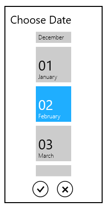

# Getting started

This section describes how to design a `SfDatePicker` control in a WPF application and overview of its basic functionalities.

# Creating simple application with SfDatePicker

The SfDatePicker control can be added to an application by using Visual Studio and Blend.

You can create the WPF application with SfDatePicker control as follows:

1. [Creating project](#creating-the-project)
2. [Adding control via designer](#adding-control-via-designer)
3. [Adding control manually in code](#adding-control-manually-in-code)

Create a WPF project in Visual Studio and refer to the following assemblies.

## Creating the project

The steps to create a Carousel control by using Visual Studio in C# are as follows:

1.	Open Visual Studio.

2.	On the File menu, select New -> Project. This opens the New Project Dialog box.

## Adding control via designer

SfDatePicker control can be added to the application by dragging it from the toolbox and dropping it in a designer view. The following required assembly references will be added automatically:

* Syncfusion.SfInput.WPF
* Syncfusion.SfShared.WPF

## Adding control manually in code

The following code sample shows how to create the SfDatePicker from code-behind and XAML. 





	<Window x:Class="SfDatePicker_WPF.DateSelectorDemo"
        xmlns="http://schemas.microsoft.com/winfx/2006/xaml/presentation"
        xmlns:x="http://schemas.microsoft.com/winfx/2006/xaml"
        xmlns:local="clr-namespace:SfDatePicker_WPF" WindowState="Maximized"
        xmlns:input="http://schemas.syncfusion.com/wpf"
        Title="DatePicker" Height="300" Width="300">

    <Grid>
        <input:SfDatePicker x:Name="datePicker" VerticalAlignment="Center" Width="200" Margin="15"/>
    </Grid>
    </Window>





	     SfDatePicker datepicker = new SfDatePicker();
         grid.Children.Add(datepicker);





Dim datepicker As SfDatePicker = New SfDatePicker
grid.Children.Add(datepicker)





## Formatting the display text

The SfDatePicker control allows the user to format the display text in various ways.

The FormatString property determines the format specifier by which the display text has to be formatted.

The following code sample shows how to create a date picker with a [month day pattern](http://msdn.microsoft.com/en-us/library/system.globalization.datetimeformatinfo.monthdaypattern(v=vs.71).aspx): 





		<Grid Background="{StaticResource ApplicationPageBackgroundThemeBrush}">

            <syncfusion:SfDatePicker VerticalAlignment="Center" 

                                   Width="200" Margin="15"

                                   FormatString="M"/>

		</Grid>





### Specifying format for the DateSelector

The SelectorFormatString property used to specify format for the DateSelector





	<Grid Background="{StaticResource ApplicationPageBackgroundThemeBrush}">

    <syncfusion:SfDatePicker SelectorFormatString="M"   x:Name="sfdatePicker" VerticalAlignment="Center"  Width="200" Margin="15" />

	</Grid>





### To set selected value in SfDatePicker on focus lost

Enable `SetValueOnLostFocus` property to apply selected value of the `SfDateSelector` in `SfDatePicker` on its lost focus. 





<syncfusion:SfDatePicker x:Name="DatePicker" SetValueOnLostFocus="True" />





SfDatePicker datepicker = new SfDatePicker();

// Enabling SetValueOnLostFocus

datepicker.SetValueOnLostFocus = true;





Dim datepicker As SfDatePicker = New SfDatePicker()
    
' Enabling SetValueOnLostFocus

datepicker.SetValueOnLostFocus = True

## Localization support

Localization is the process of making application as multi-lingual, by formatting the content according to cultures.

## Creating Resource file and adding value to the resource string based on Culture

Add a resource file(.resx) in the application and assign key values to the resource string based on the culture. Refer below screenshot,

## Assign a Current UI culture to the application

While initializing the application, CurrentCulture and CurrentUICulture should be mentioned in code, so that application will get the appropriate values provided in resource file.




 
 <syncfusion:SfDatePicker Name="datePicker" HorizontalAlignment="Center" VerticalAlignment="Center" FormatString="dddd, MMMM dd, yyyy h:mm:ss tt"/>





            CultureInfo culture = new System.Globalization.CultureInfo("ar-SA");
            culture.DateTimeFormat.AMDesignator = "صباحا";
            culture.DateTimeFormat.PMDesignator = "مساء";
            System.Threading.Thread.CurrentThread.CurrentCulture = culture;
            System.Threading.Thread.CurrentThread.CurrentUICulture = culture;





Dim culture As CultureInfo = New System.Globalization.CultureInfo("ar-SA")
culture.DateTimeFormat.AMDesignator = "5('-'"
culture.DateTimeFormat.PMDesignator = "E3'!"
System.Threading.Thread.CurrentThread.CurrentCulture = culture
System.Threading.Thread.CurrentThread.CurrentUICulture = culture





Value field of SfDatePicker is localized
{:.caption}

Display text "Choose Date" is localized to ar-SA culture
{:.caption}