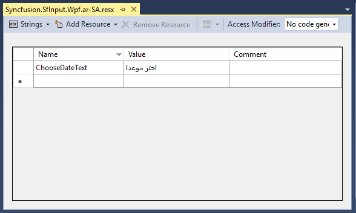

# Localization support in SfDatePicker

Localization is the process of making application as multi-lingual, by formatting the content according to cultures.

## Creating Resource file and adding value to the resource string based on Culture

Add a resource file(.resx) in the application and assign key values to the resource string based on the culture. Refer below screenshot,

## Assign a Current UI culture to the application

While initializing the application, CurrentCulture and CurrentUICulture should be mentioned in code, so that application will get the appropriate values provided in resource file.


 
 <syncfusion:SfDatePicker Name="datePicker" HorizontalAlignment="Center" VerticalAlignment="Center" FormatString="dddd, MMMM dd, yyyy h:mm:ss tt"/>





            CultureInfo culture = new System.Globalization.CultureInfo("ar-SA");
            culture.DateTimeFormat.AMDesignator = "صباحا";
            culture.DateTimeFormat.PMDesignator = "مساء";
            System.Threading.Thread.CurrentThread.CurrentCulture = culture;
            System.Threading.Thread.CurrentThread.CurrentUICulture = culture;



Value field of SfDatePicker is localized
{:.caption}

Display text "Choose Date" is localized to ar-SA culture
{:.caption}

