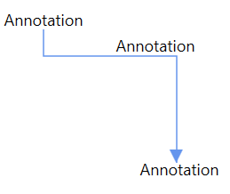

# Annotation

Annotation is a block of text that can be displayed over a node or connector. Annotation is used to textually represent an object with a string that can be edited at run time. Multiple annotations can be added to a node or connector.

## Define annotation

An annotation can be added to a node or connector by defining the annotation object and adding that to the annotation collection of the node or connector. The `Content` property of `AnnotationEditorViewModel` class defines the text to be displayed. The following code explains how to create an annotation.



<!--Initialize the SfDiagram-->
<syncfusion:SfDiagram x:Name="diagram">
    <!--Initialize the Node-->
    <syncfusion:SfDiagram.Nodes>
        <!--Initialize the Node Collection-->
        <syncfusion:NodeCollection>
            <!--Initialize the node view model-->
            <syncfusion:NodeViewModel UnitWidth="100" UnitHeight="100" OffsetX="100" OffsetY="100" Shape="{StaticResource Rectangle}" >
                <!--Initialize the annotations-->
                <syncfusion:NodeViewModel.Annotations>
                    <!--Initialize the AnnotationCollection-->
                    <syncfusion:AnnotationCollection>
                        <!--Initialize the Annotation editor view model-->
                        <syncfusion:AnnotationEditorViewModel Content="Annotation"/>
                    </syncfusion:AnnotationCollection>
                </syncfusion:NodeViewModel.Annotations>
            </syncfusion:NodeViewModel>
        </syncfusion:NodeCollection>
    </syncfusion:SfDiagram.Nodes>
    <!--Initialize the Connector-->
    <syncfusion:SfDiagram.Connectors>
        <!--Initialize the Connector Collection-->
        <syncfusion:ConnectorCollection>
            <!--Initialize the Connector view model-->
            <syncfusion:ConnectorViewModel SourcePoint="200,50" TargetPoint="300,150">
                <syncfusion:ConnectorViewModel.Annotations>
                    <!--Initialize the AnnotationCollection-->
                    <syncfusion:AnnotationCollection>
                        <!--Initialize the Annotation editor view model-->
                        <syncfusion:AnnotationEditorViewModel Content="Annotation"/>
                    </syncfusion:AnnotationCollection>
                </syncfusion:ConnectorViewModel.Annotations>
            </syncfusion:ConnectorViewModel>
        </syncfusion:ConnectorCollection>
    </syncfusion:SfDiagram.Connectors>
</syncfusion:SfDiagram>




//Initialize the diagram
SfDiagram diagram = new SfDiagram();

//Initialize the Node View Model
NodeViewModel node = new NodeViewModel()
{
    UnitWidth = 100,
    UnitHeight = 100,
    OffsetX = 100,
    OffsetY = 100,
    Shape = new RectangleGeometry() { Rect = new Rect(0, 0, 10, 10) },
    //Initialize the AnnotationCollection
    Annotations = new ObservableCollection<IAnnotation>()
    {
        //Initialize the Annotation with content
        new AnnotationEditorViewModel()
        {
            Content="Annotation"
        }
    }
};

//Initialize the Connector View Model
ConnectorViewModel connector = new ConnectorViewModel()
{
    SourcePoint = new Point(200, 50),
    TargetPoint = new Point(300, 150),
    //Initialize the AnnotationCollection
    Annotations = new ObservableCollection<IAnnotation>()
    {
        //Initialize the Annotation with content
        new AnnotationEditorViewModel()
        {
            Content="Annotation"
        }
    }
};

// Add the node into Node's collection
(diagram.Nodes as NodeCollection).Add(node);

// Add the Connector into connector's collection
(diagram.Connectors as ConnectorCollection).Add(connector);



## Multiple Annotations

You can add any number of annotations to a node or connector.
For sample, please refer to [MultipleAnnotation](https://www.syncfusion.com/downloads/support/directtrac/239374/ze/MultipleAnnotation-2076131568 "MultipleAnnotation").




<!--Initialize the Annotation Collection-->
<syncfusion:AnnotationCollection>
    <!--Initialize the multiple annotation-->
    <syncfusion:AnnotationEditorViewModel Content="Annotation"/>
    <syncfusion:AnnotationEditorViewModel Content="Annotation"/>
    <syncfusion:AnnotationEditorViewModel Content="Annotation"/>
</syncfusion:AnnotationCollection>
                                



//Initialize the Annotation Collection
Annotations = new ObservableCollection<IAnnotation>()
{
    //Initialize the multiple annotation
    new AnnotationEditorViewModel()
    {
        Content = "Annotation",
    },
    new AnnotationEditorViewModel()
    {
        Content = "Annotation",
    },
    new AnnotationEditorViewModel()
    {
        Content = "Annotation",
    },
}




 &ensp;&ensp;&ensp;&ensp;&ensp; 
