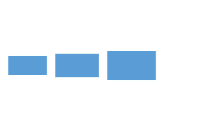
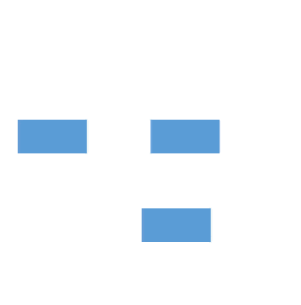
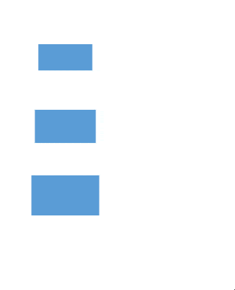
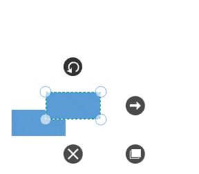
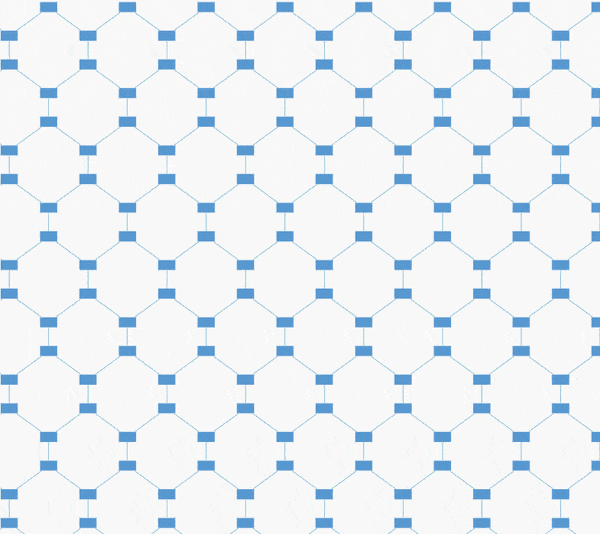

# Commands

Diagram provides set of Commands to perform the functionalities in application.

* Alignment commands
* Spacing commands
* Sizing commands
* Clipboard commands
* Duplicate Command
* Grouping commands
* Flip commands
* Z-order commands
* Zoom commands
* Reset command
* Nudge commands
* FitToPage command
* Undo/Redo command

## Alignment

Alignment commands enable you to align the selected objects such as Nodes and Connectors on a page with respect to a reference object.

The Alignment commands as follows

| Commands | Description |
|---|---|---|
| AlignLeft | The AlignLeft command enables you to align all selected objects along the left corner of the reference object. |
| AlignRight | The AlignRight command enables you to align all selected objects along the right corner of the reference object. |
| AlignCenter | The AlignCenter command enables you to center all selected objects vertically. It aligns selected objects to the center with respect to the horizontal axis by changing the x-coordinate of the object. |
| AlignTop | The AlignTop command enables you to align all selected objects along the top surface of the reference object. |
| AlignBottom | The AlignBottom command enables you to align all selected objects along the bottom surface of the reference object. |
| AlignMiddle | The AlignMiddle command enables you to center all selected objects horizontally. It aligns selected objects to the center with respect to the vertical axis by changing the y-coordinate of the object. |




IGraphInfo graphinfo = diagramcontrol.Info as IGraphInfo;
// sets direction as Top
graphinfo.Commands.AlignTop.Execute(null);




## Spacing

Spacing commands enable you to place selected objects on the page at equal intervals from each other. The objects are spaced within the bounds of the first and last objects in the selection.




IGraphInfo graphinfo = diagramcontrol.Info as IGraphInfo;

// Equally spaces the selected nodes horizontally
graphinfo.Commands.SpaceAcross.Execute(null);

// Equally spaces the selected nodes vertically
graphinfo.Commands.SpaceDown.Execute(null);




## Sizing

Object size commands will be resized all selected object based on width, height and size of the first object in the selection list.




IGraphInfo graphinfo = diagramcontrol.Info as IGraphInfo;

//Scales the selected items to the size of first selected object
graphinfo.Commands.SameSize.Execute(null);

//Vertically scales the selected items to the height of first selected object
graphinfo.Commands.SameHeight.Execute(null);

//Horizontally scales the selected items to the width of first selected object
graphinfo.Commands.SameWidth.Execute(null);




## Clipboard

Clipboard commands are used to perform Cut, Copy and Paste operations. 

Clipboard commands allow you to cut or copy selected Diagram objects to the Clipboard and paste the valid Clipboard content into the Diagram.




IGraphInfo graphinfo = diagramcontrol.Info as IGraphInfo;
//Cuts the selected elements from the Diagram to the Diagram’s clipboard
graphinfo.Commands.Cut.Execute(null);

//Copies the selected elements from the Diagram to the Diagram’s clipboard.
graphinfo.Commands.Copy.Execute(null);

//Pastes the Diagram’s clipboard data (nodes/connectors) into the Diagram.
graphinfo.Commands.Paste.Execute(null);




## Duplicate

This command copies the selected objects from the diagram and pastes the copied content into the diagram.                           

## Grouping

Grouping commands are used to group/ungroup the selected elements on the diagram.




IGraphInfo graphinfo = diagramcontrol.Info as IGraphInfo;

//Groups the selected elements.
graphinfo.Commands.Group.Execute(null);

//UnGroups the selected elements.
graphinfo.Commands.UnGroup.Execute(null);




## Flip

Flip commands are used to mirror a diagram object’s content. [IFlip parameter](https://help.syncfusion.com/cr/cref_files/wpf/sfdiagram/Syncfusion.SfDiagram.WPF~Syncfusion.UI.Xaml.Diagram.FlipParameter_members.html) is provided to customize the flip. 
If the parameter is null, the object will be flipped both horizontally and vertically.




// Apply flip to selected objects.
(diagramcontrol.Info as IGraphInfo).Commands.Flip.Execute(null);




## Z – Order

Z – Order commands enable you to visually arrange the selected objects such as Nodes and Connectors on the page.

### BringToFront

The BringToFront command visually brings the selected element to the front over all other overlapped elements. 




IGraphInfo graphinfo = diagramcontrol.Info as IGraphInfo;

//Brings to front
graphinfo.Commands.BringToFront.Execute(null);




### SendToBack

The SendToBack command visually moves the selected elements behind all the other overlapped elements. 




IGraphInfo graphinfo = diagramcontrol.Info as IGraphInfo;

// Send To Back
graphinfo.Commands.SendToBack.Execute(null);




### SendBackward

The SendBackward command visually moves the selected elements behind the underlying element.




IGraphInfo graphinfo = diagramcontrol.Info as IGraphInfo;

// Send To Backward
graphinfo.Commands.SendBackward.Execute(null);




### BringForward

The BringForward command visually moves the selected element over the nearest overlapping element.




IGraphInfo graphinfo = diagramcontrol.Info as IGraphInfo;

// Brings To Forward
graphinfo.Commands.BringForward.Execute(null);




## Zoom

Zoom commands are used to zoom-in and zoom-out the Diagram view.

To execute zoom commands, parameters of type IZoomParameter ([IZoomManipulationParameter](https://help.syncfusion.com/cr/cref_files/wpf/sfdiagram/Syncfusion.SfDiagram.WPF~Syncfusion.UI.Xaml.Diagram.ZoomManipulationParamenter_members.html), [IZoomPositionParameter](https://help.syncfusion.com/cr/cref_files/wpf/sfdiagram/Syncfusion.SfDiagram.WPF~Syncfusion.UI.Xaml.Diagram.ZoomPositionParameter_members.html), or [IZoomPointerParameter](https://help.syncfusion.com/cr/cref_files/wpf/sfdiagram/Syncfusion.SfDiagram.WPF~Syncfusion.UI.Xaml.Diagram.ZoomPointerParamenter_members.html)) have to be passed.




IGraphInfo graphinfo = diagramcontrol.Info as IGraphInfo;

// Zoom to a particular scale.
graphinfo.Commands.Zoom.Execute(new ZoomPositionParameter() 
{ 
	ZoomTo = 2, ZoomCommand = ZoomCommand.ZoomOut 
});




## Reset

Reset commands are used to reset horizontal Offset, vertical Offset, and zoom level of the Diagram. To execute a reset command, a parameter of type [IReset](https://help.syncfusion.com/cr/cref_files/wpf/sfdiagram/Syncfusion.SfDiagram.WPF~Syncfusion.UI.Xaml.Diagram.ResetParameter_members.html) has to be passed.




IGraphInfo graphinfo = diagramcontrol.Info as IGraphInfo;

// Reset the Zoom level of the Diagram
graphinfo.Commands.Reset.Execute(new ResetParameter() { Reset = Reset.Zoom });




## Undo and Redo

The Undo command reverses the last editing action performed. For example, some of the basic operations performed on diagram objects such as translation, rotation, resizing, grouping, ungrouping, changing z-order, addition, deletion, and so on, can be reversed. The Redo command restores the last editing action if no other actions have occurred since the last undo.

Undo and Redo actions are disabled by default, to enable this you can use `Constraints` property of the SfDiagram. 




// To enable the Undo and Redo action
diagram.Constraints |= GraphConstraints.Undoable;







IGraphInfo graphinfo = diagramcontrol.Info as IGraphInfo;

// To perform the Undo action in Diagram
graphinfo.Commands.Undo.Execute(null);

// To Perform the Redo action in Diagram
graphinfo.Commands.Redo.Execute(null);




## Nudge

Nudge commands move the selected elements towards up, down, left or right by 1 pixel. [IMoveParameter](https://help.syncfusion.com/cr/cref_files/wpf/sfdiagram/Syncfusion.SfDiagram.WPF~Syncfusion.UI.Xaml.Diagram.MoveParameter_members.html) is provided to customize the movement of the selected objects. The Nudge Commands as follows.

| Commands | Description |
|---|---|
| NudgeUp | The NudgeUp command moves the selected object towards the top by 1 pixel. |
| NudgeDown | The NudgeDown command moves the selected object towards the bottom by 1 pixel. |
| NudgeLeft | The NudgeLeft command moves the selected object towards the left by 1 pixel. |
| NudgeRight | The NudgeRight command moves the selected object towards the right by 1 pixel. |




IGraphInfo graphinfo = diagramcontrol.Info as IGraphInfo;

// Nudge up the selected objects
graphinfo.Commands.MoveUp.Execute(null);




## FitToPage

FitToPage commands are used to bring the entire Diagram into the view. [IFitToPage parameter](https://help.syncfusion.com/cr/cref_files/wpf/sfdiagram/Syncfusion.SfDiagram.WPF~Syncfusion.UI.Xaml.Diagram.FitToPageParameter_members.html) is provided to customize the FitToPage.
If the parameter is null, entire Diagram is fit into the view.




IGraphInfo graphinfo = diagramcontrol.Info as IGraphInfo;
// To fit the Diagram into the view
graphinfo.Commands.FitToPage.Execute(null);




## Command Manager
Command manager is used to map between user gestures (keyboard, mouse) with commands. Refer to the following table for built-in commands with Key Gesture and Mouse Gesture.
List of Commands and Key Gesture:

| Command | Key | Key Modifiers |
|---|---|---|
| Copy | C | Control |
| Cut | X| Control |
| Paste | V | Control |
| Duplicate | D | Control |
| Undo | Z | Control |
| Redo | Y | Control |
| MoveLeft | | Left |	
| MoveRight | |	Right |	
| MoveUp | | Up |	
| MoveDown | | Down |	
| Delete | | Delete |	
| SelectAll | A	| Control |
| Group| G|	Control |
| UnGroup | G | Control |
| SendToBack | [ | Control+Shift |
| SendBackward | [ | Control |
| BringToFront | ] | Control+Shift |
| BringForward | ] | Control |

#### List of Commands and Key Gestures with Parameter

| Command | Key | KeyModifier | Parameter |
|---|---|---|---|
| Zoom | - | Control | new ZoomPositionParameter { ZoomCommand=ZoomCommand.ZoomOut} |
| Zoom | + | Control | new ZoomPositionParameter { ZoomCommand = ZoomCommand.ZoomIn } |
| Reset | 0 | Control | new ResetParameter { Reset = Diagram.Reset.ZoomPan } |
| FitToPage | 0 | Control+ Menu | new FitToPageParameter { FitToPage = Diagram.FitToPage.FitToPage, Margin = new Thickness(20) } |

#### List of Commands and Mouse Gesture with Parameter

| Command | Scroll State | Parameter |
|---|---|---|
| Vertical Scroll using ‘Zoom’ command | Scroll | new ZoomPointerParameter { ZoomCommand = ZoomCommand.VerticalScroll} |

#### List of Commands and Key and Mouse Gesture with Parameter

| Command | KeyModifier | Scroll State | Parameter |
|---|---|---|---|
| Horizontal Scroll using ‘Zoom’ command | Shift | Scroll | new ZoomPointerParameter { ZoomCommand = ZoomCommand.HorizontalScroll} |
| Zoom | Control | Scroll | new ZoomPointerParameter { ZoomCommand = ZoomCommand.ZoomIn | ZoomCommand.ZoomOut} |

N> When different commands are registered for the same key / mouse gestures, you need to handle the command while execution.

### Custom command

User defined commands can also be created and mapped with existing gesture by using command manager. The following code example explains how to register mouse key gesture with Parameter to Save Command (Control + S)

#### Create a user defined command: Save command




//Create ICommand
private ICommand _save;
public ICommand Save
{
	get { return _save;}
	set { _save = value; }
}
        
// Initialize Command
Save = new DelegateCommand(OnSaveCommand);
         
// Execute the Save Command
private void OnSaveCommand(object obj)
{
    SaveFileDialog dialog = newSaveFileDialog();
    Object parameter = (obj as IGestureParameter).Parameter;
    dialog.FileName = parameter.ToString();
    dialog.Filter = "XAML File (*.xaml)|*.xaml";
    if (dialog.ShowDialog() == true)
    {
        using (Stream s = File.Open(dialog.FileName, FileMode.CreateNew))
        {
            diagram.Save(s);
        }
    }
}
  


  
#### Map and user defined command with key gesture:

Add new Commands to CommandManager - Ctrl + S -> Save
          
		    
	
		
sfdiagram.CommandManager.Commands.Add
(
    new GestureCommand()
	{
        Command = Save,
		Gesture = new Gesture
		{
			KeyModifiers = ModifierKeys.Control,
			KeyState = KeyStates.Down,
			Key = Key.S
		},

		// Parameter is the name of the file (.xmal)
		Parameter = "diagram"
	}
);




Sample link : http://www.syncfusion.com/downloads/support/directtrac/199579/ze/CustomCommand-482516272f10