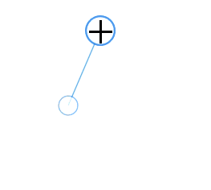

# Connector

Connectors are objects used to create link between two points or nodes to indicate the flow of operation or relationships between them.

## Connector types

Diagram supports to create five types of connectors. They are:

*   `Line`
*   `Orthogonal`
*   `CubicBezier`
*   `QuadraticBezier`
*   `PolyLine`

The `DefaultConnectorType` property allows you to change the connector type. By default, the diagram connector type is `Orthogonal`.



<!--Style for the Connector-->

        </Setter.Value>
    </Setter>
    <Setter Property="TargetDecoratorStyle">
        <Setter.Value>
            
        </Setter.Value>
    </Setter>
</Style>

<!--Initialize the Sfdiagram-->
<syncfusion:SfDiagram x:Name="diagram" DefaultConnectorType="Line">
    <syncfusion:SfDiagram.Connectors>
        <!--Initialize the Connector Collection-->
        <syncfusion:ConnectorCollection>
            <!--create the simple connector with source point and target point values-->
            <syncfusion:ConnectorViewModel x:Name="simpleConnector" SourcePoint="100,100" TargetPoint="200,200" />
        </syncfusion:ConnectorCollection>
    </syncfusion:SfDiagram.Connectors>
</syncfusion:SfDiagram>




//Initialize the SfDiagram
SfDiagram diagram = new SfDiagram();

//Define the Connector Type as line
diagram.DefaultConnectorType = ConnectorType.Line;

//creating simple connector through collction using source and target points.
ConnectorViewModel simpleConnector = new ConnectorViewModel()
{
    SourcePoint = new Point(100,100),
    TargetPoint = new Point(200,200),
};

//Adding the connector into Collection
(diagram.Connectors as ConnectorCollection).Add(simpleConnector);




### How to draw polyline

Polyline is a continuous line of a segment or a continuous line composed of more line segments. When you click the diagram page, a line will be drawn, and then new segments will be kept on added for every click on page. Line drawing will be stopped when double-click the page. This polyline will be drawn using the `Tool`, `DrawingTool`, and `DefaultConnectorType` properties.




<!--Initialize the Sfdiagram-->
<syncfusion:SfDiagram x:Name="diagram" DefaultConnectorType="Line" Tool="ContinuesDraw" DrawingTool="Connector" />




//Initialize the SfDiagram
SfDiagram diagram = new SfDiagram();

//Define the Connector type as poly line
diagram.DefaultConnectorType = ConnectorType.PolyLine;

//Define tool as continious draw and drawing tool as connector
diagram.Tool = Tool.ContinuesDraw;
diagram.DrawingTool = DrawingTool.Connector;




### Free-hand drawing

Diagram has support for free-hand drawing to draw anything on the diagram page independently. Free-hand drawing will be enabled by using the `DrawingTool` property and setting its value to `FreeHand`.




<!--Initialize the Sfdiagram-->
<syncfusion:SfDiagram x:Name="diagram" Tool="ContinuesDraw" DrawingTool="FreeHand" />




//Initialize the SfDiagram
SfDiagram diagram = new SfDiagram();
diagram.Tool = Tool.ContinuesDraw;
//Define drawing tool as free hand
diagram.DrawingTool = DrawingTool.FreeHand;




For more information about changing drawing tool of diagram, refer to [Tools](/wpf/sfdiagram/tools "Tools").

## Create connector 

Connector can be created by defining the start and end points. The path to be drawn can be defined with a collection of [Segments](/wpf/sfdiagram/connector/interaction/segments/straight "Segments").

## Create connectors through connection points

The connector can be created by defining the source and target point of the connection. The `SourcePoint` and `TargetPoint` properties, which are `Point` type allows you to set or get the start and end points of a connection.




<!--Initialize the Sfdiagram-->
<syncfusion:SfDiagram x:Name="diagram" DefaultConnectorType="Line">
    <syncfusion:SfDiagram.Connectors>
        <!--Initialize the Connector Collection-->
        <syncfusion:ConnectorCollection>
            <!--create the simple connector with source point and target point values-->
            <syncfusion:ConnectorViewModel x:Name="simpleConnector" SourcePoint="100,100" TargetPoint="200,200" />
        </syncfusion:ConnectorCollection>
    </syncfusion:SfDiagram.Connectors>
</syncfusion:SfDiagram>




//Initialize the SfDiagram
SfDiagram diagram = new SfDiagram();

//Define the Connector Type
diagram.DefaultConnectorType = ConnectorType.Line;

//creating simple connector through collection using source and target points.
ConnectorViewModel simpleConnector = new ConnectorViewModel()
{
    SourcePoint = new Point(100,100),
    TargetPoint = new Point(200,200),
};

//Adding the connector into Collection
(diagram.Connectors as ConnectorCollection).Add(simpleConnector);




## Create connection between nodes

The connector can be created between nodes to display the relationship between them. The `SourceNode`/`SourceNodeID` and `TargetNode`/`TargetNodeID` properties allows you to represent the nodes to be connected.



<!--Initialize the Sfdiagram-->
<syncfusion:SfDiagram x:Name="diagram">
    <syncfusion:SfDiagram.Nodes>
        <!--Initialize the Nodes Collection-->
        <syncfusion:NodeCollection>
            <!--Creating source node-->
            <syncfusion:NodeViewModel ID="sourceNode" UnitWidth="100" UnitHeight="50" OffsetX="300" OffsetY="200" Shape="{StaticResource Rectangle}"/>
            <!--Creating target node-->
            <syncfusion:NodeViewModel ID="targetNode" UnitWidth="100" UnitHeight="50" OffsetX="500" OffsetY="200" Shape="{StaticResource Rectangle}"/>
        </syncfusion:NodeCollection>
    </syncfusion:SfDiagram.Nodes>

    <syncfusion:SfDiagram.Connectors>
        <!--Initialize the ConnectorCollection-->
        <syncfusion:ConnectorCollection>
            <!--create the connector with source node and target node values-->
            <syncfusion:ConnectorViewModel x:Name="NodeToNodeConnection" SourceNodeID="sourceNode" TargetNodeID="targetNode"/>
        </syncfusion:ConnectorCollection>
    </syncfusion:SfDiagram.Connectors>
</syncfusion:SfDiagram>
             



//Initialize the SfDiagram
SfDiagram diagram = new SfDiagram();

//creating source node
NodeViewModel sourcenode = new NodeViewModel()
{
    UnitWidth = 100,
    UnitHeight = 50,
    OffsetX = 300,
    OffsetY = 200,
    Shape = this.Resources["Rectangle"],
};

//creating target node
NodeViewModel targetenode = new NodeViewModel()
{
    UnitWidth = 100,
    UnitHeight = 50,
    OffsetX = 500,
    OffsetY = 200,
    Shape = this.Resources["Rectangle"],
};

//Adding nodes into Collection
(diagram.Nodes as NodeCollection).Add(sourcenode);
(diagram.Nodes as NodeCollection).Add(targetenode);

//create the connector with source node and target node values
ConnectorViewModel nodeToNodeConnection = new ConnectorViewModel()
{
    SourceNode = sourcenode,
    TargetNode = targetenode,
};

//Adding connector into Collection
(diagram.Connectors as ConnectorCollection).Add(nodeToNodeConnection);




## Connections with ports

By default, connections are created at the intersecting point of segments and node bounds. The connection between any specific point of source and target nodes can be achieved with ports.

The `SourcePort`/`SourcePortID` and `TargetPort`/`TargetPortID` properties allows you to create connections between some specific points of Source/Target nodes. 




<!--Initialize the Sfdiagram-->
<syncfusion:SfDiagram x:Name="diagram">
    <syncfusion:SfDiagram.Nodes>
        <!--Initialize the Nodes Collection-->
        <syncfusion:NodeCollection>
            <!--Creating source node-->
            <syncfusion:NodeViewModel ID="sourceNode" UnitWidth="100" UnitHeight="50" OffsetX="300" OffsetY="200" Shape="{StaticResource Rectangle}">
                <syncfusion:NodeViewModel.Ports>
                    <!--Initialize the Ports Collection-->
                    <syncfusion:PortCollection>
                        <!--create source node port-->
                        <syncfusion:NodePortViewModel ID="SourcePort" NodeOffsetX="0" NodeOffsetY="0.5"/>
                    </syncfusion:PortCollection>
                </syncfusion:NodeViewModel.Ports>
            </syncfusion:NodeViewModel>

            <!--Creating target node-->
            <syncfusion:NodeViewModel ID="targetNode" UnitWidth="100" UnitHeight="50" OffsetX="500" OffsetY="200" Shape="{StaticResource Rectangle}">
                <syncfusion:NodeViewModel.Ports>
                    <!--Initialize the Ports Collection-->
                    <syncfusion:PortCollection>
                        <!--create source node port-->
                        <syncfusion:NodePortViewModel ID="TargetPort" NodeOffsetX="1" NodeOffsetY="0.5"/>
                    </syncfusion:PortCollection>
                </syncfusion:NodeViewModel.Ports>
            </syncfusion:NodeViewModel>
        </syncfusion:NodeCollection>
    </syncfusion:SfDiagram.Nodes>

    <syncfusion:SfDiagram.Connectors>
        <!--Initialize the ConnectorCollection-->
        <syncfusion:ConnectorCollection>
            <!--create the connector with source node and target node values-->
            <syncfusion:ConnectorViewModel x:Name="PortToPortConnection" SourcePortID="SourcePort" TargetPortID="TargetPort" SourceNodeID="sourceNode"  TargetNodeID="targetNode"/>
        </syncfusion:ConnectorCollection>
    </syncfusion:SfDiagram.Connectors>
</syncfusion:SfDiagram>



//Initialize the SfDiagram
SfDiagram diagram = new SfDiagram();

//Create source node port
NodePortViewModel sourcePort = new NodePortViewModel()
{
    NodeOffsetX = 0,
    NodeOffsetY = 0.5,
};

//Create target node port
NodePortViewModel targetPort = new NodePortViewModel()
{
    NodeOffsetX = 1,
    NodeOffsetY = 0.5,
};

//creating source node
NodeViewModel sourcenode = new NodeViewModel()
{
    UnitWidth = 100,
    UnitHeight = 50,
    OffsetX = 300,
    OffsetY = 200,
    Shape = this.Resources["Rectangle"],
    Ports = new PortCollection()
    {
        //Add source port to source node
        sourcePort,
    }
};

//creating target node
NodeViewModel targetenode = new NodeViewModel()
{
    UnitWidth = 100,
    UnitHeight = 50,
    OffsetX = 500,
    OffsetY = 200,
    Shape = this.Resources["Rectangle"],
    Ports = new PortCollection()
    {
        //Add target port to target node
        targetPort,
    }
};

//Adding nodes into Collection
(diagram.Nodes as NodeCollection).Add(sourcenode);
(diagram.Nodes as NodeCollection).Add(targetenode);

//create the connector from port to port
ConnectorViewModel PortToPortConnection = new ConnectorViewModel()
{
    SourceNode = sourcenode,
    //Define the source port
    SourcePort = sourcePort,
    TargetNode = targetenode,
    //Define the target port
    TargetPort = targetPort,
};

//Adding port to port connector into connector Collection
(diagram.Connectors as ConnectorCollection).Add(PortToPortConnection);




For more details about Ports, refer to [Port](https://help.syncfusion.com/wpf/sfdiagram/port "Port").

## Draw connectors

Connectors can be interactively drawn by clicking and dragging on the diagram surface by using the drawing tool. For more information about drawing connectors, refer to [Drawing Tools](/wpf/sfdiagram/tools#drawing-tools:connectors "Drawing Tools").

## Connectors through data source

Connectors are automatically generated based on the relationships defined through the data source. For more information about data source, refer to [Data Source](/wpf/sfdiagram/datasource "DataSource").

## Add connectors from stencil

Connectors can be predefined and added to the stencil. You can drop those connectors into the diagram, when required. 

For more information about adding connectors from stencil, refer to [Stencil](/wpf/sfdiagram/stencil "Stencil").

