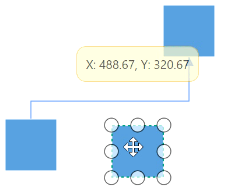

# Connector Selection, Dragging and Routing

Connectors can be selected and dragged over the diagram page. 

## How to select and edit the connector

The connector can be selected by tapping it. When connector is selected, circles will be added on the starting and ending of the connector, which is represented by `Thumbs`. Clicking and dragging those handles helps you to adjust the source and target points.

## How to drag the connector

Also, the entire connector can be dragged over the page by using the `Constraints` property and setting its value as Draggable.




<!--Initialize the Sfdiagram-->
<syncfusion:SfDiagram x:Name="diagram" DefaultConnectorType="Line">
    <syncfusion:SfDiagram.Connectors>
        <!--Initialize the Connector Collection-->
        <syncfusion:ConnectorCollection>
            <!--create the connector with draggable constraint-->
            <syncfusion:ConnectorViewModel x:Name="simpleConnector" SourcePoint="100,100" TargetPoint="200,200" Constraints="Default,Draggable" />
        </syncfusion:ConnectorCollection>
    </syncfusion:SfDiagram.Connectors>
</syncfusion:SfDiagram>




//Initialize the SfDiagram
SfDiagram diagram = new SfDiagram();

//Define the Connector Type
diagram.DefaultConnectorType = ConnectorType.Line;

//creating simple connector through collection using source and target points.
ConnectorViewModel simpleConnector = new ConnectorViewModel()
{
    SourcePoint = new Point(100,100),
    TargetPoint = new Point(200,200),
    //Define the constraint as draggable
    Constraints = ConnectorConstraints.Default | ConnectorConstraints.Draggable,
};

//Adding the connector into Collection
(diagram.Connectors as ConnectorCollection).Add(simpleConnector);




## How to route the connectors

When diagram elements are going to be placed on any connector path, then the path of connector will be hidden by placed elements. This will makes less clarity  about connector paths. This can be avoided by using routing process. Routing tries to place the connector path as close as possible with out intersecting with any other elements. To avoid objects conflict, the routing step adds segments paths needed to properly connect their end points.

So routing will be moved a connector automatically from its original position when connector path is getting intersected with other diagram elements. However, node and connector paths will not be getting intersected with any ther objects.

This behaviour can be enabled in diagram by using `GraphConstraints.Routing`.




<!--Initialize the SfDiagram with routig constraint-->
<syncfusion:SfDiagram x:Name="diagram" Constraints="Default,Routing"/>
                                



//Initialize the SfDiagram
SfDiagram diagram = new SfDiagram();
//Enable the routing constraint
diagram.Constraints = GraphConstraints.Default | GraphConstraints.Routing;




we are provided two types of routing. They are

* Classic : Connectors segments will be added as needed to avoid intersection. 
* Advanced : Customized and less number of connector segments only will be added to avoid intersection.

This can be enabled by using `RoutingType` property of `LineRoutingSettings`class.




<!--Initialize the SfDiagram-->
<syncfusion:SfDiagram x:Name="diagram" Constraints="Default,Routing">
  <!--Initialize the routing type-->
  <syncfusion:SfDiagram.LineRoutingSettings>
    <syncfusion:LineRoutingSettings RoutingType="Classic"/>
  </syncfusion:SfDiagram.LineRoutingSettings>
</syncfusion:SfDiagram>
                                



//Initialize the SfDiagram
SfDiagram diagram = new SfDiagram();
//Initialize the routing type
diagram.LineRoutingSettings.RoutingType = RoutingTypes.Classic;




By default, Node will be the routing object to change the connectors path while routing. Routing can be disabled for particular node when it is intersecting with connector using `NodeConstraints.RoutingObstacle` property of Node.




NodeViewModel node = new NodeViewModel()
  {
    UnitHeight = 50,
    UnitWidth = 50, 
    OffsetX = 200,
    OffsetY = 300,
    Shape = new RectangleGeometry() { Rect = new Rect(0, 0, 10, 10) },
    //Disable the routing obstacle property
    Constraints = NodeConstraints.Default & ~(NodeConstraints.RoutingObstacle),
  };




Also, routing option can be disabled for each connector using `ConnectorConstraints.Routing` and `ConnectorConstraints.InheritRouting` properties of connector. 




ConnectorViewModel connector = new ConnectorViewModel()
  {
    SourcePoint = new Point(200, 200),
    TargetPoint = new Point(400, 400),
    //Disable the routing
    Constraints = ConnectorConstraints.Default & ~(ConnectorConstraints.Routing | ConnectorConstraints.InheritRouting),
  };


