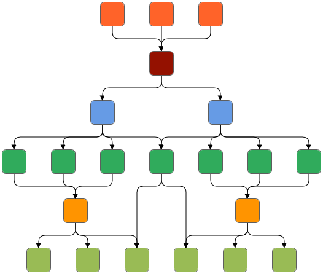
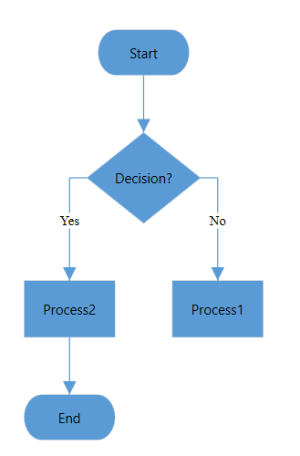

# DataSource

Diagram can be populated with the nodes and connectors based on the information provided from an external data source.

* The DataSourceSettings `DataSource` property is used to define the data source as a collection of objects, which needs to be populated as diagram.

* The DataSourceSettings `Id` property is used to define the unique field of each data.

* The DataSourceSettings `ParentId` property is used to define the parent field which builds the relationship between ID and parent field.

* The DataSourceSettings `Root` property is used to define the root node for the diagram populated from the data source.

To explore those properties, refer to [DataSourceSettings](https://help.syncfusion.com/cr/cref_files/wpf/Syncfusion.SfDiagram.WPF~Syncfusion.UI.Xaml.Diagram.DataSourceSettings_members.html)




<!-- Initializes the employee collection-->
<local:Employees x:Key="employees">
    <local:Employee Name="Steve" EmpId="1" ParentId="" Designation="CEO"/>
    <local:Employee Name="Kevin" EmpId="2" ParentId="1" Designation="Manager"/>
    <local:Employee Name="John" EmpId="3" ParentId="1" Designation="Manager"/>
    <local:Employee Name="Raj" EmpId="4" ParentId="2" Designation="Team Lead"/>
    <local:Employee Name="Will" EmpId="5" ParentId="2" Designation="S/w Developer"/>
    <local:Employee Name="Sarah" EmpId="6" ParentId="3" Designation="TeamLead"/>
    <local:Employee Name="Mike" EmpId="7" ParentId="3" Designation="Testing Engineer"/>
</local:Employees>

<!--Initializes the DataSourceSettings -->
<syncfusion:DataSourceSettings x:Key="DataSourceSettings" DataSource="{StaticResource employees}"
                               ParentId="ParentId" Id="EmpId" Root="1"/>
               
<!--Initializes the Layout-->                
<syncfusion:DirectedTreeLayout x:Key="treeLayout" HorizontalSpacing="80" VerticalSpacing="50" 
                               SpaceBetweenSubTrees="20" Orientation="TopToBottom"/>
<syncfusion:LayoutManager x:Key="layoutManager" Layout="{StaticResource treeLayout}"/>                               
         
<!--Initializes the SfDiagram-->          
<syncfusion:SfDiagram x:Name="diagram" LayoutManager="{StaticResource layoutManager}"                           
                      DataSourceSettings="{StaticResource DataSourceSettings}">
    <!--Initializes the NodeCollection-->                  
    <syncfusion:SfDiagram.Nodes>
        <syncfusion:NodeCollection/>
    </syncfusion:SfDiagram.Nodes>
    <!--Initializes the ConnectorCollection-->
    <syncfusion:SfDiagram.Connectors>
        <syncfusion:ConnectorCollection/>
    </syncfusion:SfDiagram.Connectors>
</syncfusion:SfDiagram>




Sample Link : [DataSource Sample](http://www.syncfusion.com/downloads/support/directtrac/195355/ze/DataSource-2014750971)

## Root

By default, the node without parent is treated as root of the layout. Now, `DataSourceSettings` have option to specify the root node of the layout.




//object with id “CEO”, is considered as root of tree layout.
diagram.DataSourceSettings.Root = “CEO”;




## Layout with Multiple Parent

Tree layout and data sources will now support nodes having multiple parents.The child Node is arranged in center of the parent positions.

Find the [Multi Parent Sample](http://www.syncfusion.com/downloads/support/directtrac/195355/ze/Multi_Parent-231048937) to depict this support.

Navigation->WPF->Diagram->Automatic layout->Multi Parent Hierarchical Tree

## FlowchartDataSourceSettings

`FlowchartDataSourceSettings` is the derived class of `DataSourceSettings`, which contains the mapping properties.These properties are used to map the data member in the underlying data object to the datasource item.

`ContentMapping`: Maps the Content in the underlying data object to data source item.

`ConnectorTextMapping`: Maps the ConnectorText in the underlying data object to data source item.

`ShapeMapping`: Maps the Shape in the underlying data object to data source item.
 
`WidthMapping`: Maps the Width in the underlying data object to data source item.
 
`HeightMapping`: Maps the Height in the underlying data object to data source item.





<ResourceDictionary.MergedDictionaries>

< ResourceDictionary Source="/Syncfusion.SfDiagram.Wpf;component/Resources/BasicShapes.xaml"/>

</ResourceDictionary.MergedDictionaries>

<!-- Initializes the DataSource collection-->
<local:DataItems x:Key="Dataitems">
<local:ItemInfo Id="1" NodeShape="{StaticResource Terminator}" Width="80" Height="40" Name="Start"></local:ItemInfo>
<local:ItemInfo Id="2" NodeShape="{StaticResource Decision}" Width="100" Height="80" Name="Decision?">
    <local:ItemInfo.ParentId>
        <local:LabelList>
            <sys:String>1</sys:String> 
        </local:LabelList>
    </local:ItemInfo.ParentId>
</local:ItemInfo>
<local:ItemInfo Id="3" NodeShape="{StaticResource Process}" Width="80" Height="50" Name="Process1">
    <local:ItemInfo.ParentId>
        <local:LabelList>
            <sys:String>2</sys:String>
        </local:LabelList>
    </local:ItemInfo.ParentId>
    <local:ItemInfo.Label>
        <local:LabelList>
            <sys:String>No</sys:String>
        </local:LabelList>
    </local:ItemInfo.Label>
</local:ItemInfo>
<local:ItemInfo Id="4" NodeShape="{StaticResource Process}" Width="80" Height="50" Name="Process2">
    <local:ItemInfo.ParentId>
        <local:LabelList>
            <sys:String>2</sys:String>
        </local:LabelList>
    </local:ItemInfo.ParentId>
    <local:ItemInfo.Label>
        <local:LabelList>
            <sys:String>Yes</sys:String>
        </local:LabelList>
    </local:ItemInfo.Label>
</local:ItemInfo>
<local:ItemInfo Id="5" NodeShape="{StaticResource Terminator}" Width="80" Height="40" Name="End">
    <local:ItemInfo.ParentId>
        <local:LabelList>
            <sys:String>4</sys:String>
        </local:LabelList>
    </local:ItemInfo.ParentId>
</local:ItemInfo>
</local:DataItems>
<!--Initializes the Layout-->
<syncfusion:FlowchartLayout x:Key="Layout" 
                                        Orientation="TopToBottom"
                                        YesBranchDirection="LeftInFlow"
                                        HorizontalSpacing="50" 
                                        VerticalSpacing="30">
</syncfusion:FlowchartLayout>

<!--Initializes the DataSourceSettings -->
<syncfusion:FlowchartDataSourceSettings x:Key="DataSourceSettings"
                                        DataSource="{StaticResource Dataitems}"   
                                        ParentId="ParentId" 
                                        Id="Id" 
                                        ShapeMapping="NodeShape" 
                                        WidthMapping="Width" 
                                        HeightMapping="Height" ConnectorTextMapping="Label" ContentMapping="Name" />
            
<!--Initializes the LayoutManager-->
<syncfusion:LayoutManager x:Key="layoutmanager" 
                          Layout="{StaticResource Layout}"/>

 <!--Initializes the SfDiagram-->          
<syncfusion:SfDiagram x:Name="diagram" 
                      LayoutManager="{StaticResource layoutManager}"       DataSourceSettings="{StaticResource DataSourceSettings">
    <!--Initializes the NodeCollection-->                  
    <syncfusion:SfDiagram.Nodes>
        <syncfusion:NodeCollection/>
    </syncfusion:SfDiagram.Nodes>
    <!--Initializes the ConnectorCollection-->
    <syncfusion:SfDiagram.Connectors>
        <syncfusion:ConnectorCollection/>
    </syncfusion:SfDiagram.Connectors>
    <syncfusion:SfDiagram.Theme>
        <syncfusion:OfficeTheme/>
    </syncfusion:SfDiagram.Theme>
</syncfusion:SfDiagram>





            //Initialize Diagram
            SfDiagram Diagram = new SfDiagram();

            //Initialize Node Collection
            Diagram.Nodes = new ObservableCollection<NodeViewModel>();           

            //Initialize Connector Collection
            Diagram.Connectors = new ObservableCollection<ConnectorViewModel>();

            // Initialize DataSourceSettings for SfDiagram
            Diagram.DataSourceSettings = new FlowchartDataSourceSettings()
            {
                ParentId = "ParentId",
                Id = "Id",
                DataSource = GetData(),
                ConnectorTextMapping = "Label",
                ContentMapping = "Name",
                ShapeMapping = "NodeShape",
                WidthMapping = "Width",
                HeightMapping = "Height"
            };

            //Initialize LayoutManager
            LayoutManager layoutManager = new LayoutManager();

            //Initialize Layout for SfDiagram
            layoutManager.Layout = new FlowchartLayout()
            {
                Orientation = FlowchartOrientation.TopToBottom,
                YesBranchDirection = BranchDirection.LeftInFlow,
                NoBranchDirection = BranchDirection.RightInFlow,
                HorizontalSpacing = 50,
                VerticalSpacing = 30
            };

            //initialize theming style for SfDiagram
            Diagram.Theme = new OfficeTheme();

            //Initialize LayoutManager
            Diagram.LayoutManager = layoutManager;
    
            //Adding Sfdiagram as children to mainwindow grid.
            WindowGrid.Children.Add(Diagram);

        // Initializes the DataSource collection
        private DataItems GetData()
        {
            DataItems collection = new DataItems();
            collection.Add(new ItemInfo()
            {
                Id ="1",
                NodeShape =App.Current.Resources["Terminator"] as string,
                Name = "Start",
                Height =40,
                Width =100
            });
            collection.Add(new ItemInfo()
            {
                Id = "2",
                ParentId =new List<string> { "1" },
                NodeShape = App.Current.Resources["Decision"] as string,
                Name = "Decision?",
                Height = 100,
                Width =100
            });
            collection.Add(new ItemInfo()
            {
                Id = "3", ParentId =new List<string> { "2" },
                Label = new List<string> { "No" },
                NodeShape = App.Current.Resources["Process"] as string,
                Name = "Process1",
                Height =40,
                Width = 100
            });
            collection.Add(new ItemInfo()
            {
                Id = "4",
                ParentId = new List<string> { "2" },
                Label =new List<string> {"Yes" },
                NodeShape = App.Current.Resources["Process"] as string,
                Name = "Process2",
                Height = 40,
                Width = 100
            });
            collection.Add(new ItemInfo()
            {
                Id = "5",
                ParentId = new List<string> { "4" },
                NodeShape = App.Current.Resources["Terminator"] as string,
                Name = "End",
                Height = 40,
                Width = 100
            });
            return collection;
        }
     //Data Object Class
    public class ItemInfo

    {
        public string Name { get; set; }

        public string Id { get; set; }

        public List<string> ParentId { get; set; }

        public string NodeShape { get; set; }
           
        public List<string> Label { get; set; }
        
        public double Width { get; set; }
        
        public double Height { get; set; }
       
    }

    //Collection to hold the Data Object class
    public class DataItems : ObservableCollection<ItemInfo>
    {

    }        





Refer to the `Flowchart Layout` sample to depict this support.

Navigation->WPF->Diagram->Automatic layout->Flowchart Layout