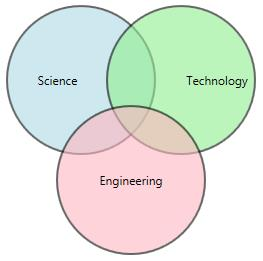

# Node

Nodes are graphical objects used to visually represent the geometrical information, process flow, internal business procedure or any other kind of data and it represents the functions of a complete system in regards to how it interacts with external entities

## Shapes

We have provided some basic built-in shapes as ResourceDictionary.For more information, refer to  [Shapes](/wpf/sfdiagram/Shapes). 

## Create Node

A Node can be created and added to the Diagram, either programmatically or interactively. Nodes are stacked on the Diagram area from bottom to top in the order they are added.

### Add Node through Nodes collection 

To create a Node, You have to define the Node object and add that to Nodes collection of the Diagram.
For more, refer to  [Add Nodes](/wpf/sfdiagram/Getting-Started#simple Application:Add Nodes "Add Nodes"). 

### Add Node from stencil

Nodes can be predefined and added to palette and can be dropped into the Diagram when needed. For more information about adding Nodes from Stencil, refer to [Stencil](/wpf/sfdiagram/Stencil "Stencil").

### Create Node through data source

Nodes can be generated automatically with the information provided through data source.For more information about data source, 

refer to [Data Source](/wpf/sfdiagram/DataSource "DataSource").

### Draw Nodes

Nodes can be interactively drawn by clicking and dragging the Diagram surface by using **Drawing Tool**. For more information about drawing Nodes, refer to [Draw Nodes](/wpf/sfdiagram/Tools#drawing-tools:shapes "Draw Nodes").

## Position

Position of a Node is controlled by using its OffsetX and OffsetY properties. By default, these Offset properties represent the distance between origin of the Diagram’s page and Node’s center point. You may except this Offset values to represent the distance between page origin and Node’s top left corner instead of center. Pivot property helps solve this problem. Default value of Node’s pivot point is (0.5, 0.5), that means center of Node.

The following table illustrates how pivot relates Offset values with Node boundaries.

| Pivot | Offset |
|---|---|
| (0,5, 0.5) |  OffsetX and OffsetY values are considered as the Node’s center point. |
| (0,0) | OffsetX and OffsetY values are considered as the top left corner of Node. |
| (1,1) | OffsetX and OffsetY values are considered as the bottom right corner of the Node. |



<!--Style for Node-->

        </Setter.Value>
    </Setter>
</Style>


<!--Initialize SfDiagram-->
<syncfusion:SfDiagram  x:Name="diagram">
    <!--Initialize NodeCollection-->
    <syncfusion:SfDiagram.Nodes>
        <syncfusion:NodeCollection>
            <!--Initialize Node-->
            <syncfusion:NodeViewModel UnitWidth="100" UnitHeight="100" OffsetX="200" OffsetY="200"
                                      Pivot="0,0">
            </syncfusion:NodeViewModel>
        </syncfusion:NodeCollection>
    </syncfusion:SfDiagram.Nodes>
</syncfusion:SfDiagram>


//Creates the Node collection
ObservableCollection<NodeViewModel> nodes = new ObservableCollection<NodeViewModel>();
//Create Node
NodeViewModel node = new NodeViewModel()
{
    //Sets the size
	UnitWidth = 100,UnitHeight = 100,   
    //Sets the position
	OffsetX = 200,OffsetY = 200,
    //Sets pivot point
	Pivot = new Point(0, 0)
};
//Adds the Node to the SfDiagram 
nodes.Add(node);
diagram.Nodes = nodes;



## Appearance

You can customize the appearance of a Node by changing its ShapeStyle. The following code illustrates how to customize the appearance of the shape.






Style style = new Style(typeof(Path));
style.Setters.Add(new Setter(Path.FillProperty, Brushes.DarkCyan));
style.Setters.Add(new Setter(Path.StrokeProperty, Brushes.Black));
style.Setters.Add(new Setter(Path.StrokeThicknessProperty, 2d));
style.Setters.Add(new Setter(Path.StrokeDashArrayProperty, new DoubleCollection() { 5 }));            
style.Setters.Add(new Setter(Path.StretchProperty, Stretch.Fill));
return style;



## Data Binding

In order to achieve Properties of ViewModel are bind to View, we have provided the default style for View in “BindingStyle.xaml”. For more information, refer to [Data Binding](/wpf/sfdiagram/Data-Binding).

N> The AutoBind property is deprecated. Instead of AutoBind, please use this View to ViewModel Binding approach.

## Interaction

Diagram provides support to drag, resize, or rotate the Node interactively. For more information about editing a Node at runtime, refer to [Interaction](/wpf/sfdiagram/Interaction "Interaction").

## Hit Padding

Connection can be made from/to Nodes, Connectors, Port or on empty area in a diagram. Making connection with Connector and Ports are usually difficult as thickness are usually small. To make it easy to connect, it should be possible to connect when mouse comes near its vicinity area.

The following code illustrates how to customize the HitPadding 




<syncfusion:NodeViewModel x:Name="ViewModel"  UnitWidth="100" HitPadding="25"
                                              UnitHeight="100" OffsetX="200" OffsetY="300">
</syncfusion:NodeViewModel>



//Creates the Node collection
ObservableCollection<NodeViewModel> nodes = new ObservableCollection<NodeViewModel>();
//Create Node
NodeViewModel node = new NodeViewModel()
{
    //Sets the size
	UnitWidth = 100,UnitHeight = 100,   
    //Sets the position
	OffsetX = 200,OffsetY = 300,
    //Sets pivot point
	Pivot = new Point(0, 0),
    //defines the vicinity area of the Node
    HitPadding = 25
};
//Adds the Node to the SfDiagram 
nodes.Add(node);
diagram.Nodes = nodes;



## Constraints

The `Constraints` property of Node allows you to enable/disable certain features. For more information about Node constraints, refer to [Node Constraints](/wpf/sfdiagram/Constraints#NodeConstraints "Node Constraints").