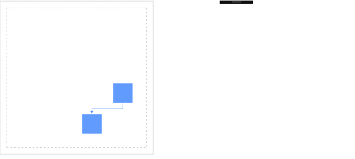

# Page Settings

By default, DiagramPage size is decided based on the diagramming elements position. To customize the size and appearance of the DiagramPage, please use [PageSettings](https://help.syncfusion.com/cr/cref_files/wpf/sfdiagram/Syncfusion.SfDiagram.WPF~Syncfusion.UI.Xaml.Diagram.PageSettings.html "PageSettings") property of SfDiagram. 

* The `PageWidth` and `PageHeight` properties of `PageSettings` define the size of the page. 
* `PageBorderThickness`, `PageBackground` and `PageBorderBrush` properties allows to define the appearance of page.
* Based on Diagramming element position, the size of the page dynamically increases or decreases in multiples of page width and height with help of `MultiplePage` property of PageSettings.
* Page breaks are visual glue to indicate the `PrintMargin` value and it helps while printing the Diagram. 
* The `ShowPageBreaks` property will decide on Visibility of Page breaks.




<syncfusion:SfDiagram x:Name="diagram" Background="WhiteSmoke">
  <syncfusion:SfDiagram.PageSettings>
    <syncfusion:PageSettings PageWidth="500" PageHeight="500" PageBorderThickness="4" PageBackground="White" PageBorderBrush="LightGray" MultiplePage="True" ShowPageBreaks="True" />
  </syncfusion:SfDiagram.PageSettings>
</syncfusion:SfDiagram>





diagram.Background = new SolidColorBrush(Colors.WhiteSmoke);
diagram.PageSettings.PageWidth = 500;
diagram.PageSettings.PageHeight = 500;
diagram.PageSettings.PageBorderThickness = new Thickness(4);
diagram.PageSettings.PageBackground = new SolidColorBrush(Colors.White);
diagram.PageSettings.PageBorderBrush = new SolidColorBrush(Colors.LightGray);
diagram.PageSettings.MultiplePage = true;
diagram.PageSettings.ShowPageBreaks = true;
            



## Origin customization of Page

By default, Origin of the Page will be (0,0). Now, We have provided virtual and public methods to customize the Origin of the Page based on Pixels and PageSize (`PageWidth` and `PageHeight`).

We have provided `AdjustPageOrigin` virtual method in PageSettings class and It's Info have `Trim` and `Truncate` methods for customization.

<table>
  <tr>
<td>
Trim()
</td>
<td>
This method will be customized the Origin in Pixel.
</td>
</tr>
<tr>
<td>
Truncate()
</td>
<td>
This method will be customized the Origin based the Size of the Page. 
</td>
</tr>
  </table>




 //create instance for PageCustomClass using PageSettings
 diagram.PageSettings = new PageCustomClass();

//Need to create a custom class which should be derived from PageSetting class.
public class PageCustomClass : PageSettings
    {
        public override void AdjustPageOrigin()
        {
            Info.Trim();
        }
    }
    



N> This customization will play role in reducing the number of pages in printing.
