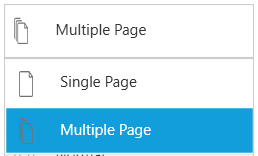
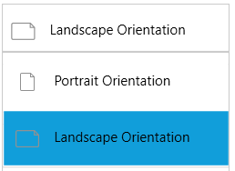
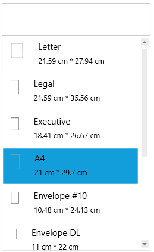
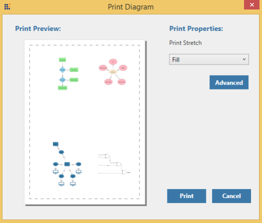

# Printing

SfDiagram provides support to print the diagram with help of [PrintingService](https://help.syncfusion.com/cr/cref_files/wpf/sfdiagram/Syncfusion.SfDiagram.WPF~Syncfusion.UI.Xaml.Diagram.PrintingService.html "PrintingService") property.

## Print Preview
 `Print` method of `PrintingService` will show preview of the SfDiagram before printing. Print Preview window has Print and QuickPrint buttons which needs to be clicked to print the SfDiagram.
 
 * QuickPrint - It directly prints from preview using default printer.
 * Print - It shows an preview to select printer and then printing occurs.
 
 For Sample please refer to,[Printing](http://www.syncfusion.com/downloads/support/directtrac/205629/ze/printing-698055447).

### Scaling

SfDiagram provides support to scale the diagram whether to fit on one page or to multiple pages. Scaling options can be changed by setting `PrintingService.PrintManager.SelectedScaleIndex` property.




diagram.PrintingService.PrintManager.SelectedScaleIndex = 1;




## Page Settings

SfDiagram provides support to customize or change the orientation, margin, width and height of preview or Print page. The `PageSettings` property of SfDiagram have properties for printing customization. 

 N> Any changes in PageSetting will affect both Diagram and Preview

### Orientation

SfDiagram provides support to switch between Portrait and Landscape orientation while printing. Orientation can be changed by setting `PageSettings.PageOrientation` Property.




 diagram.PageSettings=new PageSettings();
 diagram.PageSettings.PageOrientation=PageOrientation.Landscape;




The orientation can be changed in print preview at runtime by selecting from orientation drop-down in print preview. it will change both Preview and Diagram orientation.

### Page Size

SfDiagram provides support to change the page size. Page size can be changed by setting `PageSettings.PageWidth` and `PageSettings.PageHeight` properties.




  diagram.PageSettings=new PageSettings();
  diagram.PageSettings.PageWidth = 800;
  diagram.PageSettings.PageHeight = 800;




Page size can be changed in print preview also by selecting from page-size drop-down which displays pre-defined page sizes. You can also manually enter custom page width and height in the editors below page-size drop-down 
and press OK to apply the custom width and height for the page.

### Page Margin

SfDiagram provides support to change the page margins to adjust content in printed page. Page margin can be changed by setting `PrintingService.PrintSettings.PageMargin` property.




   diagram.PrintingService.PrintSettings.PageMargin=new Thickness(5);




Page margin can be changed in print preview also by selecting from pre-defined page margin from margin drop-down. You can manually enter custom margins in the editors below margin drop-down and press OK to apply the custom margin.

### Header and Footer

SfDiagram provides a way to display additional content at the top (Header) or bottom (Footer) of the page while printing. This can be achieved by setting `PageHeaderHeight` , `PageHeaderTemplate` , `PageFooterHeight`, `PageFooterTemplate` properties in PrintSettings.

Steps for setting Header for printing,

1.Create DataTemplate in Resources and assign it to the `PageHeaderTemplate` property.




<DataTemplate x:Key="PrintHeaderTemplate">
  <TextBlock Text="SfDiagram" FontSize="18" FontWeight="Bold" HorizontalAlignment="Center"/>
</DataTemplate>





2.Set the above defined DataTemplate to `PrintSettings.PrintPageHeaderTemplate` and assign value for `PrintSettings.PrintPageHeaderHeight` property also.




 diagram.PrintingService.PrintSettings.PageHeaderHeight = 50;
 diagram.PrintingService.PrintSettings.PageHeaderTemplate = this.Resources["PrintHeaderTemplate"] as DataTemplate;
 



3.Now run the application and you can see page header in all the pages. In the same way, you can set `PrintSettings.PrintPageFooterTemplate` also.

  
 
 
Refer to the Print and Export Sample from the following link.

Sample Link: WPF Dashboard->SfDiagram->Getting Started->Print and Export.

## Classic PrintPreview
SfDiagram provides backward compatibility  to show the older or classic print preview before printing.




   diagram.PrintingService.ShowDialog = true;
   diagram.PrintingService.ShowClassicPrintPreview();
 



 
