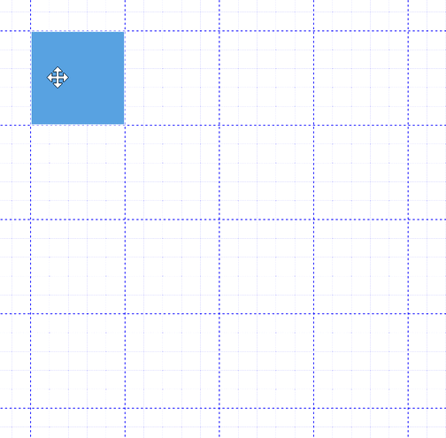

# Custom snapping

Snapping process can be customized by changing its snapping interval and snapping angle.

## Changing the Snapping interval

Diagram allows to customize the snapping interval as you want. Default value is 20.



<!--Initialize SfDiagram-->
<syncfusion:SfDiagram x:Name="diagram">
  <!--Enables the SnapConstraints value as SnapToLines -->
  <syncfusion:SfDiagram.SnapSettings>
    <syncfusion:SnapSettings SnapConstraints="SnapToLines,ShowLines">
      <!--Initialize HorizontalGridlines-->
      <syncfusion:SnapSettings.HorizontalGridlines>
        <syncfusion:Gridlines>
          <!--Initialize SnapInterval value as 100-->
          <syncfusion:Gridlines.SnapInterval>
            <local:DoubleExt>
              <sys:Double>100</sys:Double>
            </local:DoubleExt>
          </syncfusion:Gridlines.SnapInterval>
        </syncfusion:Gridlines>
      </syncfusion:SnapSettings.HorizontalGridlines>
      <!--Initialize VerticalGridlines-->
      <syncfusion:SnapSettings.VerticalGridlines>
        <syncfusion:Gridlines>
          <!--Initialize SnapInterval value as 100-->
          <syncfusion:Gridlines.SnapInterval>
            <local:DoubleExt>
              <sys:Double>100</sys:Double>
            </local:DoubleExt>
          </syncfusion:Gridlines.SnapInterval>
        </syncfusion:Gridlines>
      </syncfusion:SnapSettings.VerticalGridlines>
    </syncfusion:SnapSettings>
  </syncfusion:SfDiagram.SnapSettings>
</syncfusion:SfDiagram>



//Initialize SfDiagram
SfDiagram diagram = new SfDiagram();
//Initialize the Snap Settings
diagram.SnapSettings = new SnapSettings()
{
  SnapConstraints = SnapConstraints.SnapToLines | SnapConstraints.ShowLines,
  HorizontalGridlines = new Gridlines()
  {
    //Customize the vertical grid lines snap interval
    SnapInterval = new List<double>() { 100 },
  },
  VerticalGridlines = new Gridlines()
  {
    //Customize the vertical grid lines snap interval
    SnapInterval = new List<double>() { 100 },
  },
};

//Creating a class for list of double values
public class DoubleExt : List<double>
{
}



| SnapInterval Value  | Output |
|---|---|
| 20 | |
| 100 | |

## Changing the snapping angle

Diagram allows to customize the snapping angle as you want. Snapping angle gives more clearity about snapping when node is rotated.



<!--Initialize SfDiagram-->
<syncfusion:SfDiagram x:Name="diagram">
  <syncfusion:SfDiagram.SnapSettings>
    <!--Initialize the snap angle-->
    <syncfusion:SnapSettings SnapAngle="90"/>
  </syncfusion:SfDiagram.SnapSettings>
</syncfusion:SfDiagram>





//Initialize SfDiagram
SfDiagram diagram = new SfDiagram();
diagram.SnapSettings = new SnapSettings()
{
  //Initialize the snap angle
  SnapAngle = 90,
};




 



[How to add gridlines for diagram](/wpf/sfdiagram/gridlines)

[How to add ruler for diagram](/wpf/sfdiagram/rulers)

