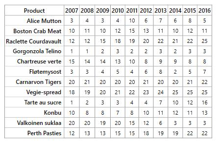
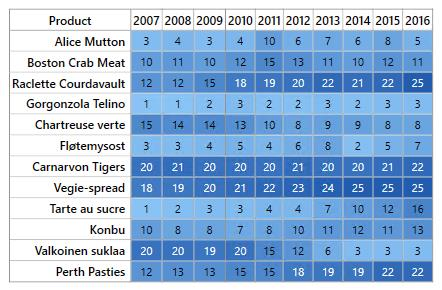

#Getting Started

## Initialize the SfHeatMap

The SfHeatMap exists in the Syncfusion.UI.Xaml.HeatMap namespace. Initialize SfHeatMap to the XAML Page as shown in the following code sample.



<Window x:Class="GettingStarted.MainWindow"
        xmlns="http://schemas.microsoft.com/winfx/2006/xaml/presentation"
        xmlns:x="http://schemas.microsoft.com/winfx/2006/xaml"
        xmlns:d="http://schemas.microsoft.com/expression/blend/2008"
        xmlns:mc="http://schemas.openxmlformats.org/markup-compatibility/2006"
        xmlns:local="clr-namespace:GettingStarted"
        mc:Ignorable="d"
        xmlns:syncfusion="http://schemas.syncfusion.com/wpf"
        Title="MainWindow" Height="350" Width="525">
    <Grid>
        <syncfusion:SfHeatMap>

        </syncfusion:SfHeatMap>
    </Grid>
</Window>



## Prepare data

Create a class to store Product information to be visualized using SfHeatMap 



public class Product
{
    public string ProductName { get; set; }
    public double Y2007 { get; set; }
    public double Y2008 { get; set; }
    public double Y2009 { get; set; }
    public double Y2010 { get; set; }
    public double Y2011 { get; set; }
    public double Y2012 { get; set; }
    public double Y2013 { get; set; }
    public double Y2014 { get; set; }
    public double Y2015 { get; set; }
    public double Y2016 { get; set; }

    public Product()
    {

    }
}

public class Products : ObservableCollection<Product>
{

}



## Populate data

Populate product information in a collection



<local:Products x:Key="productsData">
    <local:Product ProductName="Alice Mutton" Y2007="3" Y2008="4" Y2009="3" Y2010="4" Y2011="10" 
                   Y2012="6" Y2013="7" Y2014="6" Y2015="8" Y2016="5"/>
    <local:Product ProductName="Boston Crab Meat" Y2007="10" Y2008="11" Y2009="10" Y2010="12"  
                   Y2011="15" Y2012="13" Y2013="11" Y2014="10" Y2015="12" Y2016="11"/>
    <local:Product ProductName="Raclette Courdavault" Y2007="12" Y2008="12" Y2009="15" Y2010="18" 
                   Y2011="19" Y2012="20" Y2013="22" Y2014="21" Y2015="22" Y2016="25"/>
    <local:Product ProductName="Gorgonzola Telino" Y2007="1" Y2008="1" Y2009="2" Y2010="3" 
                   Y2011="2" Y2012="2" Y2013="3" Y2014="2" Y2015="3" Y2016="3"/>
    <local:Product ProductName="Chartreuse verte" Y2007="15" Y2008="14" Y2009="14" Y2010="13" 
                   Y2011="10" Y2012="8" Y2013="9" Y2014="9" Y2015="8" Y2016="8"/>
    <local:Product ProductName="Fløtemysost" Y2007="3" Y2008="3" Y2009="4" Y2010="5" Y2011="4" 
                   Y2012="6" Y2013="8" Y2014="2" Y2015="5" Y2016="7"/>
    <local:Product ProductName="Carnarvon Tigers" Y2007="20" Y2008="21" Y2009="20" Y2010="20"
                   Y2011="20" Y2012="21" Y2013="20" Y2014="20" Y2015="21" Y2016="22"/>
    <local:Product ProductName="Vegie-spread" Y2007="18" Y2008="19" Y2009="20" Y2010="21" 
                   Y2011="22" Y2012="23" Y2013="24" Y2014="25" Y2015="25" Y2016="25"/>
    <local:Product ProductName="Tarte au sucre" Y2007="1" Y2008="2" Y2009="3" Y2010="3" Y2011="4" 
                   Y2012="4" Y2013="7" Y2014="10" Y2015="12" Y2016="16"/>
    <local:Product ProductName="Konbu" Y2007="10" Y2008="8" Y2009="8" Y2010="7" Y2011="8" 
                   Y2012="10" Y2013="11" Y2014="12" Y2015="11" Y2016="13"/>
    <local:Product ProductName="Valkoinen suklaa" Y2007="20" Y2008="20" Y2009="19" Y2010="20" 
                   Y2011="15" Y2012="12" Y2013="6" Y2014="3" Y2015="3" Y2016="3"/>
    <local:Product ProductName="Perth Pasties" Y2007="12" Y2008="13" Y2009="13" Y2010="15" 
                   Y2011="15" Y2012="18" Y2013="19" Y2014="19" Y2015="22" Y2016="22"/>
</local:Products>



## Map data into SfHeatMap 

Now data is ready, next we need to configure data source and map rows and columns to visualize.

 1. Prepare ItemsMapping add it in resource.



<syncfusion:TableMapping x:Key="ItemsMapping">
    <syncfusion:TableMapping.HeaderMapping>
        <syncfusion:ColumnMapping PropertyName="ProductName" DisplayName="Product Name"/>
    </syncfusion:TableMapping.HeaderMapping>
    <syncfusion:TableMapping.ColumnMapping>
        <syncfusion:ColumnMapping PropertyName="Y2007" DisplayName="Y2007"/>
        <syncfusion:ColumnMapping PropertyName="Y2008" DisplayName="Y2008"/>
        <syncfusion:ColumnMapping PropertyName="Y2009" DisplayName="Y2009"/>
        <syncfusion:ColumnMapping PropertyName="Y2010" DisplayName="Y2010"/>
        <syncfusion:ColumnMapping PropertyName="Y2011" DisplayName="Y2011"/>
        <syncfusion:ColumnMapping PropertyName="Y2012" DisplayName="Y2012"/>
        <syncfusion:ColumnMapping PropertyName="Y2013" DisplayName="Y2013"/>
        <syncfusion:ColumnMapping PropertyName="Y2014" DisplayName="Y2014"/>
        <syncfusion:ColumnMapping PropertyName="Y2015" DisplayName="Y2015"/>
        <syncfusion:ColumnMapping PropertyName="Y2016" DisplayName="Y2016"/>
    </syncfusion:TableMapping.ColumnMapping>
</syncfusion:TableMapping>



 2. Set items source and mapping



<syncfusion:SfHeatMap ItemsSource="{StaticResource productsData}" 
                      ItemsMapping="{StaticResource itemsMapping}">
</syncfusion:SfHeatMap>



 3. This will show a grid with data as in following image.

## Color Mapping

Next we can configure color range for these values using color mapping

 1. Configure items mapping based on items source.



<syncfusion:ColorMappingCollection x:Key="colorMapping">
    <syncfusion:ColorMapping Value="0" Color="#8ec8f8"/>
    <syncfusion:ColorMapping Value="30" Color="#0d47a1"/>
</syncfusion:ColorMappingCollection>



 2. Set ColorMapping



<syncfusion:SfHeatMap ItemsSource="{StaticResource productsData}" 
                      ItemsMapping="{StaticResource itemsMapping}"
                      ColorMappingCollection="{StaticResource colorMapping}">



 3. This will show the grid data with color based on the range given.

## Legend

A legend control is used to represent range value in a gradient, create a legend with the same color mapping as shown below.



<syncfusion:SfHeatMapLegend ColorMappingCollection="{StaticResource colorMapping}"/>



Final MainPage.cs looks like this.



namespace GettingStarted
{
    /// 

    /// Interaction logic for MainWindow.xaml
    /// 

    public partial class MainWindow : Window
    {
        public MainWindow()
        {
            InitializeComponent();
        }
    }

    public class Product
    {
        public string ProductName { get; set; }
        public double Y2007 { get; set; }
        public double Y2008 { get; set; }
        public double Y2009 { get; set; }
        public double Y2010 { get; set; }
        public double Y2011 { get; set; }
        public double Y2012 { get; set; }
        public double Y2013 { get; set; }
        public double Y2014 { get; set; }
        public double Y2015 { get; set; }
        public double Y2016 { get; set; }

        public Product()
        {

        }
    }

    public class Products : ObservableCollection<Product>
    {

    }
}



Final MainPage.xaml looks like this.



<Window x:Class="GettingStarted.MainWindow"
        xmlns="http://schemas.microsoft.com/winfx/2006/xaml/presentation"
        xmlns:x="http://schemas.microsoft.com/winfx/2006/xaml"
        xmlns:d="http://schemas.microsoft.com/expression/blend/2008"
        xmlns:mc="http://schemas.openxmlformats.org/markup-compatibility/2006"
        xmlns:local="clr-namespace:GettingStarted"
        mc:Ignorable="d"
        xmlns:syncfusion="http://schemas.syncfusion.com/wpf"
        Title="MainWindow" Height="350" Width="525">
    <Window.Resources>
        <local:Products x:Key="productsData">
            <local:Product ProductName="Alice Mutton" Y2007="3" Y2008="4" Y2009="3" Y2010="4" Y2011="10" Y2012="6" Y2013="7" Y2014="6" Y2015="8" Y2016="5"/>
            <local:Product ProductName="Boston Crab Meat" Y2007="10" Y2008="11" Y2009="10" Y2010="12" Y2011="15" Y2012="13" Y2013="11" Y2014="10" Y2015="12" Y2016="11"/>
            <local:Product ProductName="Raclette Courdavault" Y2007="12" Y2008="12" Y2009="15" Y2010="18" Y2011="19" Y2012="20" Y2013="22" Y2014="21" Y2015="22" Y2016="25"/>
            <local:Product ProductName="Gorgonzola Telino" Y2007="1" Y2008="1" Y2009="2" Y2010="3" Y2011="2" Y2012="2" Y2013="3" Y2014="2" Y2015="3" Y2016="3"/>
            <local:Product ProductName="Chartreuse verte" Y2007="15" Y2008="14" Y2009="14" Y2010="13" Y2011="10" Y2012="8" Y2013="9" Y2014="9" Y2015="8" Y2016="8"/>
            <local:Product ProductName="Fløtemysost" Y2007="3" Y2008="3" Y2009="4" Y2010="5" Y2011="4" Y2012="6" Y2013="8" Y2014="2" Y2015="5" Y2016="7"/>
            <local:Product ProductName="Carnarvon Tigers" Y2007="20" Y2008="21" Y2009="20" Y2010="20" Y2011="20" Y2012="21" Y2013="20" Y2014="20" Y2015="21" Y2016="22"/>
            <local:Product ProductName="Vegie-spread" Y2007="18" Y2008="19" Y2009="20" Y2010="21" Y2011="22" Y2012="23" Y2013="24" Y2014="25" Y2015="25" Y2016="25"/>
            <local:Product ProductName="Tarte au sucre" Y2007="1" Y2008="2" Y2009="3" Y2010="3" Y2011="4" Y2012="4" Y2013="7" Y2014="10" Y2015="12" Y2016="16"/>
            <local:Product ProductName="Konbu" Y2007="10" Y2008="8" Y2009="8" Y2010="7" Y2011="8" Y2012="10" Y2013="11" Y2014="12" Y2015="11" Y2016="13"/>
            <local:Product ProductName="Valkoinen suklaa" Y2007="20" Y2008="20" Y2009="19" Y2010="20" Y2011="15" Y2012="12" Y2013="6" Y2014="3" Y2015="3" Y2016="3"/>
            <local:Product ProductName="Perth Pasties" Y2007="12" Y2008="13" Y2009="13" Y2010="15" Y2011="15" Y2012="18" Y2013="19" Y2014="19" Y2015="22" Y2016="22"/>
        </local:Products>

        <syncfusion:TableMapping x:Key="itemsMapping">
            <syncfusion:TableMapping.HeaderMapping>
                <syncfusion:ColumnMapping PropertyName="ProductName" DisplayName="Product"/>
            </syncfusion:TableMapping.HeaderMapping>
            <syncfusion:TableMapping.ColumnMapping>
                <syncfusion:ColumnMapping PropertyName="Y2007" DisplayName="2007"/>
                <syncfusion:ColumnMapping PropertyName="Y2008" DisplayName="2008"/>
                <syncfusion:ColumnMapping PropertyName="Y2009" DisplayName="2009"/>
                <syncfusion:ColumnMapping PropertyName="Y2010" DisplayName="2010"/>
                <syncfusion:ColumnMapping PropertyName="Y2011" DisplayName="2011"/>
                <syncfusion:ColumnMapping PropertyName="Y2012" DisplayName="2012"/>
                <syncfusion:ColumnMapping PropertyName="Y2013" DisplayName="2013"/>
                <syncfusion:ColumnMapping PropertyName="Y2014" DisplayName="2014"/>
                <syncfusion:ColumnMapping PropertyName="Y2015" DisplayName="2015"/>
                <syncfusion:ColumnMapping PropertyName="Y2016" DisplayName="2016"/>
            </syncfusion:TableMapping.ColumnMapping>
        </syncfusion:TableMapping>
        
        <syncfusion:ColorMappingCollection x:Key="colorMapping">
            <syncfusion:ColorMapping Value="0" Color="#8ec8f8"/>
            <syncfusion:ColorMapping Value="30" Color="#0d47a1"/>         
        </syncfusion:ColorMappingCollection>
    </Window.Resources>
    <Grid HorizontalAlignment="Center" VerticalAlignment="Center">
        <Grid.RowDefinitions>
            <RowDefinition Height="*"/>
            <RowDefinition Height="Auto"/>
        </Grid.RowDefinitions>
        <syncfusion:SfHeatMap ItemsSource="{StaticResource productsData}" 
                              ItemsMapping="{StaticResource itemsMapping}"
                              ColorMappingCollection="{StaticResource colorMapping}">
        </syncfusion:SfHeatMap>
        <syncfusion:SfHeatMapLegend Grid.Row="1"
                                    Margin="20"
                                    MaxWidth="300"
                                    ColorMappingCollection="{StaticResource colorMapping}"/>
    </Grid> 
</Window>

	


