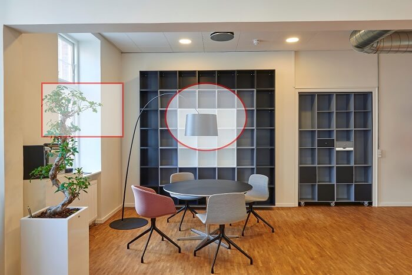

# Shapes

You can annotate an image by adding shapes such as circle, rectangle, and arrow. Shapes can be added in the following two ways:

* Using Toolbar
* Programmatically

## Adding shapes using toolbar

To add a shape, click the AddShape icon in the toolbar. This will list out the default shapes, and you can select the desired shape from it. By default, selected shape will be added at the center. You can select and drag the shape to position at the desired location. Upon selecting the shape, handles will be enabled. Handles help in resizing the shapes. Click outside to disable the selection.

## Customization

The following properties of the added shape can be customized:

* [`Fill`](https://help.syncfusion.com/cr/cref_files/wpf/Syncfusion.SfImageEditor.WPF~Syncfusion.UI.Xaml.ImageEditor.PenSettings~Fill.html)
* [`Stroke`](https://help.syncfusion.com/cr/cref_files/wpf/Syncfusion.SfImageEditor.WPF~Syncfusion.UI.Xaml.ImageEditor.PenSettings~Stroke.html)
* [`StrokeWidth`](https://help.syncfusion.com/cr/cref_files/wpf/Syncfusion.SfImageEditor.WPF~Syncfusion.UI.Xaml.ImageEditor.PenSettings~StrokeWidth.html)

By selecting the shape icon in the toolbar, a sub toolbar will be generated below the main toolbar to provide the customizing options for the shapes.

N> Shapes need to be selected to apply customization from the sub toolbar.

### Fill

Color picker will be opened on selecting this icon. You can select the desired color from color picker to fill the selected shape. By default, fill is in transparent.

### Stroke

On selecting the required color from this color picker, stroke of the selected shape will be updated. By default, stroke will be in Red.

### Stroke width

You can select the desired stroke width from the listed-out sizes to update the stroke width of the selected shape.

 

### Delete

To delete the added shape, select the shape, and then click the delete icon from the keyboard.

## Adding shapes programmatically

Shapes can be added into an image using the AddShape method. This method takes the following two parameters:

* [`ShapeType`](https://help.syncfusion.com/cr/cref_files/wpf/Syncfusion.SfImageEditor.WPF~Syncfusion.UI.Xaml.ImageEditor.Enums.ShapeType.html) - You can choose the required shape type. The available shape types are rectangle, circle, and arrow.
* [`PenSettings`](https://help.syncfusion.com/cr/cref_files/wpf/Syncfusion.SfImageEditor.WPF~Syncfusion.UI.Xaml.ImageEditor.PenSettings.html) – Customizes the added shapes.

 

 

editor.AddShape(ShapeType.Rectangle, new PenSettings());



 

### Delete

To delete the selected shape, use the Delete method as follows.

 

 

editor.Delete();



 

## Pen settings

The added shapes can be customized using the following properties in pen settings:

* [`Fill`](https://help.syncfusion.com/cr/cref_files/wpf/Syncfusion.SfImageEditor.WPF~Syncfusion.UI.Xaml.ImageEditor.PenSettings~Fill.html) - Fills the selected shape with this color.
* [`Stroke`](https://help.syncfusion.com/cr/cref_files/wpf/Syncfusion.SfImageEditor.WPF~Syncfusion.UI.Xaml.ImageEditor.PenSettings~Stroke.html) – Applies this stroke to the selected shape.
* [`Opacity`](https://help.syncfusion.com/cr/cref_files/wpf/Syncfusion.SfImageEditor.WPF~Syncfusion.UI.Xaml.ImageEditor.PenSettings~Opacity.html) – Applies opacity to both stroke and fill of the shape.
* [`StrokeWidth`](https://help.syncfusion.com/cr/cref_files/wpf/Syncfusion.SfImageEditor.WPF~Syncfusion.UI.Xaml.ImageEditor.PenSettings~StrokeWidth.html) – Applies the specified width to the stroke of a shape.
* [`Bounds`](https://help.syncfusion.com/cr/cref_files/wpf/Syncfusion.SfImageEditor.WPF~Syncfusion.UI.Xaml.ImageEditor.PenSettings~Bounds.html) – Rect used to position the shape.
* [`IsResizable`](https://help.syncfusion.com/cr/cref_files/wpf/Syncfusion.SfImageEditor.WPF~Syncfusion.UI.Xaml.ImageEditor.PenSettings~IsResizable.html) - To control the resizing of the shape.

N> Values of the bounds rect will be in percentage. For example (25,25,25,25) will take the position of 25 percent from the left and top.

 

 

            PenSettings penSettings = new PenSettings();
            penSettings.Fill = new SolidColorBrush(Colors.AliceBlue);
            penSettings.Opacity = 0.5f;
            penSettings.Stroke = new SolidColorBrush(Colors.Red);
            penSettings.StrokeWidth = 3;
            penSettings.Bounds = new Rect(10, 30, 20, 20);
            editor.AddShape(ShapeType.Rectangle, penSettings);

            penSettings = new PenSettings();
            penSettings.Fill = new SolidColorBrush(Colors.AliceBlue);
            penSettings.Opacity = 0.5f;
            penSettings.Stroke = new SolidColorBrush(Colors.Red);
            penSettings.StrokeWidth = 3;            
            penSettings.Bounds = new Rect(40, 30, 20, 25);
            editor.AddShape(ShapeType.Circle, penSettings);



 

 

## Shape resizing

By default, both shapes and text are resizable. You can also control the resizable using the ResizableElements property in image editor. The following code enables the resizing functionality to both shapes and text.

 

 

 editor.ResizableElements = ImageEditorResizableElements.Shapes | ImageEditorResizableElements.Text;



 

## Events

Shapes and Text supports the following two events:

* [`ItemSelected`](https://help.syncfusion.com/cr/cref_files/wpf/Syncfusion.SfImageEditor.WPF~Syncfusion.UI.Xaml.ImageEditor.SfImageEditor~ItemSelected_EV.html)
* [`ItemUnselected`](https://help.syncfusion.com/cr/cref_files/wpf/Syncfusion.SfImageEditor.WPF~Syncfusion.UI.Xaml.ImageEditor.SfImageEditor~ItemUnselected_EV.html)

### ItemSelected

This event occurs when an item (shape/text) is selected. `ItemSelectedEventArgs` will be the parameter. In the `Settings` property, you can get either TextSettings or PenSettings based on the selected item.

You can make changes on the settings such as stroke etc.

 

 

 private void Editor_ItemSelected(object sender, ItemSelectedEventArgs args)
        {
            
        }



 

### ItemUnSelected

This event occurs when an item (shape/text) is unfocused. `ItemUnselectedEventArgs` will be the parameter. In the `Settings` property, you can get either TextSettings or PenSettings based on the selected item.

You can make changes on the settings such as stroke etc. This is applied after the item has been unselected.

 

 

  private void Editor_ItemUnselected(object sender, ItemUnselectedEventArgs args)
        {            
           
        }




