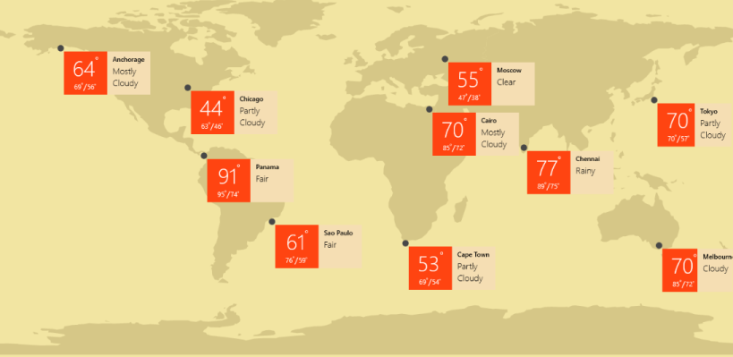

# Custom Data Binding

A map can be bound with custom objects. For custom data binding, a .dbf file is not required. In Data Binding, an object is bound to a shape. In custom data binding, an object is bound to a point based on latitude and longitude values. CustomDataSourceis the API exposed in the custom data source. It is an IEnumerable type API. Each item in the CustomDataSource should have latitude and longitude properties with each mentioned name. Stick to to the following rules for custom data binding:

## Rule for Specifying the Latitude

Latitude should specify its decimal value along with the first letter of direction. Since latitude is related to the North and South directions on a map, the values should end with N or S. For example: 10.12245N or 23.4566S.

## Rule for Specifying the Longitude

The rule for longitude is similar to that of the latitude, apart from the directional value. Since longitude is related to the East and West directions on a map, the values should end with E or W. For example:34.345E or 56.345W.

To show the custom data on the map, the CustomDataSourceTemplatemust be specified. CustomDataSourceTemplate is a DataTemplate type API used to expose the template for custom data.




public class Weather

    {       

        public int CurrentTemperature { get; set; }

        public int AverageHighTemperature { get; set; }

        public int AverageLowTemperature { get; set; }

        public string Country { get; set; }

        public string Continent { get; set; }

        public string City { get; set; }

        public string WeatherDescription { get; set; }

        public int Humidity { get; set; }

        public string Longitude { get; set; }

        public string Latitude { get; set; }

    }





public class ViewModel

    {

        public List<Weather> Models

        {

            get;

            set;

        }

        public ViewModel()

        {          

            this.Models = new List<Weather>();

            this.Models = ViewModel.GetWeatherData();

        }

        public static List<Weather> GetWeatherData()

        {

            List<Weather> weatherCollection = new List<Weather>();

                weatherCollection.Add(new Weather() { Humidity = 86, CurrentTemperature = 44, AverageHighTemperature = 63, AverageLowTemperature = 46, City = "Chicago", Continent = "North America", Country = "United States", WeatherDescription = "Partly Cloudy", Latitude="41.8500N", Longitude="87.6500W"  });

                weatherCollection.Add(new Weather() { Humidity = 94, CurrentTemperature = 77, AverageHighTemperature = 89, AverageLowTemperature = 75, City = "Chennai", Continent = "Asia", Country = "India", WeatherDescription = "Rainy", Latitude = "12.5810N", Longitude="76.0740E"});

                                weatherCollection.Add(new Weather() { Humidity = 60, CurrentTemperature = 70, AverageHighTemperature = 70, AverageLowTemperature = 57, City = "Tokyo", Continent = "Asia", Country = "Japan", WeatherDescription = "Partly Cloudy", Latitude="35.6833N", Longitude="139.7667E" });

                weatherCollection.Add(new Weather() { Humidity = 72, CurrentTemperature = 55, AverageHighTemperature = 47, AverageLowTemperature = 38, City = "Moscow", Continent = "Asia", Country = "Russia", WeatherDescription = "Clear", Latitude="55.7517N", Longitude="37.6178E" });

                weatherCollection.Add(new Weather() { Humidity = 70, CurrentTemperature = 53, AverageHighTemperature = 69, AverageLowTemperature = 54, City = "Cape Town", Continent = "Africa", Country = "South Africa", WeatherDescription = "Partly Cloudy", Latitude="33.9767S", Longitude="18.4244E"  });

                                weatherCollection.Add(new Weather() { Humidity = 77, CurrentTemperature = 64, AverageHighTemperature = 69, AverageLowTemperature = 56, City = "Anchorage", Continent = "North America", Country = "United States", WeatherDescription = "Mostly Cloudy", Latitude = "61.1919N", Longitude = "149.7621W" });

                weatherCollection.Add(new Weather() { Humidity = 55, CurrentTemperature = 91, AverageHighTemperature = 95, AverageLowTemperature = 74, City = "Panama", Continent = "South America", Country = "Republic Of  Panama", WeatherDescription = "Fair", Latitude = "8.7515N", Longitude = "79.8772W" });

                weatherCollection.Add(new Weather() { Humidity = 88, CurrentTemperature = 61, AverageHighTemperature = 76, AverageLowTemperature = 59, City = "Sao Paulo", Continent = "South America", Country = "Brazil", WeatherDescription = "Fair", Latitude="23.5000S", Longitude="46.6167W" });

                weatherCollection.Add(new Weather() { Humidity = 83, CurrentTemperature = 70, AverageHighTemperature = 85, AverageLowTemperature = 72, City = "Cairo", Continent = "Africa", Country = "Egypt", WeatherDescription = "Mostly Cloudy", Latitude = "31.2262E", Longitude = "30.0566N" });

                weatherCollection.Add(new Weather() { Humidity = 78, CurrentTemperature = 70, AverageHighTemperature = 85, AverageLowTemperature = 72, City = "Melbourne", Continent = "Oceania", Country = "Australia", WeatherDescription = "Cloudy", Latitude = "35.0833S", Longitude = "142.0667E" });

            return weatherCollection;

        }

    }




<Syncfusion:SfMap  Name="Weather_Report" >

                 <Syncfusion:SfMap.Layers>

                    <Syncfusion:ShapeFileLayer Background="#FFF2E5A2" CustomDataSource="{Binding Models}" EnableSelection="True" Uri="MapApp.world1.shp"  ShapeIDPath="NAME" ShapeIDTableField="NAME">

                            <Syncfusion:ShapeFileLayer.ShapeSettings>

                            <Syncfusion:ShapeSetting ShapeValuePath="Latitude" SelectedShapeColor="#FFD96666" ColorPalette="CustomPalette"  ShapeStrokeThickness="0">

                            <Syncfusion:ShapeSetting.FillSetting>

                                <Syncfusion:ShapeFillSetting AutoFillColors="True"/>

                            </Syncfusion:ShapeSetting.FillSetting>

                            <Syncfusion:ShapeSetting.CustomColors>

                                    <Syncfusion:MapColorPalette FillBrush="#FFD6C787"/>

                            </Syncfusion:ShapeSetting.CustomColors>

                        </Syncfusion:ShapeSetting>

                    </Syncfusion:ShapeFileLayer.ShapeSettings>

                    <Syncfusion:ShapeFileLayer.CustomDataSourceTemplate>

                        <DataTemplate>

                            <Grid>

                                <Grid.RowDefinitions>

                                    <RowDefinition Height="1*"/>

                                    <RowDefinition Height="9*"/>

                                </Grid.RowDefinitions>

                                <Grid.ColumnDefinitions>

                                    <ColumnDefinition Width="1*"/>

                                    <ColumnDefinition Width="9*"/>

                                </Grid.ColumnDefinitions>

                                <Ellipse Width="12" Height="12" Grid.Column="0" Grid.Row="0" Fill="#FF474747"/>

                                <Grid Grid.Column="1" Grid.Row="1">

                                    <Grid.ColumnDefinitions>

                                        <ColumnDefinition/>

                                        <ColumnDefinition/>

                                    </Grid.ColumnDefinitions>

                                    <!-- left column-->

                                    <Grid Grid.Column="0" Width="80" Height="80" Background="#FFFF4411" DataContext="{Binding Data}">

                                        <StackPanel Orientation="Vertical">

                                            <Grid HorizontalAlignment="Center" VerticalAlignment="Center" Margin="3,3,3,-3">

                                                <StackPanel Orientation="Horizontal">

                                                    <TextBlock FontSize="40" FontFamily="Segoe UI"  FontWeight="Thin" Text="{Binding CurrentTemperature}" HorizontalAlignment="Center" VerticalAlignment="Center" Foreground="White"/>

                                                    <TextBlock Text="&#186;" FontSize="13" Foreground="White" Padding="0,4,0,0" HorizontalAlignment="Left" VerticalAlignment="Top"/>

                                                </StackPanel>

                                            </Grid>

                                            <StackPanel Orientation="Horizontal" Margin="0,0,0,35">

                                                <Grid Margin="19,0,0,5" HorizontalAlignment="Center" VerticalAlignment="Center">

                                                    <StackPanel Orientation="Horizontal">

                                                        <TextBlock FontSize="12" FontFamily="Segoe UI" Text="{Binding AverageHighTemperature}" HorizontalAlignment="Center" VerticalAlignment="Center" Foreground="White"/>

                                                        <TextBlock Text="&#186;" FontSize="8" Foreground="White" HorizontalAlignment="Left" VerticalAlignment="Top"/>

                                                    </StackPanel>

                                                </Grid>

                                                <TextBlock Margin="0,0,0,5" FontFamily="Segoe UI" Text="/" HorizontalAlignment="Center" VerticalAlignment="Center" Foreground="White" FontSize="16"/>

                                                <Grid Margin="0,0,0,5" HorizontalAlignment="Center" VerticalAlignment="Center">

                                                    <StackPanel Orientation="Horizontal">

                                                        <TextBlock FontSize="12" FontFamily="Segoe UI"  Text="{Binding AverageLowTemperature}" HorizontalAlignment="Left" VerticalAlignment="Top" Foreground="White"/>

                                                        <TextBlock Text="&#186;" FontFamily="Segoe UI" FontSize="7" Foreground="White" HorizontalAlignment="Left" VerticalAlignment="Top"/>

                                                    </StackPanel>

                                                </Grid>

                                            </StackPanel>

                                        </StackPanel>

                                    </Grid>

                                    <Grid Grid.Column="1" Height="80" DataContext="{Binding Data}" Background="Wheat" Width="80">

                                        <StackPanel Orientation="Vertical">

                                            <TextBlock Padding="10,0,0,0" TextWrapping="Wrap" Margin="0,6,0,0" FontFamily="Segoe UI" Text="{Binding City}" FontSize="12" HorizontalAlignment="Left" VerticalAlignment="Center" Foreground="Black" FontWeight="Medium"/>

                                            <TextBlock Margin="10,3,0,0" TextWrapping="Wrap" Foreground="Black" FontFamily="Segoe UI" FontWeight="Thin" Text="{Binding WeatherDescription}" HorizontalAlignment="Left" FontSize="16" VerticalAlignment="Center"/>

                                        </StackPanel>

                                    </Grid>

                                    <Grid Grid.Column="1">

                                    </Grid>

                                </Grid>

                            </Grid>

                        </DataTemplate>

                    </Syncfusion:ShapeFileLayer.CustomDataSourceTemplate>

                </Syncfusion:ShapeFileLayer>

            </Syncfusion:SfMap.Layers>

   </Syncfusion:SfMap >




