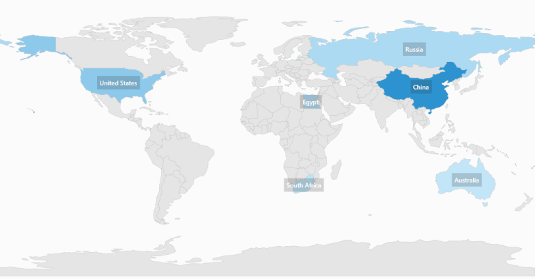

# Displaying Items on a Map

Along with bubbles, the ItemsSource data can be visualized with other elements. The ItemsTemplate property is used to define the template for the items that are displayed on the map. By default, the map elements show the values of the object that is defined in the ShapeValuePath of the ShapeFileLayer’s shape setting.

## ItemsTemplate

ItemsTemplate is a type of DataTemplate that is used to override the default template for map items. “Data” is the property that holds the object for a map item.

### Code Sample

Implement the Model and ViewModel, as mentioned in the Data Binding topic, and include the following code in the XAML page:



<syncfusion:SfMap>

            <syncfusion:SfMap.Layers>

                <syncfusion:ShapeFileLayer Background="White" ItemsSource="{Binding Countries}" ShapeIDPath="NAME" ShapeIDTableField="NAME" Uri="BubbleVisualization.ShapeFiles.world1.shp">

                    <syncfusion:ShapeFileLayer.ItemsTemplate>

                        <DataTemplate>

                            <Grid Background="#332D2D2D">

                                <TextBlock Margin="5" Foreground="White" Opacity="1" FontSize="12" FontWeight="SemiBold" FontFamily="Segoe UI" Text="{Binding Data.NAME}"/>

                            </Grid>

                        </DataTemplate>

                    </syncfusion:ShapeFileLayer.ItemsTemplate>

                    <syncfusion:ShapeFileLayer.ShapeSettings>

                        <syncfusion:ShapeSetting ShapeFill="#E5E5E5" ShapeStroke="#C1C1C1" ShapeStrokeThickness="0.5" ShapeValuePath="Population" ShapeColorValuePath="Population" >

                            <syncfusion:ShapeSetting.FillSetting>

                                <syncfusion:ShapeFillSetting AutoFillColors="False">

                                    <syncfusion:ShapeFillSetting.ColorMappings>

                                        <syncfusion:RangeColorMapping To="1500000000" From="750000000" Color="#2A91CF"/>

                                        <syncfusion:RangeColorMapping To="750000000" From="1000" Color="#3D9FD8"/>

                                        <syncfusion:RangeColorMapping From="0" To="1000" Color="#C7E9FA"/>

                                    </syncfusion:ShapeFillSetting.ColorMappings>

                                </syncfusion:ShapeFillSetting>

                            </syncfusion:ShapeSetting.FillSetting>

                        </syncfusion:ShapeSetting>

                    </syncfusion:ShapeFileLayer.ShapeSettings>

                </syncfusion:ShapeFileLayer>

            </syncfusion:SfMap.Layers>

        </syncfusion:SfMap>


