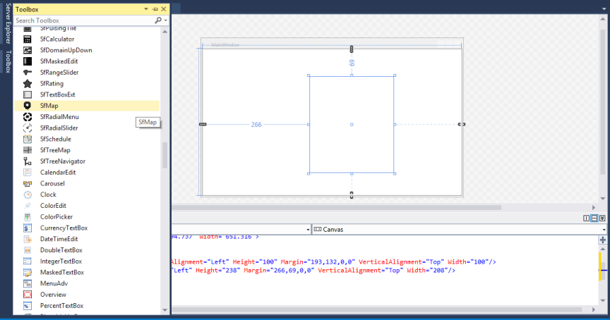
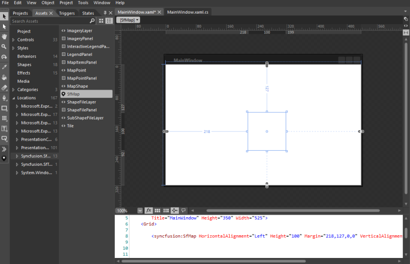

# Getting Started

## Create SfMaps control 

There are three possible ways to create a simple SfMap control.

### Through Visual Studio

To create the SfMap control through Visual Studio, drag SfMap from Toolbox and drop it to the designer. 

It generates the following the SfMap control.

### Through Expression Blend

The SfMap control can also be created and configured by using Expression Blend. Follow these steps to do so.

1. Create a WPF project in Expression Blend and reference the following assemblies.
1. Syncfusion.SfMaps.Wpf
2. Syncfusion.Shared.Wpf     
2. Search for SfMap in the Toolbox.
3. Drag SfMap to the designer. It generates the SfMap control with one child element.

### Through XAML and C#

Maps is available in the following assembly and namespace:

Assembly: Syncfusion.SfMaps.WPF

Namespace: Syncfusion.UI.Xaml.Maps

You can create the SfMap control programmatically through XAML and C#. In the following code example. 



<Window x:Class="MapApp.MainWindow"         
xmlns="http://schemas.microsoft.com/winfx/2006/xaml/presentation"       
xmlns:local="clr-namespace:MapApp"          
xmlns:x="http://schemas.microsoft.com/winfx/2006/xaml"        
xmlns:syncfusion="clr-namespace:Syncfusion.UI.Xaml.Maps;assembly=Syncfusion.SfMaps.WPF">    
<Grid Background="{StaticResource ApplicationPageBackgroundThemeBrush}" Name="mainGrid">        
<syncfusion:SfMap>                     
<syncfusion:SfMap.Layers>                
<syncfusion:ShapeFileLayer   Uri="MapApp.world1.shp">                                    
</syncfusion:ShapeFileLayer>           
 </syncfusion:SfMap.Layers>        
</syncfusion:SfMap>    
</Grid>
</Page>




            
SfMap syncMap = new SfMap();            
syncMap.EnablePan = true;            
ShapeFileLayer layer = new ShapeFileLayer();            
layer.Uri = "MapApp.world1.shp";            
syncMap.Layers.Add(layer);


## Configure the SfMap Control

### Read and Load the Shapes

The Maps control supports reading and loading shape files. A shape file is a set of files that are stored in a non-topological geometry and the attribute information for the spatial features and records in a data set. Spatial features and records are stored as shapes that consist of set vector coordinates.  A computer program can read the content of the shape files and parse them as vector elements. The Maps control also reads and parses the spatial information of a shape file into the graphical elements. 

As mentioned earlier, a shape file can be a set of files or a single file. Generally, the shape file contains the following files:

Main file (.shp)

Index file (.shx)

dBASE file (.dbf)

All files must adhere to the 8.3 naming conventions. The Main file, Index file, and dBASE file must have the same prefix, i.e., they must have the same file name. This naming convention allows you to identify specific geographical information.

The main file (.shp) contains a fixed-length file header followed by the variable-length records. Each variable-length record is made up of a fixed-length record header followed by the variable-length record contents.  

The index file (.shx) contains a 100-byte header followed by 8-byte, fixed-length records.

The dBASE file (.dbf) contains any desired feature attributes or attributes keys, where other tables can be joined. Its format is a standard .dbf file used by many table-based applications in Windows™ and DOS.  Any set of fields can be present in the table.

For more information about the 8.3 naming convention, shape files and their descriptions, visit the following link:

[http://www.esri.com/library/whitepapers/pdfs/shapefile.pdf](http://www.esri.com/library/whitepapers/pdfs/shapefile.pdf)

Maps read the main file and create the map shapes. The associated .dbf file contents are then incorporated with the shapes created from the main files.

### Attach the Shape file with Maps

To read the shape file using Maps, the shape file’s main file and .dbf file need to be added as an embedded resource in the application project. Then, the main file’s path has to be given in the Uri file of the shape file layer.

#### About the Uri property

Uri is the string type property that retrieves the location of the shape file that is added as an embedded resource. 

#### Structure of Uri property

The Uri property contains the following information:

Namespace

Subfolder names

ShapeFilename.shp



<syncfusion:ShapeFileLayer Uri=”MapApp.ShapeFiles.world1.shp”  x:Name="shapeControl">

</syncfusion:ShapeFileLayer>


In the above code sample, MapApp is the namespace, ShapeFile is the subfolder name, and world1.shp is the name of the shape file. 

The above code example results in the following output

### Load Shapefile as Content File Instead of Embedded Resource

This feature enables the control to read a shapefile from an HTTP path, as a content file, or from shapefiles and DBF files as a stream. It can also be used to render map shapes at run time.

#### From HTTP Path

By giving the URL path of the file to the URI property, a shapefile is read. Here, the file is not downloaded. It only reads the content from the web. 

##### Code Sample



<syncfusion:SfMap>

            <syncfusion:SfMap.Layers>

                <syncfusion:ShapeFileLayer  Uri="http://bi.syncfusion.com/shapefiles/world.shp">

                </syncfusion:ShapeFileLayer>

            </syncfusion:SfMap.Layers>

  </syncfusion:SfMap>



### Data Binding in Map

The following properties expose data binding in the Maps control:

ItemsSource

ShapeIDPath

ShapeIDTableField

#### Items Source

This is the basic property that exposes data binding for Maps. ItemsSource is the property that accepts the collection type values. For example, the ItemsSource property accepts the ObservableCollections, Lists, and LinqResult values.

#### ShapeID Path

ShapeIDPath is the string type property used to refer to the ID of a shape from the ItemsSource. The ItemsSource property must have a property with name of the ShapeIDPath. The ShapeIDPath and the ShapeIDTableField properties are related to each other (refer to ShapeIDTableField for more details).

#### ShapeID TableField

The ShapeIDTableField property is similar to the ShapeIDPath. It is a string type property that refers to the column name in the dbf file to identify the shape. When values of the ShapeIDPath property in the ItemsSource and the value of ShapeIDTableField in the .dbf file match, then the associated object from the ItemsSource is bound to the corresponding shape.

#### ShapeValuePath

ShapeValuePath is a string type property used to define the object bound to the shapes of the map. The ShapeValuePath must be the name of any property that is defined in the ItemsSource items. The ShapeIDPath, ShapeIDTableField, and ShapeValue paths are dependent upon one another. Without specifying the ShapeIDPath and ShapeIDTableField, ShapeValuePath has no effect.  When ShapeIDPath and ShapeIDTableField are properly set as mentioned in the Data Binding section, the ShapeValuePath has an impact on the map.

#### Role of DBF file in Data Binding

The .dbf file that is included in the main shape file, is required to work with data binding. The .dbf file contains the information about the shapes in the main shape file. Each record in the .dbf file is associated with the each shape in the main file. Shapes in the main file and records in the .dbf file are organized in the same sequence. Therefore, the Nth shape in the main file is associated with Nth record in the .dbf file. A record of the .dbf file can contain the name of the shape or population data or some other statistical data of a geographic shape.



        <syncfusion:SfMap >

            <syncfusion:SfMap.Layers>

                <syncfusion:ShapeFileLayer EnableSelection="True" ItemsSource="{Binding Countries}" ShapeIDPath="Country" ShapeIDTableField="NAME" Uri="MapApp.world1.shp">

                    <syncfusion:ShapeFileLayer.ShapeSettings>

                        <syncfusion:ShapeSetting ShapeStroke="#FFD0D1D7" ShapeStrokeThickness="1" ShapeValuePath="Population" ShapeFill="#9CBF4E" SelectedShapeColor="#BC5353"/>

                    </syncfusion:ShapeFileLayer.ShapeSettings>   

                </syncfusion:ShapeFileLayer>

            </syncfusion:SfMap.Layers>

        </syncfusion:SfMap >


### Customize Map Appearance 

You can customize the shape’s color by using ShapeFill, ShapeStroke and ShapeStrokeThickness properties in ShapeSettings.



public class Country : INotifyPropertyChanged    {        public string NAME { get; set; }     
   private Visibility itemsvisibility = Visibility.Visible;        
   public Visibility ItemsVisibility        
   {           
   get { return itemsvisibility; }            
   set { itemsvisibility = value; }        
   }        
   private double weather { get; set; }       
   public double Weather        
   {            
   get            
   {               
   return weather;            
   }           
   set            
   {               
   weather = value;            
   }       
   }       
   private double population { get; set; }       
   public double Population        
   {            
   get            
   {               
   return population;            
   }            
   set            
   {                
   population = value;                
   OnPropertyChanged(new PropertyChangedEventArgs("Population"));            
   }        
   }       
   public string PopulationFormat { get; set; }       
   public event PropertyChangedEventHandler PropertyChanged;        
   public void OnPropertyChanged(PropertyChangedEventArgs e)        
   {            
   this.PopulationFormat = (String.Format("{0:0,0}", this.Population).Trim('$'));            
   if (PropertyChanged != null)            
   {               
   PropertyChanged(this, e);            
   }        
   }    
   }    
   public class MapViewModel    
   {        
   public ObservableCollection<Country> Countries { get; set; }        
   public MapViewModel()        
   {            
   Countries = new ObservableCollection<Country>();            
   Countries = GetCountriesAndPopulation();        
   }        
   private ObservableCollection<Country> GetCountriesAndPopulation()        
   {            
   ObservableCollection<Country> countries = new ObservableCollection<Country>();            
   countries.Add(new Country() { NAME = "China", Population = 1347350000 });            
   countries.Add(new Country() { NAME = "United States", Population = 314623000 });           
   countries.Add(new Country() { NAME = "Australia", Population = 22789701 });           
   countries.Add(new Country() { NAME = "Russia", Population = 143228300 });            
   countries.Add(new Country() { NAME = "Egypt", Population = 82724000 });            
   countries.Add(new Country() { NAME = "South Africa", Population = 50586757 });           
   return countries;       
   }   
   } 


 

  
       
<syncfusion:SfMap >            
<syncfusion:SfMap.Layers>               
 <syncfusion:ShapeFileLayer EnableSelection="True" ItemsSource="{Binding Countries}" ShapeIDPath="Country" 
 ShapeIDTableField="NAME" Uri="MapApp.world1.shp">                    
 <syncfusion:ShapeFileLayer.ShapeSettings>                        
 <syncfusion:ShapeSetting ShapeStroke="#FFD0D1D7" ShapeStrokeThickness="1" ShapeValuePath="Population" 
 ShapeFill="#9CBF4E" SelectedShapeColor="#BC5353"/>                    
 </syncfusion:ShapeFileLayer.ShapeSettings>                  
 </syncfusion:ShapeFileLayer>            
 </syncfusion:SfMap.Layers>        
 </syncfusion:SfMap >


