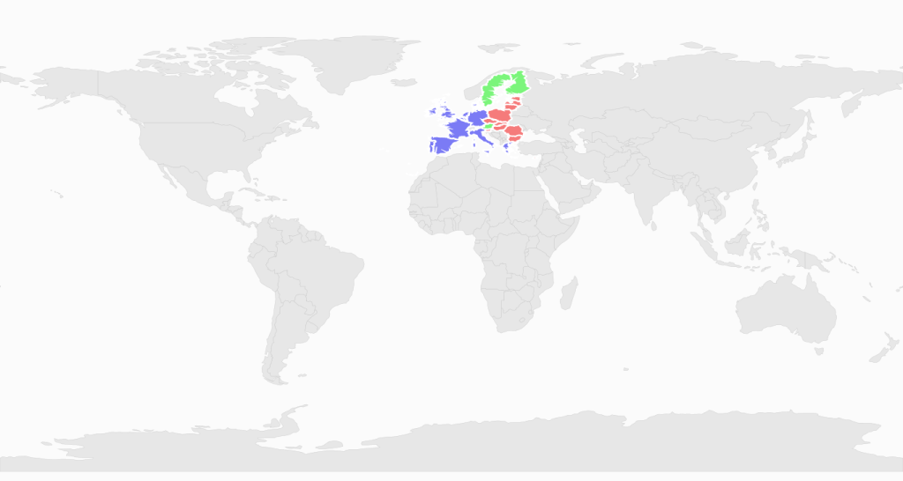

# KML Shapes Rendered in SubShapeFileLayer

[XAML]

        <syncfusion:SfMap>

            <syncfusion:SfMap.Layers>

                <syncfusion:ShapeFileLayer Uri="KmlImportDemo. ShapeFiles.world1.shp">

                    <syncfusion:ShapeFileLayer.SubShapeFileLayers>

                        <syncfusion:SubShapeFileLayer Uri="KmlImportDemo.KmlFiles.Eu.kml"/>

                    </syncfusion:ShapeFileLayer.SubShapeFileLayers>

                </syncfusion:ShapeFileLayer>

            </syncfusion:SfMap.Layers>

        </syncfusion:SfMap>

{{ '' | markdownify }}
{:.image }

