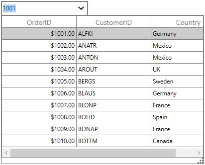

# Columns

SfMultiColumnDropDownControl enables you to define the columns as like in SfDataGrid. You can let the `SfMultiColumnDropDownControl` to create columns or you can manually defined columns to de displayed. Below sections explains both ways,
 
    1. Automatically generating columns
    2. Manually define columns
    
## Automatically generating columns

The automatic column generation based on properties of data object can be enabled or disabled by setting [SfMultiColumnDropDownControl.AutoGenerateColumns](http://help.syncfusion.com/cr/cref_files/wpf/Syncfusion.SfGrid.WPF~Syncfusion.UI.Xaml.Grid.SfMultiColumnDropDownControl~AutoGenerateColumns.html). 
You can [refer here](http://help.syncfusion.com/wpf/sfdatagrid/columns#defining-columns) to know more about the automatic column generation in SfMultiColumnDropDownControl.

## Manually defining columns

SfMultiColumnDropDownControl control allows you to define the columns manually by adding desired column to the [SfMultiColumnDropDownControl.Columns](http://help.syncfusion.com/cr/cref_files/wpf/Syncfusion.SfGrid.WPF~Syncfusion.UI.Xaml.Grid.SfMultiColumnDropDownControl~Columns.html) collection.



<syncfusion:SfMultiColumnDropDownControl x:Name="sfMultiColumn"
                                         Width="175"
                                         Height="30"
                                         AutoGenerateColumns="false"
                                         DisplayMember="OrderID"
                                         ItemsSource="{Binding Orders}"
                                         SelectedIndex="0"
                                         ValueMember="OrderID">
    <syncfusion:SfMultiColumnDropDownControl.Columns>
        <syncfusion:GridCurrencyColumn MappingName="OrderID" />
        <syncfusion:GridTextColumn MappingName="CustomerID" />
        <syncfusion:GridTextColumn MappingName="Country" />
    </syncfusion:SfMultiColumnDropDownControl.Columns>
</syncfusion:SfMultiColumnDropDownControl>


SfMultiColumnDropDownControl sfMultiColumn = new SfMultiColumnDropDownControl();
sfMultiColumn.AutoGenerateColumns = false;
sfMultiColumn.Columns.Add(new GridCurrencyColumn() { MappingName = “OrderID” });
sfMultiColumn.Columns.Add(new GridTextColumn() { MappingName = “CustomerID” });
sfMultiColumn.Columns.Add(new GridTextColumn() { MappingName = “Country” });



## Column sizing

You can also set the column width based on certain logic by setting [SfMultiColumnDropDownControl.GridColumnSizer](http://help.syncfusion.com/cr/cref_files/wpf/Syncfusion.SfGrid.WPF~Syncfusion.UI.Xaml.Grid.SfMultiColumnDropDownControl~GridColumnSizer.html). You can refer here to know more about the [GridColumn.ColumnSizer](http://help.syncfusion.com/cr/cref_files/wpf/Syncfusion.SfGrid.WPF~Syncfusion.UI.Xaml.Grid.GridColumn~ColumnSizer.html).
In the below code, `GridLengthUnitType.Star` is sets as `GridColumnSizer` for equally sets the column widths.

You can [refer here](http://help.syncfusion.com/wpf/sfdatagrid/columns#column-sizing) to know more about the column sizing.



<syncfusion:SfMultiColumnDropDownControl x:Name="sfMultiColumn"
                                         Width="175"
                                         Height="25"                                            
                                         AutoGenerateColumns="False"
                                         DisplayMember="Title"
                                         GridColumnSizer="Star"
                                         ItemsSource="{Binding MoviesLists}"
                                         SelectedIndex="2"
                                         ValueMember="Title">
    <syncfusion:SfMultiColumnDropDownControl.Columns>
        <syncfusion:GridTextColumn MappingName="Title" />
        <syncfusion:GridTextColumn MappingName="Cast" />
        <syncfusion:GridTextColumn MappingName="Director" />
        <syncfusion:GridTextColumn MappingName="Rating" />
    </syncfusion:SfMultiColumnDropDownControl.Columns>
</syncfusion:SfMultiColumnDropDownControl>



