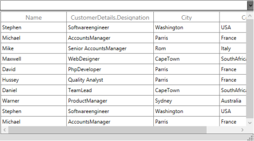
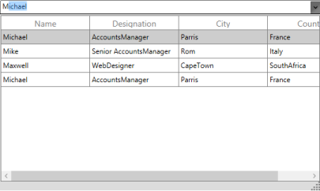
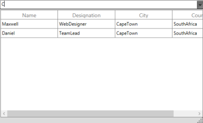
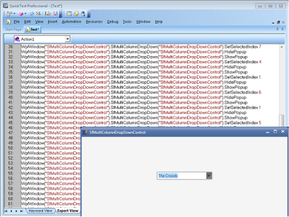

# Features

This section explains the key properties, behaviors, resizing, and keyboard support assisted by the SfMultiColumnDropDown control. 

## Data Binding

In order to display the data in the SfMultiColumnDropDown control, bind the data into the control by using ItemsSource property.

The following code example illustrates how bind the itemsSource to the SfMulticolumnDropDownControl in XAML.


[XAML]

<Window.DataContext>

  <local:Viewmodel/>

</Window.DataContext>

<syncfusion:SfMultiColumnDropDownControl x:Name="sfmulticolumn"

                                           ItemsSource="{Binding EmpDetails}"

                                           DisplayMember="Name"

                                           ValueMember="Designation"                                             

                                           >
										   

The following screenshot illustrates the output of the above code.

### Binding Collection in CodeBehind

The following code example illustrates how to bind itemsSource to the SfMultiColumnDropDownControl in codebehind.



[C#] 

public MainWindow()

{

  InitializeComponent();  

 sfmulticolumn.ItemsSource = new ObservableCollection<Data>

{

new Data(){Name="Stephen", Designation="Softwareengineer"},City="Washington",Country="USA"

new Data(){Name="Michael", Designation= "AccountsManager"}, City="Parris",Country="France"

new Data(){Name="Mike", Designation= "Senior AccountsManager "}, City="Rom",Country="Italy"

new Data(){Name="Maxwell", Designation= "WebDesigner"}, City="CapeTown",Country="SouthAfrica"

};    

 sfmulticolumn.DisplayMember="Name";

 sfmulticolumn.ValueMember="Designation";

}


The following screenshot illustrates the output for SfMultiColumnDropDownControl.

### Complex Property Binding

SfMultiColumnDropDownControl allows you to bind the Complex property to its column. For example, Data class contains “customerDetails” as Customer class type. It also contains Name and Designation property. The column for the complex property is defined in the format of “Property.Member”.

The following code example illustrate how to bind Complex property in SfMultiColumnDropDownControl,



[C#]

public class Data:INotifyPropertyChanged

    {

       public string name;

       public string designation;

       public string city;

       public string country;

       Customer customer = new Customer();

       public event PropertyChangedEventHandler PropertyChanged;

       public Customer customerDetails

       {

           get { return customer; }

           set { customer = value; }

       }

       public string Name

       {

           get { return name; }

           set { name = value; RaisePropertyChanged("Name"); 

           }

       }

       public string Designation

       {

           get { return designation; }

           set { designation = value;RaisePropertyChanged("Designation"); 

           }

       }

        public string City

        {

            get { return city; }

            set { city = value; RaisePropertyChanged("City"); }

        }

        public string Country

        {

            get { return country; }

            set { country = value; RaisePropertyChanged("Country"); }

        }

        protected virtual void RaisePropertyChanged(string propertyName)

        {

            var handler = PropertyChanged;

            if (handler != null)

                handler(this, new PropertyChangedEventArgs(propertyName));

        }

     public Data(string _name,string _designation,string _city,string _country)

       {

           this.Name = _name;

           this.customerDetails.Name = _name;

           this.customerDetails.Designation = _designation;

           this.City = _city;

           this.Country = _country;

       }

    }




[XAML]

<syncfusion:SfMultiColumnDropDownControl x:Name="sfmulticolumn"

                                           SelectedIndex="1"

                                           AutoGenerateColumns="False"

                                           ItemsSource="{Binding EmpDetails}"

                                           DisplayMember="Name"

                                           ValueMember="City"                                                                                           

                                                 >

     <syncfusion:SfMultiColumnDropDownControl.Columns>

       <syncfusion:Columns>

         <syncfusion:GridTextColumn MappingName="Name" />

         <syncfusion:GridTextColumn MappingName="customerDetails.Designation" />

         <syncfusion:GridTextColumn MappingName="City" />

         <syncfusion:GridTextColumn MappingName="Country" />

       </syncfusion:Columns>

     </syncfusion:SfMultiColumnDropDownControl.Columns>

</syncfusion:SfMultiColumnDropDownControl>

The following screenshot illustrates the output for Complex property binding in SfMultiColumnDropDownControl.

## Columns

SfMultiColumnDropDownControl enables you to define columns like SfDataGrid. It provides the following properties to achieve it:

* AutoGenerateColumns: This is a Boolean property that specifies whether the columns should be autogenerated by the SfDataGrid in the DropDownGrid, or should be generated based on the Columns property. 
* Columns: This collection of GridColumns enables to generate columns based on the given GridColumns. To know more about GridColumns, click here Column
* AutoGenerateColumnMode:It decides the way of creating columns when AutoGenerateColumns is set to true. This enum type has four options and they are as follows. 
* Reset: Creates columns for all fields in a datasource and retains the columns defined explicitly in application level.
* RetainOld: Creates columns for all the fields in a datasource when the DropDownGrid does not have any explicit definition for columns. When columns are defined explicitly, then new columns are not created.
* ResetAll: When changing ItemsSource, the columns for previous data are cleared and it makes new columns. Or, when you define columns explicitly it does not take defined columns, it takes it from underlying collection.
* None: Keeps the columns that are defined in SfDataGrid Columns.

The following code example illustrates the usage of Columns in the SfMultiColumnDropDown control.



[C#]

<Window.DataContext>

  <local:Viewmodel/>

</Window.DataContext>

<syncfusion:SfMultiColumnDropDownControl x:Name="sfmulticolumn"

                                           AllowIncrementalFiltering="False"                 

                                           AutoGenerateColumns="false"

                                           DisplayMember="Name" 

                                           ValueMember="Title"                                                           

                                           ItemsSource="{Binding GridItemSource}">

<syncfusion:SfMultiColumnDropDownControl.Columns>

<syncfusion:GridTextColumn MappingName="Name" />

<syncfusion:GridTextColumn MappingName="Designation" />

<syncfusion:GridTextColumn MappingName="City" />

<syncfusion:GridTextColumn MappingName="Country" />

</syncfusion:SfMultiColumnDropDownControl.Columns>

</syncfusion:SfMultiColumnDropDownControl>

The above code example displays the following output.

## Editing and AutoCompletion

### Editor

You can edit the textbox in the SfMultiColumnDropDownControl. You could make the textbox editable or non –editable in order to prevent typing. SfMulticolumnControl contains the following properties for Editing.

* AllowImmediatePopup – It specifies whether the DropDownGrid opens or not, when you edit the textbox. When it is set to true, DropDownGrid opens if the Editor finds the match values from the collection. Or else the DropDownGrid does not open.
* AllowSpinOnMouseWheel- It specifies whether the value can be changed by spinning the mouse wheel. It is a Boolean property. By default it is set to True.
* AllowNullInput – It specifies whether a null value can be set or not in the Editor. It is a Boolean property. By default it is set to False.
* ReadOnly –It specifies whether the Editor is set to read-only. When this property is set to true – you can only change the value by selecting from the DropDownGrid.
* IsDropDownOpen - It specifies whether the popup is in open or close state initially. It is a Boolean property and by default it is set to False.
* Text –Gets or sets the Text to the Editor. It is a string property. It has empty value as default.

### Auto Completion of Text

SfMultiColumnDropDownControl provides auto completion support. When you type into the editor, the control returns the relative match for the typed text based on the Display Member.

AllowAutoComplete: This propertyis a Boolean property that represents enables or disables provide suggestion text for auto completion.

As an example of this feature, consider a simple scenario where the SfMultiColumnDropDownControl is bound to an ObservableCollection, with AutoComplete enabled.



[XAML]

<Window.DataContext>

  <local:Viewmodel/>

</Window.DataContext>

<syncfusion:SfMultiColumnDropDownControl AllowAutoComplete="True"

                                         DisplayMember="Name"    

                                         ItemsSource="{Binding GridItemSource}"

                                         ValueMember="Title" />

In the above code example, AutoCompletion is enabled .It gives the matching suggestion from the collection based on the input as illustrated in the following screenshot.

The following screenshot displays the output for AllowAutoCompletion set to False.

## Selection

SfMultiColumnControl allows you to select the item from the DropDownGrid. SfMultiColumnDropDownControl exposes the following properties for Selection.

* SelectedIndex - This property represents the currently selected index from the Collection. By default it is set to -1.
* SelectedItem – This property represents the currently selected item. By default, it is set to null.
* SelectedValue – This property represents the currently selected value from the SelectedItem based on the DisplayMember value .By default it is set to null.

The following code example illustrates how to set SelectedIndex in SfMultiColumnDropDownControl.



[C#]

<Window.DataContext>

  <local:Viewmodel/>

</Window.DataContext>

<syncfusion:SfMultiColumnDropDownControl x:Name="sfmulticolumn"

                                           SelectedIndex="3"

                                           ValueMember="Designation"                                                   

                                           DisplayMember="Name" 

                                           ItemsSource="{Binding GridItemSource}">

</syncfusion:SfMultiColumnDropDownControl>

The following screenshot illustrates the output of the above code.

Event

_Event Table_

<table>
<tr>
<td>
EventName</td><td>
Description</td></tr>
<tr>
<td>
SelectionChanged</td><td>
This event is raised when the Selection is changed.The SelectionChanged event handler receives two arguments, namely Sender and SelectionChangedEventArgs{{ '_,_' | markdownify }} as objects.The SelectionChangedEventArgs object contains the following properties:* SelectedIndex: Gets the selected index of the SfDataGrid in the DropDownPopup.* SelectedItem: Gets the selected item of the SfDataGrid in the DropDownPopup.</td></tr>
</table>

### How To

#### How to Select the Text When SfMultiColumnDropDowncontrol got Focus?

In SfMultiColumnDropDownControl, the TextSelectionOnFocus property automatically selects the text when SfMultiColumnDropDownControl got focus from one control. 

The following code example illustrates how to use TextSelectionOnFocus in SfMultiColumnDropDownControl.



[XAML]

<syncfusion:SfMultiColumnDropDownControl x:Name="MultiColumnControl"                                          

                                            AutoGenerateColumns="True"

                                            DisplayMember="Title"

                                            ItemsSource="{Binding MoviesLists}"

                                            SelectedIndex="3"  

                                            TextSelectionOnFocus="True"  

                                            ValueMember="Cast">

</syncfusion:SfMultiColumnDropDownControl>

The following screenshot displays the SfMultiDropDownControl when setting TextSelectionOnFocus to true.

## Filtering

SfMultiColumnDropDownControl allows you to filter the item that is bound to the ItemsSource of the SfMulticolumnDropDown control. When you type on the Editor, it returns the suggestion for typed text based on the DisplayMember. 

* AllowIncrementalFiltering: This Boolean property specifies whether the items should be filtered based on the text in the Editor. 
* AllowCaseSensitiveFiltering: This Boolean property specifies whether the automatic completion of text and filtering are case-sensitive. 

The following code example illustrates how to enable IncrementalFiltering in SfMultiColumnDropDownControl,



[XAML]

<Window.DataContext>

  <local:Viewmodel/>

</Window.DataContext>

<syncfusion:SfMultiColumnDropDownControl x:Name="sfmulticolumn"

                                           AllowIncrementalFiltering="True"

                                           DisplayMember="Name" 

                                           ValueMember="Designation "                                                     

                                           ItemsSource="{Binding GridItemSource}">

<syncfusion:SfMultiColumnDropDownControl.Columns>

<syncfusion:GridTextColumn MappingName="Name" />

<syncfusion:GridTextColumn MappingName="Designation" />

<syncfusion:GridTextColumn MappingName="City" />

<syncfusion:GridTextColumn MappingName="Country" />

</syncfusion:SfMultiColumnDropDownControl.Columns>

</syncfusion:SfMultiColumnDropDownControl>

In above code example Name property is defined as DisplayMember. Therefore, when you start typing on the Editor, it filters the items that are in the Name Colum. The following screenshot displays the output for IncrementalFiltering.

### How To

#### How to Search MultipleColumn in SfMultiColumnDropDownControl?

By default, SfMultiColumnDropDownControl enables you to filter text based on the Display Member. However, you can override the FilterRecord method to search the MultipleColumn in SfMultiColumnDropDownControl. To achieve this, refer to the following code example.



[C#]

class CustomMultiColumnControl:SfMultiColumnDropDownControl

{

    /// 

    /// Returns true if the item is displayed in the Filtered List, otherwise returns false.

    /// 

    /// <param name="item"></param>

    /// <returns></returns>

    protected override bool FilterRecord(object item)

        {

            var _item = item as Data;

            var textBox = FindDescendant(this, typeof(TextBox)) as TextBox;

            var result = (_item.Name.StartsWith(textBox.Text)) ||

                      (_item.City.StartsWith(textBox.Text));

            return result;

        }    /// 

    /// Gets the Object for the source from the source to the given type.

    /// 

    /// <param name="source"></param>

    /// <param name="typeDescendant"></param>

    /// <returns></returns>

    /// <remarks></remarks>

    public static DependencyObject FindDescendant(Object source, Type typeDescendant)

    {

        var startingFrom = source as DependencyObject;

        if (startingFrom is Popup)

            startingFrom = (startingFrom as Popup).Child;

        DependencyObject visual = null;

        bool result = false;

        int iCount = VisualTreeHelper.GetChildrenCount(startingFrom);

        for (int i = 0; i < iCount; ++i)

        {

            var child = VisualTreeHelper.GetChild(startingFrom, i) as DependencyObject;

            if (typeDescendant == child.GetType())

            {

                visual = child;

                result = true;

            }

            if (!result)

            {

                visual = FindDescendant(child, typeDescendant);

                if (visual != null)

                {

                    break;

                }

            }

            else

            {

                break;

            }

        }

        return visual;

    }

}

Here, Name is defined as DisplayMember. But it also searches the match case from the City__Column and displays the filtered item as illustrated in the following screenshot.

## Keyboard Support

The following table lists the keyboard shortcuts supported by the MultiColumnDropDown control.

_List of Keyboard Shortcut_

<table>
<tr>
<td>
Keyboard Shortcut</td><td>
Description</td></tr>
<tr>
<td>
Enter</td><td>
Sets the selected item and closes the Popup.</td></tr>
<tr>
<td>
Esc</td><td>
Closes the Popup and it set the previously selectedItem.</td></tr>
<tr>
<td>
F4ALT + Up ArrowALT+Down Arrow</td><td>
Toggles the Popup to Open or Close state.</td></tr>
<tr>
<td>
Up ArrowDown Arrow</td><td>
Changes the selected item when the Popup is open.</td></tr>
</table>

## Popup Options

SfMultiColumnDropDownControl allows you to customize the DropDownPopup appearance by setting Popup Background, BorderBrush and BorderThickness etc.

The following code example illustrates how to customize the DropDownPopup.


[XAML]

<Window.DataContext>

  <local:Viewmodel/>

</Window.DataContext>

<syncfusion:SfMultiColumnDropDownControl x:Name="sfmulticolumn"

                                           AllowIncrementalFiltering="True"

                                           DisplayMember="Name" 

                                           ValueMember="Title"  

                                           PopupBorderBrush="Aqua"

                                           PopupBorderThickness="3"

                                           PopupBackground="Beige"

                                                  PopupDropDownGridBackground="AliceBlue"                                                              

                                           ItemsSource="{Binding GridItemSource}">

</syncfusion:SfMultiColumnDropDownControl>

The following screenshot displays the output for above code example.

SfMultiColumnDropDownControl allows you to resize the DropDownPopup. You can resize the DropDownPopup by using Resize Thumb that shows Right bottom of the DropDownPopup. 

SfMuliColumnDropDownControl exposes the following properties to Resize and Customize the DropDownPopup

_Property Table_

<table>
<tr>
<td>
Property</td><td>
Type</td><td>
Description</td><td>
Default Value</td></tr>
<tr>
<td>
ActualPopupHeight</td><td>
Double</td><td>
Gets the actual height of the Popup.</td><td>
Double.NaN</td></tr>
<tr>
<td>
ActualPopupWidth</td><td>
Double</td><td>
Gets the actual width of the Popup.</td><td>
Double.NaN</td></tr>
<tr>
<td>
IsAutoPopupSize</td><td>
Bool</td><td>
Specifies whether the size of the Popup should be based on the actual size of the Grid.</td><td>
False</td></tr>
<tr>
<td>
PopupHeight</td><td>
Double</td><td>
Gets or sets the height of the Popup.</td><td>
Double.NaN</td></tr>
<tr>
<td>
PopupMaxHeight</td><td>
Double</td><td>
Gets or sets the maximum height of the Popup.</td><td>
Double.PositiveInfinity</td></tr>
<tr>
<td>
PopupMaxWidth</td><td>
Double</td><td>
Gets or sets the maximum width of the Popup.</td><td>
Double.PositiveInfinity</td></tr>
<tr>
<td>
PopupMinHeight</td><td>
Double</td><td>
Gets or sets the minimum height of the Popup.</td><td>
DefaultPopupHeight</td></tr>
<tr>
<td>
PopupMinWidth</td><td>
Double</td><td>
Gets or sets the minimum width of the Popup.</td><td>
DefaultPopUpWidth</td></tr>
<tr>
<td>
PopupWidth</td><td>
Double</td><td>
Gets or sets the width of the Popup.</td><td>
Double.NaN</td></tr>
<tr>
<td>
PopupBackground</td><td>
Brush</td><td>
Get or Set the Popup Background</td><td>
Gainsboro</td></tr>
<tr>
<td>
PopupBorderBrush</td><td>
Brush</td><td>
Get or Set the Popup BorderBrush</td><td>
Black</td></tr>
<tr>
<td>
PopupBorderThickness</td><td>
Thickness</td><td>
Get or Set the PopupBorderThickness</td><td>
1</td></tr>
<tr>
<td>
PopupDropDownGridBackground</td><td>
Brush</td><td>
Get or Set the PopupDropDownGrid</td><td>
White</td></tr>
<tr>
<td>
PopupContentTemplate</td><td>
ContentTemplate</td><td>
Get or Sets the PopupContent </td><td>
Null</td></tr>
</table>
Events

_Events Table_

<table>
<tr>
<td>
Event</td><td>
Description</td></tr>
<tr>
<td>
PopupClosed</td><td>
This event is raised when the Popup is closed.The PopupClosed event handler receives two arguments, namely Sender and PopupClosedEventArgs, as objects.</td></tr>
<tr>
<td>
PopupClosing</td><td>
This event is raised before the Popup is closed; the event can be cancelled.The PopupClosing event handler receives two arguments, namely Sender and PopupClosingEventArgs, as objects.The PopupClosingEventArgs object uses the following property to cancel an event:Cancel: When set to true, the event is cancelled and the Popup is not closed.</td></tr>
<tr>
<td>
PopupOpened</td><td>
This event is raised when the Popup is opened.The PopupOpened event handler receives two arguments, namely Sender and PopupOpenedEventArgs{{ '_,_' | markdownify }} as objects.</td></tr>
<tr>
<td>
PopupOpening</td><td>
This event is raised before the Popup is opened; the event can be cancelled.The PopupOpening event handler receives two arguments, namely Sender and PopupOpeningEventArgs{{ '_,_'| markdownify }} as objects.The PopupOpeningEventArgs object uses the following property to cancel an event:Cancel: When set to true, the event is cancelled and the Popup is not opened.</td></tr>
</table>

### How To

#### How to keep DropDownPopup StaysOpen always?

You can keep the DropDownPopup of SfMultiColumnDropDownControl open always by using the StaysOpen property. In Loaded event, you can get the “PART_Popup”template from the SfMultiColumnDropDownControl and set the StaysOpen property to true.

The following code example illustrates how to set StaysOpen property for DropDownPopup.


[C#]

sfmulticolumn.Loaded += (o, e) =>

   {

    var popup= sfmulticolumn.Template.FindName("PART_Popup", sfmulticolumn) as Popup;

    popup.StaysOpen=true;

   };


## UIAutomation

SfMultiColumnDropDownControl supports the following UIAutomations,

### Coded UI

SfMutliColumnDropDownControl supports CodedUITest automation that enables you to create an automation test with SfMultiColumnDropDownControl elements and record the sequence of actions.

There are three level of support in CodedUITest for SfMultiColumnDropDownControl.

_List of levels_

<table>
<tr>
<th>
Levels</th><th>
Description</th></tr>
<tr>
<th>
Level – 1</th><th>
Record and Detecting the UI Elements when you do the actions in the control.</th></tr>
<tr>
<th>
Level – 2</th><th>
Provide custom properties for UI elements when you drag the Cross hair to any UI element.</th></tr>
<tr>
<th>
Level – 3</th><th>
Coded UI Test Builder generates code from recorded session and custom class is implemented to access custom properties, so the generated code is simplified.</th></tr>
</table>
The following screenshot illustrates the SfMultiColumnDropDownControl properties, when you drag the crosshair to the SfMultiColumnDropDown control.

Following are the properties for SfMultiColumnDropDownControl.

_Property Table_

<table>
<tr>
<td>
UI Element</td><td>
Properties</td></tr>
<tr>
<td>
SfMultiColumnDropDownControl</td><td>
* AllowAutoComplete* AllowNullInput* AllowImmediatePopup* AllowIncrementalFiltering* AllowCaseSensitiveFiltering* AllowSpinOnMouseWheel* DisplayMember* IsDropDownOpen* SelectedIndex* ValueMember</td></tr>
</table>

### Quick Test Professional

SfMultiColumnDropDownControl supports for QTP test. You can record the actions performed in the control, by mentioning the corresponding method name with Syncfusion namespace. To know more about QTP test refer to the [link](http://help.syncfusion.com/ug/wpf/Documents/quicktestprofessionalqtp.htm).

The following screenshot illustrates the QTP Test for SfMultiColumnDropDownControl.

Following are methods for SfMultiColumnDropDownControl.

_Methods Table_

<table>
<tr>
<th>
Method</th><th>
Description</th><th>
Parameters </th><th>
Return Type </th></tr>
<tr>
<th>
void SetSelectedIndex(int index);</th><th>
To set the SelectedIndex from the Popup</th><th>
 Int index</th><th>
void</th></tr>
<tr>
<th>
void ShowPopup();</th><th>
To open the Popup</th><th>
NA</th><th>
void</th></tr>
<tr>
<th>
void HidePopup();</th><th>
To close the Popup</th><th>
NA</th><th>
void</th></tr>
</table>

