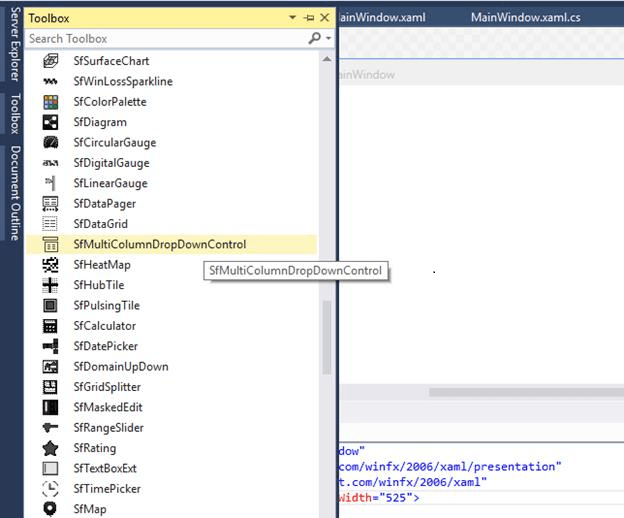
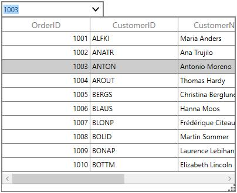

# Getting Started
SfMultiColumnDropDownControl displays multiple columns in dropdown by embedding SfDataGrid control for rich look up selection.

Features,

    * Auto complete support
    * Support to customize the columns to be displayed
    * Filter the data based on typed text
    * Ability to customize popup width, height and resize at runtime
    * Editor can be Read-only
    
You can [refer here](http://help.syncfusion.com/wpf/sfdatagrid/overview) to know more about `SfDataGrid`.

## Assembly deployment

The following list of assemblies needs to be added as reference to use `SfMultiColumnDropDownControl` control in any application,

<table>
<tr>
<th>
Required assemblies
</th>
<th>
Description
</th>
</tr>
<tr>
<td>
Syncfusion.Data.WPF
</td>
<td>
Syncfusion.Data.WPF assembly contains fundamental and base classes for CollectionViewAdv which is responsible for data processing operations handled in SfDataGrid.
</td>
</tr>
<tr>
<td>
Syncfusion.SfGrid.WPF
</td>
<td>
Syncfusion.SfGrid.WPF assembly contains classes that handles all UI operations of SfMultiColumnDropDownControl, DropDownGrid. SfMultiColumnDropDownControl control present in Syncfusion.UI.Xaml.Grid namespace. This namespace also added in <b>http://schemas.syncfusion.com/wpf</b> Syncfusion WPF schema.
</td>
</tr>
</table>

## Creating simple application with SfMultiColumnDropDownControl

In this walk through, you will create WPF application that contains `SfMultiColumnDropDownControl`. 

1. [Creating project](#Creating-the-project)
2. [Adding control via Designer](#Adding-control-via-Designer)
3. [Adding control manually in XAML](#Adding-control-manually-in-xaml)
4. [Adding control manually in C#](#Adding-control-manually-in-c)
5. [Creating Data Model for application](#Creating-Data-Model-for-sample-application)
6. [Binding to Data](#Binding-to-Data)
7. [Defining DisplayMember and ValueMember](#Defining-DisplayMember-and-ValueMember)
8. [Defining Columns](#Defining-Columns)
9. [Auto complete and filtering](#Autocomplete-and-filtering)

### Creating the project

Create new WPF Project in Visual Studio to display SfMultiColumnDropDownControl with data objects.

### Adding control via Designer

SfMultiColumnDropDownControl can be added to the application by dragging it from Toolbox and dropping it in Designer view. The required assembly references will be added automatically.



### Adding control manually in XAML

In order to add control manually in XAML, do the below steps,

1. Add the below required assembly references to the project,
    * Syncfusion.Data.WPF
    * Syncfusion.SfGrid.WPF
2. Import Syncfusion WPF schema **http://schemas.syncfusion.com/wpf** or SfMultiColumnDropDownControl namespace **Syncfusion.UI.Xaml.Grid** in XAML page.
3. Declare `SfMultiColumnDropDownControl` in XAML page.



<Window
        xmlns=”http://schemas.microsoft.com/winfx/2006/xaml/presentation”
        xmlns:x=”http://schemas.microsoft.com/winfx/2006/xaml”
        xmlns:syncfusion=”http://schemas.syncfusion.com/wpf” 
        x:Class=”WpfApplication1.MainWindow”
        Title=”MainWindow” Height=”350” Width=”525”>
    <Grid>
        <syncfusion:SfMultiColumnDropDownControl  x:Name=”sfmultiColumn”/>
    </Grid>
</Window>



### Adding control manually in C#

In order to add the control manually in C#, do the below steps,

1. Add the below required assembly references to the project,
    * Syncfusion.Data.WPF
    * Syncfusion.SfGrid.WPF
2. Import SfMultiColumnDropDownControl namespace Syncfusion.UI.Xaml.Grid.
3. Create `SfMultiColumnDropDownControl` instance and add it to the Page.



using Syncfusion.UI.Xaml.Grid;

namespace WpfApplication1
{
    public partial class MainWindow : Window
    {
        public MainWindow()
        {
            InitializeComponent();
            SfMultiColumnDropDownControl sfMultiColumn = new SfMultiColumnDropDownControl();
            Root_Grid.Children.Add(sfMultiColumn);
        }
    }
}



## Creating Data Model for sample application

Before binding `ItemsSource` to the control, you must create data model for Application.

1. Create data object class named `OrderInfo` and declare properties as shown below,



public class OrderInfo
{
    int orderID;
    string customerId;
    string country;
    string customerName;
    string shippingCity;

    public int OrderID
    {
          get {   return orderID;  }
          set {   orderID = value; }
    }

    public string CustomerID
    {
          get {  return customerId; }
          set {  customerId = value; }
    }

    public string CustomerName
    {
          get {  return customerName; }
          set {  customerName = value;}
    }

    public string Country
    {
          get { return country; }
          set  {  country = value; }
    }

    public string ShipCity
    {
         get {  return shippingCity; }
         set {  shippingCity = value; }
    }
    public OrderInfo(int orderId, string customerName, string country, string     
    customerId,string shipCity)
    {
         this.OrderID = orderId;
         this.CustomerName = customerName;
         this.Country = country;
         this.CustomerID = customerId;
         this.ShipCity = shipCity;
    }
}



2. Create a `ViewModel` class with `Orders` property and Orders property is initialized with several data objects in constructor.
 


public class ViewModel
{
    private ObservableCollection<OrderInfo> _orders;
    public ObservableCollection<OrderInfo> Orders
    {
        get { return _orders; }
        set { _orders = value; }
    }

    public ViewModel()
    {
        _orders = new ObservableCollection<OrderInfo>();
        this.GenerateOrders();
    }

    private void GenerateOrders()
    {
        _orders.Add(new OrderInfo(1001, “Maria Anders”, “Germany”, “ALFKI”, “Berlin”));
        _orders.Add(new OrderInfo(1002, “Ana Trujilo”, “Mexico”, “ANATR”, “Mexico D.F.”));
        _orders.Add(new OrderInfo(1003, “Antonio Moreno”, “Mexico”, “ANTON”, “Mexico D.F.”));
        _orders.Add(new OrderInfo(1004, “Thomas Hardy”, “UK”, “AROUT”, “London”));
        _orders.Add(new OrderInfo(1005, “Christina Berglund”, “Sweden”, “BERGS”, “Lula”));
        _orders.Add(new OrderInfo(1006, “Hanna Moos”, “Germany”, “BLAUS”, “Mannheim”));
        _orders.Add(new OrderInfo(1007, “Frederique Citeaux”, “France”, “BLONP”, “Strasbourg”));
        _orders.Add(new OrderInfo(1008, “Martin Sommer”, “Spain”, “BOLID”, “Madrid”));
        _orders.Add(new OrderInfo(1009, “Laurence Lebihan”, “France”, “BONAP”, “Marseille”));
        _orders.Add(new OrderInfo(1010, “Elizabeth Lincoln”, “Canada”, “BOTTM”, “Tsawassen”));
    }
}



## Binding to Data

You can populate the drop down list for SfMultiColumnDropDownControl by setting [ItemsSource](http://help.syncfusion.com/cr/cref_files/wpf/sfdatagrid/Syncfusion.SfGrid.WPF~Syncfusion.UI.Xaml.Grid.SfMultiColumnDropDownControl~ItemsSource.html) property.
Bind the collection created in previous step to `ItemsSource` property by setting ViewModel as DataContext.



<Window
        xmlns=”http://schemas.microsoft.com/winfx/2006/xaml/presentation”
        xmlns:x=”http://schemas.microsoft.com/winfx/2006/xaml”
        xmlns:syncfusion=”http://schemas.syncfusion.com/wpf” 
        x:Class=”WpfApplication1.MainWindow”
        xmlns:local=”clr-namespace:WpfApplication1”
        Title=”MainWindow” Height=”350” Width=”525”>
    <Window.DataContext>
        <local:ViewModel/>
    </Window.DataContext>
    <Grid x:Name=”Root_Grid”>
        <syncfusion:SfMultiColumnDropDownControl x:Name=”sfMultiColumn” 
                                                 ItemsSource=”{Binding Orders}” 
                                                 DisplayMember=”OrderID” 
                                                 Width=”175”
                                                 Height=”30”
                                                 SelectedIndex=”2”/>
    </Grid>
</Window>


ViewModel viewModel = new ViewModel();
sfMultiColumn.ItemsSource = viewModel.Orders;



## Defining DisplayMember and ValueMember

[DisplayMember](http://help.syncfusion.com/cr/cref_files/wpf/sfdatagrid/Syncfusion.SfGrid.WPF~Syncfusion.UI.Xaml.Grid.SfMultiColumnDropDownControl~DisplayMember.html) denotes the path to a value on the data object for visual presentation of the selected object in editor and [ValueMember](http://help.syncfusion.com/cr/cref_files/wpf/sfdatagrid/Syncfusion.SfGrid.WPF~Syncfusion.UI.Xaml.Grid.SfMultiColumnDropDownControl~ValueMember.html) denotes the path to a value on the data object for [SelectedValue](http://help.syncfusion.com/cr/cref_files/wpf/sfdatagrid/Syncfusion.SfGrid.WPF~Syncfusion.UI.Xaml.Grid.SfMultiColumnDropDownControl~SelectedValue.html). 

Refer [here](http://help.syncfusion.com/wpf/sfmulticolumndropdown/data-binding) to know more about the `DisplayMember` and `ValueMember`.

## Defining Columns

By default, the SfMultiColumnDropDownControl generates the columns automatically based on [ItemsSource](http://help.syncfusion.com/cr/cref_files/wpf/sfdatagrid/Syncfusion.SfGrid.WPF~Syncfusion.UI.Xaml.Grid.SfMultiColumnDropDownControl~ItemsSource.html) property. You can prevent the automatic column generation by setting[AutoGenerateColumns](http://help.syncfusion.com/cr/cref_files/wpf/sfdatagrid/Syncfusion.SfGrid.WPF~Syncfusion.UI.Xaml.Grid.SfMultiColumnDropDownControl~AutoGenerateColumns.html) property to `false`. When `AutoGenerateColumns` property is false, you have to define the columns to be displayed as below,



<syncfusion:SfMultiColumnDropDownControl x:Name=”sfMultiColumn”
                                         Width=”175”
                                         Height=”30”
                                         SelectedIndex=”0”
                                         AutoGenerateColumns=”false”
                                         DisplayMember=”OrderID”
                                         ItemsSource=”{Binding Orders}”>
    <syncfusion:SfMultiColumnDropDownControl.Columns>
        <syncfusion:GridTextColumn MappingName=”OrderID” />
        <syncfusion:GridTextColumn MappingName=”CustomerID” />
        <syncfusion:GridTextColumn MappingName=”Country” />
    </syncfusion:SfMultiColumnDropDownControl.Columns>
</syncfusion:SfMultiColumnDropDownControl>


SfMultiColumnDropDownControl sfMultiColumn = new SfMultiColumnDropDownControl();
sfMultiColumn.AutoGenerateColumns = false;
sfMultiColumn.Columns.Add(new GridTextColumn() { MappingName = “OrderID” });
sfMultiColumn.Columns.Add(new GridTextColumn() { MappingName = “CustomerID” });
sfMultiColumn.Columns.Add(new GridTextColumn() { MappingName = “Country” });



## Editing and filtering 

SfMultiColumnDropDownControl provides support to auto append the text from `ItemsSource` when end-user edits in the TextBox by setting [AllowAutoComplete](http://help.syncfusion.com/cr/cref_files/wpf/sfdatagrid/Syncfusion.SfGrid.WPF~Syncfusion.UI.Xaml.Grid.SfMultiColumnDropDownControl~AllowAutoComplete.html) to `true`. 
Also, it provides support to filter the items displayed in the drop-down based on text in the TextBox by setting[AllowIncrementalFiltering](http://help.syncfusion.com/cr/cref_files/wpf/sfdatagrid/Syncfusion.SfGrid.WPF~Syncfusion.UI.Xaml.Grid.SfMultiColumnDropDownControl~AllowIncrementalFiltering.html) ` to `true`. 
