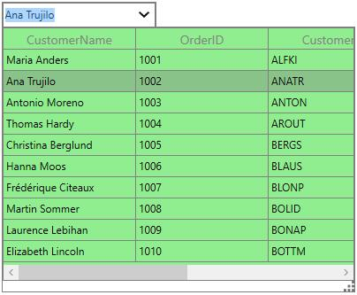

# Popup customization
SfMultiColumnDropDownControl allows you to customize the Popup appearance by setting [PopupBackground](http://help.syncfusion.com/cr/cref_files/wpf/sfdatagrid/Syncfusion.SfGrid.WPF~Syncfusion.UI.Xaml.Grid.SfMultiColumnDropDownControl~PopupBackground.html), [PopupBorderBrush](http://help.syncfusion.com/cr/cref_files/wpf/sfdatagrid/Syncfusion.SfGrid.WPF~Syncfusion.UI.Xaml.Grid.SfMultiColumnDropDownControl~PopupBorderBrush.html), [PopupDropDownGridBackground](http://help.syncfusion.com/cr/cref_files/wpf/sfdatagrid/Syncfusion.SfGrid.WPF~Syncfusion.UI.Xaml.Grid.SfMultiColumnDropDownControl~PopupDropDownGridBackground.html) and [PopupBorderThickness](http://help.syncfusion.com/cr/cref_files/wpf/sfdatagrid/Syncfusion.SfGrid.WPF~Syncfusion.UI.Xaml.Grid.SfMultiColumnDropDownControl~PopupBorderThickness.html) properties.



<syncfusion:SfMultiColumnDropDownControl x:Name="sfmultiColumn"
                                         Width="175"
                                         Height="30"                                                     
                                         DisplayMember="CustomerName"
                                         ItemsSource="{Binding Orders}"
                                         PopupBackground="Beige"
                                         PopupBorderBrush="Aqua"
                                         PopupBorderThickness="3"
                                         ValueMember="CustomerName">
                <syncfusion:SfMultiColumnDropDownControl.Columns>
                    <syncfusion:GridTextColumn MappingName="CustomerName" />
                    <syncfusion:GridTextColumn MappingName="OrderID" />
                    <syncfusion:GridTextColumn MappingName="CustomerID" />
                    <syncfusion:GridTextColumn MappingName="Country" />
                </syncfusion:SfMultiColumnDropDownControl.Columns>
</syncfusion:SfMultiColumnDropDownControl>



You can change the drop down grid background by setting [PopupDropDownGridBackground](http://help.syncfusion.com/cr/cref_files/wpf/sfdatagrid/Syncfusion.SfGrid.WPF~Syncfusion.UI.Xaml.Grid.SfMultiColumnDropDownControl~PopupDropDownGridBackground.html).



<syncfusion:SfMultiColumnDropDownControl x:Name="sfmultiColumn"
                                         Width="175"
                                         Height="30"
                                         DisplayMember="CustomerName"
                                         ItemsSource="{Binding Orders}"
                                         PopupDropDownGridBackground="LightGreen"
                                         ValueMember="CustomerName">
                <syncfusion:SfMultiColumnDropDownControl.Columns>
                    <syncfusion:GridTextColumn MappingName="CustomerName" />
                    <syncfusion:GridTextColumn MappingName="OrderID" />
                    <syncfusion:GridTextColumn MappingName="CustomerID" />
                    <syncfusion:GridTextColumn MappingName="Country" />
                </syncfusion:SfMultiColumnDropDownControl.Columns>
</syncfusion:SfMultiColumnDropDownControl>



## Popup sizing

You can change the pop-up height and width by setting [PopupWidth](http://help.syncfusion.com/cr/cref_files/wpf/sfdatagrid/Syncfusion.SfGrid.WPF~Syncfusion.UI.Xaml.Grid.SfMultiColumnDropDownControl~PopupWidth.html) and [PopupHeight](http://help.syncfusion.com/cr/cref_files/wpf/sfdatagrid/Syncfusion.SfGrid.WPF~Syncfusion.UI.Xaml.Grid.SfMultiColumnDropDownControl~PopupHeight.html) properties. The `PopupWidth` will be set based on[PopupMinWidth](http://help.syncfusion.com/cr/cref_files/wpf/sfdatagrid/Syncfusion.SfGrid.WPF~Syncfusion.UI.Xaml.Grid.SfMultiColumnDropDownControl~PopupMinWidth.html) and [PopupMaxWidth](http://help.syncfusion.com/cr/cref_files/wpf/sfdatagrid/Syncfusion.SfGrid.WPF~Syncfusion.UI.Xaml.Grid.SfMultiColumnDropDownControl~PopupMaxWidth.html) properties when the value is not between them. By default, the `PopupMinWidth` value is 200.0. 

Similarly, the `PopupHeight` will be set based on[PopupMinHeight](http://help.syncfusion.com/cr/cref_files/wpf/sfdatagrid/Syncfusion.SfGrid.WPF~Syncfusion.UI.Xaml.Grid.SfMultiColumnDropDownControl~PopupMinHeight.html) and [PopupMaxHeight](http://help.syncfusion.com/cr/cref_files/wpf/sfdatagrid/Syncfusion.SfGrid.WPF~Syncfusion.UI.Xaml.Grid.SfMultiColumnDropDownControl~PopupMaxHeight.html) when the value is not between them. The default value of `PopupMinHeight` is 300.0. 

### Auto sizing

SfMultiColumnDropDownControl can automatically adjust the popup width and height based on the width and height of SfDataGrid when setting [IsAutoPopupSize](http://help.syncfusion.com/cr/cref_files/wpf/sfdatagrid/Syncfusion.SfGrid.WPF~Syncfusion.UI.Xaml.Grid.SfMultiColumnDropDownControl~IsAutoPopupSize.html) as `true`.
N> When `IsAutoPopupSize` is `true`, then the popup width and height is not calculated based on `PopupHeight` and `PopupWidth`.

## Resizing popup

You can allow the end-user to resize the drop-down popup through resizing thumb by setting [ResizingThumbVisibility](http://help.syncfusion.com/cr/cref_files/wpf/sfdatagrid/Syncfusion.SfGrid.WPF~Syncfusion.UI.Xaml.Grid.SfMultiColumnDropDownControl~ResizingThumbVisibility.html) property to `Visible`.

## Keep DropDownPopup as StaysOpen

You can keep the popup in SfMultiColumnDropDownControl as always open by using `StaysOpen` property. You can get the popup from template of SfMultiColumnDropDownControl in its loaded event and set the `StaysOpen` property as `true`.



sfmultiColumn.Loaded += (o, e) =>
{
       var popup = sfmultiColumn.Template.FindName("PART_Popup", sfmultiColumn) as Popup;
       popup.StaysOpen = true;
};



## Events

SfMultiColumnDropDownControl provides the following events for popup customizations,
 
### PopupClosing event

[PopupClosing](http://help.syncfusion.com/cr/cref_files/wpf/sfdatagrid/Syncfusion.SfGrid.WPF~Syncfusion.UI.Xaml.Grid.SfMultiColumnDropDownControl~PopupClosing_EV.html) event is fired when the popup is closing. You can use this event to skip the popup closing and [PopupClosingEventArgs](http://help.syncfusion.com/cr/cref_files/wpf/sfdatagrid/Syncfusion.SfGrid.WPF~Syncfusion.UI.Xaml.Grid.PopupClosingEventArgs.html) provides data for `PopupClosing` event. You can skip the popup closing by setting `args.Cancel` as true.



sfmultiColumn.PopupClosing += sfmultiColumn_PopupClosing;

void sfmultiColumn_PopupClosing(object sender, PopupClosingEventArgs args)
{
            
}



### PopupClosed event

[PopupClosed](http://help.syncfusion.com/cr/cref_files/wpf/sfdatagrid/Syncfusion.SfGrid.WPF~Syncfusion.UI.Xaml.Grid.SfMultiColumnDropDownControl~PopupClosed_EV.html) event is fired when the popup is closed. [PopupClosedEventArgs](http://help.syncfusion.com/cr/cref_files/wpf/sfdatagrid/Syncfusion.SfGrid.WPF~Syncfusion.UI.Xaml.Grid.PopupClosedEventArgs.html) provides data for `PopupClosed` event



sfmultiColumn.PopupClosed += sfmultiColumn_PopupClosed;

void sfmultiColumn_PopupClosed(object sender, PopupClosedEventArgs args)
{
            
}



### PopupOpening event

[PopupOpening](http://help.syncfusion.com/cr/cref_files/wpf/sfdatagrid/Syncfusion.SfGrid.WPF~Syncfusion.UI.Xaml.Grid.SfMultiColumnDropDownControl~PopupOpening_EV.html) event is fired when the popup is opening. You can use this event to skip the popup opening and [PopupOpeningEventArgs](http://help.syncfusion.com/cr/cref_files/wpf/sfdatagrid/Syncfusion.SfGrid.WPF~Syncfusion.UI.Xaml.Grid.PopupOpeningEventArgs.html) provides data for `PopupOpening` event. You can skip the popup opening by setting `args.Cancel` as true.



sfmultiColumn.PopupOpening += sfmultiColumn_PopupOpening;

void sfmultiColumn_PopupOpening(object sender, PopupOpeningEventArgs args)
{
            
}



### PopupOpened event

[PopupOpened](http://help.syncfusion.com/cr/cref_files/wpf/sfdatagrid/Syncfusion.SfGrid.WPF~Syncfusion.UI.Xaml.Grid.SfMultiColumnDropDownControl~PopupOpened_EV.html) event is fired when the popup is opened. [PopupOpenedEventArgs](http://help.syncfusion.com/cr/cref_files/wpf/sfdatagrid/Syncfusion.SfGrid.WPF~Syncfusion.UI.Xaml.Grid.PopupOpenedEventArgs.html) provides data for `PopupOpened` event



sfmultiColumn.PopupOpened += sfmultiColumn_PopupOpened;

void sfmultiColumn_PopupOpened(object sender, PopupOpenedEventArgs args)
{
            
}


