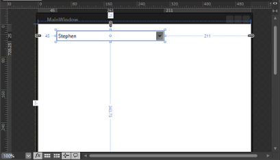
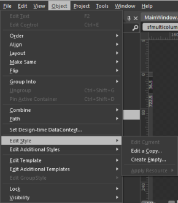
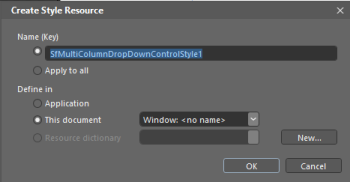

# Styles and Templates

WPF styling and Templating refer to a suite of features (styles and templates) that allows you to create visually compelling effects and to create consistent appearance for the products.

This section elaborates the information to understand the possible ways, by which you can change the visual appearance of the SfMultiColumnDropDownControl. In addition, you can edit the structure of SfMultiColumnDropDownControl by using Blend and VisualStudio that enables you to customize the appearance. 

## Edit Appearance in Expression Blend

This section explains you how to edit the SfMultiColumnDropDownControl structure in Expression Blend. To edit the Control Template in Expression Blend, refer to the following steps.

1.Open your application in Expression Blend.        
2.Select the SfMultiColumnDropDowncontrol from the window              

           

3.Go to the Menu bar and Choose Object > EditStyle.                     

  

4.You get two options in sub menu bar.     

  1.Edit a Copy- Edit a copy of the default style, when you select this option, a new dialog window opens.        

 

The Create style Resources dialog prompts you to enter the name or change the name for your style, as well as to choose the location for the Style.

Now, press ‘Ok’. Expression Blend generates the style of the SfMultiColumnDropDownControl in the Resource section. You can edit the generated code in the XAML view.

  2.Create Empty- create an empty style for the SfMultiColumnDropDownControl. When you select this option, the same Create style Resources dialog opens. You should enter the name or change the name of style and choose the location for the Style.                   

Now, press ‘Ok’. Expression Blend generates the empty style of the SfMultiColumnDropDownControl in the Resource section. You can edit the generated code in the XAML view.

## Edit Appearance in VisualStudio

This section explain you how to edit a SfMultiColumnDropDownControl style in Visual studio Design View. To Edit the control style in Visual Studio, refer to the following steps,

1. Open your application in Visual Studio.
2. Open Designview > Select SfMultiColumnDropDownControl >Right Click on SfMultiColumnDropDownControl, Menu options is displayed.                                                                                                                                                                

   

3.Click Edit Template, you have two options in sub menu bar.      
  1.Edit a Copy –Edit a copy of the default style, when you select this option, a new dialog window opens as follows.    

   

  The Create ControlTemplate Resources dialog prompts you to enter the name or change the name for your style, as well as to choose the location for the style. 

  Now press ‘Ok’. Visual Studio generates the style of SfMultiColumnDropDownControl in the Resource section. You can edit the generated code in the XAML view.

  2.Create Empty- Create an empty style for the SfMultiColumnDropDownControl. When you select this option, the same Create ControlTemplate Resources dialog opens. Enter the name or change the name of style and choose the location for the style.            
  Now press ‘Ok’. Visual Studio generates the empty style of SfMultiColumnDropDownControl in the Resource section. You can edit the generated code in the XAML view.

