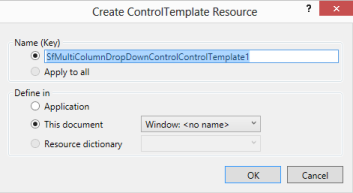

# Styles and Templates

You can customize the appearance of the SfMultiColumnDropDownControl by using Blend and VisualStudio.

## Edit the Appearance in Expression Blend

You can edit the SfMultiColumnDropDownControl style in Expression Blend by selecting Edit Style in the Object menu. Refer the following steps to customize the SfMultiColumnDropDownControl style,

<ol> 
<li> Open your application in Expression Blend. </li>  

<li> Select the SfMultiColumnDropDownControl from the window </li>  

     
<li> Go to the Menu bar and Choose Object > EditStyle.  </li>  

   

<li> You get two options in sub menu bar.   </li>  
<ol>

<li>Edit a Copy- Edit a copy of the default style, when you select this option, a new dialog window opens.  

       
The Create style Resources dialog prompts you to enter the name or change the name for your style, as well as to choose the location for the Style.
Now, press ‘Ok’. Expression Blend generates the style of the SfMultiColumnDropDownControl in the Resource section. You can edit the generated code in the XAML view. </li>

<li>Create Empty- create an empty style for the SfMultiColumnDropDownControl. When you select this option, the same Create style Resources dialog opens. You should enter the name or change the name of style and choose the location for the Style.                   
Now, press ‘Ok’. Expression Blend generates the empty style of the SfMultiColumnDropDownControl in the Resource section. You can edit the generated code in the XAML view. </li>
</ol>
</ol>

## Edit the Appearance in VisualStudio

You can edit the SfMultiColumnDropDownControl style in Visual Studio Designer by right clicking it in designer view and click Edit Templates. Refer the following steps to customize the SfMultiColumnDropDownControl style,

<ol> 
<li> Open your application in Visual Studio. </li>
<li>Open Design view > Select SfMultiColumnDropDownControl >Right Click on SfMultiColumnDropDownControl, Menu options is displayed. </li>

   

<li> Click Edit Template, you have two options in sub menu bar.    </li> 
<ol> 
<li>Edit a Copy –Edit a copy of the default style, when you select this option, a new dialog window opens as follows.    

   

The Create ControlTemplate Resources dialog prompts you to enter the name or change the name for your style, as well as to choose the location for the style. 
Now press ‘Ok’. Visual Studio generates the style of SfMultiColumnDropDownControl in the Resource section. You can edit the generated code in the XAML view. </li> 

<li> Create Empty- Create an empty style for the SfMultiColumnDropDownControl. When you select this option, the same Create ControlTemplate Resources dialog opens. Enter the name or change the name of style and choose the location for the style.            
	Now press ‘Ok’. Visual Studio generates the empty style of SfMultiColumnDropDownControl in the Resource section. You can edit the generated code in the XAML view. </li>
</ol>
</ol>

