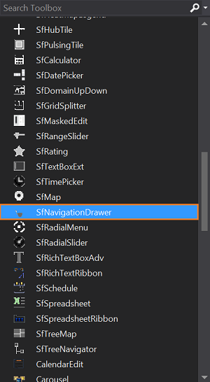
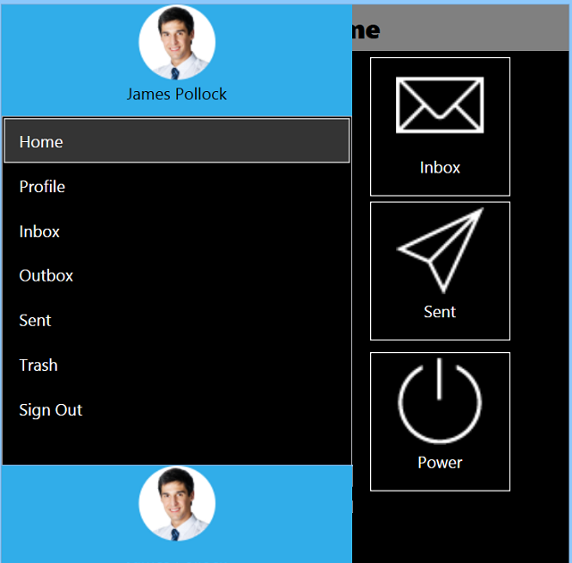

# Getting Started

The following section helps you to build your application with SfNavigationDrawer.

## Steps

* Create new WPF project using Visual Studio.
* Add the SfNavigationDrawer assembly to your application.
* Initialize Navigationdrawer control.
* Adding contentview to the navigationdrawer control.
* Adding drawerview to the navigationdrawer control.

These steps were explained below for XAML.

## Create a simple Navigationdrawer from XAML

### Adding assembly reference

1. Open the Add Reference window from your project.
2. Choose Windows > Extensions > Syncfusion.SfNavigationDrawer.WPF.

N> This window differs for the Visual Basic project.

T> Select the .NET Framework version respective to your application. The version can be identified as below:

<table>
<tr>
<td>
XX.X450.0.X
</td>
<td>
4.5 Framework
</td>
</tr>
<tr>
<td>
XX.X451.0.X
</td>
<td>
4.5.1 Framework
</td>
</tr>
<tr>
<td>
XX.X460.0.X
</td>
<td>
4.6 Framework
</td>
</table>

Add the following namespace in your XAML window.


      
      xmlns:syncfusion="http://schemas.syncfusion.com/wpf"



## Add SfNavigationDrawer from Toolbox

Drag and drop the SfNavigationDrawer control from the Toolbox to your application.

Now the SyncfusionControls for UWP XAML reference is added to the application references and the xmlns namespace code is generated in MainWindow.xaml as below.

## Initialize the NavigationDrawer

You need to initialize the NavigationDrawer represented by the following class Syncfusion.UI.Xaml.NavigationDrawer.


        
			<syncfusion:SfNavigationDrawer>
			
			</syncfusion:SfNavigationDrawer> 



## Adding contentview to the NavigationDrawer



	<syncfusion:SfNavigationDrawer x:Name="drawer">
		<syncfusion:SfNavigationDrawer.ContentView>
			<Grid Background="Black">
				<Button BorderBrush="#393939" BorderThickness="2" VerticalAlignment="Center" Click="ButtonBase_OnClick" HorizontalAlignment="Center" >
					<StackPanel Orientation="Vertical" VerticalAlignment="Center" HorizontalAlignment="Center">
						<Image Source="/Assets/NavigationDrawer/User.png" Height="80" Width="100"/>
						<TextBlock HorizontalAlignment="Center" Margin="0 10 0 0" Text="James Pollock"/>
					</StackPanel>
				</Button>
			</Grid>
		</syncfusion:SfNavigationDrawer.ContentView>
	</syncfusion:SfNavigationDrawer>



## Adding drawerview to the NavigationDrawer

The DrawerView is a panel that is the hidden content, brought to the view by manipulations like panning or swiping through the edges. The DrawerView has three sections namely:

   * DrawerHeaderView
   
   * DrawerContentView
   
   * DrawerFooterView



	<syncfusion:SfNavigationDrawer x:Name="drawer">
		<syncfusion:SfNavigationDrawer.DrawerHeaderView>
			<Grid Background="#31ade9">
				<Image Source="/Assets/NavigationDrawer/User.png" Height="75" VerticalAlignment="Center" HorizontalAlignment="Center" Margin="0 0 0 5" />
			</Grid>
		</syncfusion:SfNavigationDrawer.DrawerHeaderView>
		<syncfusion:SfNavigationDrawer.DrawerContentView>
			<Grid Background="Black">
				<ListBox x:Name="list" ItemsSource="{Binding Contents}">
					<ListBox.ItemTemplate>
						<DataTemplate>
							<TextBlock  Text="{Binding Name}" Padding="15" TextAlignment="Center" FontSize="23" Foreground="White"/>
						</DataTemplate>
					</ListBox.ItemTemplate>
				</ListBox>
			</Grid>
		</syncfusion:SfNavigationDrawer.DrawerContentView>
		<syncfusion:SfNavigationDrawer.DrawerFooterView>
			<Grid Background="#31ade9">
				<Image Source="/Assets/NavigationDrawer/User.png" Height="75" VerticalAlignment="Center" HorizontalAlignment="Center" Margin="0 0 0 5" />
			</Grid>
		</syncfusion:SfNavigationDrawer.DrawerFooterView>
	</syncfusion:SfNavigationDrawer>
    


    
                   

