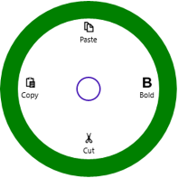
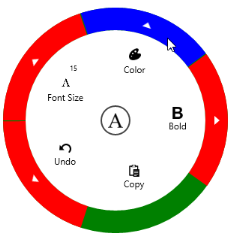
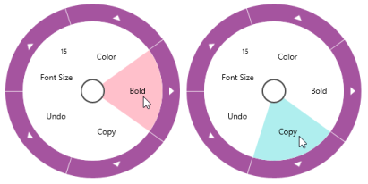

## Appearance and Styling 

## Radius 

RadiusX and RadiusY properties in the Radial Menu can be used to define the X and Y axis radius to render the control. 



<navigation:SfRadialMenu RadiusX="150" RadiusY="150" />



## CenterRimRadiusFactor

CenterRimRadiusFactor property can be used to define the radius of the center rim (inner circle). 



<navigation:SfRadialMenu   CenterRimRadiusFactor="0.3" IsOpen="True" />



## RimBackground

RimBackground property used to fill the outer rim (outer circle).





<navigation:SfRadialMenu IsOpen="True" RimBackground="Green" />

RadialMenu outer ring flled with color

## RimActiveBrush

RimActiveBrush property used to fill the expander rim and this expander rim only visible when the items have sub items.   



<navigation:SfRadialMenu RimActiveBrush="Red" RimBackground="Green" IsOpen="True" />



## RimHoverBrush

The RimHoverBrush property can be used to fill the expander rim while the pointer is hovering over it. 



<navigation:SfRadialMenu RimActiveBrush="Red" RimBackground="Green"   RimHoverBrush="Blue" IsOpen="True" />



## RimRadiusFactor

RimRadiusFactor property of Radial Menu can be used to set the radius of the items panel. Lowest values to this factor increases the thickness of the outer rim. Highest values to this factor decreases the thickness of the outer rim. 



<navigation:SfRadialMenu RimActiveBrush="Red" RimRadiusFactor="0.7" RimBackground="Green"   RimHoverBrush="Blue" IsOpen="True" />



## Navigation Button Style

The navigation button displayed in the center of radial menu can be styled using NaviationButtonStyle property. 



<syncfusion:SfRadialMenu NavigationButtonStyle="{StaticResource NavigationButtonStyle}"

IsOpen="True" />



## MenuMouseOverBackgroundColor

Each SfRadialMenuItem can be set with a different background color on mouse over by using the MenuMouseOverBackgroundColor property. Before that, the ShowMouseOverStyle property should be set to true.



<navigation:SfRadialMenu IsOpen="True">
  <navigation:SfRadialMenuItem Header="Bold" MenuMouseOverBackgroundColor="Pink" ShowMouseOverStyle="true">
    <navigation:SfRadialMenuItem/>
  </navigation:SfRadialMenuItem>
  <navigation:SfRadialMenuItem Header="Copy" MenuMouseOverBackgroundColor="PaleTurquoise" ShowMouseOverStyle="true">
    <navigation:SfRadialMenuItem/>
  </navigation:SfRadialMenuItem>
  <navigation:SfRadialMenuItem Header="Undo" MenuMouseOverBackgroundColor="Pink" ShowMouseOverStyle="true">
    <navigation:SfRadialMenuItem/>
  </navigation:SfRadialMenuItem>
  <navigation:SfRadialMenuItem Header="Font Size" MenuMouseOverBackgroundColor="PaleTurquoise" ShowMouseOverStyle="true">
    <navigation:SfRadialMenuItem/>
  </navigation:SfRadialMenuItem>
 <navigation:SfRadialMenuItem Header="Color" MenuMouseOverBackgroundColor="Lavender" ShowMouseOverStyle="true">
    <navigation:SfRadialMenuItem/>
  </navigation:SfRadialMenuItem>
</navigation:SfRadialMenu> 



