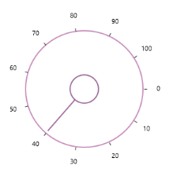
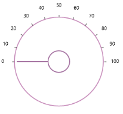
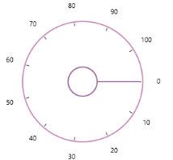
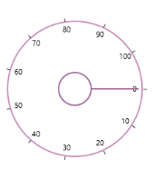
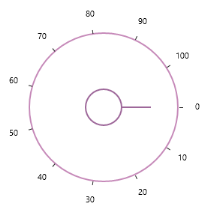

# Concepts  

## Minimum

Gets or sets the minimum possible value. (Inherited from [RangeBase](http://msdn.microsoft.com/en-us/library/windows/apps/windows.ui.xaml.controls.primitives.rangebase.aspx)). 


[XAML]

<syncfusion:SfRadialSlider

            Minimum="0" 

            Maximum="100" />



## Maximum

Gets or sets the maximum possible value. (Inherited from [RangeBase](http://msdn.microsoft.com/en-us/library/windows/apps/windows.ui.xaml.controls.primitives.rangebase.aspx)).


[XAML]

<syncfusion:SfRadialSlider

            Minimum="0" 

            Maximum="100"  />



## Value

Gets or sets the value of the Radial Slider. (Inherited from [RangeBase](http://msdn.microsoft.com/en-us/library/windows/apps/windows.ui.xaml.controls.primitives.rangebase.aspx)). 


[XAML]

<syncfusion:SfRadialSlider

            Minimum="0"  Maximum="100" Value="40" />



The value can be changed by dragging the pointer along the circular track. 

## Ticks 

Ticks are placed along the round track in a uniform manner. The position of tick marks can be customized.

### Tick Frequency

The Tick Frequency property is used to define the number of ticks along the track, based on Minimum and Maximumn values.


[XAML]

<syncfusion:SfRadialSlider Minimum="0" Maximum="100"  

TickFrequency="5" />



 

## Labels 

Labels are the numerical representation of the ticks starting from Minimum to Maximum. The frequency of the labels also controlled by TickFrequency property. 

## Small Change 

The SmallChange property (Inherited from [RangeBase](http://msdn.microsoft.com/en-us/library/windows/apps/windows.ui.xaml.controls.primitives.rangebase.aspx)) can be used to control the smallest possible range of value to be selected in Radial Slider.  For example, if SmallChange is set to 5, then it is only possible to select values that are multiples of 5. 


[XAML]

<syncfusion:SfRadialSlider

            Minimum="0" Maximum="100"  

            SmallChange="5" />



## Intermediate Value

The IntermediateValue property can be used to get the values while dragging the pointer along the circular especially when SmallChange is set. Because the SmallChange property does not allow to update the Value property until the value becomes the multiples of SmallChange. 

## Content

The Content property can be used to place any content inside the Inner Rim. 


[XAML]

<syncfusion:SfRadialSlider x:Name="rSlider1">

    <TextBlock Text="{Binding ElementName=rSlider1,Path=Value}" FontSize="24"/>

</syncfusion:SfRadialSlider>



## Content Template

The ContentTemplate property can be used to customize the content of the Radial Slider. 


[XAML]

  <syncfusion:SfRadialSlider

            Content="{Binding RelativeSource={RelativeSource Self}, Path=Value}"

            x:Name="rSlider1">

            <syncfusion:SfRadialSlider.ContentTemplate>

                <DataTemplate>

                  <TextBlock Text="{Binding}" FontSize="24" Foreground="LightSkyBlue"/>

                </DataTemplate>

            </syncfusion:SfRadialSlider.ContentTemplate>

  </syncfusion:SfRadialSlider>



## Start Angle 

The StartAngle property can be used to set the starting position for generating the ticks in the circular track.  

## End Angle 

The EndAngle property can be used to set the ending position for the ticks in the circular track. 



[XAML]

<syncfusion:SfRadialSlider  StartAngle="180" EndAngle="360" />



## Appearance and Styling 

### Inner Rim 

Inner Rim term denotes the circle in the center of Radial Slider.  Following properties can be used to customize the Inner Rim. 

#### Inner Rim Radius Factor

InnerRimRadiusFactor property decides the radius of Inner Rim from the total radius available to render the Radial Slider. 

#### Inner Rim Stroke

InnerRimStroke property can be used to set the stroke color of the Inner Rim. 

#### Inner Rim Stroke Thickness

InnerRimStrokeThickness property can be used to set the thickness of the Inner Rim.

#### Inner Rim Fill

InnerRimFill property can be used the set the fill color of the Inner Rim. 



[XAML]

  <syncfusion:SfRadialSlider

InnerRimFill="LightGray"

            InnerRimRadiusFactor="0.25"

            InnerRimStroke="LightSkyBlue"

            InnerRimStrokeThickness="4" />



 

### Outer Rim 

Outer Rim term denotes circular track (outer circle) of Radial Slider.  Following properties can be used to customize the Inner Rim

#### Outer Rim Radius Factor

OuterRimRadiusFactor property decides the radius of Outer Rim from the total radius available to render the Radial Slider. 

#### Outer Rim Stroke 

OuterRimStroke property can be used to set the stroke color of the Outer Rim. 

#### Outer Rim Stroke Thickness 

OuterRimStrokeThickness property can be used to set the thickness of the Outer Rim. 

#### Background

Background property can be used to fill the Outer Rim.



[XAML]

<syncfusion:SfRadialSlider

            Background="LightGray"

            OuterRimRadiusFactor="0.8"

            OuterRimStroke="LightSkyBlue"

            OuterRimStrokeThickness="4" />



 

### Ticks

Ticks displayed along the circular path can be customized using the following properties. 

#### Tick Template

Ticks can be customized using the TickTemplate property. 


[XAML]

<syncfusion:SfRadialSlider>

            <syncfusion:SfRadialSlider.TickTemplate>

                <DataTemplate>

                    <Border Background="Red"></Border>

                </DataTemplate>

            </syncfusion:SfRadialSlider.TickTemplate>

 </syncfusion:SfRadialSlider>



 

#### Tick Radius Factor

TickRadiusFactor property decides the radius of the ticks from the total radius available to render the Radial Slider. 


[XAML]

<syncfusion:SfRadialSlider  TickRadiusFactor="0.75"  />



#### Tick Visibility

Visibility of ticks can be controlled by TickVisibility property. 


[XAML]

<syncfusion:SfRadialSlider TickVisibility="Collapsed" />



### Labels

Labels displayed along the circular path in the Radial slider can be customized by the following properties. 

#### Label Template

The LabelTemplate property can be used to customize the label object. 



[XAML]

<syncfusion:SfRadialSlider>

<syncfusion:SfRadialSlider.LabelTemplate>

           <DataTemplate>

               <TextBlock Text="{Binding}" Foreground="DodgerBlue"></TextBlock>

           </DataTemplate>

       </syncfusion:SfRadialSlider.LabelTemplate>

</syncfusion:SfRadialSlider>



#### Label Radius Factor

LabelRadiusFactor property decides the radius of the labels from the total radius available to render the Radial Slider. 


[XAML]

<syncfusion:SfRadialSlider LabelRadiusFactor="0.7" />



 

#### Label Visibility

Visibility of ticks can be controlled by LabelVisibility property. 



[XAML]

<syncfusion:SfRadialSlider  LabelVisibility="Collapsed" />



 

### Pointer

The Pointer that is used for the select the value by dragging in circular track can be customized with the following properties. 

#### Pointer Radius Factor

The PointerRadiusFactor property decides the radius of the Pointer from the total radius available to render the Radial Slider. 



[XAML]

<syncfusion:SfRadialSlider PointerRadiusFactor="0.5" />



 

#### Pointer Style

Style of the Pointer can be customized using the PointerStyle property. 


[XAML]

<syncfusion:SfRadialSlider>

<syncfusion:SfRadialSlider.PointerStyle>

                

            </syncfusion:SfRadialSlider.PointerStyle>

</syncfusion:SfRadialSlider>



 

#### Preview Pointer Style

The Preview Pointer that appears when hovering over the Radial Slider can be customized using the PreviewPointerStyle property. 


[XAML]

<syncfusion:SfRadialSlider

            Minimum="0" 

            Maximum="100"  >

            <syncfusion:SfRadialSlider.PreviewPointerStyle>

                

            </syncfusion:SfRadialSlider.PreviewPointerStyle>

</syncfusion:SfRadialSlider>



 

