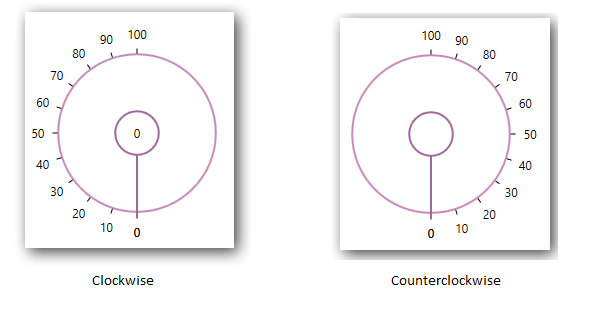

# Ticks 

Ticks are placed along the round track in a uniform manner. The position of tick marks can be customized.

### Tick Frequency

The [TickFrequency](https://help.syncfusion.com/cr/wpf/Syncfusion.SfRadialMenu.Wpf~Syncfusion.Windows.Controls.Navigation.SfRadialSlider~TickFrequency.html) property is used to define the number of ticks along the track, based on Minimum and Maximum values.



<syncfusion:SfRadialSlider Minimum="0" Maximum="100"  

TickFrequency="5" />



 

## Sweep direction
You can use the `SweepDirection` property in `SfRadialSlider` for changing the direction of slider value arrangement. The `SweepDirection` property contains the following values:

* Clockwise
* Counterclockwise





            // For clockwise direction
            this.radialSlider1.SweepDirection = SweepDirection.Clockwise;
            // For anti-clockwise direction
            this.radialSlider1.SweepDirection = SweepDirection.Counterclockwise;





             Me.radialSlider1.SweepDirection = SweepDirection.Clockwise
             Me.radialSlider1.SweepDirection = SweepDirection.Counterclockwise





