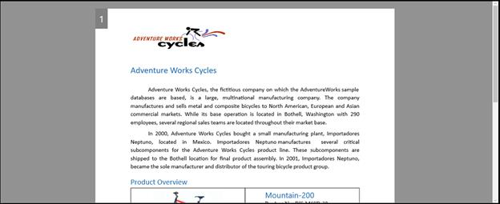
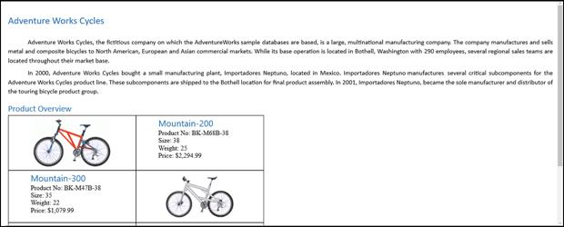
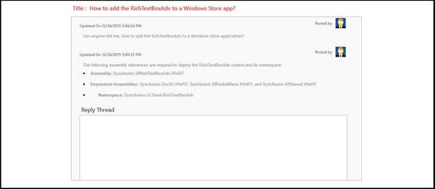

# Layout Types

The SfRichTextBoxAdv control allows you to choose between the following layout types.

* Pages

* Continuous

* Block

## Pages

When using Pages layout type, the rich text document content is rendered sequentially in several pages, similar to the Print layout view of Microsoft Word. The size and margin of each page are defined by Section format properties. 
The following code example demonstrates how to define layout type of SfRichTextBoxAdv control as Pages.


<RichTextBoxAdv:SfRichTextBoxAdv x:Name="richTextBoxAdv" LayoutType="Pages"  xmlns:RichTextBoxAdv="clr-namespace:Syncfusion.Windows.Controls.RichTextBoxAdv;assembly=Syncfusion.SfRichTextBoxAdv.Wpf"/>




// Defines the layout type as Pages. richTextBoxAdv.LayoutType = LayoutType.Pages;





## Continuous

When using Continuous layout type, the entire rich text document content is rendered continuously in a single page, similar to the Web layout view of Microsoft Word. This layout looks like a simple text box with rich-text content and can be used for applications such as forums and blogs.
The following code example demonstrates how to define layout type of SfRichTextBoxAdv control as Continuous.


<RichTextBoxAdv:SfRichTextBoxAdv x:Name="richTextBoxAdv" LayoutType="Continuous"  xmlns:RichTextBoxAdv="clr-namespace:Syncfusion.Windows.Controls.RichTextBoxAdv;assembly=Syncfusion.SfRichTextBoxAdv.Wpf"/>




// Defines the layout type as Continuous. richTextBoxAdv.LayoutType = LayoutType.Continuous;





## Block

When using Block layout type, the rich text content is rendered continuously in a single page as read only. This layout looks like a simple text block with rich text content such as texts, images, and tables. Block Layout also supports copying contents to the clipboard. This can be used for applications such as forums and blogs in order to display the rich-text contents with same look and feel as in the continuous layout type.
The following code example demonstrates how to define layout type of SfRichTextBoxAdv control as Block.


<RichTextBoxAdv:SfRichTextBoxAdv x:Name="richTextBoxAdv" LayoutType="Block"  xmlns:RichTextBoxAdv="clr-namespace:Syncfusion.Windows.Controls.RichTextBoxAdv;assembly=Syncfusion.SfRichTextBoxAdv.Wpf"/>




// Defines the layout type as Block. richTextBoxAdv.LayoutType = LayoutType.Block





