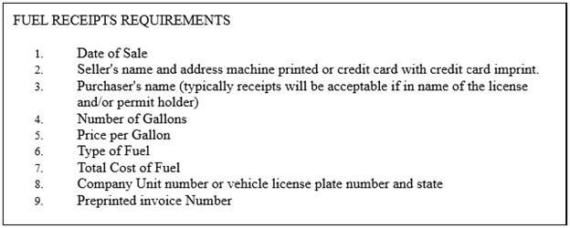

# List

The SfRichTextBoxAdv supports both the single-level and multilevel lists similar to the Microsoft Word. Lists are used to organize data as step-by-step instructions in documents for easy understanding of key points.
## Single Level List

Single level means that all the items in the list have the same hierarchy and indentation. It can be a numbered or a bulleted list.
The following screenshot shows single level bulleted list.

The following screenshot shows single level numbered list.

## Multilevel List

Multilevel means defining a list within a list where up to nine levels can be defined similar to the Microsoft Word. A multilevel list can be bulleted or numbered and also mixed with numbers, letters, and bullets. For example, one level can be bulleted and next level can be a numbered list inside it.
The following screenshot shows multilevel list.

## Adding List

Each list in the document can contain reference to any one of the abstract lists in the document. Both abstract list and list should be defined a unique Id. List should refer the abstract list with the abstract list’s Id. List format for a paragraph should refer to the list with the list’s Id.
The following code example demonstrates how to define a single level numbered list for a document and how it is applied to a paragraph.
<table>
<tr>
<td colspan=1 rowspan=1>
<RichTextBoxAdv:DocumentAdv> <RichTextBoxAdv:DocumentAdv.AbstractLists> <RichTextBoxAdv:AbstractListAdv AbstractListId="1"> <RichTextBoxAdv:AbstractListAdv.Levels> <RichTextBoxAdv:ListLevelAdv ListLevelPattern="LowLetter" NumberFormat="%1." StartAt="1" FollowCharacter="Tab" RestartLevel="0"> <RichTextBoxAdv:ListLevelAdv.ParagraphFormat> <RichTextBoxAdv:ParagraphFormat LeftIndent="48" FirstLineIndent="24"/> </RichTextBoxAdv:ListLevelAdv.ParagraphFormat> </RichTextBoxAdv:ListLevelAdv> </RichTextBoxAdv:AbstractListAdv.Levels> </RichTextBoxAdv:AbstractListAdv> </RichTextBoxAdv:DocumentAdv.AbstractLists> <RichTextBoxAdv:DocumentAdv.Lists> <RichTextBoxAdv:ListAdv AbstractListId="1" ListId="1"> </RichTextBoxAdv:ListAdv> </RichTextBoxAdv:DocumentAdv.Lists> <RichTextBoxAdv:SectionAdv> <RichTextBoxAdv:ParagraphAdv> <RichTextBoxAdv:ParagraphAdv.ParagraphFormat> <RichTextBoxAdv:ParagraphFormat> <RichTextBoxAdv:ParagraphFormat.ListFormat> <RichTextBoxAdv:ListFormat ListId="1" ListLevelNumber="0"/> </RichTextBoxAdv:ParagraphFormat.ListFormat> </RichTextBoxAdv:ParagraphFormat> </RichTextBoxAdv:ParagraphAdv.ParagraphFormat> <RichTextBoxAdv:SpanAdv>List Item 1</RichTextBoxAdv:SpanAdv> </RichTextBoxAdv:ParagraphAdv> </RichTextBoxAdv:SectionAdv> </RichTextBoxAdv:DocumentAdv> </td></tr>
<tr>
<td colspan=1 rowspan=1>
// Initializes a new abstract list instance. AbstractListAdv abstractListAdv = new AbstractListAdv(null); abstractListAdv.AbstractListId = 1; // Defines new ListLevel instance. ListLevelAdv listLevel = new ListLevelAdv(abstractListAdv); listLevel.ParagraphFormat.LeftIndent = 48d; listLevel.ParagraphFormat.FirstLineIndent = 24d; listLevel.FollowCharacter = FollowCharacterType.Tab; listLevel.ListLevelPattern = ListLevelPattern.LowLetter; listLevel.NumberFormat = "%1."; listLevel.RestartLevel = 0; listLevel.StartAt = 1; // Adds list level to abstract list. abstractListAdv.Levels.Add(listLevel); // Adds abstract list to the document. richTextBoxAdv.Document.AbstractLists.Add(abstractListAdv); // Creates a new list instance. ListAdv listAdv = new ListAdv(null); listAdv.ListId = 1; // Sets the abstract list Id for this list. listAdv.AbstractListId = 1; // Adds list to the document. richTextBoxAdv.Document.Lists.Add(listAdv); // Defines the list format for the paragraph. paragraphAdv.ParagraphFormat.ListFormat.ListId = 1; paragraphAdv.ParagraphFormat.ListFormat.ListLevelNumber = 0; </td></tr>
</table>
The following code example demonstrates how to define number format for numbered list in the SfRichTextBoxAdv control.


// Defines the number format for the list level.
/* Note
* The percent sign (%) followed by any number from 1 through 9 represents the number style from the respective list level. 
* For example, if you wanted the format for the first level to be "Article I." "Article II," and so on, the string for the NumberFormat property would be "Article %1." and the ListLevelPattern property would be set to ListLevelPattern.UpRoman.
*/
listLevel.NumberFormat = "Article %1.";
listLevel.ListLevelPattern = ListLevelPattern.UpRoman;



You can define bulleted list by setting list level pattern as Bullet. You can define various bullets by defining the bullet character. The following code sample demonstrates how to define dot, square and arrow bullets in the SfRichTextBoxAdv control.

// Defines Bulleted List.
listLevel.ListLevelPattern = ListLevelPattern.Bullet;
// Defining Dot Bullet
listLevel.NumberFormat = "\uf0b7";
listLevel.CharacterFormat.FontFamily = new FontFamily("Symbol");
// Defines Square bullet.
listLevel.NumberFormat = "\uf0a7";
listLevel.CharacterFormat.FontFamily = new FontFamily("Wingdings");
// Defines Arrow Bullet.
listLevel.NumberFormat = "\u27a4";
listLevel.CharacterFormat.FontFamily = new FontFamily("Symbol");




## Level overrides

The list levels for a list are defined in the abstract list to which it refers to. Additionally you can define level overrides for any list level. The SfRichTextBoxAdv supports two types of level overrides.
1. Start at override – Only start value for the list is overridden and other properties are referred to list level defined in abstract list.

2. Level override – The list level is completely overridden.

The following code example demonstrates how to override the start at value for an existing list level in the SfRichTextBoxAdv control.
<table>
<tr>
<td colspan=1 rowspan=1>
<RichTextBoxAdv:ListAdv AbstractListId="1" ListId="1"> <RichTextBoxAdv:ListAdv.LevelOverrides> <RichTextBoxAdv:LevelOverrideAdv StartAt="2" LevelNumber="0"/> </RichTextBoxAdv:ListAdv.LevelOverrides> </RichTextBoxAdv:ListAdv> </td></tr>
<tr>
<td colspan=1 rowspan=1>
// Adds StartAtOverride for the list at first level. // LevelNumber ranges from 0 to 8. LevelOverrideAdv levelOverride = new LevelOverrideAdv(listAdv); levelOverride.LevelNumber = 0; levelOverride.StartAt = 2; listAdv.LevelOverrides.Add(levelOverride); </td></tr>
</table>
The following code example demonstrates how to add level override for any existing list level in the SfRichTextBoxAdv control.
<table>
<tr>
<td colspan=1 rowspan=1>
<RichTextBoxAdv:ListAdv AbstractListId="1" ListId="1"> <RichTextBoxAdv:ListAdv.LevelOverrides> <!-- Overrides fourth list level--> <RichTextBoxAdv:LevelOverrideAdv LevelNumber="3"> <RichTextBoxAdv:LevelOverrideAdv.OverrideListLevel> <RichTextBoxAdv:ListLevelAdv ListLevelPattern="UpRoman" StartAt="3" NumberFormat="%1)"/> </RichTextBoxAdv:LevelOverrideAdv.OverrideListLevel> </RichTextBoxAdv:LevelOverrideAdv> </RichTextBoxAdv:ListAdv.LevelOverrides> </RichTextBoxAdv:ListAdv> </td></tr>
<tr>
<td colspan=1 rowspan=1>
// Adds ListLevel override for the list at fourth level. // LevelNumber ranges from 0 to 8. LevelOverrideAdv levelOverride = new LevelOverrideAdv(listAdv); levelOverride.LevelNumber = 3; levelOverride.OverrideListLevel = new ListLevelAdv(levelOverride); levelOverride.OverrideListLevel.ListLevelPattern = ListLevelPattern.UpRoman; levelOverride.OverrideListLevel.NumberFormat = "%1)"; levelOverride.OverrideListLevel.StartAt = 3; listAdv.LevelOverrides.Add(levelOverride); </td></tr>
</table>
## Editing list

You can retrieve the list applied for the current selection. By doing so, you can edit the list according to your requirement. After editing the list, you need to set it for the current selection in order to make the changes effective.
The following code sample demonstrates how to apply the list to the selection content in the SfRichTextBoxAdv control.


// Gets the current list for the selection content.
ListAdv listAdv = richTextBoxAdv.Selection.ParagraphFormat.GetList();



The following code example demonstrates how to apply a list for the selection content in the SfRichTextBoxAdv control. When the selection content has a list, then it gets modified with that list. Otherwise the list is added to the document and applied to the selection content.

// Applies list for the Selection content.
richTextBoxAdv.Selection.ParagraphFormat.SetList(listAdv);
richTextBoxAdv.Selection.ParagraphFormat.ListLevelNumber = 0;




