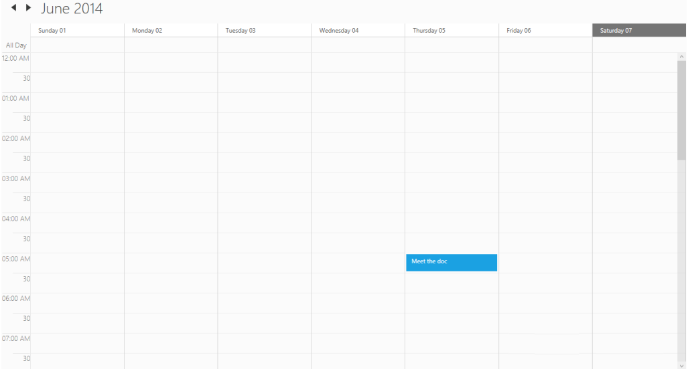
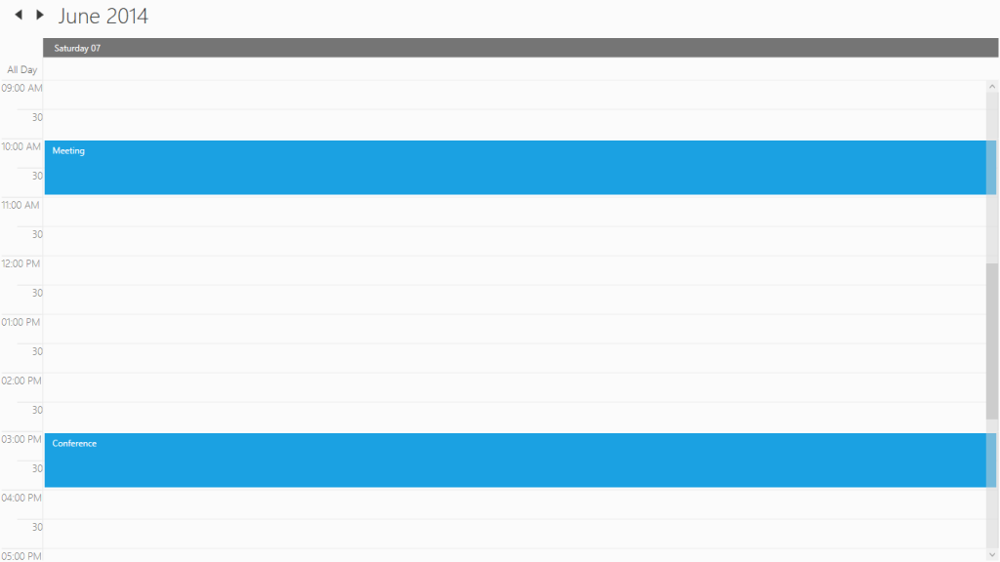

# Adding Appointments

There are two ways you can add appointments to the Schedule control: They are:

* Using Appointments Property and
* Using Data Binding Technique

## Using Appointments Property

You can add appointments directly to the Schedule control, by using the following code. 

[C#]

SfSchedule schedule = new SfSchedule();

schedule.ScheduleType = ScheduleType.Week;

schedule.Appointments.Add(new ScheduleAppointment() { StartTime= new DateTime(2013,6,5,5,0,0), EndTime= new DateTime(2013,6,5,5,30,0), Subject="Meet the doc", Location="Hutchison road", AllDay=false });



## Using Data Binding Technique

Schedule supports full data binding to any type of IEnumerable source. Specify the AppointmentMapping attributes to map the properties in the underlying data source to the Schedule appointments. The various attributes of the AppointmentMapping property are as follows.  

* Subject
* Location 
* StartTime 
* EndTime  

Add appointments by using the ItemsSource property.  

[XAML]

<Window x:Class="SfSch eduleWpf.MainWindow"

        xmlns="http://schemas.microsoft.com/winfx/2006/xaml/presentation"

        xmlns:x="http://schemas.microsoft.com/winfx/2006/xaml"

        xmlns:schedule="http://schemas.syncfusion.com/wpf"

        Title="MainWindow" Height="350" Width="525"

        WindowState="Maximized">

    <Grid Name="grid"}">

        <Schedule:SfSchedule Name="schedule" ScheduleType="Day" ItemsSource="{Binding MappedAppointments}">

            <Schedule:SfSchedule.AppointmentMapping>

                <Schedule:ScheduleAppointmentMapping

                    SubjectMapping="MappedSubject"

                    StartTimeMapping="MappedStartTime"

                    EndTimeMapping="MappedEndTime"/>

            </Schedule:SfSchedule.AppointmentMapping>

        </Schedule:SfSchedule>

    </Grid>

</Window>




[C#]

   public partial class MainWindow : Window

    {

        public ObservableCollection<MappedAppointment> MappedAppointments { get; set; }

        public MainWindow()

        {

            InitializeComponent();

            MappedAppointments = new ObservableCollection<MappedAppointment>

                     {

                         new MappedAppointment{MappedSubject = "Meeting", MappedStartTime = DateTime.Now.Date.AddHours(10), 

                                                 MappedEndTime = DateTime.Now.Date.AddHours(11)},

                         new MappedAppointment{MappedSubject = "Conference", MappedStartTime = DateTime.Now.Date.AddHours(15), 

                                                 MappedEndTime = DateTime.Now.Date.AddHours(16)},

                     };

            this.DataContext = this;

        }

    }

    public class MappedAppointment

    {

        public string MappedSubject { get; set; }

        public DateTime MappedStartTime { get; set; }

        public DateTime MappedEndTime { get; set; }

    }



