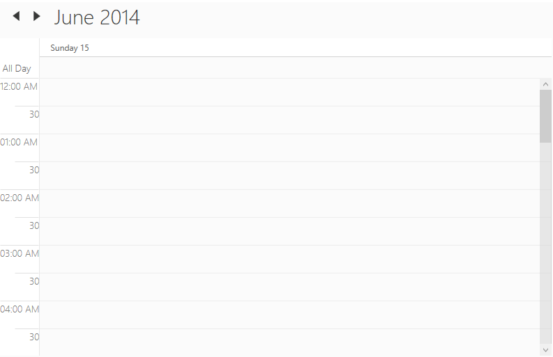
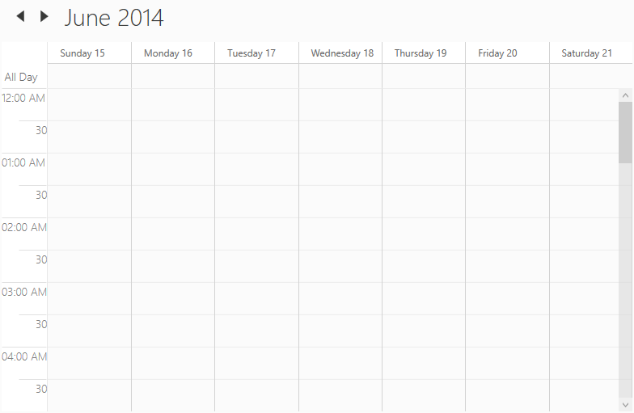
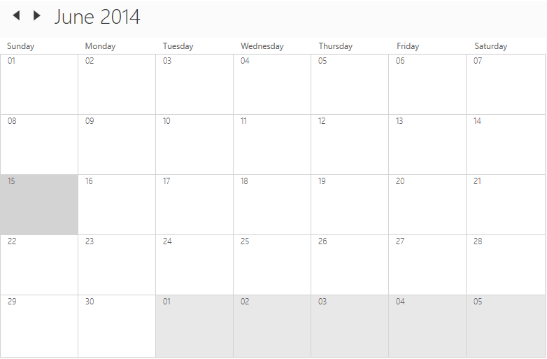
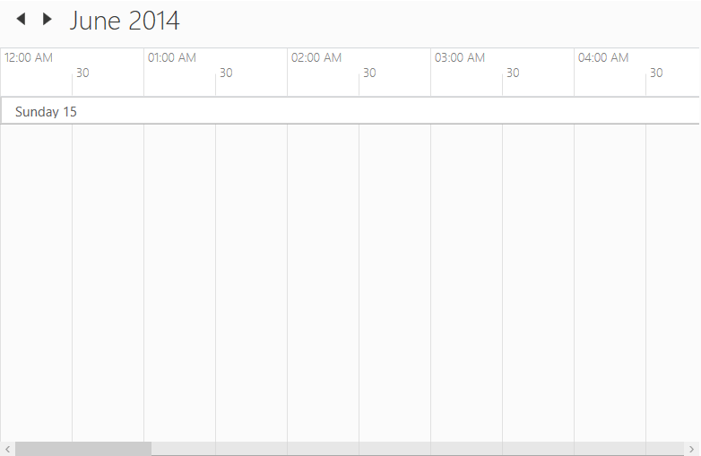

# Getting Started
This section gives you an overview of how to work with [SfSchedule](https://help.syncfusion.com/cr/wpf/Syncfusion.SfSchedule.WPF~Syncfusion.UI.Xaml.Schedule.SfSchedule.html) and also includes a walk-through to configure real-time `SfSchedule` command.

## Assembly deployment
Refer to the section on [control dependencies](https://help.syncfusion.com/wpf/control-dependencies#sfschedule) for a list of assemblies or NuGet Packages to be used as a guide for using control in any application.

Further information on installing the NuGet package can be found in the following link in a WPF application: [How to install nuget packages](https://help.syncfusion.com/wpf/nuget-packages).

You can also use [Syncfusion Reference Manager](https://help.syncfusion.com/wpf/visual-studio-integration/visual-studio-extensions/add-references) to refer the scheduler's dependent assemblies.

The following steps can be used to construct a WPF application with scheduler control:

## Create a project
In Visual Studio, create a new WPF project to show the features of the scheduler control and add the following namespace to the added assemblies.

Assembly: Syncfusion.SfSchedule.WPF

Namespace: Syncfusion.UI.Xaml.Schedule

## Add control manually in XAML

To add the control manually in XAML page, follow the given steps:

1. Add the `Syncfusion.SfSchedule.WPF` assembly reference to the project.
2. Import WPF schema http://schemas.syncfusion.com/wpf in the XAML page.
3. Declare the `SfSchedule` control in XAML page.


<Window x:Class="SfScheduleSample.MainWindow"   
	        
		xmlns="http://schemas.microsoft.com/winfx/2006/xaml/presentation"
			
        xmlns:x="http://schemas.microsoft.com/winfx/2006/xaml"

        xmlns:schedule="http://schemas.syncfusion.com/wpf"

        WindowStartupLocation="CenterScreen" WindowStyle="None"

        Width="950" Height="600">

        <Grid x:Name="LayoutRoot">

          <schedule:SfSchedule/>

        </Grid>

</Window>


## Add control manually in C&#35;
To manually attach control to C #, follow the following steps:

1. Add the `Syncfusion.SfSchedule.WPF` assembly reference to the project.
2. Import the `SfSchedule` namespace `using Syncfusion.UI.Xaml.Schedule`.
3. Create an `SfSchedule` instance, and add it to the window.


using Syncfusion.UI.Xaml.Schedule;
namespace GettingStarted
{
    public partial class MainWindow : Window
    {
       SfSchedule schedule = new SfSchedule();
       this.Content = schedule;
	}
}


Run the code above and now you can see the empty scheduler as follows, but without appointments. To view the scheduler appointments, whether local or remote information must be passed on to the scheduler.

## Scheduler Views-(Day, Week, WorkWeek, TimeLine and Month)

Scheduler control includes five different view styles in showing dates and can be allocated to the control using the property [ScheduleType](https://help.syncfusion.com/cr/wpf/Syncfusion.SfSchedule.WPF~Syncfusion.UI.Xaml.Schedule.ScheduleType.html) property. By default the control is assigned with `Day` view. Initially, the latest date will be shown for all views of the calendar.

Scheduler provides 5 different types of views which has mentioned below, 

* Day
* Week 
* WorkWeek
* Month
* TimeLine

## Day View
`Day` view is used to view a single day, and by default the current day is shown. Appointments on a specific day will be scheduled on the basis of their duration in the respective time slots.



<schedule:SfSchedule ScheduleType="Day"/>



schedule.ScheduleType = ScheduleType.Day;



## Week View
`Week` view is to view all week days of a particular week. Appointments will be scheduled in the corresponding timeslots on the basis of the week dates.



<schedule:SfSchedule x:Name="schedule" ScheduleType="Week"/>


this.schedule.ScheduleType = ScheduleType.Week;



## Work Week View
`WorkWeek` view is to view only working days of a particular week. By default, `Saturday` and `Sunday` are the non-working days. With any days of a week, you can customize it. Appointments scheduled in timeslots with the corresponding day of the week depending on their duration.



<schedule:SfSchedule x:Name="schedule" ScheduleType="WorkWeek"/>


this.schedule.ScheduleType = ScheduleType.WorkWeek;



## Month View
In scheduler, `Month` view is to view the entire dates of a given month. It is possible to place appointments in the specified date.



<schedule:SfSchedule x:Name="schedule" ScheduleType="Month"/>


this.schedule.ScheduleType = ScheduleType.Month;



## TimeLine View
`Timeline` view displays the dates with the appropriate day count in the horizontal time axis. When moving right or left, you can see the past or future events. With an intuitive drag-and-drop feature, each view shows events accurately through time slots.



<schedule:SfSchedule x:Name="schedule" ScheduleType="TimeLine"/>


this.schedule.ScheduleType = ScheduleType.TimeLine;



## Binding data to Scheduler control
Scheduler has a built-in capability to handle the appointment arrangement internally based on the ScheduleAppointment collections. You need to allocate the collection generated to `SfSchedule.ItemSource` property.

### Adding Appointments
`ScheduleAppointment` is a class that includes the specific of scheduled appointment. It has some basic properties such as [StartTime](https://help.syncfusion.com/cr/wpf/Syncfusion.SfSchedule.WPF~Syncfusion.UI.Xaml.Schedule.ScheduleAppointment~StartTime.html), [EndTime](https://help.syncfusion.com/cr/wpf/Syncfusion.SfSchedule.WPF~Syncfusion.UI.Xaml.Schedule.ScheduleAppointment~EndTime.html), [Subject](https://help.syncfusion.com/cr/wpf/Syncfusion.SfSchedule.WPF~Syncfusion.UI.Xaml.Schedule.ScheduleAppointment~Subject.html) and some additional information about the appointment can be added with [Notes](https://help.syncfusion.com/cr/wpf/Syncfusion.SfSchedule.WPF~Syncfusion.UI.Xaml.Schedule.ScheduleAppointment~Notes.html), [Location](https://help.syncfusion.com/cr/wpf/Syncfusion.SfSchedule.WPF~Syncfusion.UI.Xaml.Schedule.ScheduleAppointment~Location.html), [AllDay](https://help.syncfusion.com/cr/wpf/Syncfusion.SfSchedule.WPF~Syncfusion.UI.Xaml.Schedule.ScheduleAppointment~AllDay.html), [IsRecursive](https://help.syncfusion.com/cr/wpf/Syncfusion.SfSchedule.WPF~Syncfusion.UI.Xaml.Schedule.ScheduleAppointment~IsRecursive.html) properties.



<schedule:SfSchedule x:Name="schedule" ScheduleType="Month"/>


ScheduleAppointmentCollection appointmentCollection = new ScheduleAppointmentCollection();   
//Creating new event   
ScheduleAppointment clientMeeting = new ScheduleAppointment();   
DateTime currentDate = DateTime.Now;   
DateTime startTime = new DateTime (currentDate.Year,currentDate.Month,currentDate.Day, 10, 0, 0);    
DateTime endTime = new DateTime (currentDate.Year, currentDate.Month,currentDate.Day, 12, 0, 0);   
clientMeeting.StartTime = startTime;   
clientMeeting.EndTime = endTime;   
clientMeeting.Color = Color.Blue;   
clientMeeting.Subject = "ClientMeeting";   
appointmentCollection.Add(clientMeeting);   
schedule.Appointments = appointmentCollection;



The entire source code of this example can be downloaded from [ScheduleAppointment](https://github.com/SyncfusionExamples/wpf-scheduler-getting-started) for WPF

### Adding Custom Appointments
You can also map custom appointments data to our scheduler.

Here steps to render meetings using scheduler control with respective custom data properties created in a class `Meeting`.

* Creating custom class for appointments
* Creating view model
* Mapping custom class
* Setting data source for scheduler control.

#### Creating custom class for appointments
You can create a custom class `Meeting` with mandatory fields “From”, “To” and “EventName”.


/// 
   
/// Represents custom data properties.   
/// 
   
public class Meeting
{
	public string EventName { get; set; }
	public string Organizer { get; set; }
	public string ContactID { get; set; }
	public int Capacity { get; set; }
	public DateTime From { get; set; }
	public DateTime To { get; set; }
	public Color color { get; set; }
	public bool AllDay { get; set; }
}


N> You can inherit this class from `INotifyPropertyChanged` for dynamic changes in custom data.

#### Creating view model
By setting `From` and `To` of `Meeting` class, you can schedule meetings for a specific day. You can also change the subject and color of appointment using `EventName` and `Color` property. You may define the list of custom appointments in a separate class of `ViewModel`.


/// 
   
/// Represents collection of appointments.   
/// 
 
public class ViewModel
{
    public ObservableCollection<Meeting> Meetings { get; set; }
    List<string> eventNameCollection;
    List<Brush> colorCollection;
    public ViewModel()
    {
        Meetings = new ObservableCollection<Meeting>();
        CreateEventNameCollection();
        CreateColorCollection();
        CreateAppointments();
    }

    /// 

    /// Creates meetings and stores in a collection.  
    /// 

    private void CreateAppointments()
    {
        Random randomTime = new Random();
        List<Point> randomTimeCollection = GettingTimeRanges();
        DateTime date;
        DateTime DateFrom = DateTime.Now.AddDays(-10);
        DateTime DateTo = DateTime.Now.AddDays(10);
        DateTime dataRangeStart = DateTime.Now.AddDays(-3);
        DateTime dataRangeEnd = DateTime.Now.AddDays(3);

        for (date = DateFrom; date < DateTo; date = date.AddDays(1))
        {
            if ((DateTime.Compare(date, dataRangeStart) > 0) && (DateTime.Compare(date, dataRangeEnd) < 0))
            {
                for (int AdditionalAppointmentIndex = 0; AdditionalAppointmentIndex < 3; AdditionalAppointmentIndex++)
                {
                    Meeting meeting = new Meeting();
                    int hour = (randomTime.Next((int)randomTimeCollection[AdditionalAppointmentIndex].X, (int)randomTimeCollection[AdditionalAppointmentIndex].Y));
                    meeting.From = new DateTime(date.Year, date.Month, date.Day, hour, 0, 0);
                    meeting.To = (meeting.From.AddHours(1));
                    meeting.EventName = eventNameCollection[randomTime.Next(9)];
                    meeting.Color = colorCollection[randomTime.Next(9)];
                    if (AdditionalAppointmentIndex % 3 == 0)
                        meeting.AllDay = true;
                    Meetings.Add(meeting);
                }
            }
            else
            {
                Meeting meeting = new Meeting();
                meeting.From = new DateTime(date.Year, date.Month, date.Day, randomTime.Next(9, 11), 0, 0);
                meeting.To = (meeting.From.AddHours(1));
                meeting.EventName = eventNameCollection[randomTime.Next(9)];
                meeting.Color = colorCollection[randomTime.Next(9)];
                Meetings.Add(meeting);
            }
        }
    }

    /// 
  
    /// Creates event names collection.  
    /// 
  
    private void CreateEventNameCollection()
    {
        eventNameCollection = new List<string>();
        eventNameCollection.Add("General Meeting");
        eventNameCollection.Add("Plan Execution");
        eventNameCollection.Add("Project Plan");
        eventNameCollection.Add("Consulting");
        eventNameCollection.Add("Performance Check");
        eventNameCollection.Add("Yoga Therapy");
        eventNameCollection.Add("Plan Execution");
        eventNameCollection.Add("Project Plan");
        eventNameCollection.Add("Consulting");
        eventNameCollection.Add("Performance Check");
    }

    /// 
  
    /// Creates color collection.  
    /// 
  
    private void CreateColorCollection()
    {
        colorCollection = new List<Brush>();
        colorCollection.Add(new SolidColorBrush((Color)ColorConverter.ConvertFromString("#FF339933")));
        colorCollection.Add(new SolidColorBrush((Color)ColorConverter.ConvertFromString("#FF00ABA9")));
        colorCollection.Add(new SolidColorBrush((Color)ColorConverter.ConvertFromString("#FFE671B8")));
        colorCollection.Add(new SolidColorBrush((Color)ColorConverter.ConvertFromString("#FF1BA1E2")));
        colorCollection.Add(new SolidColorBrush((Color)ColorConverter.ConvertFromString("#FFD80073")));
        colorCollection.Add(new SolidColorBrush((Color)ColorConverter.ConvertFromString("#FFA2C139")));
        colorCollection.Add(new SolidColorBrush((Color)ColorConverter.ConvertFromString("#FFA2C139")));
        colorCollection.Add(new SolidColorBrush((Color)ColorConverter.ConvertFromString("#FFD80073")));
        colorCollection.Add(new SolidColorBrush((Color)ColorConverter.ConvertFromString("#FF339933")));
        colorCollection.Add(new SolidColorBrush((Color)ColorConverter.ConvertFromString("#FFE671B8")));
        colorCollection.Add(new SolidColorBrush((Color)ColorConverter.ConvertFromString("#FF00ABA9")));
    }

    /// 

    /// Gets the time ranges.
    /// 

    private List<Point> GettingTimeRanges()
    {
        List<Point> randomTimeCollection = new List<Point>();
        randomTimeCollection.Add(new Point(9, 11));
        randomTimeCollection.Add(new Point(12, 14));
        randomTimeCollection.Add(new Point(15, 17));
        return randomTimeCollection;
    }
}


#### Mapping custom class
You can map those properties of `Meeting` class with our scheduler control by using [ScheduleAppointmentMapping](https://help.syncfusion.com/cr/wpf/Syncfusion.SfSchedule.WPF~Syncfusion.UI.Xaml.Schedule.ScheduleAppointmentMapping.html).



<syncfusion:SfSchedule x:Name="schedule">
	<syncfusion:SfSchedule.AppointmentMapping>
		<syncfusion:ScheduleAppointmentMapping
			AppointmentBackgroundMapping="color"
			EndTimeMapping="To"
			StartTimeMapping="From"
			SubjectMapping="EventName" 
			AllDayMapping="AllDay"/>
	</syncfusion:SfSchedule.AppointmentMapping>
</syncfusion:SfSchedule>


ScheduleAppointmentMapping dataMapping = new ScheduleAppointmentMapping(); 
dataMapping.AppointmentBackgroundMapping = "color";  
dataMapping.EndTimeMapping = "To";
dataMapping.StartTimeMapping = "From"; 
dataMapping.SubjectMapping = "EventName";
dataMapping.AllDayMapping = "AllDay";
schedule.AppointmentMapping = dataMapping;



#### Setting data source for Scheduler
Create meetings of type `ObservableCollection<Meeting>` and assign those appointments collection `Meetings` to the `ItemsSource` property of Scheduler.



<syncfusion:SfSchedule x:Name="schedule"
	ItemsSource = "{Binding Meetings}"
	ScheduleType = "Month" >
	<syncfusion:SfSchedule.DataContext>
		<local:ViewModel/>
	</syncfusion:SfSchedule.DataContext>
</syncfusion:SfSchedule>


ViewModel viewModel = new ViewModel();
schedule.ItemsSource = viewModel.Meetings;



The entire source code of this example can be downloaded from [ScheduleGettingStarted](https://github.com/SyncfusionExamples/wpf-scheduler-binding-appointments) for WPF