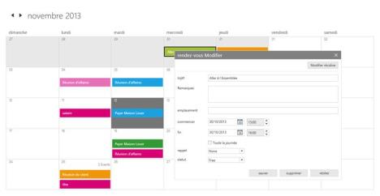

# Loclization

Localization is the process of customizing the user interface based on a culture specific to a particular country or region in order to display regional data. Culture is a schema which holds all the information about various standards such as language, DateTime information, currency, speed, and other physical metrics. The culture is represented by a unique string, for example, ―en-US‖ for U.S. English and ―fr‖ for French (common).

Localization is the key feature that provides solutions to global customers with the help of localized resource files provided by the control. The SfSchedule control supports localization, and you can create a resource file for any culture to be applied in the schedule.

### Use Cases

Localization makes your application multilingual by formatting content according to the culture. This involves configuring the application for specific languages. The SfSchedule control allows you to set custom resources through .resx files. You can simply provide the string values in a resource file for a specific culture and set it in your application. The given string values will be set accordingly in the SfSchedule control. The appointment windows, message boxes, and other alert windows will be displayed with text in the local language (culture). If the application is deployed in Japanese culture, then the SfSchedule control will display its contents in French language.


ApplicationLanguages.PrimaryLanguageOverride = "fr-fr";



## Advantages of Localization

The SfSchedule control can be embedded in applications deployed in any culture (e.g., en-US is the culture for English spoken in United States; en-GB is the culture for English spoken in United Kingdom or Great Britain) to provide details and information in the native language of the users.

