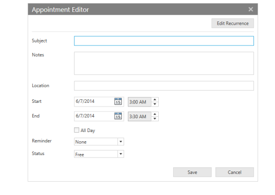

# Overview

## Introduction

SfSchedule is used to provide Outlook-like scheduling. The SfSchedule control allows user to create and manage appointments. It includes features such as viewing daily/all day/spanned appointments, complete customization using custom Templates, efficient performance, Data binding to different sources.

Use Cases

1. Schedule control can be used for public-service employees such as police officers, firefighters and health-care workers — anyone who works an unusual but predictable schedule.
2. In families if a spouse/partner works a shift schedule, then we have entirely different rotation appear on the calendar with family members. This will help us to organize family activities such as vacations and day-care.
3. Schedule control is used in a company for scheduling meetings with a clients.
4. It allows to view all the banking transaction events of a company in a daily, weekly, or monthly overview.
5. We can get a quick look at the call meetings happened in BPO of a single day in any calendar view.
6. Using this we can create single or recurring events and tasks to the employees, and set reminders for upcoming events, and color-code different item types.
7. A Drag and Drop feature allows us to reschedule an event or change its duration easily.
8. When we try to schedule an appointment with a doctor it helps to find the available time of the person and requesting for an appointment based on the availability of the concern doctor. In this way it saves the time.
9. Schedule control can be used in a scenario of categorizing the user appointments based on its importance. 

## Key Features

### Appointment Editor

The Appointments Editor to be used to create or edit various types of appointments with a specific time or location or using "All Day Events" without a specific time or location on your schedule. Appointment Editor can customize several feature of appointment such as applying reminder and adding recurrence to an appointment. It’s also simple to reschedule the added appointments by editing the Star Time and End Time of appointments.

{{ '' | markdownify }}
{:.image }

{{ '' | markdownify }}
{:.image }

### Built-in Views

Schedule provides 4 different types of viewing the calendar, 

* Day
* Week 
* Month
* TimeLine

### Multi-Resource Support

The Schedule control allows you to define resources that can be assigned to appointments. Resources let you associate additional information with your appointments. The schedule can group appointments based on the resources associated with them.

### Recurrence Appointment

You can schedule recurring appointments to repeat daily, weekly, monthly, or yearly. You can customize recurring appointment schedules that repeat for daily, weekly, monthly, or yearly.

### Remainders

You can use reminder to organize your appointments in your schedule. Schedule reminds you the particular appointment in the specified time. The remainder time can be set using the ReminderTime property of ScheduleAppointment.

### Rich User Experience

The Schedule control allows you to perform various operations. You can easily drag and drop the appointments from one timeslot to another timeslot. Appointment resizing operation can also be performed as per required start and end time of schedule in an interactive manner and also appointment can be modified though Appointment Editor.

### Appointment Mapping

The AppointmentMapping attributes are used to map the properties in the underlying data source to the Schedule appointments. The various attributes of the AppointmentMapping property are as follows.  

* Subject
* Location 
* StartTime 
* EndTime

