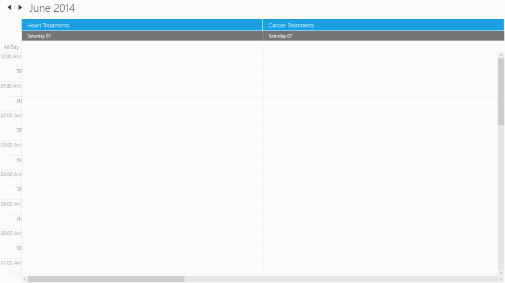

# Resources

The Schedule control allows you to define resources that can be assigned to appointments. Resources let you associate additional information with your appointments. The schedule can group appointments based on the resources associated with them. For example, you can create appointments for different doctors.

Appointments will be grouped based on the resource associated with them only when both the Resource and ScheduleResourceTypeCollection properties are set, and also when the Value set for a Resource matches with any types specified in the ScheduleResourceTypeCollection property.

[XAML] 

<Schedule:SfSchedule Name="Schedule1" ScheduleType="Week" Background="WhiteSmoke" Resource="Doctors" >

    <Schedule:SfSchedule.ScheduleResourceTypeCollection >

        <Schedule:ResourceType TypeName="Doctors">

            <Schedule:Resource   DisplayName="Dr.Jacob John, M.D " ResourceName="Dr.Jacob"/>

            <Schedule:Resource  DisplayName="Dr.Darsy Mascio, M.D" ResourceName="Dr.Darsy"/>

        </Schedule:ResourceType>

    </Schedule:SfSchedule.ScheduleResourceTypeCollection>

</Schedule:SfSchedule>

[C#] 

ScheduleAppointment app = new ScheduleAppointment() { StartTime = currentdate, EndTime = currentdate.AddHours(ran.Next(0, 2)), Subject = subject[count % subject.Length], Location = "Chennai", AppointmentBackground = brush[m % 3] };

            app.ResourceCollection.Add(new Resource() { ResourceName ="Dr.Jacob", TypeName = "Doctors" });

            ScheduleAppointment app1 = new ScheduleAppointment() { StartTime = nextdate, EndTime = nextdate.AddHours(ran.Next(0, 2)), Subject = subject[count % subject.Length], Location = "Chennai", AppointmentBackground = brush[(m + 2) % 3] };

            app1.ResourceCollection.Add(new Resource() { ResourceName ="Dr.Darsy", TypeName = "Doctors" });

            Schedule1.Appointments.Add(app);

            Schedule1.Appointments.Add(app1);

{{ '' | markdownify }}
{:.image }

{{ '' | markdownify }}
{:.image }

{{ '' | markdownify }}
{:.image }

## Creating ResourceTypesCollection for Schedule

_Let's_ see the steps to _add Resources in your schedule._

_The first step is set the ResourceTypesCollection in schedule_ 

[XAML]

     <schedule:SfSchedule  Resource="Doctors" >

         ...

        </schedule:SfSchedule>

After this, we need to create a ResourceTypeCollection, to assign the ResourceType:

[XAML]

      <schedule:SfSchedule Resource="Doctors"  >

               ...

            <schedule:SfSchedule.ScheduleResourceTypeCollection>

               ...

            </schedule:SfSchedule.ScheduleResourceTypeCollection>

        </schedule:SfSchedule>

## Adding ResourceType to a ResourceTypeCollection

After Creating the ResourceTypeCollection add the ResourecType, here we create the example for ResourceType as Doctors.

[XAML]

      <schedule:SfSchedule  Resource="Doctors" >

            <schedule:SfSchedule.ScheduleResourceTypeCollection >

                <schedule:ResourceType TypeName="Doctors">

                    . . .

                </schedule:ResourceType>

            </schedule:SfSchedule.ScheduleResourceTypeCollection>

        </schedule:SfSchedule>

## Adding a Resource to a ResourceType 

The next step is create and assign Resources to ResourceType.

[XAML]

    <schedule:SfSchedule  Resource="Doctors" >

            <schedule:SfSchedule.ScheduleResourceTypeCollection >

                <schedule:ResourceType TypeName="Doctors">

                    <schedule:Resource   DisplayName="Dr.Jacob John, M.D " ResourceName="Dr.Jacob"/>

                    <schedule:Resource  DisplayName="Dr.Darsy Mascio, M.D" ResourceName="Dr.Darsy"/>

                </schedule:ResourceType>

            </schedule:SfSchedule.ScheduleResourceTypeCollection>

        </schedule:SfSchedule>

## Creating appointments by specifying the resource

You can add an appointments to group of added resources.

[XAML]

ScheduleAppointment app = new ScheduleAppointment() { StartTime = currentdate, EndTime = currentdate.AddHours(ran.Next(0, 2)), Subject = subject[count % subject.Length], Location = "Chennai", AppointmentBackground = brush[m % 3] };

            app.ResourceCollection.Add(new Resource() { ResourceName ="Dr.Jacob", TypeName = "Doctors" });

            ScheduleAppointment app1 = new ScheduleAppointment() { StartTime = nextdate, EndTime = nextdate.AddHours(ran.Next(0, 2)), Subject = subject[count % subject.Length], Location = "Chennai", AppointmentBackground = brush[(m + 2) % 3] };

            app1.ResourceCollection.Add(new Resource() { ResourceName ="Dr.Darsy", TypeName = "Doctors" });

            Schedule1.Appointments.Add(app);

            Schedule1.Appointments.Add(app1);

## Adding Resources in code behind

Refer to the following code to add a Resources in the code behind

[C#]

          SfSchedule schedule = new SfSchedule();

            schedule.ScheduleType = ScheduleType.Week;

            schedule.DayHeaderOrder = DayHeaderOrder.OrderByDate;

            ResourceType resourceType = new ResourceType { TypeName = "Doctor" };

            resourceType.ResourceCollection.Add(new Resource { DisplayName = "Dr.Jacob", ResourceName = "Dr.Jacob", });

            resourceType.ResourceCollection.Add(new Resource { DisplayName = "Dr.Darsy", ResourceName = "Dr.Darsy" });

            schedule.ScheduleResourceTypeCollection = new ObservableCollection<ResourceType> { resourceType };

            schedule.Resource = "Doctor";

            this.grid.Children.Add(schedule);

## Subresource Support

This feature enables users to view appointments based on their subcategory only in day and week views. Using this feature, the end user can group appointments under various subcategories (resources). 

DayHeaderOrder property:

DayHeaderOrder property is used to set the order by which resources have to be displayed

<table>
<tr>
<td>
Property</td><td>
Description</td></tr>
<tr>
<td>
SubResourceType</td><td>
Gets or sets the ResourceType value which is a subresource type of its parent Resource type.</td></tr>
</table>

[XAML]

        <schedule:SfSchedule x:Name="schedule1" ScheduleType="Week"

                             Resource="Hospital" DayHeaderOrder="OrderByDate">

            <schedule:SfSchedule.ScheduleResourceTypeCollection>

                <schedule:ResourceType TypeName="Hospital">

                    <schedule:ResourceType.ResourceCollection>

                        <schedule:Resource DisplayName="Apollo Hospital"ResourceName="ApolloHospital"/>

                        <schedule:Resource DisplayName="Malar Hospital"ResourceName="MalarHospital"/>

                    </schedule:ResourceType.ResourceCollection>

                    <schedule:ResourceType.SubResourceType>

                        <schedule:ResourceType TypeName="Department">

                            <schedule:ResourceType.ResourceCollection>

                                <schedule:Resource DisplayName="Eye Department" ResourceName="Eye"/>

                                <schedule:Resource DisplayName="Heart Department" ResourceName="Heart"/>

                            </schedule:ResourceType.ResourceCollection>

                        </schedule:ResourceType>

                    </schedule:ResourceType.SubResourceType>

                </schedule:ResourceType>

            </schedule:SfSchedule.ScheduleResourceTypeCollection>

        </schedule:SfSchedule>

[C#]

            SfSchedule schedule = new SfSchedule();

            schedule.ScheduleType = ScheduleType.Week;

            schedule.DayHeaderOrder = DayHeaderOrder.OrderByDate;

            ResourceType resourceType = new ResourceType { TypeName = "Hospital" };

            ResourceType subresourceType = new ResourceType { TypeName = "Department" };

            resourceType.ResourceCollection.Add(new Resource { DisplayName = "Apollo Hospital", ResourceName = "ApolloHospital", });

            resourceType.ResourceCollection.Add(new Resource { DisplayName = "Malar Hospital", ResourceName = "MalarHospital" });

            subresourceType.ResourceCollection.Add(new Resource { DisplayName = "Eye Department", ResourceName = "Eye" });

            subresourceType.ResourceCollection.Add(new Resource { DisplayName = "Heart Department", ResourceName = "Heart" });

            schedule.ScheduleResourceTypeCollection = new ObservableCollection<ResourceType> { resourceType };

            schedule.ScheduleResourceTypeCollection = new ObservableCollection<ResourceType> { subresourceType };

            schedule.Resource = "Hospital";

            schedule.Resource = "Department";

            this.grid.Children.Add(schedule);

{{ '' | markdownify }}
{:.image }

## N Number of Resources in Day View

This feature supports to display ‘N’ number of resources in the Schedule view. You can achieve this by specifying the count of resources that needs to be displayed per view. This support is offered for Day view alone.

This support can be enabled by using property “DayViewColumnCount” in SfSchedule. By default, its value is “zero”.

<table>
<tr>
<td>
Property</td><td>
Type</td><td>
Description</td></tr>
<tr>
<td>
DayViewColumnCount</td><td>
int</td><td>
Gets or sets a value to specify the number of resources that need to be shown in the view.</td></tr>
</table>
Example:

In the following code example, “DayViewColumnCount” is “two”, so the Schedule displays two resources in the view. This count is maintained while scrolling to view the other resources.

[XAML]

<syncfusion:SfSchedule x:Name="Schedule" ScheduleType="Day"

                       Resource="Doctors" DayViewColumnCount="2">

    <syncfusion:SfSchedule.ScheduleResourceTypeCollection>

        <syncfusion:ResourceType TypeName="Doctors">

            <syncfusion:Resource ResourceName="Res1" DisplayName="Heart Treatments"/>

            <syncfusion:Resource ResourceName="Res2" DisplayName="Cancer Treatments"/>

            <syncfusion:Resource ResourceName="Res3" DisplayName="Diabetic Treatments"/>

            <syncfusion:Resource ResourceName="Res4" DisplayName="Eye Treatments"/>

            <syncfusion:Resource ResourceName="Res5" DisplayName="Psychology Treatments"/>

            <syncfusion:Resource ResourceName="Res6" DisplayName="Dermatology Treatments"/>

        </syncfusion:ResourceType>

    </syncfusion:SfSchedule.ScheduleResourceTypeCollection>

</syncfusion:SfSchedule>

[C#]

            SfSchedule schedule = new SfSchedule();

            schedule.ScheduleType = ScheduleType.Day;

            schedule.DayViewColumnCount = 0;

            ResourceType resourceType = new ResourceType { TypeName = "Doctors" };

            resourceType.ResourceCollection.Add(new Resource { ResourceName = "Res1", DisplayName = "Heart Treatments" });

            resourceType.ResourceCollection.Add(new Resource { ResourceName = "Res2", DisplayName = "Cancer Treatments" });

            resourceType.ResourceCollection.Add(new Resource { ResourceName = "Res3", DisplayName = "Diabetic Treatments" });

            resourceType.ResourceCollection.Add(new Resource { ResourceName = "Res4", DisplayName = "Eye Treatments" });

            resourceType.ResourceCollection.Add(new Resource { ResourceName = "Res5", DisplayName = "Psychology Treatments" });

            resourceType.ResourceCollection.Add(new Resource { ResourceName = "Res6", DisplayName = "Dermatology Treatments" });

            schedule.ScheduleResourceTypeCollection = new ObservableCollection<ResourceType> { resourceType };

            schedule.Resource = "Doctors";

            this.grid.Children.Add(schedule); 

The following screenshot shows a view with default value of DayViewColumnCount property set to “Zero”.

<table>
<tr>
<td>

{:.image }
The following screenshot shows a view with default value of DayViewColumnCount property set to “Two”.</td></tr>
<tr>
<td>

{:.image }
</td></tr>
</table>

