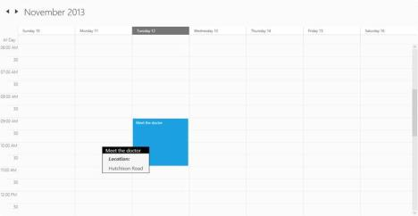

# Tooltip

Appointment Tooltip is used to view the details of the appointment in user required design. This tooltip will be displayed when the mouse is over the appointments whereas in touch device it will be displayed on holding over the appointments. The schedule appointment tooltip will be displayed only when the AppointmentTooltipTemplate property is set. The AppointmentTooltipTemplate is of type DataTemplate.

[XAML]

<Schedule:SfSchedule ScheduleType="Week" Background="WhiteSmoke" >

    <Schedule:SfSchedule.AppointmentTooltipTemplate>

        <DataTemplate>

            <Grid Background="WhiteSmoke"  Height="90" Width="210">

                <Grid.RowDefinitions>

                    <RowDefinition/>

                    <RowDefinition Height="10"/>

                    <RowDefinition/>

                    <RowDefinition />

                </Grid.RowDefinitions>

                <Border Grid.Row="0" Background="{Binding AppointmentBackground}">

                    <TextBlock Margin="10,5,0,0"  FontSize="16" Text="{Binding Subject}" Grid.Row="0"/>

                </Border>

                <TextBlock FontSize="16" FontWeight="Bold" FontStyle="Italic" Margin="20,0,0,0" Text="Location: " Grid.Row="2"/>

                <TextBlock FontSize="16" Margin="20,0,0,0" Text="{Binding Location}" Grid.Row="3"/>

            </Grid>

        </DataTemplate>

    </Schedule:SfSchedule.AppointmentTooltipTemplate>

</Schedule:SfSchedule>

[C#]

 schedule.Appointments.Add(new ScheduleAppointment()

{

StartTime = DateTime.Now.Date.AddHours(9),

EndTime = DateTime.Now.Date.AddHours(11),

Subject = "Meet the doctor",

Location = "Hutchison Road"

});

{{ '' | markdownify }}
{:.image }

