# Axes

Typically, SmithChart  has been used two axes that are used to measure and categorize the data. 

1. Horizontal Axis (Resistance)
2. Radial Axis (Reactance)

## Horizontal Axis

Horizontal axis scale is used to measure normalized resistance value. This axis should range from zero to positive infinitive only. It will not allow negative value.

The following topics explain in detail about the axis and its parts.

### MajorGridlines

By default, major gridlines are automatically added to the Axis. SfSmithChart supports the customization of major gridline. The visibility of the major gridlines can be controlled by using the **ShowMajorGridlines** property.





<syncfusion:SfSmithChart>
     <syncfusion:SfSmithChart.HorizontalAxis>
         <syncfusion:HorizontalAxis ShowMajorGridlines="False">
         </syncfusion:HorizontalAxis>
     </syncfusion:SfSmithChart.HorizontalAxis>
 </syncfusion:SfSmithChart>





//Customizing horizontal(Resistance) axis to the chart
chart.HorizontalAxis = new HorizontalAxis();
chart.HorizontalAxis.ShowMajorGridlines = false;





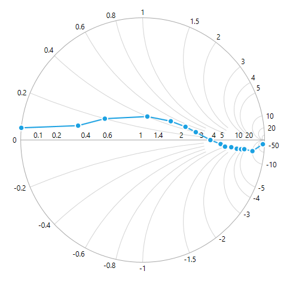

**MajorGridlineStyle**

SfSmithChart provides support to customize the style of the major gridlines by defining the *MajorGridlineStyle* property as shown in the below code snippet.





<syncfusion:SfSmithChart x:Name="SmithChart">
    <syncfusion:SfSmithChart.Resources>
        
    </syncfusion:SfSmithChart.Resources>
        <syncfusion:SfSmithChart.HorizontalAxis>
        <syncfusion:HorizontalAxis MajorGridlineStyle="{StaticResource lineStyle}">
        </syncfusion:HorizontalAxis>
   </syncfusion:SfSmithChart.HorizontalAxis>
</syncfusion:SfSmithChart>





chart.HorizontalAxis.MajorGridlineStyle = this.Grid1.Resources["lineStyle"] as Style;





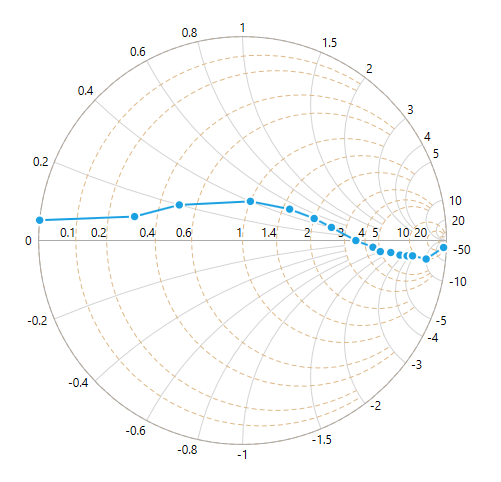

### MinorGridlines

By default, minor gridlines are not added to the Axis. The visibility of the minor gridlines can be controlled by using the `ShowMinorGridlines` property.





<syncfusion:SfSmithChart>
     <syncfusion:SfSmithChart.HorizontalAxis>
         <syncfusion:HorizontalAxis ShowMinorGridlines="True">
         </syncfusion:HorizontalAxis>
     </syncfusion:SfSmithChart.HorizontalAxis>
 </syncfusion:SfSmithChart>



 

//Customizing horizontal(Resistance) axis to the chart 
chart.HorizontalAxis = new HorizontalAxis();
chart.HorizontalAxis.ShowMinorGridlines = true;


    


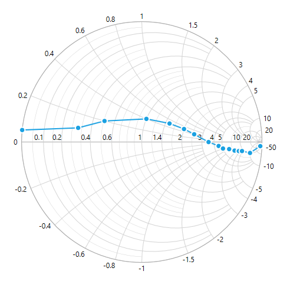

**MinorGridlinesCount**

Minor gridlines can be added by defining *MinorGridlinesCount* property. By default, this value is  eight. It means, every 100 pixels it renders maximum eight minor gridlines.





<syncfusion:SfSmithChart>
     <syncfusion:SfSmithChart.HorizontalAxis>
         <syncfusion:HorizontalAxis ShowMinorGridlines="True" MinorGridlinesCount="12">
         </syncfusion:HorizontalAxis>
     </syncfusion:SfSmithChart.HorizontalAxis>
 </syncfusion:SfSmithChart>





//Customizing horizontal(Resistance) axis to the chart 
chart.HorizontalAxis = new HorizontalAxis();
chart.HorizontalAxis.ShowMinorGridlines = true;
chart.HorizontalAxis.MinorGridlinesCount = 12;


    


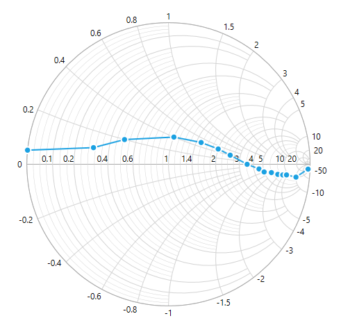

**MinorGridlineStyle**

SfSmithChart provides support to customize the style of the minor gridlines by defining the *MinorGridlineStyle* property as shown in the below code snippet.





<syncfusion:SfSmithChart x:Name="SmithChart">
    <syncfusion:SfSmithChart.Resources>
        
    </syncfusion:SfSmithChart.Resources>
        <syncfusion:SfSmithChart.HorizontalAxis>
        <syncfusion:HorizontalAxis ShowMinorGridlines="True" MinorGridlinesCount="12" MinorGridlineStyle="{StaticResource lineStyle}">
        </syncfusion:HorizontalAxis>
   </syncfusion:SfSmithChart.HorizontalAxis>
</syncfusion:SfSmithChart>



 

chart.HorizontalAxis.MinorGridlineStyle = this.Grid1.Resources["lineStyle"] as Style;





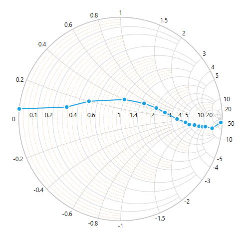

## AxisLine

SfSmithChart provides support to customize the style of the axis line by defining the *AxisLineStyle* property and change the visibility by using *ShowAxisLine* property as shown in the below code snippet.





<syncfusion:SfSmithChart x:Name="SmithChart">
    <syncfusion:SfSmithChart.Resources>
        
    </syncfusion:SfSmithChart.Resources>
        <syncfusion:SfSmithChart.HorizontalAxis>
        <syncfusion:HorizontalAxis ShowAxisLine="True" AxisLineStyle="{StaticResource lineStyle}">
        </syncfusion:HorizontalAxis>
   </syncfusion:SfSmithChart.HorizontalAxis>
</syncfusion:SfSmithChart>



 

chart.HorizontalAxis.AxisLineStyle = this.Grid1.Resources["lineStyle"] as Style;


    


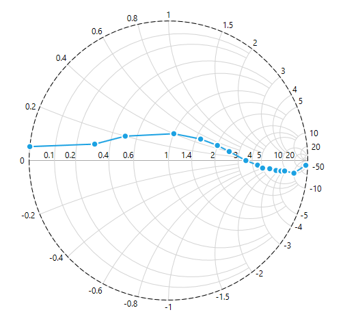

### LabelPlacement

The *LabelPlacement* property is used to position the axis label either inside or outside of the chart plotting area. By default, LabelsPlacement is **Outside**.





<syncfusion:SfSmithChart x:Name="SmithChart">
        <syncfusion:SfSmithChart.HorizontalAxis>
        <syncfusion:HorizontalAxis LabelPlacement="Inside">
        </syncfusion:HorizontalAxis>
   </syncfusion:SfSmithChart.HorizontalAxis>
</syncfusion:SfSmithChart>



 

//Positioning the horizontal axis labels to bottom of AxisLine
chart.HorizontalAxis.LabelPlacement = LabelPlacement.Inside;


    


### LabelIntersectAction

When the Axis labels overlap with each other based on the chart dimensions and label size, use the *LabelIntersectAction* property of the axis to avoid overlapping. The default value of the LabelIntersectAction is **Hide**.





<syncfusion:SfSmithChart x:Name="SmithChart">
        <syncfusion:SfSmithChart.HorizontalAxis>
        <syncfusion:HorizontalAxis LabelIntersectAction="None">
        </syncfusion:HorizontalAxis>
   </syncfusion:SfSmithChart.HorizontalAxis>
</syncfusion:SfSmithChart>





//Set axis label intersect action
chart.HorizontalAxis.LabelIntersectAction = LabelIntersectActions.None;


    


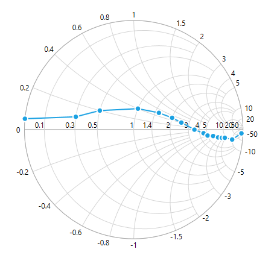

## Radial Axis

Radial axis scale is used to measure the normalized reactance values. Top circle ranges from 270 to 90 degrees, it will allow positive range like zero to positive infinite. Bottom circle ranges from 90 to 270 degrees, it will allow only negative range like zero to negative infinitive.

### MajorGridlines

By default, major gridlines are automatically added to the Axis. SfSmithChart supports customization of major gridline. The visibility of the major gridlines can be controlled by using the *ShowMajorGridlines* property.





<syncfusion:SfSmithChart>
     <syncfusion:SfSmithChart.RadialAxis>
         <syncfusion:RadialAxis ShowMajorGridlines="False">
         </syncfusion:RadialAxis >
     </syncfusion:SfSmithChart.RadialAxis >
 </syncfusion:SfSmithChart>



 

//Customizing radial(Reactance) axis to the chart 
chart.RadialAxis = new RadialAxis();
chart.RadialAxis.ShowMajorGridlines = false;


    


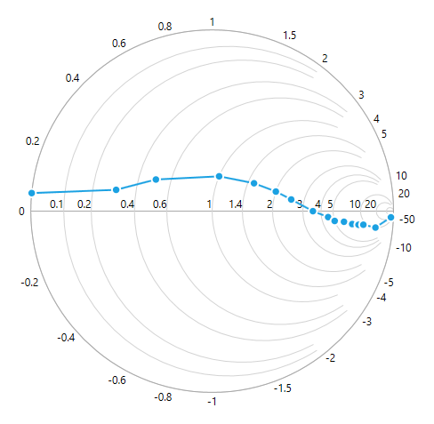

**MajorGridlineStyle**

SfSmithChart provides support to customize the style of the major gridlines by defining the *MajorGridlineStyle* property as shown in the below code snippet.





<syncfusion:SfSmithChart x:Name="SmithChart">
    <syncfusion:SfSmithChart.Resources>
        
    </syncfusion:SfSmithChart.Resources>
        <syncfusion:SfSmithChart.RadialAxis>
        <syncfusion:RadialAxis MajorGridlineStyle="{StaticResource lineStyle}">
        </syncfusion:RadialAxis >
   </syncfusion:SfSmithChart.RadialAxis>
</syncfusion:SfSmithChart>



 

chart.RadialAxis.MajorGridlineStyle = this.Grid1.Resources["lineStyle"] as Style;


    


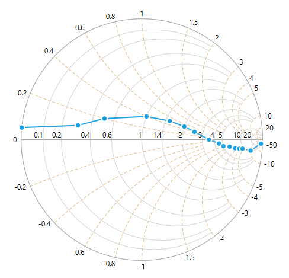

### MinorGridlines

By default, minor gridlines are not added to the Axis. The visibility of the minor gridlines can be controlled by using the *ShowMinorGridlines* property.





<syncfusion:SfSmithChart>
     <syncfusion:SfSmithChart.RadialAxis>
         <syncfusion:RadialAxis ShowMinorGridlines="True">
         </syncfusion:RadialAxis>
     </syncfusion:SfSmithChart.RadialAxis>
 </syncfusion:SfSmithChart>



 

//Customizing radial(Reactance) axis to the chart 
chart.RadialAxis = new RadialAxis();
chart.RadialAxis.ShowMinorGridlines = true;


    


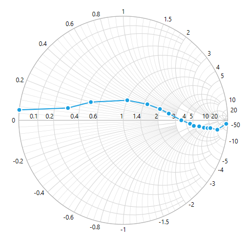

**MinorGridlinesCount**

Minor gridlines can be added by defining *MinorGridlinesCount* property. By default, this value is  eight. It means, every 100 pixels it renders maximum eight minor gridlines.





<syncfusion:SfSmithChart>
     <syncfusion:SfSmithChart.RadialAxis>
         <syncfusion:RadialAxis ShowMinorGridlines="True" MinorGridlinesCount="12">
         </syncfusion:RadialAxis>
     </syncfusion:SfSmithChart.RadialAxis>
 </syncfusion:SfSmithChart>



 

//Customizing radial(Reactance) axis to the chart 
chart.RadialAxis = new RadialAxis();
chart.RadialAxis.ShowMinorGridlines = true;
chart.RadialAxis.MinorGridlinesCount = 12;


    


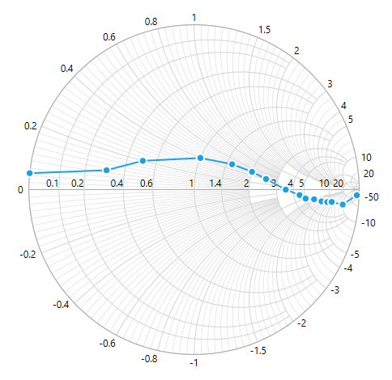

**MinorGridlineStyle**

SfSmithChart provides support to customize the style of the minor gridlines by defining the *MinorGridlineStyle* property as shown in the below code snippet.





<syncfusion:SfSmithChart x:Name="SmithChart">
    <syncfusion:SfSmithChart.Resources>
        
    </syncfusion:SfSmithChart.Resources>
        <syncfusion:SfSmithChart.RadialAxis>
        <syncfusion:RadialAxis ShowMinorGridlines="True" MinorGridlinesCount="12" MinorGridlineStyle="{StaticResource lineStyle}">
        </syncfusion:RadialAxis>
   </syncfusion:SfSmithChart.RadialAxis>
</syncfusion:SfSmithChart>



 

chart.RadialAxis.MinorGridlineStyle = this.Grid1.Resources["lineStyle"] as Style;


    


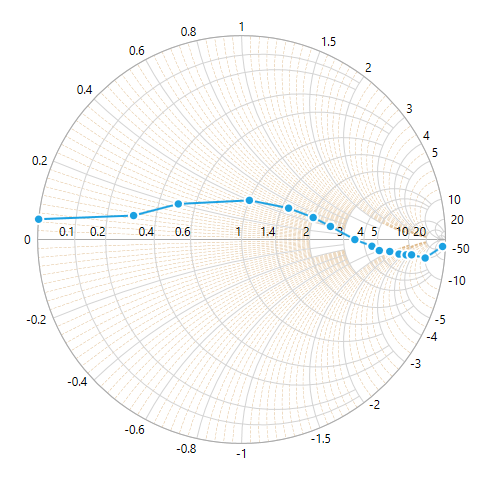

### AxisLine

SfSmithChart provides support to customize the style of the axis line by defining the *AxisLineStyle* property and change the visibility by using *ShowAxisLine* property as shown in the below code snippet.





<syncfusion:SfSmithChart x:Name="SmithChart">
    <syncfusion:SfSmithChart.Resources>
        
    </syncfusion:SfSmithChart.Resources>
        <syncfusion:SfSmithChart.RadialAxis>
        <syncfusion:RadialAxis ShowAxisLine="True" AxisLineStyle="{StaticResource lineStyle}">
        </syncfusion:RadialAxis>
   </syncfusion:SfSmithChart.RadialAxis>
</syncfusion:SfSmithChart>



 

chart.RadialAxis.AxisLineStyle = this.Grid1.Resources["lineStyle"] as Style;


    


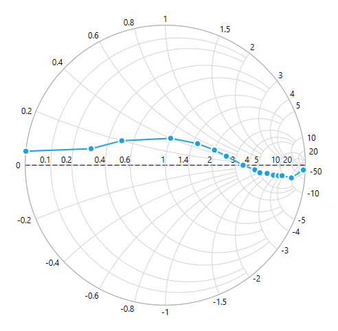

### LabelPlacement

The *LabelPlacement* property is used to position the axis label either inside or outside of the chart plotting area. By default, LabelsPlacement is **Outside**.





<syncfusion:SfSmithChart x:Name="SmithChart">
        <syncfusion:SfSmithChart.RadialAxis>
        <syncfusion:RadialAxis LabelPlacement="Inside">
        </syncfusion:RadialAxis>
   </syncfusion:SfSmithChart.RadialAxis>
</syncfusion:SfSmithChart>





//Positioning the radial axis labels to inside of Circle
chart.RadialAxis.LabelPlacement = LabelPlacement.Inside;


    


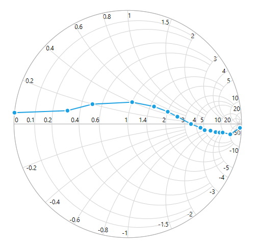

### LabelIntersectAction

When the Axis labels overlap with each other based on the chart dimensions and label size, use the *LabelIntersectAction* property of the axis to avoid overlapping. The default value of the LabelIntersectAction is **Hide**.





<syncfusion:SfSmithChart x:Name="SmithChart">
        <syncfusion:SfSmithChart.RadialAxis>
        <syncfusion:RadialAxis LabelIntersectAction="None">
        </syncfusion:RadialAxis>
   </syncfusion:SfSmithChart.RadialAxis>
</syncfusion:SfSmithChart>



 

//Set axis label intersect action
chart.RadialAxis.LabelIntersectAction = LabelIntersectActions.None;


    


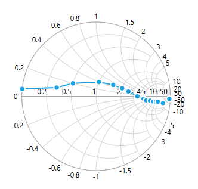

## Events

* `LabelCreated`– Occurs when the label is created.

 

//Axis label created event hooked for RadialAxis
chart.RadialAxis.LabelCreated += RadialAxis_LabelCreated;

  //Event called for every label created in the axis.
  void RadialAxis_LabelCreated(object sender, EventArgs e)
  {
      var axisLabel = e as ChartAxisLabelEventArgs;

      //Customizing the specific label text and color
      if (axisLabel.Label.Text == "1")
      {
          axisLabel.Label.Text = "One";
          axisLabel.Label.Foreground = new SolidColorBrush(Colors.Red);
      }
  }



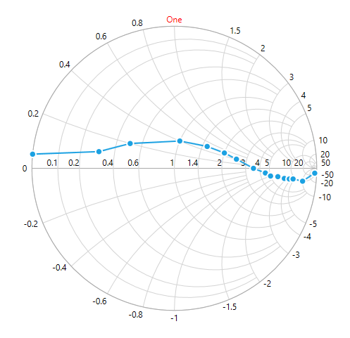