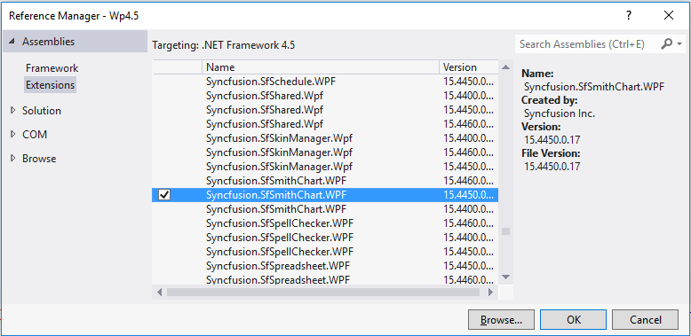
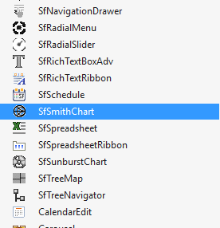
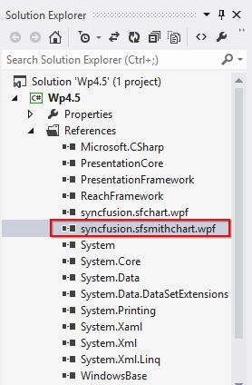

# Getting Started

The following section helps you to build your application with SfSmithChart. 

## Steps

   * Create new WPF project using Visual Studio. For more [details](https://msdn.microsoft.com/en-IN/library/bb546958(v=vs.90)).
   * Add the SfSmithChart assembly to your application. 
   * Initialize smith chart control.
   * Adding header to the smith chart control.
   * Adding series to the smith chart control.
   * Adding legends for the series.
   
These steps are explained below for both XAML and code behind.

## Create a simple smith chart from XAML

### Adding assembly reference

1. Open the Add Reference window from your project.
2. Choose Windows > Extensions > Syncfusion.SfSmithChart.WPF.

T> Select the .NET Framework version respective to your application. The version can be identified as below:
<table>
<tr>
<td>
XX.X450.0.X
</td> 
 <td>4.5 Framework
 </td>
 </tr>
<tr>
<td>XX.X451.0.X
</td>
<td>4.5.1 Framework
</td>
</tr>
<tr>
<td>XX.X460.0.X
</td>
<td>4.6 Framework
</td>
</tr>
</table>

Add the following namespace in your XAML window.


xmlns:syncfusion="clr-namespace:Syncfusion.UI.Xaml.SmithChart;assembly=Syncfusion.SfSmithChart.WPF"


### Add SfSmithChart from Toolbox

Drag and drop the SfSmithChart control from the Toolbox to your application.

Now the Syncfusion.SfSmithChart.WPF reference is added to the application references and the xmlns namespace code is generated in MainWindow.xaml as below.

In this section, the data in the following table is used for demonstration.

**Impedance** **Transmission** **of** **SmithChart**

<table>
<tr>
<th>
Resistance
</th>
<th>
Reactance
</th>
</tr>
<tr>
<td>
0
</td>
<td>
0.05
</td>
</tr>
<tr>
<td>
0.3
</td>
<td>
0.1
</td>
</tr>
<tr>
<td>
0.5
</td>
<td>
0.2
</td>
</tr>
<tr>
<td>
1.0
</td>
<td>
0.4
</td>
</tr>
<tr>
<td>
1.5
</td>
<td>
0.5
</td>
</tr>
<tr>
<td>
2.0
</td>
<td>
0.5
</td>
</tr>
<tr>
<td>
2.5
</td>
<td>
0.4
</td>
</tr>
<tr>
<td>
3.5
</td>
<td>
0.0
</td>
</tr>
<tr>
<td>
4.5
</td>
<td>
-0.5
</td>
</tr>
<tr>
<td>
5.0
</td>
<td>
-1.0
</td>
</tr>
<tr>
<td>
6.0
</td>
<td>
-1.5
</td>
</tr>
<tr>
<td>
7.0
</td>
<td>
-2.5
</td>
</tr>
<tr>
<td>
8.0
</td>
<td>
-3.5
</td>
</tr>
<tr>
<td>
9.0
</td>
<td>
-4.5
</td>
</tr>
<tr>
<td>
10
</td>
<td>
-10
</td>
</tr>
<tr>
<td>
20
</td>
<td>
-50
</td>
</tr>
</table>

Before proceeding with the smith chart, create data model with the above details as follows.


    public class TransmissionData
    {
        public double Resistance { get; set; }

        public double Reactance { get; set; }
    }


Create a collection property in MainWindow class as below:


    public partial class MainWindow : Window
    {
        public MainWindow()
        {
		    this.DataContext = this;
            InitializeComponent();
        }

        public ObservableCollection<TransmissionData> Data { get; set; } 
    }


Add the values to this TraceData property, with the values illustrated in the above table.



    public MainWindow()
    { 
        InitializeComponent();

        Data = new ObservableCollection<TransmissionData>();

        Data.Add(new TransmissionData() { Resistance = 0, Reactance = 0.05 });
        Data.Add(new TransmissionData() { Resistance = 0.3, Reactance = 0.1 });
        Data.Add(new TransmissionData() { Resistance = 0.5, Reactance = 0.2 });
        Data.Add(new TransmissionData() { Resistance = 1.0, Reactance = 0.4 });
        Data.Add(new TransmissionData() { Resistance = 1.5, Reactance = 0.5 });
        Data.Add(new TransmissionData() { Resistance = 2.0, Reactance = 0.5 });
        Data.Add(new TransmissionData() { Resistance = 2.5, Reactance = 0.4 });
        Data.Add(new TransmissionData() { Resistance = 3.5, Reactance = 0.0 });
        Data.Add(new TransmissionData() { Resistance = 4.5, Reactance = -0.5 });
        Data.Add(new TransmissionData() { Resistance = 5, Reactance = -1.0 });
        Data.Add(new TransmissionData() { Resistance = 6, Reactance = -1.5 });
        Data.Add(new TransmissionData() { Resistance = 7, Reactance = -2.5 });
        Data.Add(new TransmissionData() { Resistance = 8, Reactance = -3.5 });
        Data.Add(new TransmissionData() { Resistance = 9, Reactance = -4.5 });
        Data.Add(new TransmissionData() { Resistance = 10, Reactance = -10 });
        Data.Add(new TransmissionData() { Resistance = 20, Reactance = -50 });
    }  
      


### Initialize the smith chart 

You need to initialize the smith chart represented by the following class Syncfusion.UI.Xaml.SfSmithChart.



<syncfusion:SfSmithChart>

</syncfusion:SfSmithChart>



### Add header to smith chart

The header of the smith chart acts as the title, to identify the purpose of the smith chart. 

Here you specify “Impedance Transmission” as header in the below code example.



    <Grid>

        <syncfusion:SfSmithChart Header="Impedance Transmission" Height="400" Width="500">
            
        </syncfusion:SfSmithChart>

    </Grid>



### Adding Axes

The following code example illustrates how to customize the resistance (Horizontal) and reactance (Radial) axis to the SfSmithChart.



    <syncfusion:SfSmithChart.HorizontalAxis>
        <syncfusion:HorizontalAxis FontSize="11" FontFamily="Segoe UI"></syncfusion:HorizontalAxis>
    </syncfusion:SfSmithChart.HorizontalAxis>
    <syncfusion:SfSmithChart.RadialAxis>
        <syncfusion:RadialAxis FontSize="11" FontFamily="Segoe UI"></syncfusion:RadialAxis>
    </syncfusion:SfSmithChart.RadialAxis>



### Adding series 

You can plot the line on smith chart map, by adding line series.

You need to initialize the series for representing the **Transmission Data**.


    <syncfusion:LineSeries>                
    </syncfusion:LineSeries>		


After you have added the series, you need to add ItemSource, ResistancePath and ReactancePath APIs, to populate your data in the smith chart.

* `ItemsSource` - It is a property to hold our data source, you can bind your underlying collection to it.
* `ResistancePath` - It is a string property, used to map properties that need to be bounded to the Resistance Axis (or HorizontalAxis). It is like a value member path in ListBox.
* `ReactancePath` - It is a string property, used to map properties that need to be bounded to the Reactance Axis (Or RadialAxis). It is like a value member path in ListBox.
* `Label` - This property gives names for the series, which in turn mapped to the Legend.


        
    <syncfusion:LineSeries ResistancePath="Resistance" ReactancePath="Reactance" ItemsSource="{Binding Data}" Label="TransmissionLine">                
    </syncfusion:LineSeries>
		


### Add legends to the smith chart

The following code example illustrates the syntax to add the [`legends`]() in smith chart. 



    <syncfusion:SfSmithChart.Legend>
        <syncfusion:SmithChartLegend>
		</syncfusion:SmithChartLegend>
    </syncfusion:SfSmithChart.Legend>



Now you have prepared a SmithChart demonstrating the studies related to Transmission Line of Impedance. 

The following code example gives you the complete code for creating a smith chart.





        <syncfusion:SfSmithChart Header="Impedance Transmission" Height="400" Width="500">
            <!--Initialize the series for SfSmithChart-->
            <syncfusion:LineSeries ResistancePath="Resistance" ReactancePath="Reactance" ItemsSource="{Binding Data}" Label="TransmissionLine">                
            </syncfusion:LineSeries>
            <!--Initialize the resistance axis for SfSmithChart-->
            <syncfusion:SfSmithChart.HorizontalAxis>
                <syncfusion:HorizontalAxis FontSize="11"></syncfusion:HorizontalAxis>
            </syncfusion:SfSmithChart.HorizontalAxis>
            <!--Initialize the reactance axis for SfSmithChart-->
            <syncfusion:SfSmithChart.RadialAxis>
                <syncfusion:RadialAxis FontSize="11"></syncfusion:RadialAxis>
            </syncfusion:SfSmithChart.RadialAxis>
            <!--Adding Legend to the SfSmithChart-->
            <syncfusion:SfSmithChart.Legend>
                <syncfusion:SmithChartLegend></syncfusion:SmithChartLegend>
            </syncfusion:SfSmithChart.Legend>
        </syncfusion:SfSmithChart>





    public partial class MainWindow : Window
    {
        public ObservableCollection<TransmissionData> Data { get; set; } 
        public MainWindow()
        {
            this.DataContext = this;
            InitializeComponent();

            Data = new ObservableCollection<TransmissionData>();

            Data.Add(new TransmissionData() { Resistance = 0, Reactance = 0.05 });
            Data.Add(new TransmissionData() { Resistance = 0.3, Reactance = 0.1 });
            Data.Add(new TransmissionData() { Resistance = 0.5, Reactance = 0.2 });
            Data.Add(new TransmissionData() { Resistance = 1.0, Reactance = 0.4 });
            Data.Add(new TransmissionData() { Resistance = 1.5, Reactance = 0.5 });
            Data.Add(new TransmissionData() { Resistance = 2.0, Reactance = 0.5 });
            Data.Add(new TransmissionData() { Resistance = 2.5, Reactance = 0.4 });
            Data.Add(new TransmissionData() { Resistance = 3.5, Reactance = 0.0 });
            Data.Add(new TransmissionData() { Resistance = 4.5, Reactance = -0.5 });
            Data.Add(new TransmissionData() { Resistance = 5, Reactance = -1.0 });
            Data.Add(new TransmissionData() { Resistance = 6, Reactance = -1.5 });
            Data.Add(new TransmissionData() { Resistance = 7, Reactance = -2.5 });
            Data.Add(new TransmissionData() { Resistance = 8, Reactance = -3.5 });
            Data.Add(new TransmissionData() { Resistance = 9, Reactance = -4.5 });
            Data.Add(new TransmissionData() { Resistance = 10, Reactance = -10 });
            Data.Add(new TransmissionData() { Resistance = 20, Reactance = -50 });
        }
    }
  

    public class TransmissionData
    {
        public double Resistance { get; set; }

        public double Reactance { get; set; }
    }


    

    
    
The following smith chart is created as a result of the above codes.

## Create a simple smith chart from code behind (C#)

Some developers prefer code behind as the first approach for development, to create things dynamically. This section helps you create to SfSmithChart from code behind.

### Adding assembly reference

* Open the Add Reference window from your project.
* Choose Windows > Extensions >Syncfusion.SfSmithChart.WPF
* Add the following namespace in your C# file, MainWindow.xaml.cs.



using Syncfusion.UI.Xaml.SmithChart;



### Initialize the chart

You need to create the instance for the SfSmithChart as below.



SfSmithChart chart = new SfSmithChart();



### Adding header to the smith chart

The header acts as the title for the SmithChart you created, to identify the purpose of the smith chart.



chart.Header = "Impedance Transmission";



### Adding Axes

The following code example illustrates how to customize the resistance (Horizontal) and reactance (Radial) axis to the SfSmithChart.



    //Customizing horizontal(Resistance) axis to the smith chart 
    chart.HorizontalAxis = new HorizontalAxis();
    chart.HorizontalAxis.FontSize = 11;
	chart.HorizontalAxis.FontFamily = new FontFamily("Segoe UI");

    //Customizing radial(Reactance) axis to the smith chart 
    chart.RadialAxis = new RadialAxis();
    chart.RadialAxis.FontSize = 11;
	chart.RadialAxis.FontFamily = new FontFamily("Segoe UI");



### Adding series

You can plot the line on smith chart map, by adding line series.

You need to initialize the series for representing the **Transmission Data**.



LineSeries series = new LineSeries();



T> The graph selection depends on the user scenario and the nature of the data. For example, consider the case where a user is developing a chart to visualize the number of online users on a website for any given 30-minute interval during the day. In this scenario, since the data plotted is of high density and also based on two independent variables, choosing the line graph series would provide proper visualization.

After you have added the series, you need to add ItemSource, ResistancePath and ReactancePath APIs, to populate your data in the smith chart.

* `ItemsSource` - It is a property to hold our data source, you can bind your underlying collection to it.
* `ResistancePath` - It is a string property, used to map properties that need to be bounded to the Resistance Axis (or HorizontalAxis). It is like a value member path in ListBox.
* `ReactancePath` - It is a string property, used to map properties that need to be bounded to the Reactance Axis (Or RadialAxis). It is like a value member path in ListBox.
* `Label` - This property gives names for the series, which in turn mapped to the Legend.



    LineSeries series = new LineSeries();
    series.ItemsSource = Data;
    series.ResistancePath = "Resistance";
    series.ReactancePath = "Reactance";
	series.Label = "TransmissionLine";
	chart.Series.Add(series);



### Adding legends to the chart

The following code examples demonstrates how to add [`legends`]() to your smith chart.



    SmithChartLegend legend = new SmithChartLegend();

    chart.Legend = legend;



Now you have prepared a SmithChart demonstrating the studies related to Transmission Line of Impedance. 

The following code example gives you the complete code for creating a smith chart.



        SfSmithChart chart = new SfSmithChart();

        chart.Header = "Impedance Transmission";
        
        //Customizing horizontal(Resistance) axis to the smith chart 
        chart.HorizontalAxis = new HorizontalAxis();
        chart.HorizontalAxis.FontSize = 11;
        chart.HorizontalAxis.FontFamily = new FontFamily("Segoe UI");

        //Customizing radial(Reactance) axis to the smith chart 
        chart.RadialAxis = new RadialAxis();
        chart.RadialAxis.FontSize = 11;
        chart.RadialAxis.FontFamily = new FontFamily("Segoe UI");

        //Adding series to SmithChart
        LineSeries series = new LineSeries();
        series.ItemsSource = Data;
        series.ResistancePath = "Resistance";
        series.ReactancePath = "Reactance";
        series.Label = "TransmissionLine";

        chart.Series.Add(series);

        //Adding legend to the SmithChart
        SmithChartLegend legend = new SmithChartLegend();
        chart.Legend = legend;

        this.DataContext = this;

        //Setting SmithChart as a Content for the Grid in Page
        this.Grid1.Children.Add(chart);



The following output is displayed as a result of the above code example.

