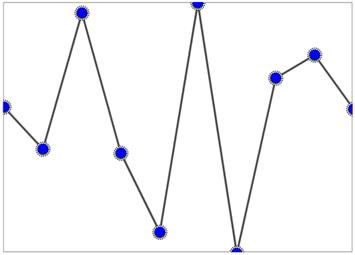

# Marker Customization

We can customize the markers by initializing the marker template selector class, and we can differentiate the first, last, high, low, negative points.





<Syncfusion:SfLineSparkline 

		    ItemsSource="{Binding UsersList}" 

			MarkerVisibility="Visible" Padding="20"

		    YBindingPath="NoOfUsers">

<Syncfusion:SfLineSparkline.MarkerTemplateSelector>

	<Syncfusion:MarkerTemplateSelector FirstPointBrush="Yellow" LastPointBrush="Yellow" 
    
                                       HighPointBrush="Red" MarkerHeight="15" MarkerWidth="15"/>

	</Syncfusion:SfLineSparkline.MarkerTemplateSelector>

</Syncfusion:SfLineSparkline >
  




SfLineSparkline sparkline = new SfLineSparkline()
{

	ItemsSource = new SparkViewModel().Data,

	YBindingPath = "Day",

	MarkerVisibility = Visibility.Visible,

	Padding = new Thickness(20)

};

SegmentTemplateSelector selector = new SegmentTemplateSelector()
{

	FirstPointBrush = new SolidColorBrush(Colors.Yellow),

	LastPointBrush = new SolidColorBrush(Colors.Yellow),

	HighPointBrush = new SolidColorBrush(Colors.Red),

	MarkerHeight = 15,

    MarkerWidth = 15

};

sparkline.MarkerTemplateSelector = selector;





Following is the snapshot above code,

**Marker Template**

You can customize default appearence of the marker symbol by using the MarkerTemplate property in the sparkline.

The following code shows how to apply the template for the Marker.





<syncfusion:SfLineSparkline Interior="#4a4a4a"  

                            BorderBrush="DarkGray"
                                        
                            MarkerVisibility="Visible"   

                            BorderThickness="1"
                                        
                            ItemsSource="{Binding UsersList}"  

                            YBindingPath="NoOfUsers">

        <syncfusion:SfLineSparkline.Resources>

            <DataTemplate x:Key="markerTemplate">

                 <Grid>

                    <Ellipse Height="15" Width="15" 
                                             
                             Fill="LightGoldenrodYellow"
                                             
                             Stroke="Black" StrokeDashArray="1,1" 
                                             
                             StrokeThickness="1" />

                    <Ellipse Height="12" Width="12" Fill="Blue" Stroke="Black"   
                                             
                             StrokeDashArray="1,1" 
                                             
                             StrokeThickness="1"/>

                    </Grid>

                </DataTemplate>
                
        </syncfusion:SfLineSparkline.Resources>

        <syncfusion:SfLineSparkline.MarkerTemplateSelector>

                <syncfusion:MarkerTemplateSelector MarkerTemplate="{StaticResource markerTemplate}"/>

         </syncfusion:SfLineSparkline.MarkerTemplateSelector>

</syncfusion:SfLineSparkline>





SfLineSparkline sparkline = new SfLineSparkline()
{

	ItemsSource = new SparkViewModel().Data,

	YBindingPath = "Day",

	MarkerVisibility = Visibility.Visible,

	Interior =new SolidColorBrush(Colors.Gray),

	BorderBrush = new SolidColorBrush(Colors.DarkGray),

	BorderThickness = new Thickness (1)

};

MarkerTemplateSelector selector = new MarkerTemplateSelector()
{

	MarkerTemplate = sparkline.Resources["markerTemplate"] as DataTemplate

};

sparkline.MarkerTemplateSelector = selector;





