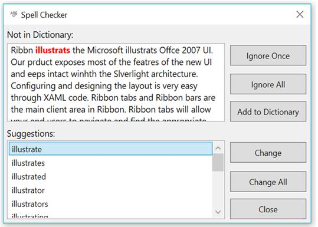

---
layout: post
title: Getting Started with SfSpellChecker control in WPF
description: Getting Started with SfSpellChecker control in WPF
platform: WPF
control: SfSpellChecker
documentation: ug
--- 

# Getting Started

Spellchecking operation can be done on Text editor controls through `SfSpellChecker` in WPF application by implementing `IEditorProperties` interface.

The following steps helps to add `SfSpellChecker`.

1 . Create a WPF project in Visual Studio and include following assemblies.

* Syncfusion.SpellChecker.Base
* Syncfusion.SfSpellChecker.WPF

2 . Create an instance of `SfSpellChecker` using “Syncfusion.Windows.Controls” namespace.





Syncfusion.Windows.Controls.SfSpellChecker spellChecker = new Syncfusion.Windows.Controls.SfSpellChecker();





3 . Create instance of Button and TextBox to input control for SpellCheck.





<Grid>

<TextBox x:Name="txtbx" TextWrapping="Wrap" VerticalContentAlignment="Top"
         Text="Ribbn illustrats the Microsoft illustrats Offce 2007 UI.
         Our prduct exposes most of the featres of the new UI and eeps
         intact winhth the Slverlight architecture.
         Configuring and designing the layout is very easy through XAML code.
         Ribbon tabs and Ribbon bars are the main client area in Ribbon.
         Ribbon tabs will allow your end users to navigate and find the appropriate
         tools for the task at hand. The Ribbon bars will contain the Ribbon tools."
         VerticalAlignment="Stretch" />
         
<Button HorizontalAlignment="Left"  Content="Spell Check" Click="Button_Click">

</Button>

</Grid> 





4 . Inherit `IEditorProperties` interface of `SfSpellChecker` and Initialize all the methods and properties in interface.





public class TextSpellEditor:IEditorProperties

{

TextBox textbox;

public TextSpellEditor(Control control)

{

ControlToSpellCheck = control;

}

public Control ControlToSpellCheck

{

get

{

return textbox;

}

set

{

textbox = value as TextBox;

}

}

public string SelectedText

{

get

{

return textbox.SelectedText;

}

set

{

textbox.SelectedText = value;

}

}

public string Text

{

get

{

return textbox.Text;

}

set

{

textbox.Text = value;

}

}

public void Select(int selectionStart, int selectionLength)

{

textbox.Select(selectionStart, selectionLength);

}

public bool HasMoreTextToCheck()

{

return false;

}

public void Focus()

{

textbox.Focus();

}

public void UpdateTextField()

{

throw new NotImplementedException();

}

}




 
5 . In Click event of button call SpellCheck method to TextBox.





private void Button_Click(object sender, RoutedEventArgs e)

{

SpellChecker.PerformSpellCheckUsingDialog(Editor);

}





6 . Suggested word can be replaced by double clicking on the word from the ListBox.

