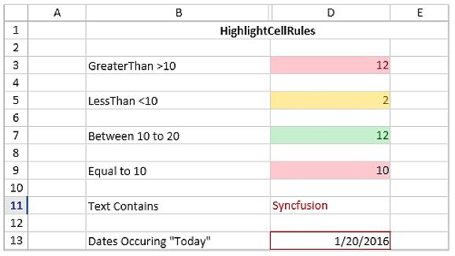
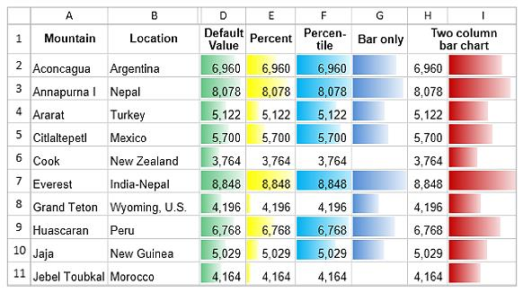
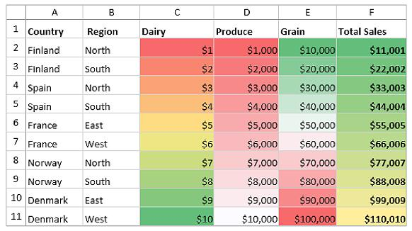
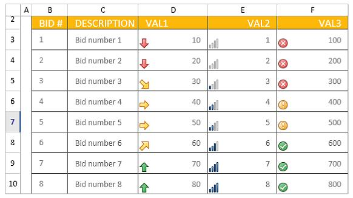

# Conditional Formatting 

This section explains about how to apply conditional formatting rules programmatically at run time in SfSpreadsheet.

In SfSpreadsheet, to apply conditional format for a cell or range of cells, add [IConditionalFormat](http://help.syncfusion.com/cr/cref_files/wpf/xlsio/Syncfusion.XlsIO.Base~Syncfusion.XlsIO.IConditionalFormat.html) to that range by using [AddCondition](http://help.syncfusion.com/cr/cref_files/wpf/xlsio/Syncfusion.XlsIO.Base~Syncfusion.XlsIO.IConditionalFormats~AddCondition.html) method.



var WorkSheet =Sfspreadsheet.Workbook.Worksheets[0];

IConditionalFormats condition = WorkSheet.Range["A1"].ConditionalFormats;

IConditionalFormat condition1 = condition.AddCondition();


  

## Highlight Cell Rules

To format the cells based on cell value, set the conditional format type as **CellValue**, operator, background color etc., to the specified cell or range and then invalidate the cells to refresh the view.



var worksheet = spreadsheet.Workbook.Worksheets[0];

IConditionalFormats condition = worksheet.Range["A1:A100"].ConditionalFormats;

IConditionalFormat condition1 = condition.AddCondition();

condition1.FormatType = ExcelCFType.CellValue;

condition1.Operator = ExcelComparisonOperator.Greater;

condition1.FirstFormula = "10";

condition1.BackColor = ExcelKnownColors.Light_orange;

spreadsheet.ActiveGrid.InvalidateCell(GridRangeInfo.Col(1));



Sample Output

## Data Bars

To apply the conditional format based on data bars, set the conditional format type as a **DataBar** and then invalidate that cells to update the view.



var worksheet = spreadsheet.Workbook.Worksheets[0];

var conditionalFormats =   worksheet.Range["B1:B100"].ConditionalFormats;

var conditionalFormat = conditionalFormats.AddCondition();

conditionalFormat.FormatType = ExcelCFType.DataBar;

conditionalFormat.DataBar.BarColor = Color.FromArgb(255, 214, 0, 123);

conditionalFormat.DataBar.MinPoint.Type = ConditionValueType.LowestValue;

conditionalFormat.DataBar.MaxPoint.Type = ConditionValueType.HighestValue;

spreadsheet.ActiveGrid.InvalidateCell(GridRangeInfo.Col(2));



Sample Output

## Color Scales

To apply the conditional format based on color scales, set a conditional format type as a **ColorScale** and then invalidate that cells to update the view.



var worksheet = spreadsheet.Workbook.Worksheets[0];

var conditionalFormats = worksheet.Range["C2:C100"].ConditionalFormats;

var conditionalFormat = conditionalFormats.AddCondition();

conditionalFormat.FormatType = ExcelCFType.ColorScale;

conditionalFormat.ColorScale.SetConditionCount(2);

conditionalFormat.ColorScale.Criteria[0].FormatColorRGB = Color.FromArgb(255, 99, 190, 123);

conditionalFormat.ColorScale.Criteria[1].FormatColorRGB = Color.FromArgb(255, 90, 138, 198);

spreadsheet.ActiveGrid.InvalidateCell(GridRangeInfo.Col(3));



Sample Output

## Icon Sets

To apply the conditional format for Icon sets, set a conditional format type as **IconSet** and then then invalidate that cells to update the view.



vvar worksheet = spreadsheet.Workbook.Worksheets[0];
           
var conditionalFormats = worksheet.Range["D2:D100"].ConditionalFormats;

var conditionalFormat = conditionalFormats.AddCondition();

conditionalFormat.FormatType = ExcelCFType.IconSet;

conditionalFormat.IconSet.IconSet = ExcelIconSetType.ThreeSymbols;

spreadsheet.ActiveGrid.InvalidateCell(GridRangeInfo.Col(4));



Sample Output

