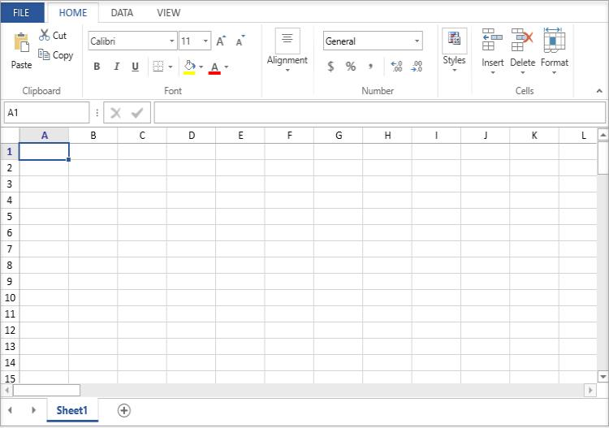

# Getting Started

This section helps you to get started with the SfSpreadsheet

## Assemblies Deployment

Below table describes, list of assemblies required to be added in project when the SfSpreadsheet control is used in your application.

<table>
<tr>
<th>
Assembly</th><th>
Description</th></tr>
<tr>
<td>
Syncfusion.SfCellGrid.WPF.dll</td><td>
Contains the base and fundamental classes which holds the underlying architecture for displaying cells with virtualized behavior and selection/interaction of cells.</td></tr>
<tr>
<td>
Syncfusion.SfGridCommon.WPF.dll</td><td>
Contains the classes which holds the properties and functions of scroll viewer and disposable elements</td></tr>
<tr>
<td>
Syncfusion.SfSpreadsheet.WPF.dll</td><td>
Contains the classes  that handles all the UI Operations of SfSpreadsheet such as importing of sheets, applying formulas/styles etc.</td></tr>
<tr>
<td>
Syncfusion.Shared.WPF.dll</td><td>
Contains the classes which holds the controls like Color pickers,Chromless window, ComboBoxAdv, DateTimeEdit etc.</td></tr>
<tr>
<td>
Syncfusion.Tools.WPF.dll</td><td>
Contains the classes which holds the controls like TabcontrolExt, TabItemExt, Gallery, GroupBar, TabSplitter etc which are used in SfSpreadsheet</td></tr>
<tr>
<td>
Syncfusion.XlsIO.Base.dll</td><td>
Contains the base classes which is responsible for read and write in Excel files, Worksheet Manipulations, Formula caculations etc.</td></tr>
</table>
Below are the assemblies list that can be added when you want to enable certain features in SfSpreadsheet control. 

<table>
<tr>
<th>
Optional Assemblies</th><th>
Description</th></tr>
<tr>
<td>
Syncfusion.SfSpreadsheetHelper.WPF.dll</td><td>
Contains the classes which is responsible for importing charts and sparklines into SfSpreadsheet</td></tr>
<tr>
<td>
Syncfusion.ExcelChartToImageConverter.WPF.dll</td><td>
Contains the classes which is responsible for converting charts as image</td></tr>
<tr>
<td>
Syncfusion.SfChart.WPF.dll</td><td>
Contains the classes which is responsible for importing charts like Line charts, Pie charts, Sparklines etc.</td></tr>
<tr>
<td>
Syncfusion.ExcelToPDFConverter.Base.dll</td><td>
Contains the base and fundamental classes which is responsible for converting excel to pdf.</td></tr>
<tr>
<td>
Syncfusion.Pdf.Base.dll</td><td>
Contains the base and fundamental classes for creating PDF.</td></tr>
</table>
 

## Create a Simple Application with SfSpreadsheet

SfSpreadsheet control can be added into the application either via designer or via coding. 
 

### Adding a Control via Designer

1.Create new WPF application in Visual Studio.

2.Open the Visual Studio **Tool** **box**. Navigate to “Syncfusion Controls” tab, and find the  SfSpreadsheet/SfSpreadsheetRibbon toolbox items 

Syncfusion Control tab
   {:.caption}

3.Drag **SfSpreadsheet** and drop in the Designer area from the Toolbox

_For_ _Spreadsheet_



    <syncfusion:SfSpreadsheet x:Name = spreadsheet />



4.Ribbon can be added to the application by dragging **SfSpreadsheetRibbon** to the Designer area.

5.To make an interaction between Ribbon items and SfSpreadsheet, bind the SfSpreadsheet as DataContext to the SfSpreadsheetRibbon.

_For_ _Ribbon_



    <syncfusion:SfSpreadsheetRibbon DataContext= "{Binding ElementName=spreadsheet}"  />
                                                                                                             


 

### Adding Control via Coding

Spreadsheet is available in the following namespace “_Syncfusion_._UI_._Xaml_._Spreadsheet_” and it can be created programmatically either by using XAML or C# code. 

_For_ _Spreadsheet_





    <Window x:Class="SpreadsheetDemo.MainWindow"

    xmlns="http://schemas.microsoft.com/winfx/2006/xaml/presentation"

    xmlns:x="http://schemas.microsoft.com/winfx/2006/xaml"

    xmlns:d="http://schemas.microsoft.com/expression/blend/2008"

    xmlns:mc="http://schemas.openxmlformats.org/markup- compatibility/2006"

    xmlns:syncfusion="http://schemas.syncfusion.com/wpf"

    syncfusion:SkinStorage.VisualStyle="Office2013"

    mc:Ignorable="d">

    <syncfusion:SfSpreadsheet x:Name="spreadsheet" FormulaBarVisibility="Visible"/>

    </Window>
    




    SfSpreadsheet spreadsheet = new SfSpreadsheet();

    this.grid.Children.Add(spreadsheet);





N> To add the SfSpreadsheetRibbon in your application, then use the **RibbonWindow** since the backstage of Ribbon will be opened only when the ribbon is loaded under the **RibbonWindow**



    <syncfusion:RibbonWindow x:Class="SpreadsheetDemo.MainWindow"

    xmlns="http://schemas.microsoft.com/winfx/2006/xaml/presentation"

    xmlns:x="http://schemas.microsoft.com/winfx/2006/xaml"

    xmlns:d="http://schemas.microsoft.com/expression/blend/2008"

    xmlns:mc="http://schemas.openxmlformats.org/markup-compatibility/2006"

    xmlns:syncfusion="http://schemas.syncfusion.com/wpf"

    syncfusion:SkinStorage.VisualStyle="Office2013"

    mc:Ignorable="d">

    </syncfusion:RibbonWindow>



_You_ _can_ _get_ _the_ _following_ _output_ _when_ _execute_ _the_ _application_.

 

## Creating a new Excel Workbook

A new workbook can be created by using a [Create](http://help.syncfusion.com/cr/cref_files/wpf/sfspreadsheet/topic6285.html) method of SfSpreadsheet. By default, a workbook will be created with single worksheet but a new workbook can also be created with specified number of worksheets.



    spreadsheet.Create(2);


 

## Opening the Existing Excel Workbook

The Excel Workbook can be opened in SfSpreadsheet using the [Open](http://help.syncfusion.com/cr/cref_files/wpf/sfspreadsheet/topic6297.html) method in various ways,



     //Using Stream,
 
      spreadsheet.Open (Stream file)

    //Using String,

      spreadsheet.Open (string file)

    //Using Workbook,

      spreadsheet.Open(IWorkbook workbook)
      




    spreadsheet.Open (@"..\..\Data\Outline.xlsx");



Opening Excel File in SfSpreadsheet
   {:.caption}
 

## Saving the Excel Workbook

The Excel workbook can be saved in SfSpreadsheet using [Save](http://help.syncfusion.com/cr/cref_files/wpf/sfspreadsheet/topic6307.html) method. If the workbook already exists in the system drive, it will be saved in the same location, otherwise Save Dialog box opens to save the workbook in user specified location. You can also use [SaveAs](http://help.syncfusion.com/cr/cref_files/wpf/sfspreadsheet/topic6308.html) method directly to save the existing excel file with modifications.



    spreadsheet.Save();


