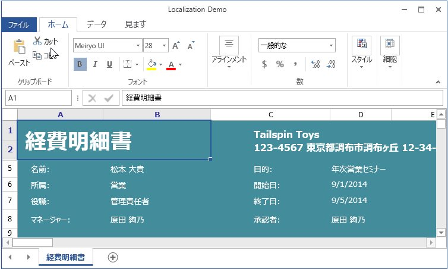

# Localization

SfSpreadsheet provides support to localize all the static text in a Ribbon and all dialogs to any desired language.

SfSpreadsheet allows you to set custom resource using Resx file. You can define your string values in resource file for a specific culture and set the culture in your application. The given string value will be set to the Spreadsheet.

The following steps show how to implement the localization,

* Create folder names as ‘Resources’ in your application, 
* Create Resx(resource) file and name it as Syncfusion.SfSpreadsheet.WPF.[Culture name].resx. For example, Syncfusion.SfSpreadsheet.WPF.ja.resx.
* Add default Resx (resource) file in the Resource folder named as Syncfusion.SfSpreadsheet.WPF.resx

To set the CultureInformation in the Application before the InitializeComponent() method is called. 

Setting of the culture information,




    System.Threading.Thread.CurrentThread.CurrentUICulture = new System.Globalization.CultureInfo("ja-JP");




Now, the Application is set to the Japanese Culture info. 

The following screenshot shows you the localization in SfSpreadsheet,

