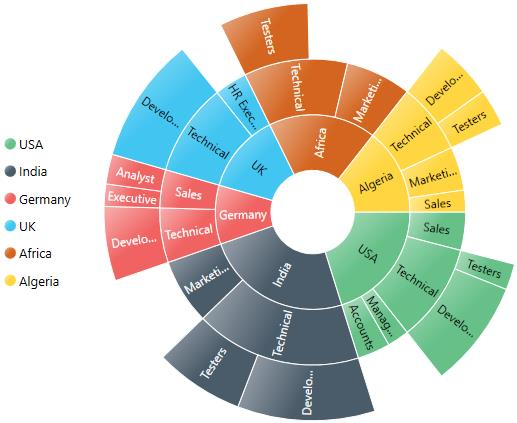
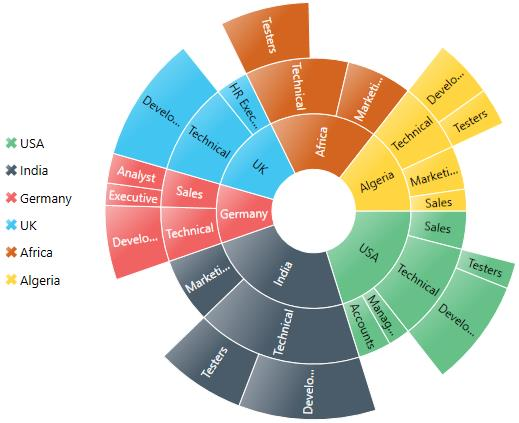
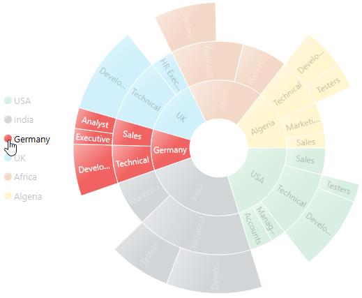
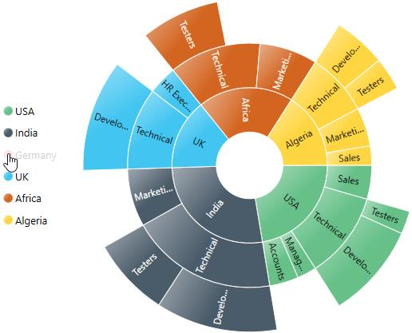

---

layout: post
title: Legend of Sunburst.
description:It is used to dispaly the information about the segment.
platform: wpf 
control: SfSunburstChart 
documentation: ug

---

# Legend

The Legend is used to represent the first level of categories in sunburst chart. 

You can initialize the legend as in the below code snippet:





 <sunburst:SfSunburstChart.Legend>

            <sunburst:SunburstLegend/>

</sunburst:SfSunburstChart.Legend>





SunburstLegend legend = new SunburstLegend();
chart.Legend = legend;





## Legend Icon

You can specify different shapes of legend icon by using the [`LegendIcon`](https://help.syncfusion.com/cr/cref_files/wpf/sfsunburstchart/Syncfusion.SfSunburstChart.WPF~Syncfusion.UI.Xaml.SunburstChart.SunburstLegend~LegendIcon.html) property. By default, legend icon is Circle. The Sunburst chart have some predefined shapes such as:

* Circle
* Cross
* Diamond
* Pentagon
* Rectangle
* Triangle





<sunburst:SfSunburstChart.Legend>

           <sunburst:SunburstLegend LegendIcon="Pentagon"/>

  </sunburst:SfSunburstChart.Legend>





SunburstLegend legend = new SunburstLegend()
{
       LegendIcon = SunburstLegendIcon.Pentagon
};
chart.Legend = legend;





The following properties are used to customize the legend icons size.

* [`IconHeight`](https://help.syncfusion.com/cr/cref_files/wpf/sfsunburstchart/Syncfusion.SfSunburstChart.WPF~Syncfusion.UI.Xaml.SunburstChart.SunburstLegend~IconHeight.html) – Gets or sets the double value to represents icon(s) height.
* [`IconWidth`](https://help.syncfusion.com/cr/cref_files/wpf/sfsunburstchart/Syncfusion.SfSunburstChart.WPF~Syncfusion.UI.Xaml.SunburstChart.SunburstLegend~IconWidth.html) – Gets or sets the double value to represents icon(s) width.

You can customize your own legend shape by applying custom template using [`LegendIconTemplate`](https://help.syncfusion.com/cr/cref_files/wpf/sfsunburstchart/Syncfusion.SfSunburstChart.WPF~Syncfusion.UI.Xaml.SunburstChart.SunburstLegend~LegendIconTemplate.html) property as shown in the below code. 



<sunburst:SfSunburstChart.Legend>

     <sunburst:SfSunburstChart.Legend  LegendIcon="Custom">

            <sunburst:SunburstLegend.LegendIconTemplate>

                        <DataTemplate>
                            <Path  Stroke="{Binding Stroke}" Stretch="Fill" Fill="{Binding Interior}"  
                            StrokeThickness="{Binding StrokeThickness}"
                            Data="F1 M 133.133,45.7109L 154.307,24.5363L 175.482,45.7109L 154.307,66.8856L 175.482,88.0603L 154.307,109.235L 133.133,88.0603L 111.958,109.235L 90.7835,88.0603L 111.958,66.8856L 90.7835,45.7109L 111.958,24.5363L 133.133,45.7109 Z " />
                        </DataTemplate>

            </sunburst:SunburstLegend.LegendIconTemplate>

      </sunburst:SfSunburstChart.Legend>

</sunburst:SfSunburstChart.Legend>



Note: You need to set [`LegendIcon`](https://help.syncfusion.com/cr/cref_files/wpf/sfsunburstchart/Syncfusion.SfSunburstChart.WPF~Syncfusion.UI.Xaml.SunburstChart.SunburstLegendIcon.html) value as Custom in order to apply custom template.

## Positioning the Legend

You can customize the position to left, right, top, bottom for the legend using [`DockPosition`](https://help.syncfusion.com/cr/cref_files/wpf/sfsunburstchart/Syncfusion.SfSunburstChart.WPF~Syncfusion.UI.Xaml.SunburstChart.SunburstLegend~DockPosition.html) property as like in below code snippet





<sunburst:SfSunburstChart.Legend>
                
          <sunburst:SunburstLegend DockPosition="Top" />
                
 </sunburst:SfSunburstChart.Legend>





SunburstLegend legend = new SunburstLegend()
{
       DockPosition =ChartDock.Top
};
chart.Legend = legend;





## Customize the Legend

You can arrange the legend items smartly by using ItemPanelTemplate and ItemTemplate property. The following code shows how to arrange the legend items smartly. 



<sunburst:SfSunburstChart.Legend>

         <sunburst:SunburstLegend  DockPosition="Top" Margin="0,25,0,0" >
                    
                  <sunburst:SunburstLegend.ItemsPanel>
                        <ItemsPanelTemplate>
                            <WrapPanel Height="100" Width="250" />
                        </ItemsPanelTemplate>
                   </sunburst:SunburstLegend.ItemsPanel>

                    <sunburst:SunburstLegend.ItemTemplate>

                        <ItemContainerTemplate>

                            <StackPanel Width="75" Height="30" Orientation="Horizontal">
                                <Ellipse Stroke="{Binding Interior}" StrokeThickness="2" Fill="White"
                                     Height="10" Width="10" Margin="5"/>
                                <TextBlock Text="{Binding Label}" HorizontalAlignment="Center"   VerticalAlignment="Center"/>
                            </StackPanel>
                        </ItemContainerTemplate>

                  </sunburst:SunburstLegend.ItemTemplate>
                    
                </sunburst:SunburstLegend>

            </sunburst:SfSunburstChart.Legend>



## Legend Interactivity

You can select a specific category while clicking on corresponding legend item through [`ClickAction`](https://help.syncfusion.com/cr/cref_files/wpf/sfsunburstchart/Syncfusion.SfSunburstChart.WPF~Syncfusion.UI.Xaml.SunburstChart.SunburstLegend~ClickAction.html) property. It has three types of action 

* ToggleSegmentSelection
* ToggleSegmentVisiblity
* None

### ToggleSegmentSelection

Used to highlight specific category while clicking on legend item. 





 <sunburst:SfSunburstChart.Legend>
                
           <sunburst:SunburstLegend ClickAction="ToggleSegmentSelection"/>

</sunburst:SfSunburstChart.Legend>





SunburstLegend legend = new SunburstLegend()
{
          ClickAction =LegendClickAction.ToggleSegmentSelection
};
chart.Legend = legend;





### ToggleSegmentVisibility

Used to disable the specific category while clicking on legend item. 





 <sunburst:SfSunburstChart.Legend>
                
              <sunburst:SunburstLegend ClickAction ="ToggleSegmentVisibility"/>

</sunburst:SfSunburstChart.Legend>





SunburstLegend legend = new SunburstLegend()
{
          ClickAction = LegendClickAction.ToggleSegmentVisibility
};
chart.Legend = legend;





