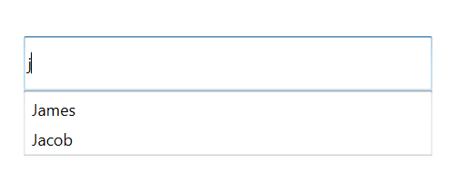
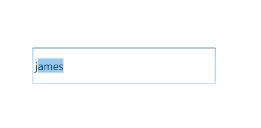
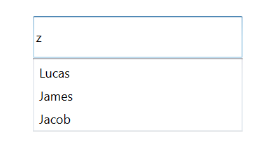
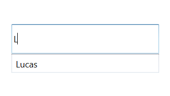
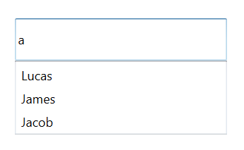
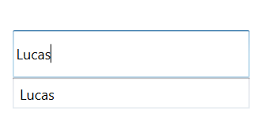
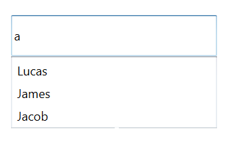
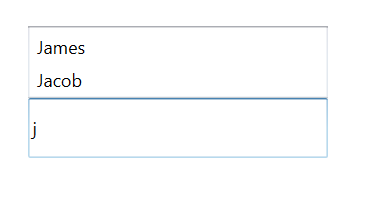

# AutoComplete

The AutoComplete functionality provides several modes of suggestions to users while typing. The suggested text can be appended to the original text, or it can be displayed in a drop-down list so that the users can choose from different options.

## AutoComplete source

The TextBoxExt control can be populated with a predefined list of items, which will assist the user while typing. Users can choose one item from the filtered list.

For illustration, let us create a textbox, which will populate a list of employees.

The Employee model looks as shown below:



public class Employee
{
   public string Name { get; set; }
   public string Email { get; set; }
}
	


Create a collection attribute,



 private List<Employee> employees;
 public List<Employee> Employees
 {
   get 
   { 
     return employees;
   }
   set 
   { 
     employees = value; 
   }
 }



Populate the collection with items,



Employees = new List<Employee>();
Employees.Add(new Employee{Name = "Lucas", Email = "lucas@syncfusion.com"});
Employees.Add(new Employee { Name = "James", Email = "james@syncfusion.com" });
Employees.Add(new Employee { Name = "Jacob", Email = "jacob@syncfusion.com" });



Bind the Employees collection to the AutoCompleteSource property of TextBoxExt.




<Window x:Class="AutoCompleteSample.MainWindow"
        xmlns="http://schemas.microsoft.com/winfx/2006/xaml/presentation"
        xmlns:x="http://schemas.microsoft.com/winfx/2006/xaml"
        xmlns:d="http://schemas.microsoft.com/expression/blend/2008"
        xmlns:mc="http://schemas.openxmlformats.org/markup-compatibility/2006"
        xmlns:local="clr-namespace:AutoCompleteSample"
        mc:Ignorable="d"
        xmlns:editors="clr-namespace:Syncfusion.Windows.Controls.Input;assembly=Syncfusion.SfInput.Wpf"
        Title="MainWindow" Height="450" Width="800">
    <Window.Content>
            <editors:SfTextBoxExt HorizontalAlignment="Center" 
                                  VerticalAlignment="Center"
                                  Width="400"
                                  AutoCompleteSource="{Binding Employees}" />
    </Window.Content>
</Window>




using Syncfusion.Windows.Controls.Input;
using System.Windows;

namespace SfDatePickerSample
{
    /// 

    /// Interaction logic for MainWindow.xaml
    /// 

    public partial class MainWindow : Window
    {
        public MainWindow()
        {
            SfTextBoxExt textBoxExt = new SfTextBoxExt()
            {
                HorizontalAlignment = HorizontalAlignment.Center,
                VerticalAlignment = VerticalAlignment.Center,
                Width = 400
            };

            this.Content = textBoxExt;
        } 
    }
}




At this point, the control is populated with the list of employees. But the Employee model contains two properties Name and Email so we should tell the control, by which property, it has to provide suggestions. In this case, let us make the control to provide suggestions based on Name.

SearchItemPath property specifies the property path by which the filtering has to be done.




<Window x:Class="AutoCompleteSample.MainWindow"
        xmlns="http://schemas.microsoft.com/winfx/2006/xaml/presentation"
        xmlns:x="http://schemas.microsoft.com/winfx/2006/xaml"
        xmlns:d="http://schemas.microsoft.com/expression/blend/2008"
        xmlns:mc="http://schemas.openxmlformats.org/markup-compatibility/2006"
        xmlns:local="clr-namespace:AutoCompleteSample"
        mc:Ignorable="d"
        xmlns:editors="clr-namespace:Syncfusion.Windows.Controls.Input;assembly=Syncfusion.SfInput.Wpf"
        Title="MainWindow" Height="450" Width="800">
    <Window.Content>
            <editors:SfTextBoxExt HorizontalAlignment="Center" 
                      VerticalAlignment="Center" 
                      Width="400"
                      SearchItemPath="Name"
                      AutoCompleteMode="Suggest"
                      AutoCompleteSource="{Binding Employees}" />
    </Window.Content>
</Window>




using Syncfusion.Windows.Controls.Input;
using System.Windows;

namespace SfDatePickerSample
{
    /// 

    /// Interaction logic for MainWindow.xaml
    /// 

    public partial class MainWindow : Window
    {
        public MainWindow()
        {
            SfTextBoxExt textBoxExt = new SfTextBoxExt()
            {
                HorizontalAlignment = HorizontalAlignment.Center,
                VerticalAlignment = VerticalAlignment.Center,
                SearchItemPath = "Name",
                AutoCompleteMode = AutoCompleteMode.Suggest,
                Width = 400
            };

            this.Content = textBoxExt;
        } 
    }
}




N> The default value of the AutoCompleteMode property is None. So, running the control without specifying this property will not show any suggestions. The detailed information about the AutoComplete modes will be provided in the next section.

## AutoComplete mode

The suggestions can be displayed in several ways. The TextBoxExt supports the following modes of AutoComplete:

* None
* Suggest
* Append
* SuggestAppend

The default value of AutoCompleteMode is None.

### Suggest

The filtered suggestions are displayed in a drop-down list. Users can pick an item from the list.




<Window x:Class="AutoCompleteSample.MainWindow"
        xmlns="http://schemas.microsoft.com/winfx/2006/xaml/presentation"
        xmlns:x="http://schemas.microsoft.com/winfx/2006/xaml"
        xmlns:d="http://schemas.microsoft.com/expression/blend/2008"
        xmlns:mc="http://schemas.openxmlformats.org/markup-compatibility/2006"
        xmlns:local="clr-namespace:AutoCompleteSample"
        mc:Ignorable="d"
        xmlns:editors="clr-namespace:Syncfusion.Windows.Controls.Input;assembly=Syncfusion.SfInput.Wpf"
        Title="MainWindow" Height="450" Width="800">
        <Window.Content>
           <editors:SfTextBoxExt HorizontalAlignment="Center" 
                                 VerticalAlignment="Center" 
                                 Width="400"
                                 SearchItemPath="Name"
                                 AutoCompleteMode="Suggest"
                                 AutoCompleteSource="{Binding Employees}" />
        </Window.Content>
</Window>




using Syncfusion.Windows.Controls.Input;
using System.Windows;

namespace SfDatePickerSample
{
    /// 

    /// Interaction logic for MainWindow.xaml
    /// 

    public partial class MainWindow : Window
    {
        public MainWindow()
        {
            SfTextBoxExt textBoxExt = new SfTextBoxExt()
            {
                HorizontalAlignment = HorizontalAlignment.Center,
                VerticalAlignment = VerticalAlignment.Center,
                SearchItemPath = "Name",
                AutoCompleteMode = AutoCompleteMode.Suggest,
                Width = 400
            };

            this.Content = textBoxExt;
        } 
    }
}




Filtered suggestions displayed in drop-down list
{:.caption}

### Append

The text will be appended to the first matched item in the suggestions collection without opening the drop-down list.




<Window x:Class="AutoCompleteSample.MainWindow"
        xmlns="http://schemas.microsoft.com/winfx/2006/xaml/presentation"
        xmlns:x="http://schemas.microsoft.com/winfx/2006/xaml"
        xmlns:d="http://schemas.microsoft.com/expression/blend/2008"
        xmlns:mc="http://schemas.openxmlformats.org/markup-compatibility/2006"
        xmlns:local="clr-namespace:AutoCompleteSample"
        mc:Ignorable="d"
        xmlns:editors="clr-namespace:Syncfusion.Windows.Controls.Input;assembly=Syncfusion.SfInput.Wpf"
        Title="MainWindow" Height="450" Width="800">
        <Window.Content>
            <editors:SfTextBoxExt HorizontalAlignment="Center" 
                                  VerticalAlignment="Center" 
                                  Width="400"
                                  SearchItemPath="Name"
                                  AutoCompleteMode="Append"
                                  AutoCompleteSource="{Binding Employees}" />
        </Window.Content>
</Window>




using Syncfusion.Windows.Controls.Input;
using System.Windows;

namespace SfDatePickerSample
{
    /// 

    /// Interaction logic for MainWindow.xaml
    /// 

    public partial class MainWindow : Window
    {
        public MainWindow()
        {
            SfTextBoxExt textBoxExt = new SfTextBoxExt()
            {
                HorizontalAlignment = HorizontalAlignment.Center,
                VerticalAlignment = VerticalAlignment.Center,
                SearchItemPath = "Name",
                AutoCompleteMode = AutoCompleteMode.Append,
                Width = 400
            };

            this.Content = textBoxExt;
        } 
    }
}




#### Append mode

N> By default the text will be appended to first matched item. But still user can browse to other items through up and down keys from keyboard.

### SuggestAppend

The text will be appended to the first matched item in the suggestions collection, in addition to opening the drop-down list.




<Window x:Class="AutoCompleteSample.MainWindow"
        xmlns="http://schemas.microsoft.com/winfx/2006/xaml/presentation"
        xmlns:x="http://schemas.microsoft.com/winfx/2006/xaml"
        xmlns:d="http://schemas.microsoft.com/expression/blend/2008"
        xmlns:mc="http://schemas.openxmlformats.org/markup-compatibility/2006"
        xmlns:local="clr-namespace:AutoCompleteSample"
        mc:Ignorable="d"
        xmlns:editors="clr-namespace:Syncfusion.Windows.Controls.Input;assembly=Syncfusion.SfInput.Wpf"
        Title="MainWindow" Height="450" Width="800">
        <Window.Content>
            <editors:SfTextBoxExt HorizontalAlignment="Center" 
                                  VerticalAlignment="Center" 
                                  Width="400"
                                  SearchItemPath="Name"
                                  AutoCompleteMode="SuggestAppend"
                                  AutoCompleteSource="{Binding Employees}" />
        </Window.Content>
</Window>




using Syncfusion.Windows.Controls.Input;
using System.Windows;

namespace SfDatePickerSample
{
    /// 

    /// Interaction logic for MainWindow.xaml
    /// 

    public partial class MainWindow : Window
    {
        public MainWindow()
        {
            SfTextBoxExt textBoxExt = new SfTextBoxExt()
            {
                HorizontalAlignment = HorizontalAlignment.Center,
                VerticalAlignment = VerticalAlignment.Center,
                SearchItemPath = "Name",
                AutoCompleteMode = AutoCompleteMode.SuggestAppend,
                Width = 400
            };

            this.Content = textBoxExt;
        } 
    }
}




SuggestAppend mode
{:.caption}

### None

This option neither appends text nor opens the drop-down list of suggestions. 

## AutoComplete Item Template

The AutoCompleteItemTemplate helps to decorate the suggested item with visual elements. The following code block explains how to add an image to the drop-down list item.




<Window x:Class="AutoCompleteSample.MainWindow"
        xmlns="http://schemas.microsoft.com/winfx/2006/xaml/presentation"
        xmlns:x="http://schemas.microsoft.com/winfx/2006/xaml"
        xmlns:d="http://schemas.microsoft.com/expression/blend/2008"
        xmlns:mc="http://schemas.openxmlformats.org/markup-compatibility/2006"
        xmlns:local="clr-namespace:AutoCompleteSample"
        mc:Ignorable="d"
        xmlns:editors="clr-namespace:Syncfusion.Windows.Controls.Input;assembly=Syncfusion.SfInput.Wpf"
        Title="MainWindow" Height="450" Width="800">
        <Window.Content>
               <editors:SfTextBoxExt HorizontalAlignment="Center" 
                                     VerticalAlignment="Center" 
                                     Width="400"
                                     SearchItemPath="Name"
                                     AutoCompleteMode="SuggestAppend"
                                     AutoCompleteSource="{Binding Employees}" >
                    <editors:SfTextBoxExt.AutoCompleteItemTemplate>
                        <DataTemplate>
                            <StackPanel Orientation="Horizontal">
                                <Image Source="User.png" Margin="2" Stretch="Uniform" Width="12"/>
                                <TextBlock Text="{Binding Name}" Margin="5 2"/>
                            </StackPanel>
                        </DataTemplate>
                    </editors:SfTextBoxExt.AutoCompleteItemTemplate>
                </editors:SfTextBoxExt>
        </Window.Content>
</Window>




using Syncfusion.Windows.Controls.Input;
using System.Windows;

namespace SfDatePickerSample
{
    /// 

    /// Interaction logic for MainWindow.xaml
    /// 

    public partial class MainWindow : Window
    {
        public MainWindow()
        {
            SfTextBoxExt textBoxExt = new SfTextBoxExt()
            {
                HorizontalAlignment = HorizontalAlignment.Center,
                VerticalAlignment = VerticalAlignment.Center,
                SearchItemPath = "Name",
                AutoCompleteMode = AutoCompleteMode.SuggestAppend,
                Width = 400
            };

            this.Content = textBoxExt;
        } 
    }
}




Drop down list with image
{:.caption}

## Filtering Customization

The way that the control filters the suggestions can be customized in several ways.

## Suggestion Mode

The property SuggestionMode helps to specify how to compare the string. It contains two built-in modes. 

1. None
2. StartsWith
3. StartsWithCaseSensitive
4. StartsWithOrdinal
5. StartsWithOrdinalCaseSensitive
6. Contains
7. ContainsCaseSensitive
8. ContainsOrdinal
9. ContainsOrdinalCaseSensitive
10. Equals
11. EqualsCaseSensitive
12. EqualsOrdinal
13. EqualsOrdinalCaseSensitive
14. Custom

The default value is StartsWith.

### None

The controls returns the entire collection without filtering when the user types text.




<Window x:Class="AutoCompleteSample.MainWindow"
        xmlns="http://schemas.microsoft.com/winfx/2006/xaml/presentation"
        xmlns:x="http://schemas.microsoft.com/winfx/2006/xaml"
        xmlns:d="http://schemas.microsoft.com/expression/blend/2008"
        xmlns:mc="http://schemas.openxmlformats.org/markup-compatibility/2006"
        xmlns:local="clr-namespace:AutoCompleteSample"
        mc:Ignorable="d"
        xmlns:editors="clr-namespace:Syncfusion.Windows.Controls.Input;assembly=Syncfusion.SfInput.Wpf"
        Title="MainWindow" Height="450" Width="800">
        <Window.Content>
                <editors:SfTextBoxExt HorizontalAlignment="Center" 
                                      VerticalAlignment="Center" 
                                      Width="400"
                                      SearchItemPath="Name"
                                      SuggestionMode="None"
                                      AutoCompleteMode="Suggest"
                                      AutoCompleteSource="{Binding Employees}"/>
        </Window.Content>
</Window>




using Syncfusion.Windows.Controls.Input;
using System.Windows;

namespace SfDatePickerSample
{
    /// 

    /// Interaction logic for MainWindow.xaml
    /// 

    public partial class MainWindow : Window
    {
        public MainWindow()
        {
            SfTextBoxExt textBoxExt = new SfTextBoxExt()
            {
                HorizontalAlignment = HorizontalAlignment.Center,
                VerticalAlignment = VerticalAlignment.Center,
                SearchItemPath = "Name",
                AutoCompleteMode = AutoCompleteMode.Suggest,
                SuggestionMode = SuggestionMode.None,
                Width = 400
            };

            this.Content = textBoxExt;
        } 
    }
}




 

None case
{:.caption}

### StartsWith

The control returns all possible matches which start with the text typed by the user.




<Window x:Class="AutoCompleteSample.MainWindow"
        xmlns="http://schemas.microsoft.com/winfx/2006/xaml/presentation"
        xmlns:x="http://schemas.microsoft.com/winfx/2006/xaml"
        xmlns:d="http://schemas.microsoft.com/expression/blend/2008"
        xmlns:mc="http://schemas.openxmlformats.org/markup-compatibility/2006"
        xmlns:local="clr-namespace:AutoCompleteSample"
        mc:Ignorable="d"
        xmlns:editors="clr-namespace:Syncfusion.Windows.Controls.Input;assembly=Syncfusion.SfInput.Wpf"
        Title="MainWindow" Height="450" Width="800">
        <Window.Content>
                <editors:SfTextBoxExt HorizontalAlignment="Center" 
                                      VerticalAlignment="Center" 
                                      Width="400"
                                      SearchItemPath="Name"
                                      SuggestionMode="StartsWith"
                                      AutoCompleteMode="Suggest"
                                      AutoCompleteSource="{Binding Employees}"/>
        </Window.Content>
</Window>




using Syncfusion.Windows.Controls.Input;
using System.Windows;

namespace SfDatePickerSample
{
    /// 

    /// Interaction logic for MainWindow.xaml
    /// 

    public partial class MainWindow : Window
    {
        public MainWindow()
        {
            SfTextBoxExt textBoxExt = new SfTextBoxExt()
            {
                HorizontalAlignment = HorizontalAlignment.Center,
                VerticalAlignment = VerticalAlignment.Center,
                SearchItemPath = "Name",
                AutoCompleteMode = AutoCompleteMode.Suggest,
                SuggestionMode = SuggestionMode.StartsWith,
                Width = 400
            };

            this.Content = textBoxExt;
        } 
    }
}




StartsWith case
{:.caption}

### StartsWithCaseSensitive

The control returns all possible matches which start with the text typed by the user which is culture and case sensitive.




<Window x:Class="AutoCompleteSample.MainWindow"
        xmlns="http://schemas.microsoft.com/winfx/2006/xaml/presentation"
        xmlns:x="http://schemas.microsoft.com/winfx/2006/xaml"
        xmlns:d="http://schemas.microsoft.com/expression/blend/2008"
        xmlns:mc="http://schemas.openxmlformats.org/markup-compatibility/2006"
        xmlns:local="clr-namespace:AutoCompleteSample"
        mc:Ignorable="d"
        xmlns:editors="clr-namespace:Syncfusion.Windows.Controls.Input;assembly=Syncfusion.SfInput.Wpf"
        Title="MainWindow" Height="450" Width="800">
        <Window.Content>
                <editors:SfTextBoxExt HorizontalAlignment="Center" 
                                      VerticalAlignment="Center" 
                                      Width="400"
                                      SearchItemPath="Name"
                                      SuggestionMode="StartsWithCaseSensitive"
                                      AutoCompleteMode="Suggest"
                                      AutoCompleteSource="{Binding Employees}"/>
        </Window.Content>
</Window>




using Syncfusion.Windows.Controls.Input;
using System.Windows;

namespace SfDatePickerSample
{
    /// 

    /// Interaction logic for MainWindow.xaml
    /// 

    public partial class MainWindow : Window
    {
        public MainWindow()
        {
            SfTextBoxExt textBoxExt = new SfTextBoxExt()
            {
                HorizontalAlignment = HorizontalAlignment.Center,
                VerticalAlignment = VerticalAlignment.Center,
                SearchItemPath = "Name",
                AutoCompleteMode = AutoCompleteMode.Suggest,
                SuggestionMode = SuggestionMode.StartsWithCaseSensitive,
                Width = 400
            };

            this.Content = textBoxExt;
        } 
    }
}




StartsWithCaseSensitive case
{:.caption}

### StartsWithOrdinal

The control returns all possible matches which start with the text typed by the user based on OrdinalIgnoreCase.




<Window x:Class="AutoCompleteSample.MainWindow"
        xmlns="http://schemas.microsoft.com/winfx/2006/xaml/presentation"
        xmlns:x="http://schemas.microsoft.com/winfx/2006/xaml"
        xmlns:d="http://schemas.microsoft.com/expression/blend/2008"
        xmlns:mc="http://schemas.openxmlformats.org/markup-compatibility/2006"
        xmlns:local="clr-namespace:AutoCompleteSample"
        mc:Ignorable="d"
        xmlns:editors="clr-namespace:Syncfusion.Windows.Controls.Input;assembly=Syncfusion.SfInput.Wpf"
        Title="MainWindow" Height="450" Width="800">
        <Window.Content>
                <editors:SfTextBoxExt HorizontalAlignment="Center" 
                                      VerticalAlignment="Center" 
                                      Width="400"
                                      SearchItemPath="Name"
                                      SuggestionMode="StartsWithOrdinal"
                                      AutoCompleteMode="Suggest"
                                      AutoCompleteSource="{Binding Employees}"/>
        </Window.Content>
</Window>




using Syncfusion.Windows.Controls.Input;
using System.Windows;

namespace SfDatePickerSample
{
    /// 

    /// Interaction logic for MainWindow.xaml
    /// 

    public partial class MainWindow : Window
    {
        public MainWindow()
        {
            SfTextBoxExt textBoxExt = new SfTextBoxExt()
            {
                HorizontalAlignment = HorizontalAlignment.Center,
                VerticalAlignment = VerticalAlignment.Center,
                SearchItemPath = "Name",
                AutoCompleteMode = AutoCompleteMode.Suggest,
                SuggestionMode = SuggestionMode.StartsWithOrdinal,
                Width = 400
            };

            this.Content = textBoxExt;
        } 
    }
}




StartsWithOrdinal case
{:.caption}

### StartsWithOrdinalCaseSensitive

The control returns all possible matches which start with the text typed by the user by Ordinal which is case sensitive.




<Window x:Class="AutoCompleteSample.MainWindow"
        xmlns="http://schemas.microsoft.com/winfx/2006/xaml/presentation"
        xmlns:x="http://schemas.microsoft.com/winfx/2006/xaml"
        xmlns:d="http://schemas.microsoft.com/expression/blend/2008"
        xmlns:mc="http://schemas.openxmlformats.org/markup-compatibility/2006"
        xmlns:local="clr-namespace:AutoCompleteSample"
        mc:Ignorable="d"
        xmlns:editors="clr-namespace:Syncfusion.Windows.Controls.Input;assembly=Syncfusion.SfInput.Wpf"
        Title="MainWindow" Height="450" Width="800">
        <Window.Content>
                <editors:SfTextBoxExt HorizontalAlignment="Center" 
                                      VerticalAlignment="Center" 
                                      Width="400"
                                      SearchItemPath="Name"
                                      SuggestionMode="StartsWithOrdinalCaseSensitive"
                                      AutoCompleteMode="Suggest"
                                      AutoCompleteSource="{Binding Employees}"/>
        </Window.Content>
</Window>




using Syncfusion.Windows.Controls.Input;
using System.Windows;

namespace SfDatePickerSample
{
    /// 

    /// Interaction logic for MainWindow.xaml
    /// 

    public partial class MainWindow : Window
    {
        public MainWindow()
        {
            SfTextBoxExt textBoxExt = new SfTextBoxExt()
            {
                HorizontalAlignment = HorizontalAlignment.Center,
                VerticalAlignment = VerticalAlignment.Center,
                SearchItemPath = "Name",
                AutoCompleteMode = AutoCompleteMode.Suggest,
                SuggestionMode = SuggestionMode.StartsWithOrdinalCaseSensitive,
                Width = 400
            };

            this.Content = textBoxExt;
        } 
    }
}




StartsWithOrdinalCaseSensitive case
{:.caption}

### Contains

The control return all possible matches which contains the text typed by the user.




<Window x:Class="AutoCompleteSample.MainWindow"
        xmlns="http://schemas.microsoft.com/winfx/2006/xaml/presentation"
        xmlns:x="http://schemas.microsoft.com/winfx/2006/xaml"
        xmlns:d="http://schemas.microsoft.com/expression/blend/2008"
        xmlns:mc="http://schemas.openxmlformats.org/markup-compatibility/2006"
        xmlns:local="clr-namespace:AutoCompleteSample"
        mc:Ignorable="d"
        xmlns:editors="clr-namespace:Syncfusion.Windows.Controls.Input;assembly=Syncfusion.SfInput.Wpf"
        Title="MainWindow" Height="450" Width="800">
        <Window.Content>
                <editors:SfTextBoxExt HorizontalAlignment="Center" 
                                      VerticalAlignment="Center" 
                                      Width="400"
                                      SearchItemPath="Name"
                                      SuggestionMode="Contains"
                                      AutoCompleteMode="Suggest"
                                      AutoCompleteSource="{Binding Employees}"/>
        </Window.Content>
</Window>




using Syncfusion.Windows.Controls.Input;
using System.Windows;

namespace SfDatePickerSample
{
    /// 

    /// Interaction logic for MainWindow.xaml
    /// 

    public partial class MainWindow : Window
    {
        public MainWindow()
        {
            SfTextBoxExt textBoxExt = new SfTextBoxExt()
            {
                HorizontalAlignment = HorizontalAlignment.Center,
                VerticalAlignment = VerticalAlignment.Center,
                SearchItemPath = "Name",
                AutoCompleteMode = AutoCompleteMode.Suggest,
                SuggestionMode = SuggestionMode.Contains,
                Width = 400
            };

            this.Content = textBoxExt;
        } 
    }
}




Contains case
{:.caption}

### ContainsCaseSensitive

The control return all possible matches which contains the text typed by the user which is culture and case sensitive.




<Window x:Class="AutoCompleteSample.MainWindow"
        xmlns="http://schemas.microsoft.com/winfx/2006/xaml/presentation"
        xmlns:x="http://schemas.microsoft.com/winfx/2006/xaml"
        xmlns:d="http://schemas.microsoft.com/expression/blend/2008"
        xmlns:mc="http://schemas.openxmlformats.org/markup-compatibility/2006"
        xmlns:local="clr-namespace:AutoCompleteSample"
        mc:Ignorable="d"
        xmlns:editors="clr-namespace:Syncfusion.Windows.Controls.Input;assembly=Syncfusion.SfInput.Wpf"
        Title="MainWindow" Height="450" Width="800">
        <Window.Content>
                <editors:SfTextBoxExt HorizontalAlignment="Center" 
                                      VerticalAlignment="Center" 
                                      Width="400"
                                      SearchItemPath="Name"
                                      SuggestionMode="ContainsCaseSensitive"
                                      AutoCompleteMode="Suggest"
                                      AutoCompleteSource="{Binding Employees}"/>
        </Window.Content>
</Window>




using Syncfusion.Windows.Controls.Input;
using System.Windows;

namespace SfDatePickerSample
{
    /// 

    /// Interaction logic for MainWindow.xaml
    /// 

    public partial class MainWindow : Window
    {
        public MainWindow()
        {
            SfTextBoxExt textBoxExt = new SfTextBoxExt()
            {
                HorizontalAlignment = HorizontalAlignment.Center,
                VerticalAlignment = VerticalAlignment.Center,
                SearchItemPath = "Name",
                AutoCompleteMode = AutoCompleteMode.Suggest,
                SuggestionMode = SuggestionMode.ContainsCaseSensitive,
                Width = 400
            };

            this.Content = textBoxExt;
        } 
    }
}




ContainsCaseSensitive case
{:.caption}

### ContainsOrdinal

The control return all possible matches which contains the text typed by the user based on OrdinalIgnoreCase.




<Window x:Class="AutoCompleteSample.MainWindow"
        xmlns="http://schemas.microsoft.com/winfx/2006/xaml/presentation"
        xmlns:x="http://schemas.microsoft.com/winfx/2006/xaml"
        xmlns:d="http://schemas.microsoft.com/expression/blend/2008"
        xmlns:mc="http://schemas.openxmlformats.org/markup-compatibility/2006"
        xmlns:local="clr-namespace:AutoCompleteSample"
        mc:Ignorable="d"
        xmlns:editors="clr-namespace:Syncfusion.Windows.Controls.Input;assembly=Syncfusion.SfInput.Wpf"
        Title="MainWindow" Height="450" Width="800">
        <Window.Content>
                <editors:SfTextBoxExt HorizontalAlignment="Center" 
                                      VerticalAlignment="Center" 
                                      Width="400"
                                      SearchItemPath="Name"
                                      SuggestionMode="ContainsOrdinal"
                                      AutoCompleteMode="Suggest"
                                      AutoCompleteSource="{Binding Employees}"/>
        </Window.Content>
</Window>




using Syncfusion.Windows.Controls.Input;
using System.Windows;

namespace SfDatePickerSample
{
    /// 

    /// Interaction logic for MainWindow.xaml
    /// 

    public partial class MainWindow : Window
    {
        public MainWindow()
        {
            SfTextBoxExt textBoxExt = new SfTextBoxExt()
            {
                HorizontalAlignment = HorizontalAlignment.Center,
                VerticalAlignment = VerticalAlignment.Center,
                SearchItemPath = "Name",
                AutoCompleteMode = AutoCompleteMode.Suggest,
                SuggestionMode = SuggestionMode.ContainsOrdinal,
                Width = 400
            };

            this.Content = textBoxExt;
        } 
    }
}




ContainsOrdinal case
{:.caption}

### ContainsOrdinalCaseSensitive

The control return all possible matches which contains the text typed by the user based on Ordinal which is case sensitive.




<Window x:Class="AutoCompleteSample.MainWindow"
        xmlns="http://schemas.microsoft.com/winfx/2006/xaml/presentation"
        xmlns:x="http://schemas.microsoft.com/winfx/2006/xaml"
        xmlns:d="http://schemas.microsoft.com/expression/blend/2008"
        xmlns:mc="http://schemas.openxmlformats.org/markup-compatibility/2006"
        xmlns:local="clr-namespace:AutoCompleteSample"
        mc:Ignorable="d"
        xmlns:editors="clr-namespace:Syncfusion.Windows.Controls.Input;assembly=Syncfusion.SfInput.Wpf"
        Title="MainWindow" Height="450" Width="800">
        <Window.Content>
                <editors:SfTextBoxExt HorizontalAlignment="Center" 
                                      VerticalAlignment="Center" 
                                      Width="400"
                                      SearchItemPath="Name"
                                      SuggestionMode="ContainsOrdinalCaseSensitive"
                                      AutoCompleteMode="Suggest"
                                      AutoCompleteSource="{Binding Employees}"/>
        </Window.Content>
</Window>




using Syncfusion.Windows.Controls.Input;
using System.Windows;

namespace SfDatePickerSample
{
    /// 

    /// Interaction logic for MainWindow.xaml
    /// 

    public partial class MainWindow : Window
    {
        public MainWindow()
        {
            SfTextBoxExt textBoxExt = new SfTextBoxExt()
            {
                HorizontalAlignment = HorizontalAlignment.Center,
                VerticalAlignment = VerticalAlignment.Center,
                SearchItemPath = "Name",
                AutoCompleteMode = AutoCompleteMode.Suggest,
                SuggestionMode = SuggestionMode.ContainsOrdinalCaseSensitive,
                Width = 400
            };

            this.Content = textBoxExt;
        } 
    }
}




ContainsOrdinalCaseSensitive
{:.caption}

### Equals

The control return all possible matches which equals the text typed by the user.




<Window x:Class="AutoCompleteSample.MainWindow"
        xmlns="http://schemas.microsoft.com/winfx/2006/xaml/presentation"
        xmlns:x="http://schemas.microsoft.com/winfx/2006/xaml"
        xmlns:d="http://schemas.microsoft.com/expression/blend/2008"
        xmlns:mc="http://schemas.openxmlformats.org/markup-compatibility/2006"
        xmlns:local="clr-namespace:AutoCompleteSample"
        mc:Ignorable="d"
        xmlns:editors="clr-namespace:Syncfusion.Windows.Controls.Input;assembly=Syncfusion.SfInput.Wpf"
        Title="MainWindow" Height="450" Width="800">
        <Window.Content>
                <editors:SfTextBoxExt HorizontalAlignment="Center" 
                                      VerticalAlignment="Center" 
                                      Width="400"
                                      SearchItemPath="Name"
                                      SuggestionMode="Equals"
                                      AutoCompleteMode="Suggest"
                                      AutoCompleteSource="{Binding Employees}"/>
        </Window.Content>
</Window>




using Syncfusion.Windows.Controls.Input;
using System.Windows;

namespace SfDatePickerSample
{
    /// 

    /// Interaction logic for MainWindow.xaml
    /// 

    public partial class MainWindow : Window
    {
        public MainWindow()
        {
            SfTextBoxExt textBoxExt = new SfTextBoxExt()
            {
                HorizontalAlignment = HorizontalAlignment.Center,
                VerticalAlignment = VerticalAlignment.Center,
                SearchItemPath = "Name",
                AutoCompleteMode = AutoCompleteMode.Suggest,
                SuggestionMode = SuggestionMode.Equals,
                Width = 400
            };

            this.Content = textBoxExt;
        } 
    }
}




Equals case
{:.caption}

### EqualsCaseSensitive

The control return all possible matches which equals the text typed by the user which is culture and case sensitive.




<Window x:Class="AutoCompleteSample.MainWindow"
        xmlns="http://schemas.microsoft.com/winfx/2006/xaml/presentation"
        xmlns:x="http://schemas.microsoft.com/winfx/2006/xaml"
        xmlns:d="http://schemas.microsoft.com/expression/blend/2008"
        xmlns:mc="http://schemas.openxmlformats.org/markup-compatibility/2006"
        xmlns:local="clr-namespace:AutoCompleteSample"
        mc:Ignorable="d"
        xmlns:editors="clr-namespace:Syncfusion.Windows.Controls.Input;assembly=Syncfusion.SfInput.Wpf"
        Title="MainWindow" Height="450" Width="800">
        <Window.Content>
                <editors:SfTextBoxExt HorizontalAlignment="Center" 
                                      VerticalAlignment="Center" 
                                      Width="400"
                                      SearchItemPath="Name"
                                      SuggestionMode="EqualsCaseSensitive"
                                      AutoCompleteMode="Suggest"
                                      AutoCompleteSource="{Binding Employees}"/>
        </Window.Content>
</Window>




using Syncfusion.Windows.Controls.Input;
using System.Windows;

namespace SfDatePickerSample
{
    /// 

    /// Interaction logic for MainWindow.xaml
    /// 

    public partial class MainWindow : Window
    {
        public MainWindow()
        {
            SfTextBoxExt textBoxExt = new SfTextBoxExt()
            {
                HorizontalAlignment = HorizontalAlignment.Center,
                VerticalAlignment = VerticalAlignment.Center,
                SearchItemPath = "Name",
                AutoCompleteMode = AutoCompleteMode.Suggest,
                SuggestionMode = SuggestionMode.EqualsCaseSensitive,
                Width = 400
            };

            this.Content = textBoxExt;
        } 
    }
}




EqualsCaseSensitive case
{:.caption}

### EqualsOrdinal

The control return all possible matches which equals the text typed by the user based on OrdinalIgnoreCase.




<Window x:Class="AutoCompleteSample.MainWindow"
        xmlns="http://schemas.microsoft.com/winfx/2006/xaml/presentation"
        xmlns:x="http://schemas.microsoft.com/winfx/2006/xaml"
        xmlns:d="http://schemas.microsoft.com/expression/blend/2008"
        xmlns:mc="http://schemas.openxmlformats.org/markup-compatibility/2006"
        xmlns:local="clr-namespace:AutoCompleteSample"
        mc:Ignorable="d"
        xmlns:editors="clr-namespace:Syncfusion.Windows.Controls.Input;assembly=Syncfusion.SfInput.Wpf"
        Title="MainWindow" Height="450" Width="800">
        <Window.Content>
                <editors:SfTextBoxExt HorizontalAlignment="Center" 
                                      VerticalAlignment="Center" 
                                      Width="400"
                                      SearchItemPath="Name"
                                      SuggestionMode="EqualsOrdinal"
                                      AutoCompleteMode="Suggest"
                                      AutoCompleteSource="{Binding Employees}"/>
        </Window.Content>
</Window>




using Syncfusion.Windows.Controls.Input;
using System.Windows;

namespace SfDatePickerSample
{
    /// 

    /// Interaction logic for MainWindow.xaml
    /// 

    public partial class MainWindow : Window
    {
        public MainWindow()
        {
            SfTextBoxExt textBoxExt = new SfTextBoxExt()
            {
                HorizontalAlignment = HorizontalAlignment.Center,
                VerticalAlignment = VerticalAlignment.Center,
                SearchItemPath = "Name",
                AutoCompleteMode = AutoCompleteMode.Suggest,
                SuggestionMode = SuggestionMode.EqualsOrdinal,
                Width = 400
            };

            this.Content = textBoxExt;
        } 
    }
}




EqualsOrdinal case
{:.caption}

### EqualsOrdinalCaseSensitive

The control return all possible matches which equals the text typed by the user based on Ordinal which is case sensitive.




<Window x:Class="AutoCompleteSample.MainWindow"
        xmlns="http://schemas.microsoft.com/winfx/2006/xaml/presentation"
        xmlns:x="http://schemas.microsoft.com/winfx/2006/xaml"
        xmlns:d="http://schemas.microsoft.com/expression/blend/2008"
        xmlns:mc="http://schemas.openxmlformats.org/markup-compatibility/2006"
        xmlns:local="clr-namespace:AutoCompleteSample"
        mc:Ignorable="d"
        xmlns:editors="clr-namespace:Syncfusion.Windows.Controls.Input;assembly=Syncfusion.SfInput.Wpf"
        Title="MainWindow" Height="450" Width="800">
        <Window.Content>
                <editors:SfTextBoxExt HorizontalAlignment="Center" 
                                      VerticalAlignment="Center" 
                                      Width="400"
                                      SearchItemPath="Name"
                                      SuggestionMode="EqualsOrdinalCaseSensitive"
                                      AutoCompleteMode="Suggest"
                                      AutoCompleteSource="{Binding Employees}"/>
        </Window.Content>
</Window>




using Syncfusion.Windows.Controls.Input;
using System.Windows;

namespace SfDatePickerSample
{
    /// 

    /// Interaction logic for MainWindow.xaml
    /// 

    public partial class MainWindow : Window
    {
        public MainWindow()
        {
            SfTextBoxExt textBoxExt = new SfTextBoxExt()
            {
                HorizontalAlignment = HorizontalAlignment.Center,
                VerticalAlignment = VerticalAlignment.Center,
                SearchItemPath = "Name",
                AutoCompleteMode = AutoCompleteMode.Suggest,
                SuggestionMode = SuggestionMode.EqualsOrdinalCaseSensitive,
                Width = 400
            };

            this.Content = textBoxExt;
        } 
    }
}




EqualsOrdinalCaseSensitive case
{:.caption}

### Custom

The control return all possible matches based on the Filter property. Filter is of type SuggestionPredicate. In the MyFilter method, filtration is done by checking whether the collection contains the typed text




<Window x:Class="AutoCompleteSample.MainWindow"
        xmlns="http://schemas.microsoft.com/winfx/2006/xaml/presentation"
        xmlns:x="http://schemas.microsoft.com/winfx/2006/xaml"
        xmlns:d="http://schemas.microsoft.com/expression/blend/2008"
        xmlns:mc="http://schemas.openxmlformats.org/markup-compatibility/2006"
        xmlns:local="clr-namespace:AutoCompleteSample"
        mc:Ignorable="d"
        xmlns:editors="clr-namespace:Syncfusion.Windows.Controls.Input;assembly=Syncfusion.SfInput.Wpf"
        Title="MainWindow" Height="450" Width="800">
        <Window.Content>
                <editors:SfTextBoxExt HorizontalAlignment="Center" 
                                      VerticalAlignment="Center" 
                                      Width="400"
                                      SearchItemPath="Name"
                                      SuggestionMode="Custom"
                                      AutoCompleteMode="Suggest"
                                      AutoCompleteSource="{Binding Employees}"/>
        </Window.Content>
</Window>


    
    
    public bool MyFilter(string search, object item)
    {
        Person model = item as Person;
        if (model != null)
        {
            if (model.Name.ToLower().Contains(search))
            {
              return true;
            }
            else
              return false;
        }
        else
        return false;

    }

[c#]

autoComplete.Filter = MyFilter;




Custom case
{:.caption}

N> Append mode always works only with StartsWith behavior. If the typed text is not the same as the start text of any items, it will not append anything even when the auto complete mode is set to Append or SuggestAppend.

### Ignore Case

This option allows the control to filter suggestions by ignoring the case. The default value is false.




<Window x:Class="AutoCompleteSample.MainWindow"
        xmlns="http://schemas.microsoft.com/winfx/2006/xaml/presentation"
        xmlns:x="http://schemas.microsoft.com/winfx/2006/xaml"
        xmlns:d="http://schemas.microsoft.com/expression/blend/2008"
        xmlns:mc="http://schemas.openxmlformats.org/markup-compatibility/2006"
        xmlns:local="clr-namespace:AutoCompleteSample"
        mc:Ignorable="d"
        xmlns:editors="clr-namespace:Syncfusion.Windows.Controls.Input;assembly=Syncfusion.SfInput.Wpf"
        Title="MainWindow" Height="450" Width="800">
        <Window.Content>
            <editors:SfTextBoxExt HorizontalAlignment="Center" 
                                  VerticalAlignment="Center" 
                                  Width="400"
                                  SearchItemPath="Name"
                                  IgnoreCase="True"
                                  AutoCompleteMode="Suggest"
                                  AutoCompleteSource="{Binding Employees}"/>
        </Window.Content>
</Window>




using Syncfusion.Windows.Controls.Input;
using System.Windows;

namespace SfDatePickerSample
{
    /// 

    /// Interaction logic for MainWindow.xaml
    /// 

    public partial class MainWindow : Window
    {
        public MainWindow()
        {
            SfTextBoxExt textBoxExt = new SfTextBoxExt()
            {
                HorizontalAlignment = HorizontalAlignment.Center,
                VerticalAlignment = VerticalAlignment.Center,
                SearchItemPath = "Name",
                AutoCompleteMode = AutoCompleteMode.Suggest,
                IgnoreCase = "True",
                Width = 400
            };

            this.Content = textBoxExt;
        } 
    }
}




Ignore Case
{:.caption}

### Minimum Prefix Length

The MinimumPrefixCharacters property allows the control to filter the typed text based on the number of characters.




<Window x:Class="AutoCompleteSample.MainWindow"
        xmlns="http://schemas.microsoft.com/winfx/2006/xaml/presentation"
        xmlns:x="http://schemas.microsoft.com/winfx/2006/xaml"
        xmlns:d="http://schemas.microsoft.com/expression/blend/2008"
        xmlns:mc="http://schemas.openxmlformats.org/markup-compatibility/2006"
        xmlns:local="clr-namespace:AutoCompleteSample"
        mc:Ignorable="d"
        xmlns:editors="clr-namespace:Syncfusion.Windows.Controls.Input;assembly=Syncfusion.SfInput.Wpf"
        Title="MainWindow" Height="450" Width="800">
        <Window.Content>
                <editors:SfTextBoxExt HorizontalAlignment="Center"
                                      VerticalAlignment="Center" 
                                      Width="400"
                                      SearchItemPath="Name"
                                      MinimumPrefixCharacters="2"
                                      AutoCompleteMode="Suggest"
                                      AutoCompleteSource="{Binding Employees}"/> 
       </Window.Content>
</Window>




using Syncfusion.Windows.Controls.Input;
using System.Windows;

namespace SfDatePickerSample
{
    /// 

    /// Interaction logic for MainWindow.xaml
    /// 

    public partial class MainWindow : Window
    {
        public MainWindow()
        {
            SfTextBoxExt textBoxExt = new SfTextBoxExt()
            {
                HorizontalAlignment = HorizontalAlignment.Center,
                VerticalAlignment = VerticalAlignment.Center,
                SearchItemPath = "Name",
                AutoCompleteMode = AutoCompleteMode.Suggest,
                MinimumPrefixCharacters = "2",
                Width = 400
            };

            this.Content = textBoxExt;
        } 
    }
}




Minimum Prefix Length case
{:.caption}

### Popup Delay

PopupDelay specifies the delay after which the suggestion popup should open. 




<Window x:Class="AutoCompleteSample.MainWindow"
        xmlns="http://schemas.microsoft.com/winfx/2006/xaml/presentation"
        xmlns:x="http://schemas.microsoft.com/winfx/2006/xaml"
        xmlns:d="http://schemas.microsoft.com/expression/blend/2008"
        xmlns:mc="http://schemas.openxmlformats.org/markup-compatibility/2006"
        xmlns:local="clr-namespace:AutoCompleteSample"
        mc:Ignorable="d"
        xmlns:editors="clr-namespace:Syncfusion.Windows.Controls.Input;assembly=Syncfusion.SfInput.Wpf"
        Title="MainWindow" Height="450" Width="800">
        <Window.Content>
            <editors:SfTextBoxExt HorizontalAlignment="Center" 
                                  VerticalAlignment="Center" 
                                  Width="400"
                                  SearchItemPath="Name"
                                  PopupDelay="00:00:02"
                                  AutoCompleteMode="Suggest"
                                  AutoCompleteSource="{Binding Employees}"/>
        </Window.Content>
</Window>




using Syncfusion.Windows.Controls.Input;
using System.Windows;

namespace SfDatePickerSample
{
    /// 

    /// Interaction logic for MainWindow.xaml
    /// 

    public partial class MainWindow : Window
    {
        public MainWindow()
        {
            SfTextBoxExt textBoxExt = new SfTextBoxExt()
            {
                HorizontalAlignment = HorizontalAlignment.Center,
                VerticalAlignment = VerticalAlignment.Center,
                SearchItemPath = "Name",
                AutoCompleteMode = AutoCompleteMode.Suggest,
                PopupDelay="00:00:02",
                Width = 400
            };

            this.Content = textBoxExt;
        } 
    }
}




### Positioning the Popup

The SuggestionBoxPlacement property defines the position of Popup relative to the control. It contains three built-in options,

1. Top
2. Bottom
3. None

The default value is bottom.

#### Top

The drop-down list will open at top of the control.




<Window x:Class="AutoCompleteSample.MainWindow"
        xmlns="http://schemas.microsoft.com/winfx/2006/xaml/presentation"
        xmlns:x="http://schemas.microsoft.com/winfx/2006/xaml"
        xmlns:d="http://schemas.microsoft.com/expression/blend/2008"
        xmlns:mc="http://schemas.openxmlformats.org/markup-compatibility/2006"
        xmlns:local="clr-namespace:AutoCompleteSample"
        mc:Ignorable="d"
        xmlns:editors="clr-namespace:Syncfusion.Windows.Controls.Input;assembly=Syncfusion.SfInput.Wpf"
        Title="MainWindow" Height="450" Width="800">
        <Window.Content>
            <editors:SfTextBoxExt HorizontalAlignment="Center"
                                  VerticalAlignment="Center"
                                  Width="400"
                                  SearchItemPath="Name"
                                  SuggestionBoxPlacement="Top"
                                  AutoCompleteMode="Suggest"
                                  AutoCompleteSource="{Binding Employees}"/>
        </Window.Content>
</Window>




using Syncfusion.Windows.Controls.Input;
using System.Windows;

namespace SfDatePickerSample
{
    /// 

    /// Interaction logic for MainWindow.xaml
    /// 

    public partial class MainWindow : Window
    {
        public MainWindow()
        {
            SfTextBoxExt textBoxExt = new SfTextBoxExt()
            {
                HorizontalAlignment = HorizontalAlignment.Center,
                VerticalAlignment = VerticalAlignment.Center,
                SearchItemPath = "Name",
                AutoCompleteMode = AutoCompleteMode.Suggest,
                SuggestionBoxPlacement = SuggestionBoxPlacement.Top,
                Width = 400
            };

            this.Content = textBoxExt;
        } 
    }
}




Drop down list opening at the top
{:.caption}

#### Bottom

The drop-down list will open at bottom of the control.




<Window x:Class="AutoCompleteSample.MainWindow"
        xmlns="http://schemas.microsoft.com/winfx/2006/xaml/presentation"
        xmlns:x="http://schemas.microsoft.com/winfx/2006/xaml"
        xmlns:d="http://schemas.microsoft.com/expression/blend/2008"
        xmlns:mc="http://schemas.openxmlformats.org/markup-compatibility/2006"
        xmlns:local="clr-namespace:AutoCompleteSample"
        mc:Ignorable="d"
        xmlns:editors="clr-namespace:Syncfusion.Windows.Controls.Input;assembly=Syncfusion.SfInput.Wpf"
        Title="MainWindow" Height="450" Width="800">
        <Window.Content>
            <editors:SfTextBoxExt HorizontalAlignment="Center" 
                                  VerticalAlignment="Center"
                                  Width="400"
                                  SearchItemPath="Name"
                                  SuggestionBoxPlacement="Bottom"
                                  AutoCompleteMode="Suggest"
                                  AutoCompleteSource="{Binding Employees}"/>
        </Window.Content>
</Window>




using Syncfusion.Windows.Controls.Input;
using System.Windows;

namespace SfDatePickerSample
{
    /// 

    /// Interaction logic for MainWindow.xaml
    /// 

    public partial class MainWindow : Window
    {
        public MainWindow()
        {
            SfTextBoxExt textBoxExt = new SfTextBoxExt()
            {
                HorizontalAlignment = HorizontalAlignment.Center,
                VerticalAlignment = VerticalAlignment.Center,
                SearchItemPath = "Name",
                AutoCompleteMode = AutoCompleteMode.Suggest,
                SuggestionBoxPlacement = SuggestionBoxPlacement.Bottom,
                Width = 400
            };

            this.Content = textBoxExt;
        } 
    }
}




Drop down list opening at the bottom
{:.caption}

#### None

The drop-down list will not open.




<Window x:Class="AutoCompleteSample.MainWindow"
        xmlns="http://schemas.microsoft.com/winfx/2006/xaml/presentation"
        xmlns:x="http://schemas.microsoft.com/winfx/2006/xaml"
        xmlns:d="http://schemas.microsoft.com/expression/blend/2008"
        xmlns:mc="http://schemas.openxmlformats.org/markup-compatibility/2006"
        xmlns:local="clr-namespace:AutoCompleteSample"
        mc:Ignorable="d"
        xmlns:editors="clr-namespace:Syncfusion.Windows.Controls.Input;assembly=Syncfusion.SfInput.Wpf"
        Title="MainWindow" Height="450" Width="800">
        <Window.Content>
            <editors:SfTextBoxExt HorizontalAlignment="Center" 
                                  VerticalAlignment="Center" 
                                  Width="400"
                                  SearchItemPath="Name"
                                  SuggestionBoxPlacement="None"
                                  AutoCompleteMode="Suggest"
                                  AutoCompleteSource="{Binding Employees}"/>
        </Window.Content>
</Window>




using Syncfusion.Windows.Controls.Input;
using System.Windows;

namespace SfDatePickerSample
{
    /// 

    /// Interaction logic for MainWindow.xaml
    /// 

    public partial class MainWindow : Window
    {
        public MainWindow()
        {
            SfTextBoxExt textBoxExt = new SfTextBoxExt()
            {
                HorizontalAlignment = HorizontalAlignment.Center,
                VerticalAlignment = VerticalAlignment.Center,
                SearchItemPath = "Name",
                AutoCompleteMode = AutoCompleteMode.Suggest,
                SuggestionBoxPlacement = SuggestionBoxPlacement.None,
                Width = 400
            };

            this.Content = textBoxExt;
        } 
    }
}




No drop down list
{:.caption}