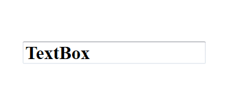

# Customizing AutoComplete

AutoComplete provides user-friendly customizing options for both text box and drop-down. This section explains how to customize the entire AutoComplete control.

## Customizing the text box

The `Text`, `FontSize`, `FontWeight`, and `FontFamily` properties are used to customize the text box.





<Window x:Class="AutoCompleteSample.MainWindow"
        xmlns="http://schemas.microsoft.com/winfx/2006/xaml/presentation"
        xmlns:x="http://schemas.microsoft.com/winfx/2006/xaml"
        xmlns:d="http://schemas.microsoft.com/expression/blend/2008"
        xmlns:mc="http://schemas.openxmlformats.org/markup-compatibility/2006"
        xmlns:local="clr-namespace:AutoCompleteSample"
        mc:Ignorable="d"
        xmlns:editors="clr-namespace:Syncfusion.Windows.Controls.Input;assembly=Syncfusion.SfInput.Wpf"
        Title="MainWindow" Height="450" Width="800">
    <Window.Content>
        <Grid>
            <editors:SfTextBoxExt x:Name="textBoxExt" 
                              Text="TextBox"
                              FontSize="20"
                              FontWeight="Bold"
                              FontFamily="Times New Roman"
                              HorizontalAlignment="Center" 
                              VerticalAlignment="Center" 
                              Width="200">
            </editors:SfTextBoxExt>
        </Grid>
    </Window.Content>
</Window>





using Syncfusion.Windows.Controls.Input;
using System.Windows;
using System.Windows.Media;

namespace AutoCompleteSample
{
    /// 

    /// Interaction logic for MainWindow.xaml
    /// 

    public partial class MainWindow : Window
    {
        public MainWindow()
        {
            InitializeComponent();
            SfTextBoxExt textBoxExt = new SfTextBoxExt()
            {
                Text = "TextBox",
                FontSize = 20,
                FontWeight = FontWeights.Bold,
                FontFamily = new FontFamily("Time New Roman"),
                HorizontalAlignment = HorizontalAlignment.Center,
                VerticalAlignment = VerticalAlignment.Center,
                Width = 200
            };

            this.Content = textBoxExt;
        }
    }
}





## Customizing the suggestion box

### Changing the background color of suggestion box

The `DropDownBackground` property is used to modify the background color of suggestion box. The following code example demonstrates how to change the background color of suggestion box.





<Window x:Class="AutoCompleteSample.MainWindow"
        xmlns="http://schemas.microsoft.com/winfx/2006/xaml/presentation"
        xmlns:x="http://schemas.microsoft.com/winfx/2006/xaml"
        xmlns:d="http://schemas.microsoft.com/expression/blend/2008"
        xmlns:mc="http://schemas.openxmlformats.org/markup-compatibility/2006"
        xmlns:local="clr-namespace:AutoCompleteSample"
        mc:Ignorable="d"
        xmlns:editors="clr-namespace:Syncfusion.Windows.Controls.Input;assembly=Syncfusion.SfInput.Wpf"
        Title="MainWindow" Height="450" Width="800">
    <Window.Content>
    <Grid>
        <editors:SfTextBoxExt x:Name="textBoxExt" 
                              HorizontalAlignment="Center" 
                              VerticalAlignment="Center" 
                              AutoCompleteMode="Suggest"
                              DropDownBackground="AliceBlue"
                              Width="300"/>
    </Grid>
    </Window.Content>
</Window>





using Syncfusion.Windows.Controls.Input;
using System.Collections.Generic;
using System.Windows;
using System.Windows.Media;

namespace AutoCompleteSample
{
    /// 

    /// Interaction logic for MainWindow.xaml
    /// 

    public partial class MainWindow : Window
    {
        public MainWindow()
        {
            InitializeComponent();
            SfTextBoxExt textBoxExt = new SfTextBoxExt()
            {
                HorizontalAlignment = HorizontalAlignment.Center,
                VerticalAlignment = VerticalAlignment.Center,
                Width = 200,
                AutoCompleteMode = AutoCompleteMode.Suggest,
                DropDownBackground = new SolidColorBrush(Colors.AliceBlue)
            };

            List<string> list = new List<string>()
            {
                 "India",
                 "Uganda",
                 "Ukraine",
                 "Canada",
                 "United Arab Emirates"
            };

            textBoxExt.AutoCompleteSource = list;
            this.Content = textBoxExt;
        }
    }
}





