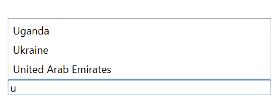
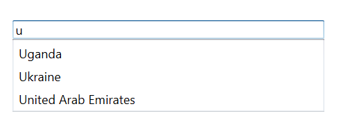
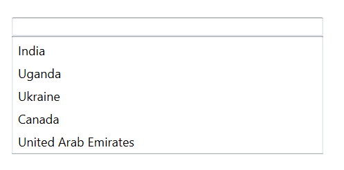

# Dealing with suggestion box

Suggestion box is a drop-down list box that displays the filtered suggestions inside a popup. This section explains the properties that deal with drop-down list in the AutoComplete control.

## Suggestion box placement mode

The suggestion box can be placed either at the top or bottom using the `SuggestionBoxPlacement` property. By default, it is placed at the bottom.





<Window x:Class="AutoCompleteSample.MainWindow"
        xmlns="http://schemas.microsoft.com/winfx/2006/xaml/presentation"
        xmlns:x="http://schemas.microsoft.com/winfx/2006/xaml"
        xmlns:d="http://schemas.microsoft.com/expression/blend/2008"
        xmlns:mc="http://schemas.openxmlformats.org/markup-compatibility/2006"
        xmlns:local="clr-namespace:AutoCompleteSample"
        mc:Ignorable="d"
        xmlns:editors="clr-namespace:Syncfusion.Windows.Controls.Input;assembly=Syncfusion.SfInput.Wpf"
        Title="MainWindow" Height="450" Width="800">
    <Window.Content>
    <Grid>
        <editors:SfTextBoxExt x:Name="textBoxExt" 
                              HorizontalAlignment="Center" 
                              VerticalAlignment="Center" 
                              AutoCompleteMode="Suggest"
                              SuggestionBoxPlacement="Top"
                              Width="300"/>
    </Grid>
    </Window.Content>
</Window>





using Syncfusion.Windows.Controls.Input;
using System.Collections.Generic;
using System.Windows;
using System.Windows.Media;

namespace AutoCompleteSample
{
    /// 

    /// Interaction logic for MainWindow.xaml
    /// 

    public partial class MainWindow : Window
    {
        public MainWindow()
        {
            InitializeComponent();
            SfTextBoxExt textBoxExt = new SfTextBoxExt()
            {
                HorizontalAlignment = HorizontalAlignment.Center,
                VerticalAlignment = VerticalAlignment.Center,
                Width = 200,
                AutoCompleteMode = AutoCompleteMode.Suggest,
                SuggestionBoxPlacement = SuggestionBoxPlacement.Top
            };

            List<string> list = new List<string>()
            {
                 "India",
                 "Uganda",
                 "Ukraine",
                 "Canada",
                 "United Arab Emirates"
            };

            textBoxExt.AutoCompleteSource = list;
            this.Content = textBoxExt;
        }
    }
}





## Maximum suggestion box height

The maximum height of the suggestion box in the SfAutocomplete control can be changed using the `MaximumDropDownHeight` property.





<Window x:Class="AutoCompleteSample.MainWindow"
        xmlns="http://schemas.microsoft.com/winfx/2006/xaml/presentation"
        xmlns:x="http://schemas.microsoft.com/winfx/2006/xaml"
        xmlns:d="http://schemas.microsoft.com/expression/blend/2008"
        xmlns:mc="http://schemas.openxmlformats.org/markup-compatibility/2006"
        xmlns:local="clr-namespace:AutoCompleteSample"
        mc:Ignorable="d"
        xmlns:editors="clr-namespace:Syncfusion.Windows.Controls.Input;assembly=Syncfusion.SfInput.Wpf"
        Title="MainWindow" Height="450" Width="800">
    <Window.Content>
    <Grid>
        <editors:SfTextBoxExt x:Name="textBoxExt" 
                              HorizontalAlignment="Center" 
                              VerticalAlignment="Center" 
                              AutoCompleteMode="Suggest"
                              MaxDropDownHeight="500"
                              Width="300"/>
    </Grid>
    </Window.Content>
</Window>





using Syncfusion.Windows.Controls.Input;
using System.Collections.Generic;
using System.Windows;
using System.Windows.Media;

namespace AutoCompleteSample
{
    /// 

    /// Interaction logic for MainWindow.xaml
    /// 

    public partial class MainWindow : Window
    {
        public MainWindow()
        {
            InitializeComponent();
            SfTextBoxExt textBoxExt = new SfTextBoxExt()
            {
                HorizontalAlignment = HorizontalAlignment.Center,
                VerticalAlignment = VerticalAlignment.Center,
                Width = 200,
                AutoCompleteMode = AutoCompleteMode.Suggest,
                MaxDropDownHeight = 500
            };

            List<string> list = new List<string>()
            {
                 "India",
                 "Uganda",
                 "Ukraine",
                 "Canada",
                 "United Arab Emirates"
            };

            textBoxExt.AutoCompleteSource = list;
            this.Content = textBoxExt;
        }
    }
}





## Opening suggestion box on focus

Suggestion box can be shown whenever the control receives focus using the `ShowSuggestionsOnFocus` property. At that time, suggestion list is the complete list of data source.





<Window x:Class="AutoCompleteSample.MainWindow"
        xmlns="http://schemas.microsoft.com/winfx/2006/xaml/presentation"
        xmlns:x="http://schemas.microsoft.com/winfx/2006/xaml"
        xmlns:d="http://schemas.microsoft.com/expression/blend/2008"
        xmlns:mc="http://schemas.openxmlformats.org/markup-compatibility/2006"
        xmlns:local="clr-namespace:AutoCompleteSample"
        mc:Ignorable="d"
        xmlns:editors="clr-namespace:Syncfusion.Windows.Controls.Input;assembly=Syncfusion.SfInput.Wpf"
        Title="MainWindow" Height="450" Width="800">
    <Window.Content>
    <Grid>
        <editors:SfTextBoxExt x:Name="textBoxExt" 
                              HorizontalAlignment="Center" 
                              VerticalAlignment="Center" 
                              AutoCompleteMode="Suggest"
                              ShowSuggestionsOnFocus="True"
                              Width="300"/>
    </Grid>
    </Window.Content>
</Window>





using Syncfusion.Windows.Controls.Input;
using System.Collections.Generic;
using System.Windows;
using System.Windows.Media;

namespace AutoCompleteSample
{
    /// 

    /// Interaction logic for MainWindow.xaml
    /// 

    public partial class MainWindow : Window
    {
        public MainWindow()
        {
            InitializeComponent();
            SfTextBoxExt textBoxExt = new SfTextBoxExt()
            {
                HorizontalAlignment = HorizontalAlignment.Center,
                VerticalAlignment = VerticalAlignment.Center,
                Width = 200,
                AutoCompleteMode = AutoCompleteMode.Suggest,
                ShowSuggestionsOnFocus = true
            };

            List<string> list = new List<string>()
            {
                 "India",
                 "Uganda",
                 "Ukraine",
                 "Canada",
                 "United Arab Emirates"
            };

            textBoxExt.AutoCompleteSource = list;
            this.Content = textBoxExt;
        }
    }
}





## Avoid opening suggestion box

The APIs are available to avoid popups. By setting the `SuggestionBoxPlacement` API to None, you can avoid opening suggestion box.





<Window x:Class="AutoCompleteSample.MainWindow"
        xmlns="http://schemas.microsoft.com/winfx/2006/xaml/presentation"
        xmlns:x="http://schemas.microsoft.com/winfx/2006/xaml"
        xmlns:d="http://schemas.microsoft.com/expression/blend/2008"
        xmlns:mc="http://schemas.openxmlformats.org/markup-compatibility/2006"
        xmlns:local="clr-namespace:AutoCompleteSample"
        mc:Ignorable="d"
        xmlns:editors="clr-namespace:Syncfusion.Windows.Controls.Input;assembly=Syncfusion.SfInput.Wpf"
        Title="MainWindow" Height="450" Width="800">
    <Window.Content>
    <Grid>
        <editors:SfTextBoxExt x:Name="textBoxExt" 
                              HorizontalAlignment="Center" 
                              VerticalAlignment="Center" 
                              AutoCompleteMode="Suggest"
                              SuggestionBoxPlacement="None"
                              Width="300"/>
    </Grid>
    </Window.Content>
</Window>





using Syncfusion.Windows.Controls.Input;
using System.Collections.Generic;
using System.Windows;
using System.Windows.Media;

namespace AutoCompleteSample
{
    /// 

    /// Interaction logic for MainWindow.xaml
    /// 

    public partial class MainWindow : Window
    {
        public MainWindow()
        {
            InitializeComponent();
            SfTextBoxExt textBoxExt = new SfTextBoxExt()
            {
                HorizontalAlignment = HorizontalAlignment.Center,
                VerticalAlignment = VerticalAlignment.Center,
                Width = 200,
                AutoCompleteMode = AutoCompleteMode.Suggest,
                SuggestionBoxPlacement = SuggestionBoxPlacement.None
            };

            List<string> list = new List<string>()
            {
                 "India",
                 "Uganda",
                 "Ukraine",
                 "Canada",
                 "United Arab Emirates"
            };

            textBoxExt.AutoCompleteSource = list;
            this.Content = textBoxExt;
        }
    }
}




