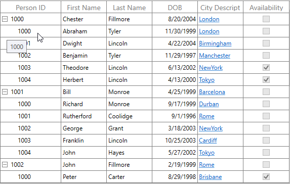
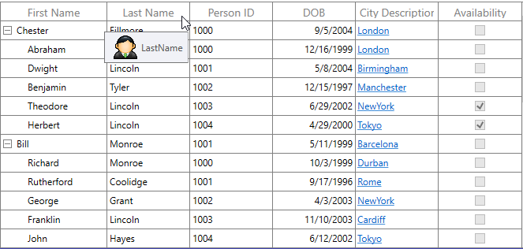

# Interactive Feature

## ToolTip

SfTreeGrid provides support to display tooltip for record and header cells when hover the cells.

### Record Cell ToopTip

You can enable or disable default tooltip for record cells by setting [SfTreeGrid.ShowToolTip](https://help.syncfusion.com/cr/cref_files/wpf/sfdatagrid/Syncfusion.SfGrid.WPF~Syncfusion.UI.Xaml.Grid.GridColumnBase~ShowToolTipProperty.html) as `true`.




<syncfusion:SfTreeGrid Name="treeGrid" 
                        AutoExpandMode="RootNodesExpanded"
                        AutoGenerateColumns="False"
                        ShowToolTip="True"
                        ChildPropertyName="Children"    ItemsSource="{Binding EmployeeDetails}">	




this.treeGrid.ShowToolTip = true;




You can enable the tooltip for the particular column by setting the [TreeGridColumn.ShowToolTip](https://help.syncfusion.com/cr/cref_files/wpf/sfdatagrid/Syncfusion.SfGrid.WPF~Syncfusion.UI.Xaml.TreeGrid.TreeGridColumn_properties.html) as `true`.




<syncfusion:TreeGridTextColumn HeaderText="First Name" MappingName="FirstName" ShowToolTip="True" />
<syncfusion:TreeGridTextColumn HeaderText="Last Name" MappingName="LastName" ShowToolTip="True" />	




this.treeGrid.Columns["FirstName"].ShowToolTip = true;
this.treeGrid.Columns["LastName"].ShowToolTip = true;




N> It takes higher priority than `SfTreeGrid.ShowToolTip`.

### Header ToolTip

You can enable the tooltip for the header cell by setting the [TreeGridColumn.ShowHeaderToolTip](https://help.syncfusion.com/cr/cref_files/wpf/sfdatagrid/Syncfusion.SfGrid.WPF~Syncfusion.UI.Xaml.Grid.GridColumnBase~ShowHeaderToolTip.html) as `true`.




<syncfusion:SfTreeGrid.Columns>
    <syncfusion:TreeGridTextColumn HeaderText="First Name" MappingName="FirstName" ShowHeaderToolTip="True" />
</syncfusion:SfTreeGrid.Columns>




this.treeGrid.Columns["FirstName"].ShowHeaderToolTip = true;




## Custom ToopTip

### Cell ToopTip

You can customize the appearance of the tooltip for particular column by setting [TreeGridColumn.ToolTipTemplate](http://help.syncfusion.com/cr/cref_files/wpf/sfdatagrid/Syncfusion.SfGrid.WPF~Syncfusion.UI.Xaml.Grid.GridColumnBase~ToolTipTemplate.html). `ToolTipTemplate` receives underlying data object as DataContext.




<Window.Resources>
    <local:StringToImageConverter x:Key="ImageConverter" />
    <DataTemplate x:Key="TemplateToolTip">
        <Grid>
            <Grid.RowDefinitions>
                <RowDefinition Height="*"/>
                <RowDefinition Height="*"/>
            </Grid.RowDefinitions>
            <Image Height="100" Width="100" Source="{Binding LastName,Converter={StaticResource ImageConverter}}" />
            <TextBlock Grid.Row="1" Text="{Binding LastName}" HorizontalAlignment="Center"/>
        </Grid>
    </DataTemplate>
</Window.Resources>

<syncfusion:SfTreeGrid.Columns>    
    <syncfusion:TreeGridTextColumn HeaderText="Last Name" MappingName="LastName" ToolTipTemplate="{StaticResource TemplateToolTip}" ShowToolTip="True" />
</syncfusion:SfTreeGrid.Columns>




public class StringToImageConverter : IValueConverter
{
    public object Convert(object value, Type targetType, object parameter, System.Globalization.CultureInfo culture)
    {
        string imagename = value.ToString();
        return @"..\..\Assets\" + imagename + @".png";
    }

    public object ConvertBack(object value, Type targetType, object parameter, System.Globalization.CultureInfo culture)
    {
        return value;
    }
}




You can get the sample from [here](http://www.syncfusion.com/downloads/support/directtrac/general/ze/ToolTipTemplateDemo-1415306479.zip).

### Header ToolTip

You can customize the appearance of header tooltip for particular column by [TreeGridColumn.HeaderToolTipTemplate](http://help.syncfusion.com/cr/cref_files/wpf/sfdatagrid/Syncfusion.SfGrid.WPF~Syncfusion.UI.Xaml.Grid.GridColumnBase~HeaderToolTipTemplate.html) property. `ToolTipTemplate` receives underlying data object as DataContext.




<Window.Resources>
    <local:StringToImageConverter x:Key="ImageConverter" />
    <DataTemplate x:Key="headerToolTipTemplate">
        <Grid>
            <Grid.ColumnDefinitions>
                <ColumnDefinition Width="*"/>
                <ColumnDefinition Width="*"/>
            </Grid.ColumnDefinitions>
            <Image Height="30" Width="40" Source="\Assets\heading.png" />
            <TextBlock Grid.Column="1" Text="LastName" VerticalAlignment="Center"/>
        </Grid>
    </DataTemplate>
</Window.Resources>

<syncfusion:SfTreeGrid.Columns>
    <syncfusion:TreeGridTextColumn HeaderText="Last Name" MappingName="LastName"  HeaderToolTipTemplate="{StaticResource headerToolTipTemplate}" ShowHeaderToolTip="True" />
</syncfusion:SfTreeGrid.Columns>
	



## ToolTip Customization

You can customize the template selector of tooltip by using the 
[TreeGridColumn.ToolTipTemplateSelector](http://help.syncfusion.com/cr/cref_files/wpf/sfdatagrid/Syncfusion.SfGrid.WPF~Syncfusion.UI.Xaml.Grid.GridColumnBase~ToolTipTemplateSelector.html) properties. 

The different tooltip template can be loaded in a same column conditionally based on data by setting `TreeGridColumn.ToolTipTemplateSelector`. `ToolTipTemplateSelector` receives underlying data object as DataContext.




<Window.Resources>
    <DataTemplate x:Key="ToolTip1">
        <Grid>
            <Rectangle Fill="Transparent"/>
            <TextBlock Text="{Binding Id}" FontWeight="Bold" Background="LightPink"/>
        </Grid>
    </DataTemplate>
    <DataTemplate x:Key="ToolTip2">
        <Grid>
            <Rectangle Fill="Transparent"/>
            <TextBlock Text="{Binding Id}" FontStyle="Italic" Background="LightGreen"/>
        </Grid>
    </DataTemplate>
</Window.Resources>

<syncfusion:SfTreeGrid.Columns>
    <syncfusion:TreeGridTextColumn HeaderText="Person ID" MappingName="Id" ShowToolTip="True" >
        <syncfusion:TreeGridTextColumn.ToolTipTemplateSelector>
            <local:ToolTipTemplateSelector AlternateTemplate="{StaticResource ToolTip2}" 
                                                DefaultTemplate="{StaticResource ToolTip1}" />
        </syncfusion:TreeGridTextColumn.ToolTipTemplateSelector>
    </syncfusion:TreeGridTextColumn>
</syncfusion:SfTreeGrid.Columns>




public class ToolTipTemplateSelector : DataTemplateSelector
{
    private DataTemplate _defaultTemplate;

    /// 

    /// Gets or sets DefaultTemplate.
    /// 

    public DataTemplate DefaultTemplate
    {
        get { return _defaultTemplate; }
        set { _defaultTemplate = value; }
    }

    private DataTemplate _alternateTemplate;

    /// 

    /// Gets or Sets AlternateTemplate.
    /// 

    public DataTemplate AlternateTemplate
    {
        get { return _alternateTemplate; }
        set { _alternateTemplate = value; }
    }

    public override System.Windows.DataTemplate SelectTemplate(object item, System.Windows.DependencyObject container)
    {
        //The item that comes from ToolTipTemplate is DataContextHelper. When set SetCellBoundValue to true, it sets DataContextHelper as DataContext to DataTemplate. Refer property section of CellTemplate.
        Employee dataUnit = item as Employee;
        if (dataUnit == null) return this.DefaultTemplate;
        //use reflection to retrieve property
        Type type = dataUnit.GetType();
        PropertyInfo property = type.GetProperty("Id");
        //To see what template needs to be select according to the specified property value.
        if (property.GetValue(dataUnit, null).ToString().Contains("111") || property.GetValue(dataUnit, null).ToString().Contains("333"))
            return this.AlternateTemplate;
        else
            return this.DefaultTemplate;
    }
}




The below image refers the DefaultTemplate which is applied through ToolTipTemplateSelector.

The below image refers the AlternateTemplate which is applied through ToolTipTemplateSelector.

You can get the sample from [here](http://www.syncfusion.com/downloads/support/directtrac/general/ze/ToolTipTemplateSelectorDemo1292485348.zip).

## Events

### ToolTipOpening Event

`ToolTipOpening` event occurs when any cell tooltip of an element is open.



<syncfusion:SfTreeGrid Name="treeGrid"  
                        AutoExpandMode="RootNodesExpanded" 
                        ToolTipOpening="TreeGrid_ToolTipOpening"
                        AutoGenerateColumns="False"
                        ChildPropertyName="Children"
                        ColumnSizer="Star"
                        ExpanderColumn="Id"
                        ItemsSource="{Binding PersonDetails}">


this.treeGrid.ToolTipOpening += TreeGrid_ToolTipOpening;

private void TreeGrid_ToolTipOpening(object sender, System.Windows.Controls.ToolTipEventArgs e)
{
            
}



### ToolTipClosing Event

`ToolTipClosing` event occurs just before any cell tooltip on the element is closed.



<syncfusion:SfTreeGrid Name="treeGrid"  
                        AutoExpandMode="RootNodesExpanded" 
                        ToolTipClosing="TreeGrid_ToolTipClosing"
                        AutoGenerateColumns="False"
                        ChildPropertyName="Children"
                        ColumnSizer="Star"
                        ExpanderColumn="Id"
                        ItemsSource="{Binding PersonDetails}">


this.treeGrid.ToolTipClosing += TreeGrid_ToolTipClosing;

private void TreeGrid_ToolTipClosing(object sender, System.Windows.Controls.ToolTipEventArgs e)
{
          
}



### CellToolTipOpening Event

[CellToolTipOpening](https://help.syncfusion.com/cr/cref_files/wpf/sfdatagrid/Syncfusion.SfGrid.WPF~Syncfusion.UI.Xaml.TreeGrid.SfTreeGrid~CellToolTipOpening_EV.html) event occurs when hover the cell in the SfTreeGrid.

<ul>
<li> Column: Gets the Column of hovered cell in the SfTreeGrid.</li>
<li> Node: Gets the Node of hovered cell.</li>
<li> Record: Gets the data context of hovered cell.</li>
<li> RowColumnIndex: Gets the Row,Column index of hovered cell.</li>
<li> ToolTip: Gets the tooltip of hovered cells</li>
</ul>



<syncfusion:SfTreeGrid Name="treeGrid"  
                        AutoExpandMode="RootNodesExpanded" 
                        CellToolTipOpening="TreeGrid_CellToolTipOpening"
                        AutoGenerateColumns="False"
                        ChildPropertyName="Children"
                        ColumnSizer="Star"
                        ExpanderColumn="Id"
                        ItemsSource="{Binding PersonDetails}">


this.treeGrid.CellToolTipOpening += TreeGrid_CellToolTipOpening;

private void TreeGrid_CellToolTipOpening(object sender, Syncfusion.UI.Xaml.TreeGrid.TreeGridCellToolTipOpeningEventArgs e)
{
           
}



## Showing ToolTip for Empty Cells

To show the tooltip for empty cells by handling the loaded event of the content loading into the tooltip template.  In the below code, the loaded event of the TextBlock is handled and the parent Tooltip, is found by using the FindAncestor method. When the TextBlock.Text is empty, then set the ToolTip.IsOpen to true and set the text for TextBlock to show the tooltip for cell.




<syncfusion:SfTreeGrid.Columns>
    <syncfusion:TreeGridTextColumn MappingName="Id" />
    <syncfusion:TreeGridTextColumn HeaderText="First Name" MappingName="FirstName" ShowToolTip="True">
        <syncfusion:TreeGridTextColumn.ToolTipTemplate>
            <DataTemplate>
                <local:ToolTipExt Text="{Binding Path=FirstName}" />
            </DataTemplate>
        </syncfusion:TreeGridTextColumn.ToolTipTemplate>
    </syncfusion:TreeGridTextColumn>    
</syncfusion:SfTreeGrid.Columns>



using Microsoft.VisualStudio.PlatformUI;

public class ToolTipExt : TextBlock
{
    public ToolTipExt()
    {
        this.Loaded += TextBlockExt_Loaded;
    }
    void TextBlockExt_Loaded(object sender, RoutedEventArgs e)
    {
        if (!string.IsNullOrEmpty(this.Text))
            return;
        var tooltip = this.FindAncestor<ToolTip>();
        if (IsVisible)
        {
            this.Text = "Cell value as empty";
            tooltip.IsOpen = true;                
        }
    }
}



