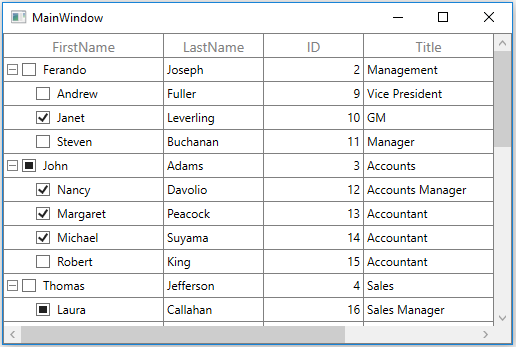
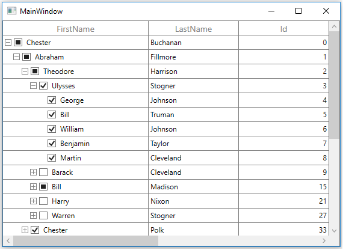
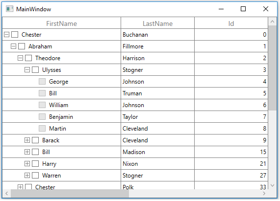
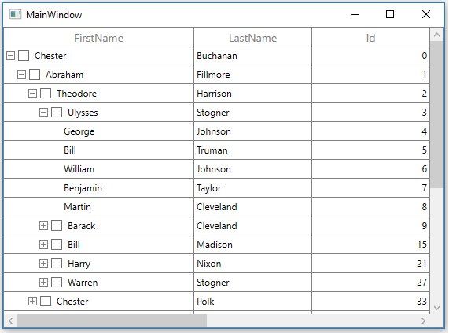
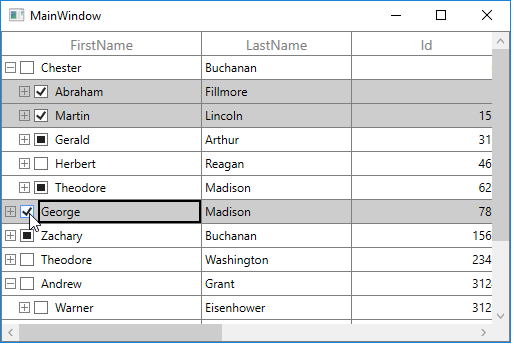
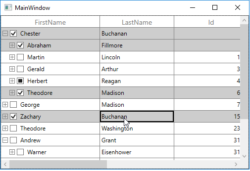

# Node Checkbox

SfTreeGrid provides support for loading `CheckBox` in the expander cell of each node, which allows the user to check/uncheck the corresponding node. You can display check box in each node by setting [SfTreeGrid.ShowCheckBox](https://help.syncfusion.com/cr/cref_files/uwp/sfdatagrid/frlrfSyncfusionUIXamlTreeGridSfTreeGridClassShowCheckBoxTopic.html) property as `true`. It also provides support to process the selection in the context of state of the checkbox based on [SfTreeGrid.CheckBoxSelectionMode](https://help.syncfusion.com/cr/cref_files/uwp/sfdatagrid/frlrfSyncfusionUIXamlTreeGridSfTreeGridClassCheckBoxSelectionModeTopic.html) property.



<syncfusion:SfTreeGrid Name="treeGrid"
                       ChildPropertyName="Children"
                       ItemsSource="{Binding PersonDetails}"
                       CheckBoxSelectionMode="Default"
                       ShowCheckBox="True"/>


treeGrid.ShowCheckBox = true;
treeGrid.CheckBoxSelectionMode = CheckBoxSelectionMode.Default;



## Indeterminate State Support

You can enable or disable the indeterminate state for node CheckBox using [SfTreeGrid.AllowTriStateChecking](https://help.syncfusion.com/cr/cref_files/uwp/sfdatagrid/frlrfSyncfusionUIXamlTreeGridSfTreeGridClassAllowTriStateCheckingTopic.html) property.



<syncfusion:SfTreeGrid Name="treeGrid"
                       AllowTriStateChecking="True"
                       ChildPropertyName="Children"
                       ItemsSource="{Binding PersonDetails}"
                       ShowCheckBox="True"/>


treeGrid.AllowTriStateChecking = true;



## Recursive Checking

SfTreeGrid provides support for recursive checking where the checked state of parent node and child nodes is changed recursively based on the state of currently changed node. You can enable recursive checking by setting [SfTreeGrid.EnableRecuriveChecking](https://help.syncfusion.com/cr/cref_files/uwp/sfdatagrid/frlrfSyncfusionUIXamlTreeGridSfTreeGridClassEnableRecuriveCheckingTopic.html) property as `true`.

* A tree node will be checked only if all its child nodes are checked.
* A tree node will be unchecked if all its child nodes are unchecked. 
* The tree node will be in Indeterminate state in other combinations of its children.



<syncfusion:SfTreeGrid Name="treeGrid"
                       EnableRecuriveChecking="True"
                       ChildPropertyName="Children"
                       ItemsSource="{Binding PersonDetails}"
                       ShowCheckBox="True"/>


treeGrid.EnableRecuriveChecking = true;



N> Even though [SfTreeGrid.AllowTriStateChecking](https://help.syncfusion.com/cr/cref_files/uwp/sfdatagrid/frlrfSyncfusionUIXamlTreeGridSfTreeGridClassAllowTriStateCheckingTopic.html) is `false` if [SfTreeGrid.EnableRecuriveChecking](https://help.syncfusion.com/cr/cref_files/uwp/sfdatagrid/frlrfSyncfusionUIXamlTreeGridSfTreeGridClassEnableRecuriveCheckingTopic.html) is `true`, CheckBox can be in indeterminate state.

## Saving and loading Node CheckBox state from the property in data object

You can bind state of node checkbox to the bool property in underlying data object by using [SfTreeGrid.CheckBoxMappingName](https://help.syncfusion.com/cr/cref_files/uwp/sfdatagrid/frlrfSyncfusionUIXamlTreeGridSfTreeGridClassCheckBoxMappingNameTopic.html) property. TreeGrid updates the checked state of checkbox when underlying data object property gets changed and vice versa.



<syncfusion:SfTreeGrid Name="treeGrid"
                       CheckBoxMappingName="IsSelected"
                       ChildPropertyName="Children"
                       ItemsSource="{Binding PersonDetails}"
                       ShowCheckBox="True"/>


treeGrid.CheckBoxMappingName = "IsSelected";



### Disable Recursive Checking when data object property changed

By default, recursive checking will be applied, whenever node’s `IsChecked` property gets changed. You can disable the recursive checking on property value change (which is mapped with `CheckBoxMappingName`) by setting [SfTreeGrid.RecursiveCheckingMode](https://help.syncfusion.com/cr/cref_files/uwp/sfdatagrid/frlrfSyncfusionUIXamlTreeGridSfTreeGridClassRecursiveCheckingModeTopic.html) as `OnCheck`.



<syncfusion:SfTreeGrid Name="treeGrid"
                       EnableRecuriveChecking="True"
                       ChildPropertyName="Children"
                       RecursiveCheckingMode="OnCheck"
                       ItemsSource="{Binding PersonDetails}"
                       ShowCheckBox="True"/>


treeGrid.RecursiveCheckingMode = RecursiveCheckingMode.OnCheck;



## Disabling CheckBox for certain nodes

You can disable CheckBox by writing style for [TreeGridExpanderCell](https://help.syncfusion.com/cr/cref_files/uwp/sfdatagrid/frlrfSyncfusionUIXamlTreeGridTreeGridExpanderCellClassTopic.html) and setting [IsCheckBoxEnabled](https://help.syncfusion.com/cr/cref_files/uwp/sfdatagrid/frlrfSyncfusionUIXamlTreeGridTreeGridExpanderCellClassIsCheckBoxEnabledTopic.html) property as ‘false’







In the below screenshot, node CheckBox is disabled for leaf nodes.

## Collapsing CheckBox for certain nodes

You can collapse node CheckBox for certain nodes by editing the control template of [TreeGridExpanderCell](https://help.syncfusion.com/cr/cref_files/uwp/sfdatagrid/frlrfSyncfusionUIXamlTreeGridTreeGridExpanderCellClassTopic.html) and changing the Checkbox visibility based on condition.



<Window.Resources>
        <ResourceDictionary>
            <ResourceDictionary.MergedDictionaries>
                <ResourceDictionary Source="/Syncfusion.SfGrid.WPF;component/Control/Themes/Generic.xaml" />
            </ResourceDictionary.MergedDictionaries>
            <local:BoolToVisiblityConverter x:Key="boolToVisiblityConverter" />
            
        </ResourceDictionary>
</Window.Resources>


public class BoolToVisiblityConverter : IValueConverter
{
    public object Convert(object value, Type targetType, object parameter, System.Globalization.CultureInfo culture)
    {
        if ((bool)value)
            return Visibility.Visible;
        return Visibility.Collapsed;
    }

    public object ConvertBack(object value, Type targetType, object parameter, System.Globalization.CultureInfo culture)
    {
        if ((Visibility)value == Visibility.Visible)
            return true;
        return false;
    }
}



Here, node CheckBox is collapsed for leaf nodes.

## Handling Selection based on CheckBox State

SfTreeGrid has following modes for processing selection based on check box state.

1. Default – Selection and state of checkbox works independent of each other.
2. SelectOnCheck – Row can be selected or deselected based on state of checkbox.
3. SynchronizeSelection – Row can be selected or deselected based on state of checkbox and vice versa.

**Default mode**

If you don’t want to affect the selection while checking/unchecking the node CheckBox, you need to set [SfTreeGrid.CheckBoxSelectionMode](https://help.syncfusion.com/cr/cref_files/uwp/sfdatagrid/frlrfSyncfusionUIXamlTreeGridSfTreeGridClassCheckBoxSelectionModeTopic.html) as `Default`.



<syncfusion:SfTreeGrid Name="treeGrid"
                       CheckBoxSelectionMode="Default"
                       ItemsSource="{Binding PersonDetails}"
                       ShowCheckBox="True"/>





treeGrid.CheckBoxSelectionMode = CheckBoxSelectionMode.Default;



**SelectOnCheck**

If you want to select/deselect the rows using node CheckBox only, you need to set [SfTreeGrid. CheckBoxSelectionMode](https://help.syncfusion.com/cr/cref_files/uwp/sfdatagrid/frlrfSyncfusionUIXamlTreeGridSfTreeGridClassCheckBoxSelectionModeTopic.html) as `SelectOnCheck`. 
Navigation, editing and programmatic selection are not supported in this mode.



<syncfusion:SfTreeGrid Name="treeGrid"
                       CheckBoxSelectionMode="SelectOnCheck"
                       ItemsSource="{Binding PersonDetails}"
                       ShowCheckBox="True"/>



treeGrid.CheckBoxSelectionMode = CheckBoxSelectionMode.SelectOnCheck;



**SynchronizeSelection**

If you want to synchronize the selection with node CheckBox’s IsChecked state, you need to set [SfTreeGrid.CheckBoxSelectionMode](https://help.syncfusion.com/cr/cref_files/uwp/sfdatagrid/frlrfSyncfusionUIXamlTreeGridSfTreeGridClassCheckBoxSelectionModeTopic.html) as `SynchronizeSelection`. In this mode, you can select by checking checkbox and selecting/deselecting the row will check/uncheck the corresponding node checkbox.



<syncfusion:SfTreeGrid Name="treeGrid"
                       CheckBoxSelectionMode="SynchronizeSelection"
                       ItemsSource="{Binding PersonDetails}"
                       ShowCheckBox="True"/>



treeGrid.CheckBoxSelectionMode = CheckBoxSelectionMode.SynchronizeSelection;



N>
* Recursive checking is not supported when selection mode is single.
* CheckBox selection is not supported if selection mode in None.

## Events

### NodeCheckStateChanged

[NodeCheckStateChanged](https://help.syncfusion.com/cr/cref_files/uwp/sfdatagrid/frlrfSyncfusionUIXamlTreeGridSfTreeGridClassNodeCheckStateChangedTopic.html) event triggered when user check or uncheck the node check box.



treeGrid.NodeCheckStateChanged += TreeGrid_NodeCheckStateChanged;

private void TreeGrid_NodeCheckStateChanged(object sender, NodeCheckStateChangedEventArgs e)
{
    var node = e.Node;
}



## Programmatically Processing Node CheckBox

You can change the state of node checkbox programmatically by calling [SetCheckedState](https://help.syncfusion.com/cr/cref_files/uwp/sfdatagrid/frlrfSyncfusionUIXamlTreeGridTreeNodeClassSetCheckedStateTopic.html) method as below,



var treeNode = treeGrid.View.Nodes[0];
treeNode.SetCheckedState(true);



If you want to restrict the `IsChecked` update of the parent and child nodes (when [SfTreeGrid.EnableRecuriveChecking](https://help.syncfusion.com/cr/cref_files/uwp/sfdatagrid/frlrfSyncfusionUIXamlTreeGridSfTreeGridClassEnableRecuriveCheckingTopic.html) is `true`), you can pass default parameter values as `false` in [SetCheckedState](https://help.syncfusion.com/cr/cref_files/uwp/sfdatagrid/frlrfSyncfusionUIXamlTreeGridTreeNodeClassSetCheckedStateTopic.html) method.



var treeNode = treeGrid.View.Nodes[0];
treeNode.SetCheckedState(true, false, false);



## Getting Checked nodes

You can get the checked nodes collection using [GetCheckedNodes](https://help.syncfusion.com/cr/cref_files/uwp/sfdatagrid/frlrfSyncfusionUIXamlTreeGridSfTreeGridClassGetCheckedNodesTopic.html) method.



var nodes = treeGrid.GetCheckedNodes();



If you want to get all the checked nodes even though they are not in view, you can pass parameter as ‘true’ in `GetCheckedNodes` method.



var nodes = treeGrid.GetCheckedNodes(true);


