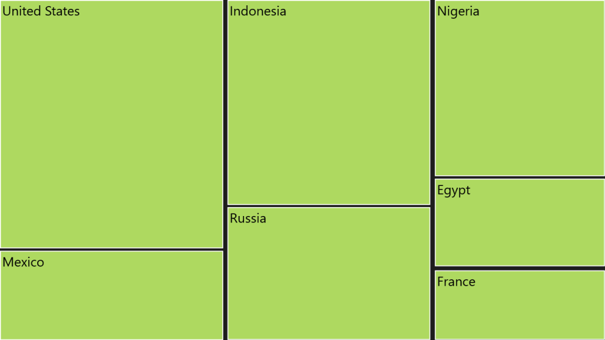
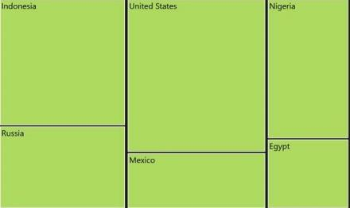
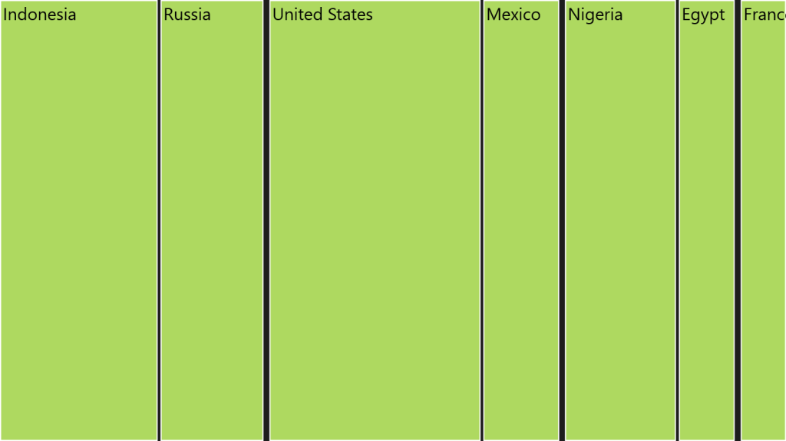
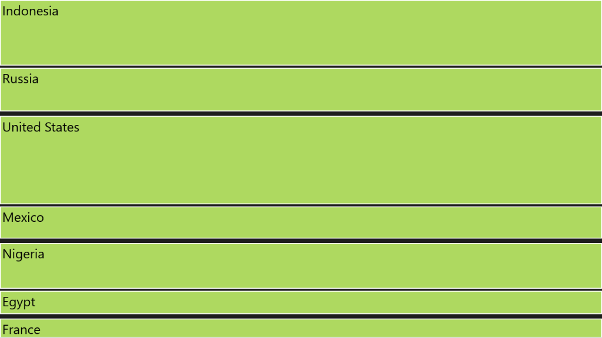

# TreeMap Layout

The ItemsLayoutMode for SfTreeMap specifies the layout mode of the tree map items. This layout is applied for all the tree map levels. There are four different TreeMap layouts such as,

## Squarified Layout

In this layout the data is visualized in the form of square-like rectangles with best aspect ratio.

The following code illustrates how to set a squarified layout in Treemap.



    <Grid Background="Black">

        <Grid.DataContext>

            <local:PopulationViewModel/>

        </Grid.DataContext>

        <syncfusion:SfTreeMap ItemsSource="{Binding PopulationDetails}"

                              ItemsLayoutMode="Squarified"

                              WeightValuePath="Population"                              

                              ColorValuePath="Growth">

        </syncfusion:SfTreeMap>

    </Grid>  


The following screenshot illustrates a squarified layout.

## SliceAndDiceAuto Layout:

In this layout the data is visualized in the form of long-thin rectangles with high aspect ratio, which can be displayed either vertically or horizontally.

The following code illustrates how to set a slice and dice layout in Treemap.



    <Grid Background="Black">

        <Grid.DataContext>

            <local:PopulationViewModel/>

        </Grid.DataContext>

        <syncfusion:SfTreeMap ItemsSource="{Binding PopulationDetails}"

                              ItemsLayoutMode=" SliceAndDiceAuto"

                              WeightValuePath="Population"                              

                              ColorValuePath="Growth">

        </syncfusion:SfTreeMap>

    </Grid>



The following screenshot illustrates a slice-and-dice layout.

_Slice-and-dice layout_

## SliceAndDiceHorizontal Layout:

The following code illustrates how to set a slice and dice layout horizontally in TreeMap.



    <Grid Background="Black">

        <Grid.DataContext>

            <local:PopulationViewModel/>

        </Grid.DataContext>

        <syncfusion:SfTreeMap ItemsSource="{Binding PopulationDetails}"

                              ItemsLayoutMode=" SliceAndDiceHorizontal"

                              WeightValuePath="Population"                              

                              ColorValuePath="Growth">

        </syncfusion:SfTreeMap>

    </Grid>


The following screenshot shows a Slice-and-dice TreeMap in horizontal layout.

## SliceAndDiceVertical Layout:

The following code illustrates how to set a slice and dice layout vertically in TreeMap.



    <Grid Background="Black">

        <Grid.DataContext>

            <local:PopulationViewModel/>

        </Grid.DataContext>

        <syncfusion:SfTreeMap ItemsSource="{Binding PopulationDetails}"

                              ItemsLayoutMode=" SliceAndDiceVertical"

                              WeightValuePath="Population"                              

                              ColorValuePath="Growth">

        </syncfusion:SfTreeMap>

    </Grid>


The following screenshot shows a Slice-and-dice TreeMap in vertical layout.

